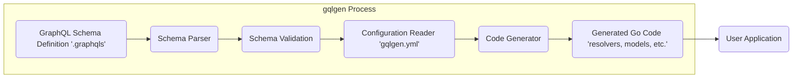
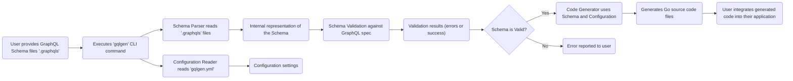

# Project Design Document: gqlgen

**Version:** 1.1
**Date:** October 26, 2023
**Author:** AI Software Architect

## 1. Introduction

This document provides a detailed design overview of the `gqlgen` project, a Go library for building GraphQL servers strictly and easily. This document aims to clearly articulate the architecture, components, and data flow of `gqlgen`. It will serve as a foundation for subsequent threat modeling activities, enabling a comprehensive understanding of potential security vulnerabilities. This revision includes improvements for clarity and detail, particularly in the security considerations.

## 2. Goals

*   Provide a clear and concise description of the `gqlgen` architecture.
*   Identify the key components and their interactions with greater detail.
*   Outline the data flow within the `gqlgen` process with more specific steps.
*   Establish a robust basis for identifying potential security threats and vulnerabilities, including concrete examples.

## 3. High-Level Architecture

`gqlgen` operates primarily as a code generation tool executed during the development phase. It takes a GraphQL schema definition and configuration as input and generates Go code that implements the foundational structure of a GraphQL server. The core process involves parsing the schema, validating it against GraphQL specifications, reading configuration directives, and then generating resolvers, data models, and supporting infrastructure code.

## 4. Component Details

This section details the key components involved in the `gqlgen` process, providing more context and detail for each.

*   **GraphQL Schema Definition ('.graphqls'):**
    *   Description: Text files written in the GraphQL Schema Definition Language (SDL), defining the structure and capabilities of the GraphQL API. This includes types, fields, arguments, queries, mutations, and subscriptions.
    *   Function: Serves as the single source of truth for the GraphQL API's structure and contract.
    *   Relevance to Security:  Maliciously crafted or poorly defined schemas can introduce vulnerabilities. For example, excessively deep nesting of types could lead to stack overflow issues when processing queries against the generated server. Lack of proper input validation definitions within the schema can also lead to vulnerabilities in resolvers.

*   **Schema Parser:**
    *   Description:  Utilizes a library (like `github.com/vektah/gqlparser`) to read and interpret the GraphQL schema definition files. It converts the textual representation into an Abstract Syntax Tree (AST) or a similar internal data structure.
    *   Function:  Transforms the schema text into a structured format that `gqlgen` can understand and manipulate.
    *   Relevance to Security: Vulnerabilities in the parser itself could be exploited by providing specially crafted, malicious schema files. This could lead to denial-of-service by crashing the `gqlgen` process or potentially even arbitrary code execution if the parser has severe flaws.

*   **Schema Validation:**
    *   Description:  Analyzes the parsed schema against the official GraphQL specification rules. This includes checks for type correctness, uniqueness of names, proper directive usage, and other semantic constraints.
    *   Function: Ensures the schema adheres to the GraphQL standard, preventing the generation of code based on invalid or ambiguous schemas.
    *   Relevance to Security: Prevents the generation of code from schemas that violate GraphQL rules, which could lead to unpredictable behavior or expose underlying implementation details. For instance, validating argument types helps prevent type confusion issues in resolvers.

*   **Configuration Reader ('gqlgen.yml'):**
    *   Description: Reads the `gqlgen.yml` configuration file, which is typically located at the root of the project. This file specifies various code generation options, such as package names for generated code, resolver binding information (mapping schema fields to Go methods), and customization settings.
    *   Function:  Provides a mechanism for users to customize the code generation process and integrate `gqlgen` with their existing Go project structure.
    *   Relevance to Security: Incorrect or malicious configurations could lead to the generation of insecure code. For example, specifying an incorrect package name could lead to unintended code overwrites. Furthermore, if the configuration file is sourced from an untrusted location or modified by an attacker, it could be used to inject malicious code generation directives.

*   **Code Generator:**
    *   Description: The core logic of `gqlgen`. It takes the validated schema and the configuration as input and generates Go source code. This includes:
        *   Resolver interfaces that define the contract for implementing business logic.
        *   Data models (structs) representing the types defined in the schema.
        *   Boilerplate code for GraphQL execution, such as query and mutation handlers.
        *   Code for data loading and potentially other utilities.
    *   Function: Automates the creation of the necessary Go code to build a GraphQL server based on the provided schema.
    *   Relevance to Security:  Vulnerabilities in the code generation logic are critical. Examples include:
        *   **Injection Vulnerabilities:** If schema elements (like field names or descriptions) are directly incorporated into generated code without proper escaping, it could lead to code injection.
        *   **Insecure Defaults:** The generated code might have insecure default configurations, such as overly permissive access controls or insecure data handling practices.
        *   **Information Disclosure:**  Generated code might inadvertently expose internal implementation details or sensitive information through error messages or logging.

*   **Generated Go Code ('resolvers, models, etc.'):**
    *   Description: The output of the code generation process, consisting of Go source code files. These files contain the resolver interfaces, data models, and supporting infrastructure code that forms the basis of the GraphQL server implementation.
    *   Function: Provides the structural foundation for developers to implement the business logic of their GraphQL API by filling in the resolver implementations.
    *   Relevance to Security: The security of this generated code is paramount. Flaws introduced during generation can directly impact the security of the user's application. Developers need to be aware of potential security implications in the generated code and implement their resolvers securely.

*   **User Application:**
    *   Description: The Go application that imports and utilizes the generated code from `gqlgen`. Developers implement the actual resolver logic within the generated interfaces, connecting the GraphQL API to their data sources and business logic.
    *   Function: Executes the generated GraphQL server, handles incoming GraphQL requests, and returns responses.
    *   Relevance to Security: The user application is ultimately responsible for the final security posture of the GraphQL API. While `gqlgen` provides the structure, the security of the resolvers and the overall application logic is the developer's responsibility.

## 5. Data Flow

The data flow within the `gqlgen` process can be visualized with more specific steps:

**Detailed Data Flow:**

1. The user creates and provides GraphQL schema definition files (`.graphqls`).
2. The user executes the `gqlgen` command-line interface (CLI) within their project.
3. The `gqlgen` CLI invokes the **Schema Parser** to read and interpret the content of the `.graphqls` files.
4. The **Schema Parser** creates an internal representation of the GraphQL schema (e.g., an Abstract Syntax Tree).
5. This internal representation is passed to the **Schema Validation** component.
6. The **Schema Validation** component checks the schema against the rules and specifications of the GraphQL language.
7. The **Configuration Reader** reads the `gqlgen.yml` file to obtain code generation settings.
8. The configuration settings are loaded into memory.
9. The **Schema Validation** component produces results indicating whether the schema is valid or contains errors.
10. A decision point: If the schema is valid, the process proceeds to code generation. If not, errors are reported to the user.
11. The **Code Generator** takes the validated schema and the configuration settings as input.
12. The **Code Generator** generates Go source code files, including resolvers, models, and supporting code.
13. The user integrates this generated Go code into their application's codebase.

## 6. Security Considerations (Detailed)

This section expands on the initial security considerations, providing more specific examples and categorizing potential threats.

*   **Schema Parsing Vulnerabilities:**
    *   **Denial of Service (DoS):**  Maliciously crafted schema files with extremely deep nesting or excessively large definitions could overwhelm the parser, leading to high CPU and memory usage, effectively causing a denial of service during the code generation phase.
    *   **Code Execution (Less Likely):** While less probable, vulnerabilities like buffer overflows in the parser could potentially be exploited for arbitrary code execution on the developer's machine during the build process.
    *   **Example:** A schema with thousands of nested object types without proper limits could crash the parser.

*   **Schema Validation Bypass:**
    *   **Generation of Insecure Code:** If validation is insufficient, schemas with ambiguous or problematic constructs might pass through, leading to the generation of code with unexpected behavior or security flaws.
    *   **Example:** A schema allowing the same field name with different types in different interfaces could lead to type confusion in the generated resolvers.

*   **Configuration Injection:**
    *   **Malicious Code Generation:** If the `gqlgen.yml` file is compromised (e.g., through a supply chain attack or a compromised development environment), an attacker could inject malicious configuration directives to generate backdoors or vulnerabilities into the generated code.
    *   **Example:**  Modifying the output path to overwrite critical system files or injecting code generation templates that introduce vulnerabilities.

*   **Code Generation Flaws:**
    *   **Injection Vulnerabilities:**
        *   **GraphQL Injection:** If schema descriptions or field names are directly used in generated resolver code without proper sanitization, it could be possible to inject malicious GraphQL fragments that could be executed by the server.
        *   **Code Injection (Go):**  If schema elements are used to construct Go code strings without proper escaping, it could lead to the execution of arbitrary Go code.
    *   **Insecure Defaults:**
        *   Generated resolvers might lack proper input validation, making them susceptible to common web vulnerabilities like SQL injection or cross-site scripting (XSS) if they interact with external systems.
        *   Default error handling might expose sensitive information in production environments.
    *   **Information Disclosure:**
        *   Generated code might inadvertently include comments or logging statements that reveal internal implementation details or sensitive data.
        *   Error messages generated by the framework might be too verbose, exposing information about the underlying system.
    *   **Lack of Rate Limiting/DoS Protection:** The generated code might not include default mechanisms for rate limiting or protection against denial-of-service attacks at the GraphQL endpoint level.

*   **Dependency Vulnerabilities:**
    *   **Transitive Dependencies:** Vulnerabilities in the libraries that `gqlgen` depends on (e.g., the schema parser) can indirectly affect the security of `gqlgen` itself.
    *   **Supply Chain Attacks:** If the dependencies are compromised, malicious code could be introduced into the `gqlgen` build process.

*   **Supply Chain Security:**
    *   **Compromised Binaries:** Ensuring the integrity and authenticity of the `gqlgen` binary downloaded by developers is crucial to prevent the execution of malicious code during the build process.
    *   **Package Repository Security:**  The security of the Go package repository (e.g., `pkg.go.dev`) is important to prevent the distribution of tampered `gqlgen` packages.

## 7. Dependencies

`gqlgen` relies on the following key dependencies:

*   **Go Standard Library:** Provides fundamental building blocks for the application, including file I/O, networking, and concurrency. Security vulnerabilities in the standard library are rare but could impact `gqlgen`.
*   **`github.com/vektah/gqlparser`:** A crucial dependency for parsing and validating GraphQL schema definitions. Vulnerabilities in this library could directly impact `gqlgen`'s ability to securely process schemas.
*   **`gopkg.in/yaml.v2` (or similar):** Used for parsing the `gqlgen.yml` configuration file. Vulnerabilities in the YAML parsing library could lead to issues when processing configuration.
*   **`github.com/99designs/gqlgen/graphql`:**  Provides core GraphQL execution functionalities.
*   **Potentially other utility libraries:** For tasks like string manipulation, code formatting, and logging. A thorough review of the `go.mod` file is essential for a complete understanding of all dependencies and their potential security implications.

It's crucial to keep these dependencies updated to patch any known security vulnerabilities.

## 8. Deployment

`gqlgen` is primarily a development-time tool executed on a developer's machine or within a CI/CD pipeline. The generated code is then compiled and deployed as part of the user's Go application to a runtime environment (e.g., a server, container, or serverless function). The security of the deployment environment and the user's application is separate from the `gqlgen` process itself, but vulnerabilities introduced during code generation can manifest in the deployed application.

## 9. Future Considerations

*   **Plugin System Security:** If a plugin system is introduced, careful consideration must be given to plugin sandboxing, permission models, and secure communication between the core `gqlgen` process and plugins to prevent malicious plugins from compromising the system.
*   **Schema Stitching/Federation Security:** Generating code for federated GraphQL schemas requires careful handling of authentication, authorization, and data access across different services. Security vulnerabilities in the generated gateway code could expose sensitive data or allow unauthorized access.
*   **Security Auditing and Static Analysis Integration:** Integrating tools or features to help developers automatically audit the security of the generated code (e.g., static analysis tools for identifying potential injection vulnerabilities) would be a valuable enhancement.
*   **Secure Code Generation Practices:**  Continuously reviewing and improving the code generation logic to minimize the risk of introducing security vulnerabilities is essential. This includes using secure coding practices and performing regular security audits of the code generation engine.

This improved design document provides a more detailed and nuanced understanding of the `gqlgen` project, enhancing its value as a foundation for comprehensive threat modeling. The expanded security considerations and detailed component descriptions offer a clearer picture of potential attack vectors and vulnerabilities.
