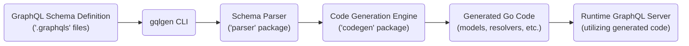
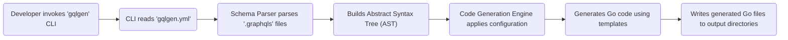

# Project Design Document: gqlgen - GraphQL Code Generator

**Version:** 1.1
**Date:** October 26, 2023
**Author:** AI Architecture Expert

## 1. Project Overview

This document details the architecture of `gqlgen`, a Go library designed to facilitate the creation of type-safe GraphQL servers. It adopts a "schema-first" approach, generating Go code directly from GraphQL schema definitions, thereby ensuring consistency and minimizing repetitive coding. This document is specifically intended to serve as a foundation for subsequent threat modeling activities.

## 2. Goals and Objectives

* **Primary Goal:** To offer a reliable and efficient mechanism for generating Go-based GraphQL server implementations derived from GraphQL schema definitions.
* **Key Objectives:**
    * **Enforce Type Safety:** Maintain strong typing correspondence between the GraphQL schema and the generated Go code.
    * **Automate Code Generation:** Streamline the generation of essential Go components, including resolvers and data models.
    * **Enable Customization:** Provide developers with options to tailor the generated code and integrate it with existing application logic.
    * **Ensure Performance:** Produce performant Go code suitable for production deployments.
    * **Optimize Developer Experience:** Offer a straightforward and intuitive process for defining schemas and generating associated code.
    * **Facilitate Extensibility:** Support integration with diverse GraphQL server libraries and frameworks within the Go ecosystem.

## 3. Target Audience

This document is primarily intended for:

* Security Engineers: To gain insights into the system's architecture for identifying potential security vulnerabilities during threat modeling exercises.
* Software Developers: To acquire a comprehensive understanding of the system's design principles and component interactions.
* Solution Architects: To evaluate the architectural design and its suitability for various application scenarios.
* Operations Teams: To understand deployment considerations, dependencies, and runtime behavior.

## 4. Scope

This design document concentrates on the core architectural elements and operational principles of the `gqlgen` library itself. The scope encompasses:

* The process of interpreting and processing GraphQL schema definitions.
* The architecture and functionality of the code generation engine.
* The structure and organization of the generated Go code artifacts.
* The interaction patterns between the generated code and developer-provided resolver implementations.
* The configuration mechanisms and options available within `gqlgen`.

This document explicitly excludes:

* Specific GraphQL server implementations that leverage `gqlgen` for code generation.
* The implementation details of user-defined business logic within resolvers.
* Deployment strategies and infrastructure considerations for applications built using `gqlgen`.
* The intricacies and specifications of the GraphQL language itself.

## 5. High-Level Architecture

The operation of `gqlgen` can be conceptually divided into distinct stages:



* **GraphQL Schema Definition:** The process begins with `.graphqls` files that define the GraphQL schema.
* **gqlgen CLI:** The command-line interface serves as the primary tool for interacting with `gqlgen`, initiating code generation.
* **Schema Parser:** This component, typically within a `parser` package, is responsible for analyzing the GraphQL schema definition files and creating an internal representation.
* **Code Generation Engine:** This core component, often located in a `codegen` package, transforms the parsed schema into Go code based on defined templates and configurations.
* **Generated Go Code:** The output consists of Go source files containing structs representing GraphQL types, interface definitions for resolvers, and supporting boilerplate code.
* **Runtime GraphQL Server:** The generated Go code is integrated into a GraphQL server implementation (e.g., using libraries like `github.com/graphql-go/graphql`) to handle incoming GraphQL requests.

## 6. Detailed Design

### 6.1. Components

* **`gqlgen` CLI (`cmd/gqlgen`):**
    * **Purpose:** Provides the command-line interface for triggering code generation and managing configuration settings.
    * **Functionality:**
        * Loads configuration parameters from the `gqlgen.yml` file.
        * Processes command-line arguments and flags.
        * Invokes the schema parser and the code generation engine.
        * Provides error reporting, logging, and informational output to the user.
* **Schema Parser (`parser` package):**
    * **Purpose:** Responsible for reading and interpreting GraphQL schema definition files.
    * **Functionality:**
        * Performs lexical analysis and parsing of `.graphqls` files to break down the schema into tokens and structures.
        * Validates the schema against the rules and specifications of the GraphQL language.
        * Constructs an Abstract Syntax Tree (AST) that represents the hierarchical structure of the schema.
        * Extracts key schema elements such as type definitions, fields, arguments, and directives.
* **Code Generation Engine (`codegen` package):**
    * **Purpose:** Transforms the parsed schema representation into corresponding Go source code.
    * **Functionality:**
        * Reads and applies configuration options specified in `gqlgen.yml` to customize the code generation process.
        * Employs Go templating mechanisms (e.g., `text/template`) to generate code for:
            * Go structs that mirror GraphQL types.
            * Go interface definitions for resolvers.
            * Optional data loader implementations.
            * Go structs representing GraphQL input types.
            * Go type definitions for GraphQL enums.
            * Mappings between GraphQL scalars and Go types.
        * Enforces naming conventions and manages the organization of generated code into packages.
        * Handles dependency management and import statements within the generated code.
* **Configuration (`gqlgen.yml`):**
    * **Purpose:** Defines the configuration parameters that govern the code generation process.
    * **Content:**
        * Paths to GraphQL schema definition files.
        * Package names for the generated Go code.
        * Paths to resolver implementation files or directories.
        * Configurations for mapping GraphQL types to existing Go models.
        * Directives for customizing specific aspects of the generation.
        * Various other settings that influence code generation behavior.
* **Generated Code (within user's project):**
    * **`models` package:** Contains Go structs representing the types defined in the GraphQL schema.
    * **`resolvers` package (or user-defined location):** Includes Go interface definitions for resolvers, requiring developers to implement the actual data fetching logic.
    * **`directives` package (optional):** Contains Go functions that implement custom GraphQL directives defined in the schema.
    * **`enums` package:** Defines Go types corresponding to GraphQL enum types.
    * **`inputs` package:** Contains Go structs representing GraphQL input types used in mutations and queries.
    * **`scalars` package:** Defines mappings for custom GraphQL scalar types to their corresponding Go representations.
    * **`gqlgen.go`:** Contains essential boilerplate code that initializes the GraphQL schema, wires up the generated components, and provides entry points for the GraphQL server.

### 6.2. Data Flow (Code Generation)



1. A developer initiates the code generation process by executing the `gqlgen` CLI command.
2. The CLI reads the configuration settings from the `gqlgen.yml` file.
3. The Schema Parser component parses the specified GraphQL schema files (`.graphqls`).
4. The parser constructs an Abstract Syntax Tree (AST) representing the parsed schema.
5. The Code Generation Engine applies the configuration settings from `gqlgen.yml` to guide the code generation.
6. The engine utilizes Go templates and the schema AST to generate the corresponding Go source code.
7. The generated Go code files are written to the designated output directories within the user's project.

### 6.3. Data Flow (Runtime Request Handling - Conceptual)

This illustrates how the code generated by `gqlgen` is utilized at runtime within a GraphQL server to handle client requests:

```mermaid
graph LR
    A("GraphQL Client sends request") --> B("GraphQL Server (using generated code)");
    B --> C("Generated Resolver Dispatcher");
    C --> D("User-Defined Resolver Implementation");
    D --> E("Data Source (Database, API, etc.)");
    E --> D;
    C <-- D;
    B <-- C;
    B --> F("GraphQL Response");
    F --> A;
```

1. A GraphQL client sends a query or mutation request to the GraphQL server.
2. The GraphQL server, which incorporates the code generated by `gqlgen`, receives the incoming request.
3. The generated resolver dispatcher within the server identifies the appropriate resolver function based on the requested fields.
4. The dispatcher invokes the corresponding user-defined resolver implementation (written by the developer).
5. The resolver implementation interacts with data sources (databases, external APIs, etc.) to fetch the necessary data.
6. The data is returned from the data source to the resolver.
7. The resolver processes and formats the data according to the GraphQL schema.
8. The generated code marshals the resolved data into the GraphQL response format.
9. The GraphQL server constructs the complete response.
10. The GraphQL response is sent back to the client.

## 7. Technology Stack

* **Primary Programming Language:** Go
* **Schema Parsing:** Likely utilizes a custom-built parser or a readily available Go parsing library for GraphQL.
* **Templating Engine:** Employs Go's standard `text/template` or `html/template` package for code generation.
* **Configuration Management:** Leverages YAML for configuration file parsing, often using libraries like `gopkg.in/yaml.v2` or `sigs.k8s.io/yaml`.
* **Testing Framework:** Utilizes Go's built-in testing framework (`testing` package) for unit and integration tests.

## 8. Security Considerations (Initial)

This section outlines initial security considerations relevant for threat modeling and further analysis.

* **GraphQL Schema Parsing Vulnerabilities:**
    * **Denial of Service (DoS):**  Maliciously crafted, excessively complex, or deeply nested schemas could exploit parsing inefficiencies, leading to high CPU and memory consumption, potentially causing service disruption.
    * **Schema Poisoning:** Although less direct, if the source of schema definitions is compromised, attackers could inject malicious schema elements.
* **Code Generation Vulnerabilities:**
    * **Code Injection:** If the templating logic is not carefully implemented and validated, malicious content within the GraphQL schema could potentially lead to the generation of insecure or malicious Go code.
    * **Information Disclosure:** Errors or vulnerabilities in the code generation process could inadvertently expose sensitive information, such as internal paths or configurations.
* **Configuration Vulnerabilities (`gqlgen.yml`):**
    * **Path Traversal:** If the configuration allows specifying file paths without proper sanitization, attackers might be able to access or overwrite arbitrary files on the system.
    * **Injection via Configuration:** Maliciously crafted configuration files could potentially inject commands or code during the code generation phase if not handled securely.
* **Dependency Management:**
    * **Supply Chain Attacks:** Vulnerabilities in third-party dependencies used by `gqlgen` could be exploited. Regular dependency updates and vulnerability scanning are crucial.
* **Generated Code Security:**
    * While `gqlgen` primarily generates the structural code, the overall security of the application depends heavily on the security of the user-implemented resolvers. However, `gqlgen`'s choices regarding input validation and data type handling in the generated code can influence the security posture.
    * **Insecure Defaults:**  Care must be taken to avoid generating code with insecure default settings or configurations.
* **Error Handling and Logging:**
    * **Information Leakage:** Verbose error messages or logs could inadvertently expose sensitive information to attackers.
    * **Lack of Proper Logging:** Insufficient logging can hinder incident response and forensic analysis.

## 9. Deployment Model

`gqlgen` is primarily a development-time tool. Its core function is to generate Go code, which is then compiled and deployed as part of a standard Go application.

* **Local Development:** Developers typically run the `gqlgen` CLI locally to generate code during development.
* **CI/CD Pipelines:** `gqlgen` is often integrated into Continuous Integration/Continuous Deployment (CI/CD) pipelines to automate code generation as part of the build process. This ensures that the generated code is always up-to-date with schema changes.
* **No Direct Runtime Dependency:** Once the Go code is generated, the running GraphQL server does not have a direct runtime dependency on the `gqlgen` library itself, unless code regeneration is intentionally performed at runtime (which is less common).

## 10. Assumptions and Constraints

* **Well-formed GraphQL Schema:** It is assumed that the input GraphQL schema adheres to the official GraphQL specification and is syntactically correct.
* **Functional Go Environment:**  `gqlgen` requires a properly configured Go development environment (including the Go toolchain) to execute.
* **Accurate Configuration:** The `gqlgen.yml` configuration file is assumed to be correctly configured according to the project's requirements.
* **Secure Templates:** The security of the code generation process relies on the assumption that the Go templates used by `gqlgen` are securely designed and do not introduce vulnerabilities.

This improved design document provides a more comprehensive and detailed overview of the `gqlgen` project's architecture, further enhancing its utility as a foundation for thorough threat modeling activities. The expanded explanations, clarified data flows, and more specific security considerations offer a stronger basis for identifying and mitigating potential vulnerabilities.
