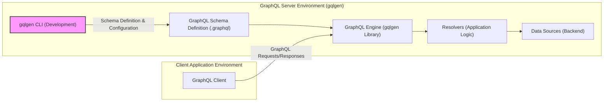
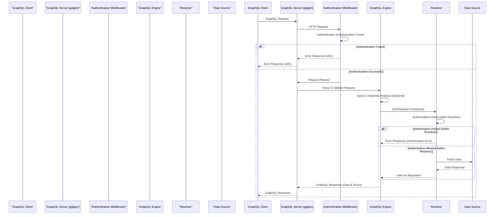

# Project Design Document: gqlgen - Improved

## 1. Introduction

This document provides an enhanced design overview of the `gqlgen` project, a Go library for building type-safe GraphQL servers. It is designed to be a robust foundation for subsequent threat modeling and security assessments. Building upon the initial design, this version offers more detail, clarity, and a stronger focus on security implications. This document details the system architecture, data flow, technology stack, and expands on security considerations for applications built using `gqlgen`.

### 1.1. Project Overview

`gqlgen` is a schema-first Go library that streamlines GraphQL server development. Developers define their GraphQL API using `.graphql` schema files, and `gqlgen` automatically generates Go code. This generated code handles GraphQL request processing, data fetching orchestration, and response formatting, significantly reducing boilerplate and improving developer productivity. `gqlgen` emphasizes type safety and performance in Go-based GraphQL implementations.

### 1.2. Purpose of this Document

This document serves as a comprehensive design specification for systems built with `gqlgen`. Its primary purpose is to facilitate effective threat modeling by providing a detailed understanding of the system's components, interactions, and potential vulnerabilities. This document will be the primary input for security architects and engineers to conduct thorough threat assessments and design appropriate security controls. It aims to be a living document, updated as the system evolves.

## 2. System Architecture

Applications built with `gqlgen` typically adhere to a well-defined layered architecture, promoting separation of concerns and maintainability. The key components are:

*   **GraphQL Client:** The consumer of the GraphQL API. This can be a frontend web application, a mobile application, a partner service, or any system that needs to interact with the data exposed by the GraphQL server.
*   **GraphQL Server (gqlgen Application):** The Go application generated and powered by `gqlgen`. It acts as the central point of access for the GraphQL API and is responsible for:
    *   **API Gateway Functionality:** Receiving and routing GraphQL requests over HTTP(S).
    *   **Request Handling:** Parsing, validating, and executing GraphQL queries, mutations, and subscriptions.
    *   **Resolver Orchestration:** Invoking resolver functions to fetch and manipulate data.
    *   **Response Generation:** Formatting and sending GraphQL responses back to the client.
*   **GraphQL Engine (gqlgen Library Core):** The core library embedded within the `gqlgen` generated server. It provides the fundamental GraphQL processing capabilities: schema parsing, query validation against the schema, query execution planning, and resolver invocation management.
*   **Resolvers (Application Logic Layer):** Go functions implemented by developers. These functions are the crucial bridge between the GraphQL schema and the application's backend. They contain the business logic for:
    *   **Data Fetching:** Retrieving data from various data sources.
    *   **Data Transformation:** Adapting data from data sources to the GraphQL schema's expected format.
    *   **Business Logic Execution:** Implementing application-specific rules and operations.
    *   **Authorization Checks:** Enforcing access control policies before data retrieval or manipulation.
*   **Data Sources (Backend Data Layer):** External systems that store and manage the application's data. `gqlgen` is data-source agnostic, allowing integration with diverse backend technologies, including:
    *   **Relational Databases (SQL):** PostgreSQL, MySQL, etc.
    *   **NoSQL Databases:** MongoDB, Cassandra, etc.
    *   **RESTful APIs:** External services accessed via HTTP.
    *   **gRPC Services:** Microservices communicating over gRPC.
    *   **Message Queues:** Systems like Kafka or RabbitMQ for asynchronous operations.
*   **GraphQL Schema Definition Files (.graphql):** Text files defining the GraphQL API contract. These files specify:
    *   **Types:** Data structures exposed through the API.
    *   **Queries:** Operations for retrieving data.
    *   **Mutations:** Operations for modifying data.
    *   **Subscriptions:** Operations for real-time data updates.
    *   **Directives:** Metadata to control schema behavior (e.g., authorization).
*   **gqlgen CLI (Development Tooling):** The command-line interface provided by `gqlgen`. It is used during development for:
    *   **Code Generation:** Generating Go code from `.graphql` schema files.
    *   **Configuration:** Setting up server options and resolver mappings.
    *   **Schema Management:** Introspection and validation of the GraphQL schema.

**Component Descriptions (Expanded):**

*   **GraphQL Client:**  Initiates communication with the GraphQL server by sending requests and consuming responses. Security considerations for the client include secure storage of credentials, secure communication channels (HTTPS), and proper handling of sensitive data received from the server.
*   **GraphQL Server (gqlgen Application):**  The primary entry point for all GraphQL operations. It must be hardened against common web application vulnerabilities. Security responsibilities include request validation, authentication, authorization, rate limiting, and protection against DoS attacks.
*   **GraphQL Engine (gqlgen Library Core):**  Handles the core GraphQL processing logic. While `gqlgen` library itself is generally considered secure, vulnerabilities in the underlying `graphql-go` library or improper configuration could introduce risks. Regular updates are crucial.
*   **Resolvers (Application Logic Layer):**  The most critical component from a security perspective. Resolvers directly interact with data sources and implement business logic. They are susceptible to vulnerabilities like injection flaws, insecure data handling, and authorization bypasses if not implemented securely.
*   **Data Sources (Backend Data Layer):** The security of data sources is paramount. Access control, encryption at rest and in transit, and regular security audits are essential. Resolvers must interact with data sources securely, respecting access control policies.
*   **GraphQL Schema Definition Files (.graphql):**  Defines the API's surface area. A poorly designed schema can inadvertently expose sensitive data or operations. Schema design should follow the principle of least privilege, only exposing necessary data and operations.
*   **gqlgen CLI (Development Tooling):** Primarily a development-time tool. Security risks are lower, but ensuring the CLI is obtained from a trusted source and used securely is still important, especially in CI/CD pipelines.

## 3. Data Flow (Detailed)

The data flow for a GraphQL operation (query, mutation, or subscription) in a `gqlgen` application is a sequence of well-defined steps:

1.  **Client Request Initiation:** The GraphQL Client constructs a GraphQL request (query, mutation, or subscription) and sends it as an HTTP request (typically POST for queries and mutations, WebSocket for subscriptions) to the GraphQL server endpoint (e.g., `/graphql`). The request includes the GraphQL query string, variables (if any), and HTTP headers (including authentication tokens).
2.  **Server Request Reception:** The `gqlgen` server receives the HTTP request at its configured endpoint.
3.  **Authentication Middleware (Optional but Recommended):**  Before processing the GraphQL request, authentication middleware (if configured) intercepts the request. It verifies the client's identity using mechanisms like JWT, API keys, or session cookies. If authentication fails, the request is rejected with an appropriate error response (e.g., 401 Unauthorized).
4.  **Request Parsing and Validation (GraphQL Engine):** The GraphQL Engine parses the GraphQL query string to ensure it conforms to GraphQL syntax. It then validates the query against the defined GraphQL schema. Validation includes:
    *   **Syntax Validation:** Checking for correct GraphQL syntax.
    *   **Schema Validation:** Ensuring all requested fields, types, and arguments exist in the schema and are used correctly.
    *   **Type Validation:** Verifying that variable types and argument types are compatible with the schema definitions.
5.  **Query Complexity Analysis (Optional but Recommended):**  To prevent DoS attacks via overly complex queries, a query complexity analysis module (which can be implemented as middleware or within resolvers) can analyze the query's structure and calculate a complexity score. If the score exceeds a predefined threshold, the request is rejected.
6.  **Query Planning and Execution (GraphQL Engine):** The GraphQL Engine plans the execution of the validated query. It determines the order in which resolvers need to be called to fetch the requested data.
7.  **Authorization Checks (within Resolvers):**  Crucially, authorization checks should be performed *within resolvers* before accessing data or performing operations. Resolvers should verify if the authenticated user (obtained from context, often set by authentication middleware) has the necessary permissions to access the requested data or perform the requested mutation.
8.  **Resolver Invocation (GraphQL Engine):** The GraphQL Engine invokes the appropriate resolver functions based on the query plan. Resolvers are called in a specific order to efficiently fetch data.
9.  **Data Fetching and Business Logic (Resolvers):** Resolvers interact with configured data sources to retrieve data. This step involves executing database queries, calling REST APIs, or interacting with other backend services. Resolvers also implement business logic, data transformations, and further authorization checks if needed.
10. **Data Transformation and Response Construction (Resolvers & GraphQL Engine):** Resolvers transform the data fetched from data sources into the format expected by the GraphQL schema. The GraphQL Engine collects the results from resolvers and constructs the GraphQL response payload according to the structure of the original query.
11. **Response Formatting (GraphQL Engine):** The GraphQL Engine formats the response into a standard GraphQL response format (typically JSON), including the `data` and `errors` fields.
12. **Server Response Transmission:** The `gqlgen` server sends the GraphQL response back to the client as an HTTP response. The response typically has a 200 OK status code even for requests with errors in the `errors` field (GraphQL standard). Error responses might use 4xx or 5xx HTTP status codes for server-level or authentication/authorization failures.
13. **Client Response Processing:** The GraphQL Client receives and processes the GraphQL response, extracting the requested data and handling any errors reported in the `errors` field.

## 4. Technology Stack (Detailed)

The technology stack for `gqlgen` applications is centered around Go and GraphQL, with flexibility in choosing supporting technologies:

*   **Core Technologies:**
    *   **Go Programming Language (version 1.16+ recommended):** The primary language for `gqlgen` and generated server code. Go's performance, concurrency features, and strong standard library make it well-suited for building GraphQL servers.
    *   **GraphQL Specification (Latest Stable Version):** `gqlgen` adheres to the official GraphQL specification, ensuring interoperability and standards compliance.
    *   **`graphql-go` Library ([https://github.com/graphql-go/graphql](https://github.com/graphql-go/graphql)):** The underlying GraphQL parsing and execution engine used by `gqlgen`. Understanding `graphql-go` can be helpful for advanced customization or debugging.

*   **Server Infrastructure:**
    *   **HTTP Server (Go `net/http` package or frameworks):** `gqlgen` is HTTP server agnostic. You can use Go's standard `net/http` package or popular frameworks like:
        *   **`net/http` (Standard Library):** Simple and efficient for basic servers.
        *   **Gin ([https://github.com/gin-gonic/gin](https://github.com/gin-gonic/gin)):** High-performance framework with middleware support, routing, and JSON handling.
        *   **Echo ([https://echo.labstack.com/](https://echo.labstack.com/)):**  Another fast and extensible framework with similar features to Gin.
        *   **Fiber ([https://gofiber.io/](https://gofiber.io/)):**  Framework inspired by Express.js, known for its speed and ease of use.
    *   **Middleware Libraries:** For common server functionalities like:
        *   **Authentication and Authorization:** JWT middleware, OAuth 2.0 libraries, custom authentication logic.
        *   **Logging:**  Structured logging libraries (e.g., `logrus`, `zap`).
        *   **Tracing:**  OpenTelemetry or Jaeger integration for distributed tracing.
        *   **Metrics:** Prometheus or Grafana integration for monitoring.
        *   **CORS (Cross-Origin Resource Sharing):** Middleware to handle CORS policies.
        *   **Rate Limiting:** Middleware to protect against abuse and DoS attacks.

*   **Data Source Technologies (Application-Specific):**
    *   **Databases:**
        *   **SQL Databases:** PostgreSQL, MySQL, SQLite, SQL Server. Go database drivers (`database/sql` package and specific drivers like `pq` for PostgreSQL, `go-sql-driver/mysql` for MySQL). ORM/Query builders like GORM, sqlx, or raw SQL.
        *   **NoSQL Databases:** MongoDB (Go driver `go.mongodb.org/mongo-driver/mongo`), Redis (Go client `github.com/go-redis/redis/v8`), Cassandra (Go driver `github.com/gocql/gocql`).
    *   **REST APIs:** Go's `net/http` client package or HTTP client libraries like `resty` for making requests to external REST services.
    *   **gRPC Services:** Go's gRPC libraries (`google.golang.org/grpc`) for communication with other gRPC microservices.
    *   **Message Queues:** Go clients for message queues like Kafka (`github.com/segmentio/kafka-go`), RabbitMQ (`github.com/streadway/amqp`).

*   **Development and Build Tools:**
    *   **Go Toolchain (`go`, `go build`, `go run`, `go test`):** Standard Go development tools.
    *   **Go Modules (`go mod`):** Dependency management.
    *   **gqlgen CLI (`go run github.com/99designs/gqlgen`):** Code generation and schema management.
    *   **Code Editors/IDEs:** VS Code with Go extension, GoLand, etc.
    *   **Testing Frameworks:** Go's built-in `testing` package, testing libraries like `testify`.
    *   **CI/CD Pipelines:** GitHub Actions, GitLab CI, Jenkins, etc.

## 5. Security Considerations (Detailed and Categorized)

This section expands on security considerations, categorizing them for better organization and providing more specific mitigation strategies.

**5.1. Input Validation and Injection Prevention:**

*   **GraphQL Injection Vulnerabilities:** While GraphQL itself mitigates some injection risks compared to REST, resolvers can still be vulnerable if they construct queries (SQL, NoSQL, etc.) based on raw user input from GraphQL variables or arguments.
    *   **Mitigation:**
        *   **Parameterized Queries/Prepared Statements:** Always use parameterized queries or prepared statements when interacting with databases to prevent SQL injection.
        *   **Input Sanitization and Validation:** Validate and sanitize all input variables and arguments within resolvers. Define strict input validation rules based on expected data types and formats. Use input validation libraries if necessary.
        *   **Avoid Dynamic Query Construction:** Minimize or eliminate dynamic construction of queries based on user input. Prefer ORMs or query builders that handle escaping and parameterization securely.
*   **GraphQL Query Complexity and Depth Attacks (DoS):** Malicious clients can craft complex, deeply nested queries to overload the server, leading to DoS.
    *   **Mitigation:**
        *   **Query Complexity Analysis and Limits:** Implement query complexity analysis to calculate a score for each incoming query based on factors like field selections, nested levels, and list sizes. Set a maximum allowed complexity score and reject queries exceeding this limit. Libraries or middleware can assist with this.
        *   **Query Depth Limits:** Limit the maximum depth of GraphQL queries to prevent excessively nested requests. `gqlgen` configuration or middleware can enforce depth limits.
        *   **Rate Limiting:** Implement rate limiting at the API gateway or server level to restrict the number of requests from a single IP address or client within a given time frame.
        *   **Timeout Configuration:** Set appropriate timeouts for GraphQL query execution to prevent long-running queries from consuming excessive server resources.

**5.2. Authentication and Authorization:**

*   **Authentication Bypass:**  Weak or missing authentication mechanisms can allow unauthorized access to the GraphQL API.
    *   **Mitigation:**
        *   **Implement Robust Authentication:** Use established authentication methods like JWT (JSON Web Tokens), OAuth 2.0, or session-based authentication. Choose a method appropriate for your application's security requirements.
        *   **Authentication Middleware:** Implement authentication middleware in the `gqlgen` server to verify user identity before processing GraphQL requests.
        *   **Secure Credential Management:** Store and manage user credentials securely (e.g., using bcrypt for password hashing, secure storage for API keys).
        *   **HTTPS Enforcement:** Enforce HTTPS for all communication to protect credentials and data in transit.
*   **Authorization Failures:**  Insufficient or improperly implemented authorization can lead to users accessing data or performing actions they are not permitted to.
    *   **Mitigation:**
        *   **Role-Based Access Control (RBAC) or Attribute-Based Access Control (ABAC):** Implement a robust authorization model (RBAC or ABAC) to define and enforce access control policies.
        *   **Authorization Logic in Resolvers:** Implement authorization checks *within resolvers* before accessing data or performing mutations. This ensures fine-grained access control at the data level.
        *   **GraphQL Directives for Authorization:** Consider using GraphQL directives to declaratively define authorization rules within the schema. Libraries or custom directives can be used to enforce these rules.
        *   **Principle of Least Privilege:** Design the GraphQL schema and resolvers to expose only the necessary data and operations, following the principle of least privilege.

**5.3. Data Security and Privacy:**

*   **Sensitive Data Exposure:**  Accidental or intentional exposure of sensitive data through the GraphQL API.
    *   **Mitigation:**
        *   **Schema Design Review:** Carefully review the GraphQL schema to ensure it does not inadvertently expose sensitive data that should not be publicly accessible.
        *   **Field-Level Authorization:** Implement authorization at the field level in resolvers to control access to specific fields based on user roles or permissions.
        *   **Data Masking/Redaction:**  Mask or redact sensitive data in GraphQL responses if it should not be fully exposed to certain clients or users.
        *   **Data Encryption:** Encrypt sensitive data at rest in data sources and in transit over the network (HTTPS).
        *   **Logging and Auditing:** Implement comprehensive logging and auditing of GraphQL requests and data access to detect and investigate security incidents.
*   **Information Disclosure through Error Messages:** Verbose error messages in GraphQL responses can reveal sensitive information about the server's internal workings or data structure to attackers.
    *   **Mitigation:**
        *   **Custom Error Handling:** Implement custom error handling in the `gqlgen` server to avoid exposing detailed error messages in production environments. Return generic error messages to clients while logging detailed errors server-side for debugging and monitoring.
        *   **Error Logging Security:** Ensure error logs do not contain sensitive data that could be exploited if logs are compromised.

**5.4. Dependency and Infrastructure Security:**

*   **Dependency Vulnerabilities:** Outdated or vulnerable dependencies in `gqlgen` or its underlying libraries (`graphql-go`, HTTP server frameworks, database drivers) can introduce security risks.
    *   **Mitigation:**
        *   **Regular Dependency Updates:** Regularly update `gqlgen` and all its dependencies using Go modules. Monitor for security advisories related to dependencies and apply patches promptly.
        *   **Dependency Scanning:** Use dependency scanning tools to automatically identify known vulnerabilities in project dependencies.
*   **Infrastructure Security:**  Insecure deployment configurations or vulnerabilities in the underlying infrastructure (servers, containers, cloud platforms) can compromise the `gqlgen` application.
    *   **Mitigation:**
        *   **Secure Deployment Practices:** Follow secure deployment practices for the chosen deployment environment (containerized, cloud, serverless). Harden server configurations, apply security patches, and use secure container images.
        *   **Network Security:** Implement network security measures like firewalls, network segmentation, and intrusion detection/prevention systems to protect the `gqlgen` server and its infrastructure.
        *   **Regular Security Audits and Penetration Testing:** Conduct regular security audits and penetration testing to identify and address security vulnerabilities in the `gqlgen` application and its infrastructure.

**5.5. CSRF and Other Web Security Considerations:**

*   **CSRF (Cross-Site Request Forgery):** For state-changing operations (mutations) performed from web browsers, CSRF protection is essential.
    *   **Mitigation:**
        *   **CSRF Tokens:** Implement CSRF protection mechanisms using CSRF tokens (synchronizer tokens) if the GraphQL API is accessed from web browsers. Middleware or frameworks can assist with CSRF token generation and validation.
        *   **SameSite Cookie Attribute:** Use the `SameSite` cookie attribute for session cookies to mitigate CSRF risks.
*   **CORS (Cross-Origin Resource Sharing):** Improper CORS configuration can lead to security vulnerabilities or prevent legitimate cross-origin requests.
    *   **Mitigation:**
        *   **Configure CORS Policies:** Configure CORS policies carefully to allow only trusted origins to access the GraphQL API. Use CORS middleware to manage CORS headers.
        *   **Avoid Wildcard Origins in Production:** Avoid using wildcard origins (`*`) in production CORS configurations. Specify explicit allowed origins.
*   **Clickjacking:** While less directly applicable to GraphQL APIs, consider clickjacking risks if the GraphQL server exposes any UI elements or if the client application is vulnerable.
    *   **Mitigation:**
        *   **X-Frame-Options Header:** Set the `X-Frame-Options` HTTP header to prevent the GraphQL server's pages (if any) from being embedded in frames on other websites.

## 6. Deployment Considerations (Security Focused)

Deployment environments significantly impact security. Here's a security-focused view of common deployment scenarios:

*   **Containerized Environments (Docker, Kubernetes):**
    *   **Security Advantages:** Isolation, reproducibility, easier patching.
    *   **Security Considerations:**
        *   **Container Image Security:** Use minimal base images, scan container images for vulnerabilities, and regularly rebuild images to incorporate security updates.
        *   **Kubernetes Security:** Secure Kubernetes cluster configuration, RBAC for access control, network policies to restrict container communication, security context constraints for pod security.
        *   **Secrets Management:** Securely manage secrets (API keys, database credentials) using Kubernetes Secrets or dedicated secrets management solutions (HashiCorp Vault).
*   **Cloud Platforms (AWS, GCP, Azure):**
    *   **Security Advantages:** Managed security services, infrastructure security provided by the cloud provider.
    *   **Security Considerations:**
        *   **Cloud Security Configuration:** Properly configure cloud security services (firewalls, security groups, IAM roles, WAFs). Follow cloud provider security best practices.
        *   **Access Control (IAM):** Implement strong Identity and Access Management (IAM) policies to control access to cloud resources and the `gqlgen` application.
        *   **Data Encryption:** Utilize cloud provider services for data encryption at rest and in transit.
        *   **Monitoring and Logging:** Leverage cloud monitoring and logging services for security monitoring and incident response.
*   **Serverless Functions (with custom runtime):**
    *   **Security Advantages:** Reduced attack surface (less infrastructure to manage), automatic scaling.
    *   **Security Considerations:**
        *   **Function Security:** Secure function code, minimize dependencies, and follow serverless security best practices.
        *   **Cold Starts and Secrets:** Handle cold starts securely and manage secrets appropriately in the serverless environment.
        *   **Function Permissions:** Grant functions only the necessary permissions to access other cloud resources (principle of least privilege).
        *   **Monitoring and Logging:** Utilize serverless platform monitoring and logging capabilities.
*   **Traditional Server Deployments (Virtual Machines, Physical Servers):**
    *   **Security Considerations:**
        *   **Operating System Security:** Harden the operating system, apply security patches regularly, and configure firewalls.
        *   **Server Hardening:** Secure server configurations, disable unnecessary services, and follow security best practices for server hardening.
        *   **Network Security:** Implement firewalls and network segmentation to protect servers.
        *   **Physical Security (for physical servers):** Secure physical access to servers.

## 7. Threat Modeling Context and Future Steps

This design document is the foundational input for a comprehensive threat modeling exercise. We recommend using a structured threat modeling methodology, such as:

*   **STRIDE (Spoofing, Tampering, Repudiation, Information Disclosure, Denial of Service, Elevation of Privilege):**  Analyzing threats against each component and data flow using the STRIDE categories.
*   **PASTA (Process for Attack Simulation and Threat Analysis):** A more risk-centric methodology that involves stages like defining objectives, technical scope, application decomposition, threat analysis, vulnerability analysis, attack modeling, and risk & impact analysis.
*   **OWASP Threat Modeling:** Following the OWASP Threat Modeling Guide, which provides practical guidance and techniques.

**Future Steps:**

1.  **Threat Modeling Workshop:** Conduct a threat modeling workshop with security experts, developers, and operations team members, using this document as a reference.
2.  **Threat Identification and Documentation:** Systematically identify potential threats based on the design and data flow outlined in this document, using the chosen threat modeling methodology. Document each identified threat, its potential impact, and likelihood.
3.  **Mitigation Strategy Development:** For each identified threat, develop and document appropriate mitigation strategies and security controls.
4.  **Security Control Implementation:** Implement the defined security controls in the `gqlgen` application and its infrastructure.
5.  **Verification and Testing:** Verify the effectiveness of implemented security controls through security testing, including penetration testing and vulnerability scanning.
6.  **Continuous Security Review:** Regularly review and update this design document and the threat model as the `gqlgen` application evolves and new threats emerge.

## 8. Conclusion

This improved design document provides a more detailed and security-focused overview of applications built with `gqlgen`. It expands on the system architecture, data flow, technology stack, and security considerations, categorizing threats and providing more specific mitigation strategies. This document is intended to be a valuable resource for threat modeling, security assessments, and ongoing security efforts throughout the lifecycle of `gqlgen`-based projects. By using this document as a foundation for threat modeling and implementing the recommended security controls, organizations can build more secure and resilient GraphQL APIs with `gqlgen`.