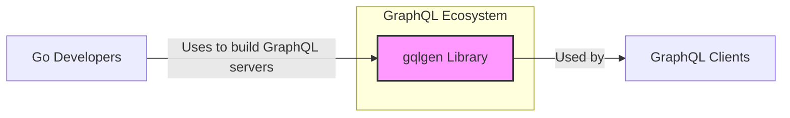
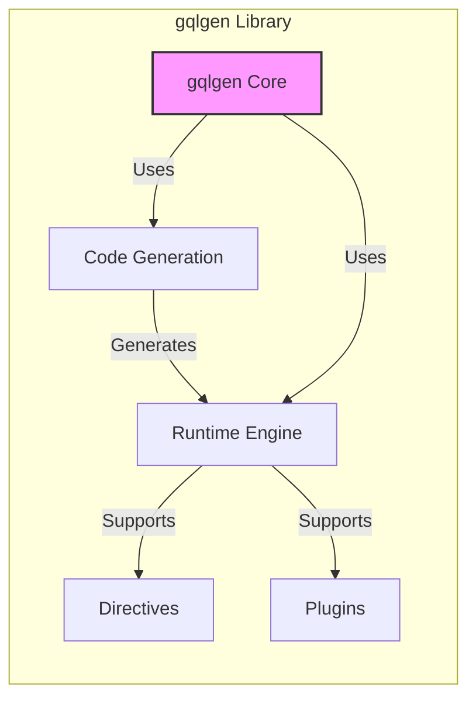
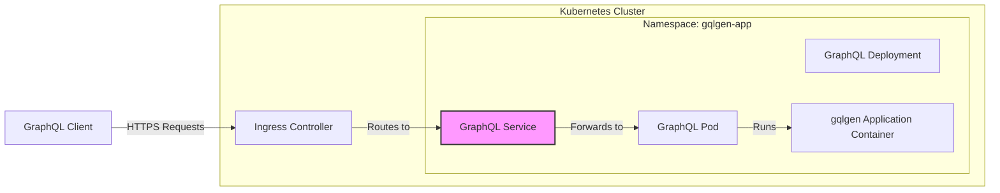
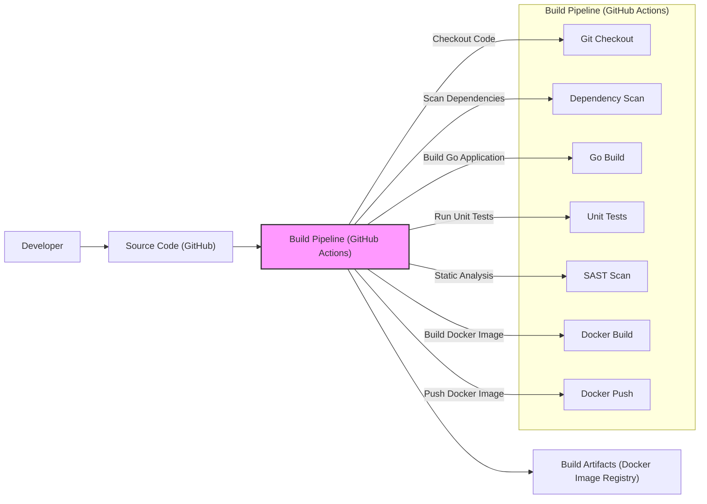

# BUSINESS POSTURE

- Business Priorities and Goals:
 - Priority: Provide a robust and efficient library for Go developers to build GraphQL servers.
 - Goal: Simplify GraphQL server development in Go, enabling faster development cycles and easier maintenance.
 - Goal: Promote the adoption of GraphQL by providing a well-documented and easy-to-use library.
 - Goal: Maintain a high-quality, performant, and reliable library that meets the needs of the Go GraphQL community.

- Business Risks:
 - Risk: Security vulnerabilities in the `gqlgen` library could lead to data breaches or service disruptions in applications built using it.
 - Risk: Performance bottlenecks or inefficiencies in `gqlgen` could negatively impact the performance of GraphQL servers.
 - Risk: Lack of comprehensive documentation or examples could hinder adoption and increase development time for users.
 - Risk: Incompatibility with future Go versions or other libraries could require significant refactoring and maintenance.
 - Risk: Open-source nature relies on community contributions, which may lead to inconsistent quality or delayed updates if community support wanes.

# SECURITY POSTURE

- Existing Security Controls:
 - security control: Standard open-source development practices, including code reviews and community contributions. (Implemented: GitHub repository workflow)
 - security control: Unit and integration tests to ensure code correctness and prevent regressions. (Implemented: GitHub repository test suite)
 - accepted risk: Reliance on community contributions for identifying and addressing security vulnerabilities.
 - accepted risk: Security of applications built using `gqlgen` is the responsibility of the application developers. `gqlgen` provides the framework but does not enforce application-level security.

- Recommended Security Controls:
 - recommended security control: Implement automated dependency scanning to detect known vulnerabilities in third-party libraries used by `gqlgen`.
 - recommended security control: Integrate static application security testing (SAST) tools into the CI/CD pipeline to identify potential security flaws in the `gqlgen` codebase.
 - recommended security control: Provide clear and comprehensive security guidelines in the documentation for developers using `gqlgen`, especially regarding input validation, authorization, and data protection in GraphQL applications.
 - recommended security control: Establish a process for reporting and responding to security vulnerabilities, including a security policy and contact information.
 - recommended security control: Consider performing regular security audits or penetration testing of the `gqlgen` library.

- Security Requirements:
 - Authentication:
  - Requirement: `gqlgen` itself does not handle authentication. Applications built with `gqlgen` are responsible for implementing authentication mechanisms to verify user identities.
  - Requirement: Documentation should clearly outline best practices for implementing authentication in GraphQL applications using `gqlgen`, including integration with common authentication providers and strategies (e.g., JWT, OAuth 2.0).
 - Authorization:
  - Requirement: `gqlgen` itself does not handle authorization. Applications built with `gqlgen` are responsible for implementing authorization logic to control access to data and operations based on user roles and permissions.
  - Requirement: Documentation should provide guidance on implementing fine-grained authorization in GraphQL applications using `gqlgen`, including examples of directive-based authorization and integration with authorization frameworks.
 - Input Validation:
  - Requirement: Applications built with `gqlgen` must perform thorough input validation to prevent injection attacks (e.g., SQL injection, GraphQL injection) and other input-related vulnerabilities.
  - Requirement: Documentation should emphasize the importance of input validation in GraphQL applications and provide examples of how to validate GraphQL queries, mutations, and input types effectively using `gqlgen`.
 - Cryptography:
  - Requirement: `gqlgen` itself does not enforce cryptography. Applications built with `gqlgen` should use appropriate cryptographic measures to protect sensitive data in transit and at rest.
  - Requirement: Documentation should recommend best practices for using cryptography in GraphQL applications built with `gqlgen`, such as using HTTPS for transport security and encrypting sensitive data in the database.

# DESIGN

- C4 CONTEXT

- C4 CONTEXT Elements:
 - Element:
  - Name: Go Developers
  - Type: Person
  - Description: Software developers who use the `gqlgen` library to build GraphQL servers in Go.
  - Responsibilities: Utilize `gqlgen` to create, deploy, and maintain GraphQL APIs. Implement application-level security controls in their GraphQL applications.
  - Security controls: Responsible for secure coding practices in applications built with `gqlgen`.
 - Element:
  - Name: gqlgen Library
  - Type: Software System
  - Description: A Go library for building GraphQL servers. It handles GraphQL schema parsing, query execution, and data fetching.
  - Responsibilities: Provide a framework for building GraphQL servers. Ensure efficient and correct GraphQL query processing. Offer extensibility points for custom logic.
  - Security controls: Input validation within the library for GraphQL syntax. Protection against common GraphQL vulnerabilities (e.g., batching attacks, complexity attacks) should be considered in the library design.
 - Element:
  - Name: GraphQL Clients
  - Type: Software System
  - Description: Applications or services that consume GraphQL APIs built using `gqlgen`. These can be web applications, mobile apps, or other backend services.
  - Responsibilities: Send GraphQL queries and mutations to the GraphQL server. Process and display data received from the GraphQL API.
  - Security controls: Implement secure communication with the GraphQL server (HTTPS). Handle authentication and authorization tokens securely.

- C4 CONTAINER

- C4 CONTAINER Elements:
 - Element:
  - Name: gqlgen Core
  - Type: Library Component
  - Description: The central part of the `gqlgen` library, responsible for orchestrating the GraphQL server building process. It includes schema parsing, configuration management, and integration of other components.
  - Responsibilities: Manage the overall lifecycle of GraphQL server creation. Coordinate code generation and runtime execution. Provide APIs for developers to configure and extend `gqlgen`.
  - Security controls: Input validation for schema definitions. Secure handling of configuration parameters.
 - Element:
  - Name: Code Generation
  - Type: Library Component
  - Description: Generates Go code based on the GraphQL schema and configuration. This includes resolvers, data loaders, and GraphQL type definitions.
  - Responsibilities: Automate the creation of boilerplate code for GraphQL servers. Ensure generated code is efficient and secure.
  - Security controls: Output encoding of generated code to prevent code injection vulnerabilities. Secure handling of schema information during code generation.
 - Element:
  - Name: Runtime Engine
  - Type: Library Component
  - Description: The runtime environment for executing GraphQL queries. It handles query parsing, validation, execution, and response formatting.
  - Responsibilities: Efficiently process GraphQL queries and mutations. Enforce GraphQL schema rules and validation. Manage data fetching and resolver execution.
  - Security controls: Input validation for incoming GraphQL queries. Protection against denial-of-service attacks (e.g., query complexity limits). Secure execution of resolvers.
 - Element:
  - Name: Directives
  - Type: Library Component
  - Description: Provides support for GraphQL directives, allowing developers to add custom logic and behavior to the GraphQL schema and resolvers.
  - Responsibilities: Enable schema customization and extensibility. Facilitate implementation of cross-cutting concerns like authorization and logging.
  - Security controls: Secure handling of directive definitions and execution. Ensure directives cannot be used to bypass security controls.
 - Element:
  - Name: Plugins
  - Type: Library Component
  - Description: Allows developers to extend `gqlgen` functionality through plugins. Plugins can intercept and modify the GraphQL execution process.
  - Responsibilities: Provide a modular way to extend `gqlgen`. Enable integration with external services and libraries.
  - Security controls: Secure plugin loading and execution. Ensure plugins cannot introduce security vulnerabilities into the GraphQL server.

- DEPLOYMENT

- Deployment Options:
 - Option 1: Serverless Functions (e.g., AWS Lambda, Google Cloud Functions) - Deploying GraphQL applications built with `gqlgen` as serverless functions.
 - Option 2: Containerized Deployment (e.g., Docker, Kubernetes) - Deploying GraphQL applications within containers orchestrated by Kubernetes or similar platforms.
 - Option 3: Virtual Machines/Bare Metal - Deploying GraphQL applications directly on virtual machines or bare metal servers.

- Selected Deployment Option: Containerized Deployment (Docker, Kubernetes)

- DEPLOYMENT Elements:
 - Element:
  - Name: Kubernetes Cluster
  - Type: Infrastructure
  - Description: A Kubernetes cluster providing container orchestration and management.
  - Responsibilities: Manage container deployments, scaling, and networking. Provide infrastructure for running the GraphQL application.
  - Security controls: Network policies to restrict traffic. Role-Based Access Control (RBAC) for cluster access. Container security scanning.
 - Element:
  - Name: Namespace: gqlgen-app
  - Type: Kubernetes Namespace
  - Description: A dedicated namespace within the Kubernetes cluster for deploying the `gqlgen` application.
  - Responsibilities: Isolation of `gqlgen` application resources within the cluster.
  - Security controls: Namespace-level resource quotas and network policies.
 - Element:
  - Name: Ingress Controller
  - Type: Kubernetes Ingress
  - Description: Manages external access to the services within the Kubernetes cluster, acting as a reverse proxy and load balancer.
  - Responsibilities: Route external requests to the GraphQL Service. Handle TLS termination. Provide load balancing and traffic management.
  - Security controls: HTTPS termination. Web Application Firewall (WAF) integration. Rate limiting.
 - Element:
  - Name: GraphQL Service
  - Type: Kubernetes Service
  - Description: A Kubernetes service that exposes the GraphQL Deployment within the cluster.
  - Responsibilities: Provide a stable endpoint for accessing the GraphQL application. Load balancing across pods in the deployment.
  - Security controls: Network policies to control access to the service.
 - Element:
  - Name: GraphQL Deployment
  - Type: Kubernetes Deployment
  - Description: Manages the desired state for the GraphQL Pods, ensuring the application is running and available.
  - Responsibilities: Deploy and update GraphQL Pods. Ensure application availability and scalability.
  - Security controls: Deployment strategies for zero-downtime updates. Pod security policies or security contexts.
 - Element:
  - Name: GraphQL Pod
  - Type: Kubernetes Pod
  - Description: The smallest deployable unit in Kubernetes, containing the GraphQL Application Container.
  - Responsibilities: Run the `gqlgen` application.
  - Security controls: Container security context. Resource limits.
 - Element:
  - Name: gqlgen Application Container
  - Type: Container
  - Description: A Docker container running the GraphQL application built using `gqlgen`.
  - Responsibilities: Execute the GraphQL server logic. Handle GraphQL requests and responses.
  - Security controls: Base image security scanning. Application-level security controls (authentication, authorization, input validation).

- BUILD

- BUILD Elements:
 - Element:
  - Name: Developer
  - Type: Person
  - Description: Software developer working on the `gqlgen` library or applications using it.
  - Responsibilities: Write code, commit changes to the repository, and trigger the build pipeline.
  - Security controls: Secure development workstation. Code review process.
 - Element:
  - Name: Source Code (GitHub)
  - Type: Code Repository
  - Description: GitHub repository hosting the `gqlgen` source code.
  - Responsibilities: Version control, source code management, collaboration.
  - Security controls: Access control to the repository. Branch protection rules. Audit logging.
 - Element:
  - Name: Build Pipeline (GitHub Actions)
  - Type: CI/CD System
  - Description: GitHub Actions workflow automating the build, test, and deployment process.
  - Responsibilities: Automate build process. Run security checks. Publish build artifacts.
  - Security controls: Secure pipeline configuration. Access control to pipeline definitions. Secret management for credentials.
 - Element:
  - Name: Git Checkout
  - Type: Build Step
  - Description: Checks out the source code from the GitHub repository.
  - Responsibilities: Retrieve the latest code for building.
  - Security controls: Ensure integrity of checked-out code (e.g., using commit hashes).
 - Element:
  - Name: Dependency Scan
  - Type: Build Step
  - Description: Scans project dependencies for known vulnerabilities.
  - Responsibilities: Identify vulnerable dependencies. Prevent inclusion of vulnerable libraries in build artifacts.
  - Security controls: Use of dependency scanning tools (e.g., `go mod tidy -v`). Fail the build if vulnerabilities are found.
 - Element:
  - Name: Go Build
  - Type: Build Step
  - Description: Compiles the Go code into executable binaries or libraries.
  - Responsibilities: Create build artifacts.
  - Security controls: Secure build environment. Use of Go toolchain security features.
 - Element:
  - Name: Unit Tests
  - Type: Build Step
  - Description: Executes unit tests to verify code functionality and prevent regressions.
  - Responsibilities: Ensure code quality and correctness.
  - Security controls: Comprehensive test suite covering security-relevant aspects.
 - Element:
  - Name: SAST Scan
  - Type: Build Step
  - Description: Performs static application security testing to identify potential security flaws in the code.
  - Responsibilities: Detect potential security vulnerabilities early in the development lifecycle.
  - Security controls: Use of SAST tools (e.g., `gosec`). Fail the build if high-severity vulnerabilities are found.
 - Element:
  - Name: Docker Build
  - Type: Build Step
  - Description: Builds a Docker image containing the GraphQL application.
  - Responsibilities: Create container image for deployment.
  - Security controls: Use of minimal base images. Security scanning of Docker image layers.
 - Element:
  - Name: Docker Push
  - Type: Build Step
  - Description: Pushes the built Docker image to a container registry.
  - Responsibilities: Publish build artifacts for deployment.
  - Security controls: Secure communication with the container registry (HTTPS). Access control to the container registry.
 - Element:
  - Name: Build Artifacts (Docker Image Registry)
  - Type: Artifact Repository
  - Description: Container registry storing Docker images of the GraphQL application.
  - Responsibilities: Store and distribute build artifacts.
  - Security controls: Access control to the registry. Image signing and verification. Vulnerability scanning of stored images.

# RISK ASSESSMENT

- Critical Business Processes:
 - Process: Development and deployment of GraphQL APIs using the `gqlgen` library.
 - Process: Providing a reliable and secure GraphQL library to the Go community.

- Data to Protect and Sensitivity:
 - Data: Source code of the `gqlgen` library. Sensitivity: High (Confidentiality and Integrity). Unauthorized access or modification could compromise the library's security and functionality.
 - Data: Build artifacts (Docker images). Sensitivity: Medium (Integrity and Availability). Compromised build artifacts could lead to deployment of vulnerable applications.
 - Data: User data processed by GraphQL applications built with `gqlgen`. Sensitivity: Varies (Confidentiality, Integrity, Availability). Sensitivity depends on the specific application and the type of data handled. `gqlgen` itself does not handle user data directly, but applications built with it do.

# QUESTIONS & ASSUMPTIONS

- BUSINESS POSTURE:
 - Assumption: The primary business goal is to provide a high-quality, open-source GraphQL library for the Go community.
 - Question: Are there specific business objectives related to commercialization or support services for `gqlgen`?
 - Question: What is the tolerance for security vulnerabilities in the `gqlgen` library? Is there a defined SLA for addressing security issues?

- SECURITY POSTURE:
 - Assumption: Security is a significant concern for users of `gqlgen`, especially when building public-facing GraphQL APIs.
 - Question: Are there any specific compliance requirements (e.g., GDPR, HIPAA, PCI DSS) that applications built with `gqlgen` need to adhere to?
 - Question: Is there a dedicated security team or individual responsible for overseeing the security of the `gqlgen` project?

- DESIGN:
 - Assumption: `gqlgen` is designed to be flexible and extensible to support various GraphQL use cases and deployment environments.
 - Question: Are there any specific architectural patterns or design principles that were followed during the development of `gqlgen` with security in mind?
 - Question: What are the intended mechanisms for developers to extend and customize `gqlgen` securely (e.g., plugins, directives)?