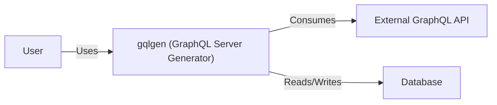
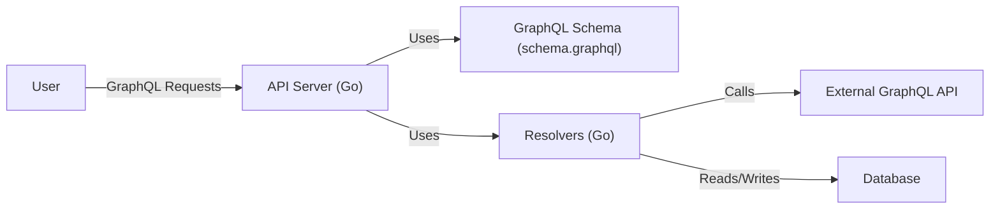
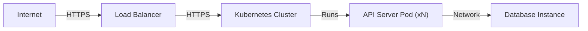
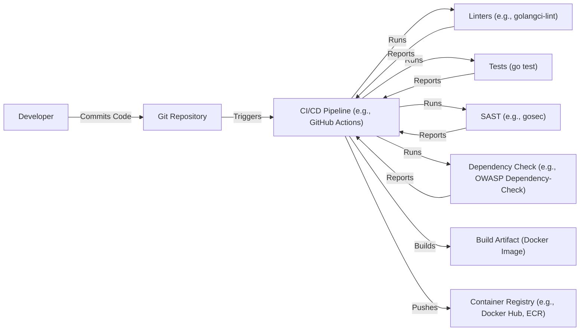

Okay, let's create a design document for the `gqlgen` project.

# BUSINESS POSTURE

Business Priorities and Goals:

*   Enable developers to quickly and efficiently build GraphQL servers in Go.
*   Provide a schema-first approach to GraphQL server development.
*   Generate type-safe, performant, and maintainable code.
*   Reduce boilerplate code and development time.
*   Offer flexibility and customization options for advanced use cases.
*   Maintain a vibrant and active open-source community.

Business Risks:

*   Insecure default configurations could lead to vulnerabilities in applications built using `gqlgen`.
*   Lack of proper input validation in generated code could expose applications to injection attacks.
*   Insufficient error handling could lead to unexpected behavior or crashes.
*   Dependencies on vulnerable third-party libraries could introduce security risks.
*   Lack of community support or slow response to security issues could damage the project's reputation.
*   Steep learning curve or complex configuration could hinder adoption.
*   Failure to keep up with GraphQL specification updates could lead to compatibility issues.

# SECURITY POSTURE

Existing Security Controls:

*   security control: The project is written in Go, a memory-safe language, which helps prevent common memory-related vulnerabilities like buffer overflows. (Source: Go language features)
*   security control: The project uses a schema-first approach, which can help enforce a well-defined API contract and reduce the risk of unexpected data exposure. (Source: Project README and documentation)
*   security control: The project generates code, which can potentially reduce the risk of human error in implementing security controls, assuming the code generator itself is secure. (Source: Project design)
*   security control: The project has a test suite, which can help identify and prevent regressions, including security-related ones. (Source: Project repository)
*   security control: The project uses Go modules for dependency management, which allows for tracking and updating dependencies, including security patches. (Source: `go.mod` file)

Accepted Risks:

*   accepted risk: The project relies on third-party libraries, which may have their own vulnerabilities. The project maintainers rely on the community and vulnerability databases to identify and address these issues.
*   accepted risk: The generated code may require further customization and security hardening by the developers using the library. The project provides a base level of security, but developers are responsible for ensuring their applications meet their specific security requirements.
*   accepted risk: The project's default configurations may not be suitable for all deployment environments and may require adjustments for production use.

Recommended Security Controls:

*   security control: Implement a comprehensive security linter for the generated code to identify potential vulnerabilities early in the development process.
*   security control: Provide clear documentation and guidance on secure coding practices when using `gqlgen`, including input validation, error handling, and authentication/authorization.
*   security control: Conduct regular security audits and penetration testing of the `gqlgen` library itself.
*   security control: Establish a clear vulnerability disclosure process and security response team.
*   security control: Integrate with security scanning tools to automatically identify vulnerabilities in dependencies.
*   security control: Provide options for generating code that integrates with common security libraries and frameworks (e.g., authentication middleware, authorization libraries).

Security Requirements:

*   Authentication: The library itself does not handle authentication. It is the responsibility of the developer using `gqlgen` to implement authentication mechanisms in their application. Generated code should facilitate integration with authentication solutions.
*   Authorization: Similar to authentication, authorization is the responsibility of the developer. `gqlgen` should provide mechanisms (e.g., directives, middleware) to easily integrate with authorization libraries or implement custom authorization logic.
*   Input Validation: `gqlgen` relies on the GraphQL schema for basic type validation. However, additional input validation (e.g., length limits, format checks, sanitization) should be implemented by the developer, potentially with the help of custom directives or validation libraries. `gqlgen` should provide clear guidance and examples for implementing robust input validation.
*   Cryptography: `gqlgen` does not directly handle cryptographic operations. If applications built with `gqlgen` require cryptography (e.g., for storing sensitive data, handling secure communication), developers are responsible for using appropriate cryptographic libraries and practices.

# DESIGN

## C4 CONTEXT

Element Descriptions:

*   Element:
    *   Name: User
    *   Type: Person
    *   Description: A user of the GraphQL API provided by a server built with gqlgen.
    *   Responsibilities: Sends GraphQL queries and mutations to the server.
    *   Security controls: Authentication and authorization are typically handled at the application layer, not directly by gqlgen.

*   Element:
    *   Name: gqlgen (GraphQL Server Generator)
    *   Type: Software System
    *   Description: A tool for generating Go code for building GraphQL servers.
    *   Responsibilities: Generates code based on a GraphQL schema, provides a framework for building resolvers, and handles the GraphQL execution lifecycle.
    *   Security controls: Relies on Go's memory safety, schema-based type checking, and developer-implemented security measures in the generated code.

*   Element:
    *   Name: External GraphQL API
    *   Type: Software System
    *   Description: An external GraphQL API that the generated server might interact with.
    *   Responsibilities: Provides data or services to the generated server.
    *   Security controls: Relies on the security of the external API provider. The generated server should implement appropriate security measures when interacting with external APIs (e.g., authentication, input validation).

*   Element:
    *   Name: Database
    *   Type: Software System
    *   Description: A database used by the generated server to store and retrieve data.
    *   Responsibilities: Stores and manages data for the application.
    *   Security controls: Relies on the database's security features (e.g., access control, encryption). The generated server should implement secure database access practices (e.g., parameterized queries, least privilege).

## C4 CONTAINER

Element Descriptions:

*   Element:
    *   Name: User
    *   Type: Person
    *   Description: A user of the GraphQL API.
    *   Responsibilities: Sends GraphQL queries and mutations.
    *   Security controls: Authentication and authorization are handled by the API Server.

*   Element:
    *   Name: API Server (Go)
    *   Type: Container (Web Application)
    *   Description: The main server application generated by gqlgen.
    *   Responsibilities: Handles incoming GraphQL requests, executes resolvers, and returns responses.
    *   Security controls: Implements authentication and authorization, input validation, and error handling. Uses Go's built-in security features.

*   Element:
    *   Name: GraphQL Schema (schema.graphql)
    *   Type: Container (Configuration File)
    *   Description: Defines the GraphQL schema, including types, queries, and mutations.
    *   Responsibilities: Provides the structure and contract for the GraphQL API.
    *   Security controls: Enforces type safety and basic input validation through schema definitions.

*   Element:
    *   Name: Resolvers (Go)
    *   Type: Container (Code)
    *   Description: Go code that implements the logic for fetching and manipulating data.
    *   Responsibilities: Retrieves data from databases or external APIs, performs business logic, and returns data to the API server.
    *   Security controls: Implements input validation, data sanitization, and secure access to data sources.

*   Element:
    *   Name: External GraphQL API
    *   Type: Software System
    *   Description: An external GraphQL API that the resolvers might interact with.
    *   Responsibilities: Provides data or services to the resolvers.
    *   Security controls: Relies on the security of the external API provider. Resolvers should implement appropriate security measures when interacting with external APIs.

*   Element:
    *   Name: Database
    *   Type: Software System
    *   Description: A database used by the resolvers to store and retrieve data.
    *   Responsibilities: Stores and manages data for the application.
    *   Security controls: Relies on the database's security features. Resolvers should implement secure database access practices.

## DEPLOYMENT

Possible Deployment Solutions:

1.  Standalone Server: Deploy the generated Go application as a standalone server, running directly on a virtual machine or physical server.
2.  Containerized Deployment (Docker): Package the application and its dependencies into a Docker container and deploy it to a container orchestration platform like Kubernetes or Docker Swarm.
3.  Serverless Deployment (AWS Lambda, Google Cloud Functions, Azure Functions): Deploy the application as a serverless function, triggered by API Gateway events.

Chosen Solution (Containerized Deployment with Kubernetes):

Element Descriptions:

*   Element:
    *   Name: Internet
    *   Type: Network
    *   Description: The public internet.
    *   Responsibilities: Routes traffic to the load balancer.
    *   Security controls: Relies on standard internet security protocols (e.g., HTTPS).

*   Element:
    *   Name: Load Balancer
    *   Type: Infrastructure
    *   Description: Distributes incoming traffic across multiple instances of the API server.
    *   Responsibilities: Handles TLS termination, distributes traffic, and provides health checks.
    *   Security controls: Configured with TLS certificates, implements health checks to ensure only healthy instances receive traffic.

*   Element:
    *   Name: Kubernetes Cluster
    *   Type: Infrastructure
    *   Description: A container orchestration platform that manages the deployment and scaling of the API server.
    *   Responsibilities: Schedules and manages containers, provides networking and service discovery.
    *   Security controls: Implements network policies, role-based access control (RBAC), and other Kubernetes security features.

*   Element:
    *   Name: API Server Pod (xN)
    *   Type: Container Instance
    *   Description: Multiple instances of the API server container running within the Kubernetes cluster.
    *   Responsibilities: Handles incoming GraphQL requests.
    *   Security controls: Runs as a non-root user, limited resource requests and limits, implements application-level security controls.

*   Element:
    *   Name: Database Instance
    *   Type: Infrastructure/Software System
    *   Description: The database instance used by the API server. Could be a managed database service (e.g., AWS RDS, Google Cloud SQL) or a self-hosted database within the Kubernetes cluster.
    *   Responsibilities: Stores and manages data.
    *   Security controls: Relies on the database's security features (e.g., access control, encryption at rest, encryption in transit). API server uses secure database connection practices.

## BUILD

Build Process Description:

1.  Developer commits code to the Git repository.
2.  The commit triggers the CI/CD pipeline (e.g., GitHub Actions, Jenkins, GitLab CI).
3.  The pipeline runs linters (e.g., `golangci-lint`) to check for code style and potential errors.
4.  The pipeline runs unit and integration tests (`go test`).
5.  The pipeline runs a SAST tool (e.g., `gosec`) to identify potential security vulnerabilities in the code.
6.  The pipeline runs a dependency check tool (e.g., OWASP Dependency-Check) to identify known vulnerabilities in project dependencies.
7.  If all checks pass, the pipeline builds the application and creates a Docker image (build artifact).
8.  The pipeline pushes the Docker image to a container registry (e.g., Docker Hub, Amazon ECR, Google Container Registry).

Security Controls:

*   security control: Code review process before merging code into the main branch.
*   security control: Use of linters to enforce code style and identify potential errors.
*   security control: Automated unit and integration tests to ensure code correctness.
*   security control: Static Application Security Testing (SAST) to identify potential security vulnerabilities in the code.
*   security control: Dependency vulnerability scanning to identify known vulnerabilities in third-party libraries.
*   security control: Building a minimal Docker image to reduce the attack surface.
*   security control: Using a secure container registry with access control.
*   security control: Signing Docker images to ensure their integrity.

# RISK ASSESSMENT

Critical Business Processes:

*   Providing a reliable and performant GraphQL API to users.
*   Maintaining the integrity and confidentiality of user data.
*   Ensuring the availability of the service.

Data Sensitivity:

*   The sensitivity of the data handled by applications built with `gqlgen` depends entirely on the specific application. `gqlgen` itself does not handle or store any data.
*   Applications built with `gqlgen` may handle a wide range of data, from publicly available information to highly sensitive personal data, financial information, or health records.
*   Developers using `gqlgen` are responsible for classifying the data their applications handle and implementing appropriate security measures based on the data's sensitivity.

# QUESTIONS & ASSUMPTIONS

Questions:

*   Are there any specific compliance requirements (e.g., GDPR, HIPAA, PCI DSS) that applications built with `gqlgen` need to meet?
*   What is the expected scale and load for applications built with `gqlgen`?
*   What are the preferred deployment environments for applications built with `gqlgen`?
*   What are the existing security practices and tools used by developers who are likely to use `gqlgen`?

Assumptions:

*   BUSINESS POSTURE: Developers using `gqlgen` are responsible for the overall security of their applications. `gqlgen` provides a framework, but it does not guarantee security.
*   SECURITY POSTURE: Developers have a basic understanding of GraphQL security best practices.
*   DESIGN: The primary use case for `gqlgen` is building new GraphQL APIs, rather than integrating with existing systems.
*   DESIGN: Developers are comfortable with Go and have some experience with building web applications.
*   DESIGN: The generated code will be deployed to a secure environment with appropriate network security controls.
*   DESIGN: Developers will use secure coding practices when writing resolvers and interacting with data sources.