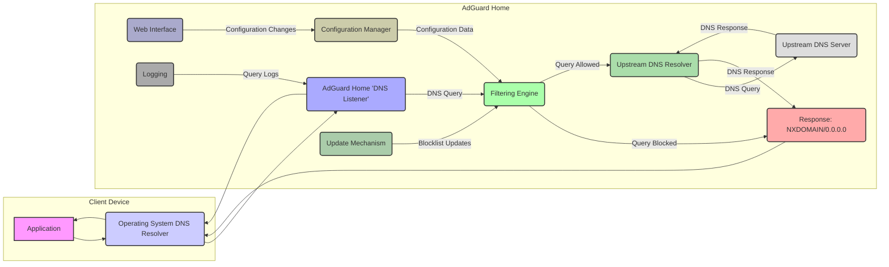

## Project Design Document: AdGuard Home (Improved)

**1. Introduction**

This document provides an enhanced design overview of AdGuard Home, a network-wide software solution designed for ad blocking and privacy protection. The purpose of this document is to clearly articulate the system's architecture, its constituent components, the flow of data, and the underlying technologies. This detailed design will serve as a crucial input for subsequent threat modeling activities, enabling a comprehensive security analysis.

**2. Goals and Objectives**

*   **Core Functionality:** Implement network-wide ad blocking and protection against online tracking.
*   **DNS Resolution:** Act as a local DNS server, intercepting and processing DNS queries originating from network devices.
*   **Customization:** Offer granular control over filtering through configurable rules and the use of external blocklists.
*   **User Interface:** Provide an intuitive web interface for system configuration, monitoring, and management.
*   **Performance:** Maintain a lightweight and efficient footprint suitable for deployment on home networks and resource-constrained environments.
*   **Protocol Support:** Support standard DNS protocols alongside encrypted DNS options like DNS-over-HTTPS (DoH) and DNS-over-TLS (DoT).

**3. High-Level Architecture**

AdGuard Home functions as an intermediary DNS resolver within a network. Client devices are configured to use AdGuard Home as their DNS server. When a client initiates a DNS query, AdGuard Home intercepts it. The system's filtering engine then evaluates the query against a set of rules derived from configured blocklists and user-defined settings. If the queried domain matches a blocking rule, AdGuard Home returns a negative response (e.g., `NXDOMAIN` or resolves to `0.0.0.0`). For allowed queries, AdGuard Home forwards the request to a designated upstream DNS server and relays the response back to the originating client. A web-based interface allows administrators to manage all aspects of AdGuard Home's operation.

**4. Detailed Design**

The AdGuard Home system comprises the following key components, each with specific responsibilities:

*   **"DNS Listener"**:
    *   **Function:**  The entry point for all incoming DNS queries from client devices on the network.
    *   **Technical Details:** Listens on specified IP addresses and ports (typically UDP/TCP port 53). Supports standard DNS, DNS-over-HTTPS (DoH), and DNS-over-TLS (DoT) protocols.
    *   **Security Relevance:**  Responsible for initial parsing and validation of DNS requests. Vulnerabilities here could lead to denial-of-service or the ability to inject malicious DNS data.

*   **"Filtering Engine"**:
    *   **Function:** The core logic for determining whether a DNS query should be blocked or allowed.
    *   **Technical Details:**  Utilizes a collection of blocklists (e.g., EasyList, EasyPrivacy) and user-defined filtering rules. Matches the domain name in the DNS query against these rules, supporting various matching techniques (exact match, wildcard). Implements advanced features like CNAME-uncloaking to bypass certain ad-serving techniques.
    *   **Security Relevance:**  The integrity and source of blocklists are critical. A compromised blocklist could lead to legitimate domains being blocked or malicious domains being allowed. The efficiency of the engine is important to prevent denial-of-service.

*   **"Upstream DNS Resolver"**:
    *   **Function:**  Handles the resolution of DNS queries that are not blocked by the Filtering Engine.
    *   **Technical Details:**  Allows configuration of multiple upstream DNS servers, including primary and secondary options. Supports conditional forwarding, allowing different upstream servers to be used for specific domains. Can communicate with upstream servers using secure protocols (DoH, DoT). Implements a DNS cache to improve performance and reduce reliance on upstream servers.
    *   **Security Relevance:**  The security of communication with upstream servers is paramount. Using encrypted protocols (DoH, DoT) mitigates eavesdropping and man-in-the-middle attacks. Cache poisoning vulnerabilities in the resolver could lead to incorrect DNS resolutions.

*   **"Configuration Manager"**:
    *   **Function:**  Manages the loading, storage, and application of AdGuard Home's configuration settings.
    *   **Technical Details:** Configuration is typically stored in a YAML file. Manages settings related to DNS listening addresses, upstream DNS servers, enabled blocklists, custom filtering rules, and web interface access credentials. Provides an API for the Web Interface to interact with the configuration.
    *   **Security Relevance:**  The configuration file contains sensitive information. Unauthorized access or modification could compromise the entire system. Secure storage and access controls are essential.

*   **"Web Interface"**:
    *   **Function:** Provides a graphical user interface for managing and monitoring AdGuard Home.
    *   **Technical Details:**  Typically accessible via a web browser on a specific port (e.g., 3000). Allows users to view statistics (blocked queries, top blocked domains), configure upstream DNS servers and blocklists, add custom filtering rules, test DNS queries, and manage client settings.
    *   **Security Relevance:**  A critical attack surface. Vulnerabilities like cross-site scripting (XSS), cross-site request forgery (CSRF), and insecure authentication could allow unauthorized access and control of the system.

*   **"Logging and Reporting"**:
    *   **Function:** Records DNS query activity for monitoring, debugging, and analysis.
    *   **Technical Details:** Logs include details of blocked and allowed queries, timestamps, and client information. Offers configurable log levels and output formats. Generates statistics displayed in the Web Interface.
    *   **Security Relevance:**  Logs can contain sensitive information about user browsing habits. Secure storage and access controls are necessary. Log data can be valuable for security auditing and incident response.

*   **"Update Mechanism"**:
    *   **Function:**  Automates the process of updating blocklists from remote sources.
    *   **Technical Details:** Periodically checks for updates to configured blocklists based on defined schedules. Downloads and applies updates to the Filtering Engine. May involve verifying the integrity of downloaded lists.
    *   **Security Relevance:**  A compromised update mechanism could be used to inject malicious entries into blocklists, effectively disabling protection or redirecting traffic to malicious sites. Secure download protocols and integrity checks are crucial.

**5. Data Flow (Detailed)**

**Detailed Data Flow Description:**

*   An application on a client device initiates a DNS query for a specific domain.
*   The client operating system's DNS resolver forwards this query to the configured DNS server, which is AdGuard Home's "DNS Listener".
*   The "DNS Listener" receives the DNS query and passes it to the "Filtering Engine".
*   The "Filtering Engine" examines the queried domain against its loaded blocklists and custom filtering rules.
    *   If the domain matches a blocking rule, the "Filtering Engine" instructs the "DNS Listener" to construct and return a blocked response (typically `NXDOMAIN` or an IP address of `0.0.0.0`).
    *   If the domain is not blocked, the "Filtering Engine" forwards the query to the "Upstream DNS Resolver".
*   The "Upstream DNS Resolver" selects an appropriate upstream DNS server (based on configuration) and forwards the DNS query.
*   The upstream DNS server resolves the query and returns the DNS response to the "Upstream DNS Resolver".
*   The "Upstream DNS Resolver" caches the received response (subject to TTL) and forwards it back to the "DNS Listener".
*   The "DNS Listener" relays the DNS response back to the client operating system's DNS resolver.
*   The client operating system's DNS resolver provides the resolved IP address to the requesting application.
*   The "Configuration Manager" provides the "Filtering Engine" with the necessary blocklist data and filtering rules.
*   The "Web Interface" allows users to make configuration changes, which are then applied by the "Configuration Manager".
*   The "Update Mechanism" periodically fetches updated blocklists and provides them to the "Filtering Engine".
*   The "Logging" component records details of processed DNS queries received by the "DNS Listener".

**6. Key Technologies**

*   **Primary Programming Language:** Go (Golang) - chosen for its performance, concurrency features, and suitability for network applications.
*   **Configuration File Format:** YAML - a human-readable data serialization language used for storing AdGuard Home's configuration.
*   **Supported DNS Protocols:** UDP, TCP (for standard DNS), DNS-over-HTTPS (DoH), DNS-over-TLS (DoT) - providing flexibility and secure communication options.
*   **Web Interface Technologies:**  Likely a combination of HTML, CSS, and JavaScript for the front-end, potentially utilizing a Go-based web framework or standard library features for the backend.
*   **Blocklist Format Support:**  Compatible with various standard blocklist formats, including hosts files and Adblock Plus filter syntax.

**7. Security Considerations (Detailed for Threat Modeling)**

*   **"DNS Listener" Vulnerabilities:**
    *   **Denial of Service (DoS):** Susceptible to UDP and TCP flooding attacks targeting port 53.
    *   **DNS Spoofing/Cache Poisoning:** If not implemented carefully, could be vulnerable to attacks that inject false DNS records into its cache.
    *   **Protocol Exploits:** Potential vulnerabilities in the handling of different DNS protocols (UDP, TCP, DoH, DoT).

*   **"Filtering Engine" Vulnerabilities:**
    *   **Blocklist Tampering:** If the update mechanism is compromised, malicious entries could be injected into blocklists.
    *   **Performance Issues:** Complex or poorly written filtering rules could lead to performance degradation and DoS.
    *   **Bypass Techniques:** Attackers may develop techniques to circumvent filtering rules.

*   **"Upstream DNS Resolver" Vulnerabilities:**
    *   **DNS Spoofing/Cache Poisoning:** Vulnerable if communicating with untrusted or compromised upstream DNS servers (mitigated by using DoH/DoT).
    *   **Man-in-the-Middle Attacks:**  Without secure protocols (DoH/DoT), communication with upstream servers can be intercepted and manipulated.

*   **"Configuration Manager" Vulnerabilities:**
    *   **Unauthorized Access:** If the configuration file is not properly protected, attackers could modify settings.
    *   **Injection Attacks:** Potential vulnerabilities in the API used by the Web Interface to modify configuration.

*   **"Web Interface" Vulnerabilities:**
    *   **Cross-Site Scripting (XSS):** Attackers could inject malicious scripts into the web interface, potentially compromising user sessions.
    *   **Cross-Site Request Forgery (CSRF):** Attackers could trick authenticated users into performing unintended actions.
    *   **Insecure Authentication/Authorization:** Weak passwords or flawed authentication mechanisms could allow unauthorized access.
    *   **Injection Attacks (SQL, Command):** If the web interface interacts with a database or executes commands, it could be vulnerable to injection attacks.

*   **"Logging and Reporting" Vulnerabilities:**
    *   **Information Disclosure:** Logs may contain sensitive information about user browsing habits.
    *   **Log Tampering:** Attackers might try to modify or delete logs to cover their tracks.

*   **"Update Mechanism" Vulnerabilities:**
    *   **Man-in-the-Middle Attacks:** If updates are not downloaded over secure channels (HTTPS) or integrity checks are missing, attackers could inject malicious blocklists.
    *   **Compromised Update Source:** If the source of blocklist updates is compromised, malicious data could be distributed.

**8. Deployment Considerations and Security Implications**

*   **Home Router Deployment:**  Commonly deployed directly on a home router. Security implications include the router's overall security posture and the potential for vulnerabilities in the router's operating system.
*   **Dedicated Server/Device:**  Deploying on a dedicated server or device offers more control over the underlying operating system and security configurations but requires more technical expertise.
*   **Containerized Deployment (Docker):**  Provides isolation and simplifies deployment but introduces the security considerations of the container runtime environment.
*   **Cloud Deployment (VPS):** Offers scalability but introduces the security considerations of the cloud provider and the need to properly secure the virtual machine.

**9. Future Considerations (Beyond Initial Threat Model)**

*   Integration with threat intelligence feeds for enhanced blocking capabilities.
*   Advanced analytics and reporting features for identifying trends and potential threats.
*   Support for more sophisticated filtering rule languages and expressions.
*   Centralized management and synchronization of settings across multiple AdGuard Home instances.

This improved design document provides a more detailed and security-focused overview of AdGuard Home, making it a more effective foundation for subsequent threat modeling activities. The enhanced descriptions of components, data flow, and security considerations will facilitate a more comprehensive and accurate assessment of potential vulnerabilities.