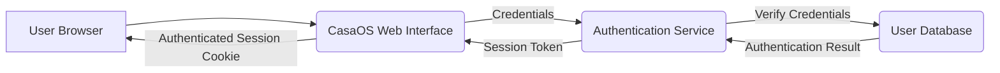
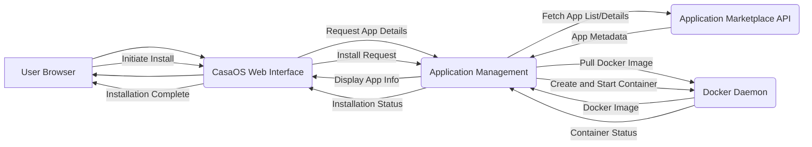
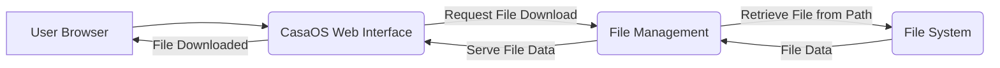

# Project Design Document: CasaOS

**Version:** 1.1
**Date:** October 26, 2023
**Author:** AI Software Architect

## 1. Introduction

This document provides a detailed design overview of the CasaOS project, an open-source personal cloud operating system. This document aims to clearly articulate the system's architecture, components, and interactions to facilitate effective threat modeling in subsequent stages of the project lifecycle.

### 1.1. Purpose

The primary purpose of this document is to serve as a comprehensive design reference for security analysis, specifically for threat modeling. It outlines the key components, data flows, and interactions within the CasaOS system, providing the necessary context for identifying potential vulnerabilities.

### 1.2. Scope

This document covers the core architectural components of CasaOS, including its web interface, application management, file management, and underlying system interactions. It focuses on the logical architecture and key data flows, without delving into specific implementation details or code-level specifics unless directly relevant to understanding component interaction.

### 1.3. Goals

*   Provide a clear and concise description of the CasaOS architecture and its major components.
*   Identify key components and their specific responsibilities and interactions.
*   Illustrate the primary data flows within the system, highlighting data sources and destinations.
*   Establish a solid foundation for identifying potential security threats and vulnerabilities within the CasaOS ecosystem.

## 2. System Overview

CasaOS is designed as a user-friendly platform for managing personal cloud services on a single board computer or server. It provides a web-based interface for users to interact with and manage various applications and services, primarily through containerization.

### 2.1. High-Level Architecture

CasaOS employs a layered architecture, with distinct components interacting to provide the overall functionality. The core components include:

*   **Web Interface Layer:**  The presentation layer responsible for user interaction.
*   **Application Management Layer:** Handles the lifecycle of applications.
*   **File Management Layer:** Provides access to and management of files.
*   **System Management Layer:** Manages core system functionalities.
*   **Containerization Layer:** The underlying technology for running applications.
*   **Operating System Layer:** The base operating system.

### 2.2. Key Components

#### 2.2.1. Web Interface

*   **Description:** A web application serving as the primary user interface for CasaOS.
*   **Functionality:**
    *   User authentication and session management.
    *   Displaying system status, resource utilization, and application information.
    *   Providing access to application management features (installation, updates, removal).
    *   Providing access to file management features (browsing, upload, download).
    *   Providing access to system settings and configurations (user management, network settings).
*   **Technology:** Likely a Single Page Application (SPA) built using web technologies like HTML, CSS, JavaScript, and a backend framework (e.g., Node.js with Express, Python with Flask/Django). Communication with backend components likely occurs via RESTful APIs.

#### 2.2.2. Application Management

*   **Description:**  Manages the lifecycle of applications within CasaOS, primarily through Docker containers.
*   **Functionality:**
    *   Interacting with application repositories or marketplaces to retrieve application manifests or definitions (e.g., Docker Compose files).
    *   Communicating with the Docker daemon to pull container images, create, start, stop, restart, and delete containers.
    *   Managing application configurations, environment variables, and persistent storage volumes.
    *   Exposing application logs and status information to the web interface.
*   **Technology:**  Interacts directly with the Docker API (likely through a Docker SDK or client library). May include a component for parsing and interpreting application manifests (e.g., Docker Compose).

#### 2.2.3. File Management

*   **Description:** Provides users with the ability to manage files stored on the CasaOS system.
*   **Functionality:**
    *   Browsing the file system with appropriate permissions.
    *   Uploading and downloading files to and from the server.
    *   Creating, deleting, renaming, and moving files and directories.
    *   Potentially managing file permissions and sharing settings.
*   **Technology:**  Likely interacts with the underlying file system through system calls or libraries provided by the operating system. May utilize a backend service to handle file operations and serve files to the web interface.

#### 2.2.4. System Management

*   **Description:** Handles core system-level functionalities and configurations.
*   **Functionality:**
    *   User account creation, modification, and deletion.
    *   Managing user roles and permissions.
    *   Network configuration (e.g., setting static IP addresses, configuring DNS).
    *   Performing system updates and upgrades of CasaOS components.
    *   Managing system services (starting, stopping, restarting CasaOS services).
    *   Collecting and providing system logs and monitoring information.
*   **Technology:**  Interacts with the underlying operating system's system administration tools and APIs (e.g., `systemd`, network configuration utilities).

#### 2.2.5. Underlying Operating System

*   **Description:** The base Linux distribution on which CasaOS is installed and operates.
*   **Functionality:** Provides the kernel, core utilities, system libraries, and device drivers necessary for CasaOS and Docker to run.
*   **Examples:** Debian, Ubuntu, Raspberry Pi OS.

#### 2.2.6. Docker Daemon

*   **Description:** The containerization engine responsible for running applications in isolated containers.
*   **Functionality:**
    *   Pulling container images from configured registries (e.g., Docker Hub).
    *   Creating and managing container instances based on image definitions.
    *   Providing resource isolation (CPU, memory, network) for containers.
    *   Managing container networking (e.g., creating bridge networks, port mappings).
    *   Managing container storage volumes and data persistence.

## 3. Data Flow Diagrams

### 3.1. User Login

### 3.2. Installing an Application from Marketplace

### 3.3. Downloading a File

## 4. Security Considerations (Initial)

This section outlines initial security considerations based on the system design. A more detailed threat model will be developed in subsequent phases.

*   **Authentication and Authorization:**
    *   Ensuring strong password policies and secure storage of user credentials.
    *   Implementing robust session management to prevent session hijacking.
    *   Properly enforcing authorization rules to control access to resources and functionalities based on user roles.
*   **Data Storage Security:**
    *   Protecting sensitive data at rest, including user credentials and application data.
    *   Implementing appropriate file system permissions to restrict unauthorized access.
    *   Considering encryption for sensitive data.
*   **Network Security:**
    *   Securing communication between the web interface and backend components (e.g., using HTTPS).
    *   Protecting against network-based attacks.
    *   Properly configuring firewall rules to restrict access to necessary ports and services.
*   **Application Security:**
    *   Mitigating risks associated with running third-party applications in Docker containers.
    *   Implementing resource limits for containers to prevent denial-of-service attacks.
    *   Considering container security scanning and vulnerability management.
*   **Supply Chain Security:**
    *   Verifying the integrity and authenticity of application images pulled from repositories.
    *   Trusting application marketplaces and repositories.
*   **Web Interface Security:**
    *   Protecting against common web vulnerabilities such as Cross-Site Scripting (XSS), Cross-Site Request Forgery (CSRF), and SQL Injection (if databases are directly accessed by the web interface).
    *   Implementing proper input validation and output encoding.
*   **API Security:**
    *   Securing internal APIs between components using authentication and authorization mechanisms.
    *   Protecting against API abuse and unauthorized access.
*   **Docker Daemon Security:**
    *   Securing the Docker daemon itself to prevent unauthorized container management.
    *   Following Docker security best practices.

## 5. Assumptions and Constraints

*   CasaOS relies on a properly installed and configured Docker daemon on the underlying operating system.
*   User authentication is primarily handled by the CasaOS web interface or a dedicated authentication service integrated with it.
*   Application installations primarily involve pulling and running pre-built Docker container images.
*   The underlying operating system provides basic security features, and CasaOS builds upon these.
*   Communication between internal components is assumed to occur over a trusted network (e.g., localhost or an internal network).

## 6. Future Considerations

*   Integration with external authentication providers (e.g., OAuth 2.0).
*   More granular role-based access control.
*   Advanced monitoring and alerting capabilities for security events.
*   Support for different container runtimes beyond Docker.
*   Implementation of backup and recovery mechanisms.
*   Features for managing and securing network access to applications.

This document provides a more detailed and refined understanding of the CasaOS architecture, serving as a robust foundation for subsequent threat modeling activities. Further details and refinements may be added as the project evolves and more specific implementation details become available.