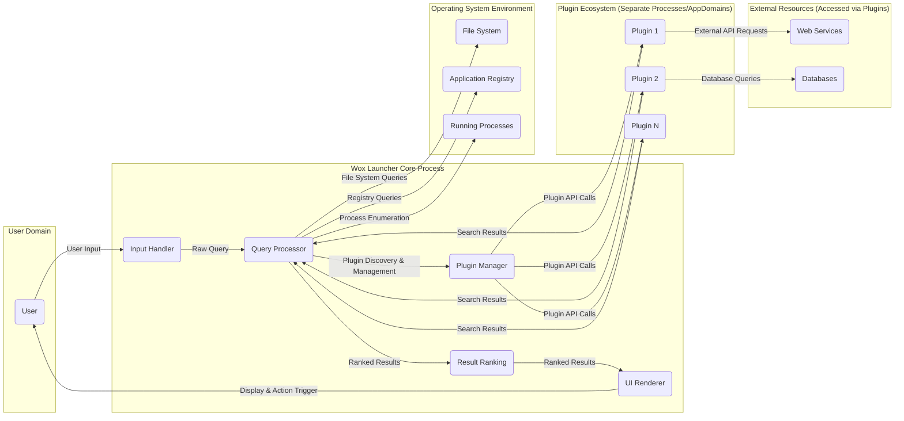
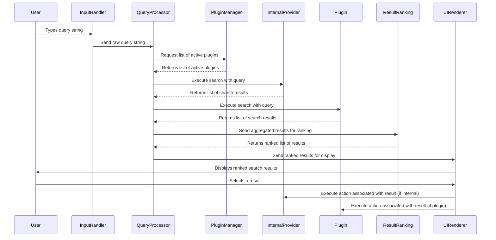

# Project Design Document: Wox Launcher

**Version:** 1.1
**Date:** October 26, 2023
**Prepared By:** AI Software Architect

## 1. Introduction

This document outlines the design of the Wox launcher application, an open-source, extensible launcher for Windows. This document serves as a blueprint for understanding the system's architecture, components, and data flow, which is crucial for subsequent threat modeling activities. This revision aims to provide more granular detail and clarity for security analysis.

## 2. Goals and Objectives

*   Provide a clear and comprehensive overview of the Wox launcher's architecture, emphasizing security-relevant aspects.
*   Identify key components and their interactions, detailing their specific responsibilities.
*   Describe the data flow within the application, highlighting potential points of data manipulation or interception.
*   Highlight potential areas of interest for security analysis and threat modeling, providing concrete examples of potential threats.
*   Serve as a reference point for future development and security assessments, facilitating informed decision-making.

## 3. High-Level Architecture

The Wox launcher operates as a user-facing application that interacts with the underlying operating system and potentially external resources through plugins. The diagram below illustrates the main entities and their relationships.

## 4. Detailed Architecture and Components

This section delves into the specific components of the Wox launcher and their interactions, providing more detail on their functionality.

### 4.1. Input Handler

*   **Description:** Responsible for capturing user input (keywords) from the keyboard when the Wox window is active. This component directly interacts with Windows input APIs.
*   **Functionality:**
    *   Listens for global keyboard events or events specific to the Wox window.
    *   Buffers keystrokes to form the user's query.
    *   Triggers the Query Processor when a predefined activation key or sequence is detected and input is present.
    *   Handles special commands or hotkeys that might bypass the normal query processing (e.g., opening settings).

### 4.2. Query Processor

*   **Description:** The central logic component that interprets user input, orchestrates the search process, and aggregates results.
*   **Functionality:**
    *   Parses the user's query, potentially performing tokenization or basic intent recognition.
    *   Identifies relevant search providers (internal and plugins) based on keywords or prefixes.
    *   Dispatches queries to appropriate internal providers (e.g., application search, file search).
    *   Communicates with the Plugin Manager to invoke relevant plugins, passing the query and potentially other context.
    *   Receives search results from internal providers and plugins.
    *   Aggregates results from different providers into a unified list.

### 4.3. Plugin Manager

*   **Description:** Manages the lifecycle of plugins, including discovery, loading, unloading, and inter-plugin communication (if supported). This component is crucial for the extensibility of Wox.
*   **Functionality:**
    *   Discovers available plugins by scanning designated directories for plugin manifests or assemblies.
    *   Loads plugin assemblies into the Wox process (or potentially separate AppDomains/processes for isolation).
    *   Provides a defined API (likely using interfaces or abstract classes) for communication between the Wox core and plugins. This API defines how plugins receive queries and return results.
    *   Handles plugin configuration and settings, potentially storing plugin-specific data.
    *   Manages plugin dependencies and potential conflicts.

### 4.4. Result Ranking

*   **Description:** Determines the order in which search results are displayed to the user, aiming to present the most relevant results first.
*   **Functionality:**
    *   Applies ranking algorithms based on factors such as:
        *   Relevance of the result to the query (e.g., string matching score).
        *   Frequency of user selection of the result in the past.
        *   Recency of use.
        *   Potentially, plugin-provided relevance scores.
    *   Allows for customization of ranking rules through user settings or plugin contributions.

### 4.5. UI Renderer

*   **Description:** Responsible for displaying the search results and the Wox user interface, handling user interactions with the results.
*   **Functionality:**
    *   Renders the search results in a visually appealing and user-friendly manner, typically in a list format.
    *   Displays relevant information for each result (e.g., name, description, icon).
    *   Handles user interaction with the results, such as:
        *   Keyboard navigation (up/down arrows).
        *   Mouse clicks.
        *   Copying result information.
    *   Triggers the execution of the selected result's action when the user confirms their selection (e.g., pressing Enter).

### 4.6. Internal Search Providers

*   **Description:** Modules within the Wox core that provide search capabilities for specific, built-in data sources.
*   **Examples:**
    *   **Application Search:** Indexes and searches installed applications based on their names and metadata from the Windows registry or file system.
    *   **File Search:** Searches the file system based on keywords in file names and potentially file content (depending on implementation).
    *   **System Commands:** Provides access to common Windows commands and utilities (e.g., "shutdown", "restart").
    *   **Settings Search:** Indexes and searches Windows settings and control panel items.

### 4.7. Plugins

*   **Description:** External extensions developed by third parties that provide additional search capabilities and functionalities, significantly extending Wox's capabilities.
*   **Characteristics:**
    *   Developed as separate assemblies (e.g., DLLs).
    *   Reside in designated plugin directories.
    *   Communicate with the Wox core through a defined API, typically involving method calls and data structures.
    *   Can access local resources (files, network) and external services, depending on their implementation and permissions.
*   **Examples:**
    *   Web search plugins (e.g., searching Google, DuckDuckGo directly from Wox).
    *   Calculator plugins.
    *   Clipboard history plugins.
    *   Translation plugins.

## 5. Data Flow

The typical data flow within Wox follows these steps, highlighting the movement and transformation of data:

1. **User Input:** The user types a query into the active Wox window. This raw input is a string of characters.
2. **Input Handling:** The Input Handler captures the keystrokes and forms the complete query string.
3. **Query Processing:** The Query Processor receives the raw query string.
4. **Provider Identification:** The Query Processor analyzes the query to determine which internal providers and plugins are relevant (e.g., based on keywords or prefixes).
5. **Search Request Dispatch:** The Query Processor sends the query (or a modified version) to the identified internal providers and plugins via their respective interfaces.
6. **Search Execution:**
    *   Internal providers execute their search logic against their specific data sources (e.g., file system, registry).
    *   Plugins execute their custom search logic, potentially accessing external APIs or databases.
7. **Result Retrieval:** Internal providers and plugins return a list of search results to the Query Processor. Each result typically includes:
    *   A title or name.
    *   A description or subtitle.
    *   An icon or image.
    *   An action to be performed if the result is selected.
8. **Result Aggregation:** The Query Processor collects the result lists from all providers.
9. **Result Ranking:** The Result Ranking component receives the aggregated list of results and applies its ranking algorithm to order them.
10. **UI Rendering:** The UI Renderer receives the ranked list of results and renders them in the Wox window.
11. **Action Execution:** When the user selects a result and confirms (e.g., by pressing Enter), the UI Renderer triggers the corresponding action. This might involve:
    *   Launching an application (using `System.Diagnostics.Process.Start`).
    *   Opening a file.
    *   Executing a command.
    *   Invoking a plugin-specific action.

## 6. Key Data Elements

*   **User Query (String):** The raw text input provided by the user. This is the initial untrusted data.
*   **Search Results (List of Objects):** A structured list of items matching the user's query. Each object contains:
    *   **Title (String):** The primary display text of the result.
    *   **Subtitle (String):**  A secondary description.
    *   **Icon (Image/Path):**  Visual representation of the result.
    *   **Action (Object/Delegate):**  The code or data to execute when the result is selected. This is a critical element for security.
    *   **Score (Numeric):**  Relevance score assigned by the provider.
*   **Plugin Configuration (Varies):** Settings and preferences for individual plugins, potentially including sensitive information like API keys or credentials. Storage mechanisms for this data are important.
*   **Application Index (Data Structure):**  Data about installed applications, including names, executable paths, and potentially other metadata.
*   **File System Index (Data Structure or Dynamic Access):** Data about files and folders, potentially including paths and metadata. Access to this data needs to be controlled.

## 7. Security Considerations (Detailed)

This section highlights potential areas of security concern with specific examples of potential threats.

*   **Plugin Security:** This is a primary attack surface due to the extensible nature of Wox.
    *   **Malicious Plugins:**
        *   **Threat:** A plugin from an untrusted source could contain code to steal user data, install malware, or perform other malicious actions.
        *   **Example:** A plugin disguised as a utility could log keystrokes or exfiltrate browser history.
    *   **Code Injection:**
        *   **Threat:** Vulnerabilities in the plugin API or core could allow a malicious plugin to inject arbitrary code into the Wox process or other processes.
        *   **Example:** A plugin could exploit a buffer overflow in the Wox core when handling plugin API calls.
    *   **Data Access:**
        *   **Threat:** Plugins might request or be granted excessive permissions, allowing them to access sensitive user data or system resources beyond their intended scope.
        *   **Example:** A simple calculator plugin might request access to the entire file system.
    *   **Unsafe Dependencies:**
        *   **Threat:** Plugins might rely on vulnerable third-party libraries, introducing security flaws into the Wox ecosystem.
        *   **Example:** A plugin using an outdated networking library with known vulnerabilities.
*   **Input Validation:** Improper handling of user input can lead to various vulnerabilities.
    *   **Command Injection:**
        *   **Threat:** If user input is directly used to construct system commands without proper sanitization, an attacker could inject malicious commands.
        *   **Example:** A plugin that executes shell commands based on user input could be exploited to run arbitrary commands.
    *   **Path Traversal:**
        *   **Threat:** Vulnerabilities when handling file paths in user input or plugin results could allow access to unauthorized files or directories.
        *   **Example:** A plugin that allows opening files based on user input could be tricked into opening system files.
*   **Privilege Escalation:**
    *   **Threat:** If Wox runs with elevated privileges (which is generally discouraged), vulnerabilities could be exploited to gain higher access to the system.
    *   **Example:** A malicious plugin could leverage Wox's elevated privileges to install system-level malware.
    *   **Threat:** Plugins might attempt to perform actions requiring elevated privileges without proper authorization or user consent.
*   **Data Security:**
    *   **Threat:** Sensitive information stored by Wox or its plugins (e.g., API keys, credentials) could be vulnerable if not encrypted or protected adequately.
    *   **Example:** A plugin storing API keys in plain text in its configuration file.
    *   **Threat:** The application index or file system index might contain sensitive file paths that could be exposed or exploited.
*   **Update Mechanism:**
    *   **Threat:** If Wox has an auto-update feature, a compromised update server or insecure update process could lead to the installation of malicious software.
    *   **Example:** Man-in-the-middle attack during an update, replacing the legitimate update with a malicious one.
*   **Inter-Process Communication (IPC):**
    *   **Threat:** If plugins communicate with external processes, insecure IPC mechanisms could be exploited to intercept or manipulate data.
    *   **Example:** A plugin communicating with a local server using an unauthenticated or unencrypted channel.

## 8. Future Considerations

*   **Sandboxing for Plugins:** Implementing a robust sandboxing mechanism for plugins to restrict their access to system resources (file system, network, registry). This would significantly mitigate the risk of malicious plugins.
    *   **Benefit:** Limits the impact of compromised plugins.
    *   **Challenge:** Requires significant architectural changes and might impact plugin functionality.
*   **Plugin Signing and Verification:** Requiring plugins to be digitally signed by trusted developers and verifying these signatures before loading plugins.
    *   **Benefit:** Increases trust in plugins and helps prevent the execution of tampered or malicious plugins.
    *   **Challenge:** Requires establishing a plugin signing infrastructure and process.
*   **Enhanced Input Sanitization and Validation:** Implementing more rigorous input validation and sanitization techniques throughout the Wox core and plugin API to prevent injection attacks.
    *   **Benefit:** Reduces the risk of command injection and path traversal vulnerabilities.
    *   **Challenge:** Requires careful implementation to avoid breaking legitimate functionality.
*   **Role-Based Access Control for Plugins:** Defining a permission system that allows users to grant specific permissions to plugins, limiting their access to only necessary resources.
    *   **Benefit:** Provides granular control over plugin capabilities.
    *   **Challenge:** Requires a well-defined permission model and user interface for managing permissions.
*   **Secure Storage for Plugin Configuration:** Implementing secure storage mechanisms for plugin configuration data, such as using the Windows Credential Manager or encrypted files.
    *   **Benefit:** Protects sensitive information like API keys.
    *   **Challenge:** Requires careful implementation and management of encryption keys.
*   **Regular Security Audits and Penetration Testing:** Conducting regular security assessments to identify and address potential vulnerabilities in the Wox core and popular plugins.
    *   **Benefit:** Proactively identifies and mitigates security risks.
    *   **Challenge:** Requires dedicated resources and expertise.

This improved design document provides a more detailed and security-focused overview of the Wox launcher. This enhanced information will be invaluable for conducting a comprehensive threat model and implementing appropriate security measures.