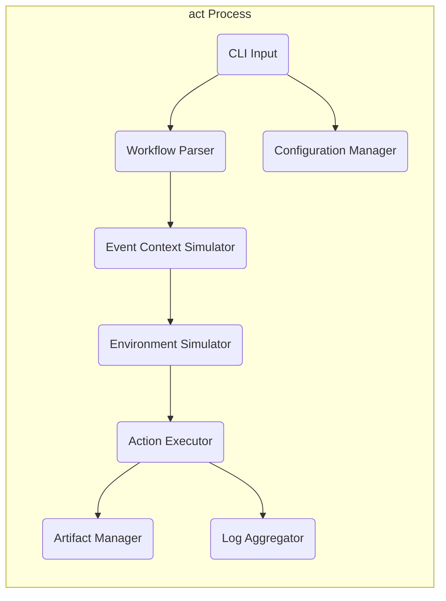
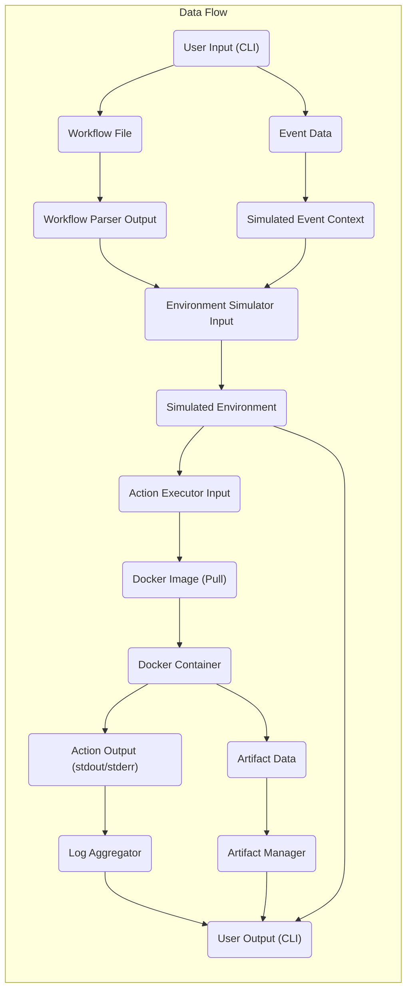

# Project Design Document: act - Run your GitHub Actions locally

**Version:** 1.1
**Date:** October 26, 2023
**Author:** AI Software Architect

## 1. Introduction

This document provides a detailed design overview of the `act` project, a command-line tool enabling users to execute GitHub Actions workflows locally. This document aims to furnish a comprehensive understanding of the system's architecture, components, and data flow, serving as a robust foundation for subsequent threat modeling activities. This revision incorporates further detail and clarification based on initial review.

## 2. Goals

The primary goals of this design document are to:

*   Clearly articulate the architecture and individual components of the `act` project with enhanced detail.
*   Describe the data flow within the system with greater precision and clarity.
*   Identify key areas and specific components that are particularly relevant for security considerations and threat modeling.
*   Provide visual representations of the system's structure and interactions using standardized diagrams.

## 3. Overview

`act` empowers developers to execute GitHub Actions workflows directly on their local machines, closely simulating the behavior of the official GitHub Actions environment. This facilitates rapid iteration, efficient debugging, and thorough testing of workflows without the necessity of pushing code to a remote repository for every modification. `act` achieves this by:

*   Reading and interpreting workflow definition files (typically in YAML format).
*   Simulating the environment variables and contexts that are present within the GitHub Actions runtime.
*   Orchestrating the execution of individual steps defined within the workflow.
*   Frequently leveraging containerization technologies, such as Docker, to provide isolated and reproducible environments for action execution.

## 4. System Architecture

The `act` system is logically structured into the following architectural components, each with specific responsibilities:

*   **Command Line Interface (CLI):**  The primary interface through which users interact with `act`. It is responsible for:
    *   Parsing user-provided commands, flags, and arguments.
    *   Validating user input.
    *   Orchestrating the execution flow based on user commands.
*   **Workflow Parser:** This component is dedicated to the interpretation of GitHub Actions workflow definition files. Its responsibilities include:
    *   Reading workflow files from the local filesystem (typically located in `.github/workflows/`).
    *   Parsing the YAML structure of the workflow definition.
    *   Extracting key elements such as jobs, steps, actions, triggers, and environment variables.
    *   Performing basic validation of the workflow syntax.
*   **Event Context Simulator:**  GitHub Actions are often triggered by specific events. This component simulates these triggering events, allowing users to:
    *   Specify the payload of the event that would initiate a workflow run (e.g., simulating a `push` event with specific details).
    *   Simulate various trigger types, including webhook events, scheduled events (cron), and manual dispatches.
    *   Construct the `github.context` object that is available within the GitHub Actions environment.
*   **Environment Simulator:** This component is responsible for establishing the execution environment for the workflow steps. This involves:
    *   Setting up standard environment variables that are typically available within the GitHub Actions environment (e.g., `GITHUB_WORKSPACE`, `GITHUB_REPOSITORY`, `GITHUB_SHA`).
    *   Constructing and populating the `github` context object, providing information about the current workflow run, repository, and other relevant details.
    *   Handling the retrieval and injection of secrets, potentially from environment variables or configuration files.
*   **Action Executor:** The core component responsible for the actual execution of individual steps defined in the workflow. This process typically involves:
    *   Resolving the action to be executed, which might involve locating a local action or fetching a remote action (often a Docker image).
    *   Downloading or locating the appropriate Docker image associated with the action.
    *   Creating and managing Docker containers based on the action's image.
    *   Mapping volumes between the host system and the container (e.g., mapping the workspace).
    *   Configuring network settings for the container.
    *   Passing environment variables and inputs to the container.
    *   Capturing the standard output and standard error streams from the container.
    *   Managing the lifecycle of the container.
*   **Artifact Manager:** This component simulates the artifact management capabilities of GitHub Actions. It handles:
    *   The creation of artifacts based on instructions within workflow steps.
    *   The local storage of artifact data.
    *   Simulating the upload and download processes for artifacts.
*   **Log Aggregator:** This component collects and presents the logs generated during the execution of workflow steps. Its responsibilities include:
    *   Receiving log streams from the Action Executor (primarily from container output).
    *   Formatting and displaying logs to the user in a readable manner.
    *   Potentially providing options for log filtering or persistence.
*   **Configuration Manager:** This component manages the configuration of `act` itself. This includes:
    *   Handling user-defined configurations (e.g., specifying a custom Docker client).
    *   Managing default settings and fallback behaviors.
    *   Potentially handling configuration through command-line flags or configuration files.

## 5. Data Flow

The movement of data within `act` can be described in the following stages:

*   **User Input via CLI:** The user initiates the process by providing input through the command-line interface. This input specifies the workflow file to execute, any event details to simulate, and other relevant parameters.
*   **Workflow Definition Retrieval:** The Workflow Parser reads the specified workflow definition file from the local filesystem.
*   **Event Data Generation/Reception:** The Event Context Simulator either generates event data based on user-provided input or uses default configurations to simulate a triggering event.
*   **Environment Configuration Setup:** The Environment Simulator constructs the necessary environment variables and context data based on the simulated event and the workflow definition. This may involve retrieving secrets from configured sources.
*   **Action Execution Details Provisioning:** The Action Executor receives detailed instructions for each step in the workflow, including the action to run, any required inputs, and the relevant environment variables.
*   **Docker Image Acquisition:** The Action Executor may need to pull Docker images from container registries (such as Docker Hub or ghcr.io) if the specified action is a container-based action and the image is not already present locally.
*   **Container Instance Creation and Execution:** The Action Executor interacts with the Docker daemon to create and run Docker containers for each action step. This involves passing configuration details and commands to the Docker daemon.
*   **Action Output Generation:** Actions running within the Docker containers produce output on their standard output and standard error streams. They may also create artifacts as part of their execution.
*   **Log Data Streaming:** The Log Aggregator receives and processes the log streams from the running containers, making them available to the user.
*   **Artifact Data Management:** The Artifact Manager handles the creation and local storage of any artifact data produced by the workflow steps.
*   **Output Presentation to User:**  `act` presents the collected logs, information about created artifacts, and the overall status of the workflow execution back to the user through the command-line interface.

## 6. Key Components and Interactions

This section provides a more detailed look at the interactions between key components:

*   **CLI and Workflow Parser Interaction:** The CLI receives the path to the workflow file as input from the user and passes this path to the Workflow Parser. The Workflow Parser then reads the file content, parses the YAML structure, and extracts the structured representation of the workflow, including jobs and steps.
    *   **Data Exchanged:** File path (from CLI to Parser), YAML content (read by Parser), parsed workflow structure (from Parser to other components).
*   **Environment Simulator and Action Executor Interaction:** The Environment Simulator provides the Action Executor with the complete environment configuration required for each step. This includes setting up environment variables (both standard GitHub Actions variables and any defined in the workflow), constructing the `github` context object, and providing access to any configured secrets.
    *   **Data Exchanged:** Environment variables (as key-value pairs), the `github` context object (as a structured data object), and potentially secret values.
*   **Action Executor and Docker Daemon Interaction:** The Action Executor acts as a client to the Docker daemon. It communicates with the Docker daemon to pull necessary Docker images, create containers with specific configurations (including volume mounts and network settings), start the containers, and monitor their execution.
    *   **Data Exchanged:** Docker image names (for pulling), container configuration parameters (e.g., image, volumes, ports, environment variables), commands to execute within the container, and container status information.
*   **Action Executor and Artifact Manager Interaction:** When a workflow step includes instructions to upload an artifact, the Action Executor interacts with the Artifact Manager. It provides the artifact's name and content (or a path to the content), and the Artifact Manager handles the local storage of this data.
    *   **Data Exchanged:** Artifact name, artifact content (or path to content), and storage location information.
*   **Action Executor and Log Aggregator Interaction:** The Action Executor captures the standard output and standard error streams from the running Docker containers. This stream of log data is then forwarded to the Log Aggregator for processing and display to the user.
    *   **Data Exchanged:** Raw log messages (strings) from the container's stdout and stderr.

## 7. Security Considerations (For Threat Modeling)

Building upon the architecture and data flow, here are more specific security considerations to address during threat modeling:

*   **Workflow File Parsing Vulnerabilities:**
    *   **Threat:** Maliciously crafted YAML workflow files could exploit vulnerabilities in the YAML parsing library, potentially leading to arbitrary code execution on the host system.
    *   **Example:** A workflow file with specially crafted YAML anchors or aliases could cause a buffer overflow or other memory corruption issues in the parser.
*   **Insecure Action Execution Environment (Docker):**
    *   **Threat:** If the Docker environment is not properly secured, malicious actions could potentially escape the container and gain access to the host system or other containers.
    *   **Example:** Exploiting vulnerabilities in the Docker daemon or using overly permissive container configurations could allow container escape.
*   **Sensitive Information Exposure (Secrets Management):**
    *   **Threat:** Improper handling or storage of secrets could lead to their unintended disclosure.
    *   **Example:** Secrets might be logged inadvertently, stored insecurely in memory, or exposed through environment variables to other processes.
*   **Malicious Action Code Execution:**
    *   **Threat:**  `act` executes arbitrary code defined within actions. If a user runs a workflow containing a malicious action, it could potentially harm the host system, access sensitive data, or perform other unauthorized actions.
    *   **Example:** A malicious action could attempt to read files outside the designated workspace, establish network connections to external malicious servers, or install malware.
*   **Unrestricted Network Access from Actions:**
    *   **Threat:** Actions might require network access. If not controlled, malicious actions could potentially be used for network scanning, denial-of-service attacks, or exfiltration of data.
    *   **Example:** An action could attempt to connect to internal network resources that it should not have access to.
*   **Insecure Artifact Handling:**
    *   **Threat:** If artifact storage and retrieval are not secure, unauthorized users could potentially access or modify artifact data.
    *   **Example:** Artifacts might be stored in world-readable locations or without proper access controls.
*   **Input Validation Failures:**
    *   **Threat:** Lack of proper validation of user input (CLI arguments, simulated event data) could lead to injection attacks or unexpected behavior.
    *   **Example:**  A user could provide a specially crafted event payload that causes an error or exploits a vulnerability in the event processing logic.
*   **Supply Chain Security (Dependencies):**
    *   **Threat:**  Vulnerabilities in `act`'s own dependencies could be exploited to compromise the tool itself.
    *   **Example:** A vulnerability in a used library could allow an attacker to execute arbitrary code when `act` is run.

## 8. Diagrams

The diagrams illustrating the system architecture and data flow are presented in sections 4 and 5, respectively.

## 9. Assumptions and Constraints

The following assumptions and constraints are relevant to this design and should be considered during threat modeling:

*   **Reliance on Docker:** `act`'s functionality is heavily dependent on the presence and proper functioning of a Docker installation on the user's machine.
*   **Primarily Local Execution:** The primary design focus and intended use case for `act` is the local execution of GitHub Actions workflows on a developer's workstation.
*   **Simulation Fidelity:** While `act` strives to closely mimic the behavior of the official GitHub Actions environment, there might be subtle differences or limitations in its simulation capabilities.
*   **Open Source Nature and Community Contributions:** `act` is an open-source project, and its development relies on community contributions. This implies a potentially wider range of code contributors and the need for careful review of contributions.

This revised design document provides a more detailed and nuanced understanding of the `act` project. The enhanced descriptions of components, clarified data flows, and more specific security considerations will be valuable for conducting a more thorough and effective threat modeling exercise.