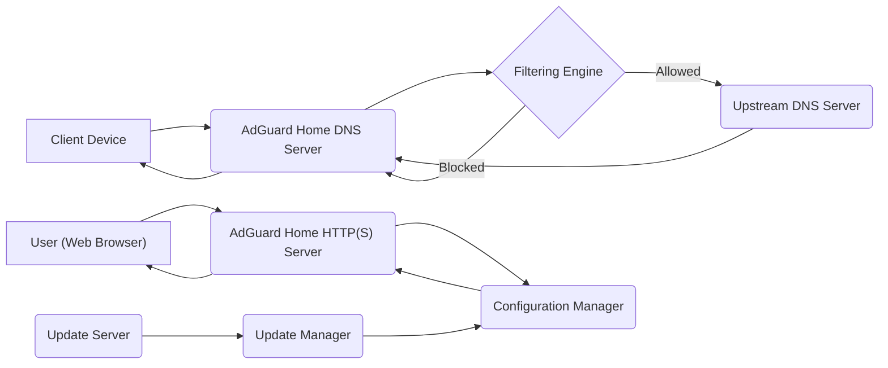

# Project Design Document: AdGuard Home

**Version:** 1.1
**Date:** 2023-10-27
**Project:** AdGuard Home - Network-wide Ad Blocking and Privacy Protection
**GitHub Repository:** [https://github.com/adguardteam/adguardhome](https://github.com/adguardteam/adguardhome)

## 1. Introduction

This document outlines the design of AdGuard Home, a network-wide software for blocking ads and tracking. It acts as a DNS server and content filter, protecting all devices on a network. This document serves as a foundation for subsequent threat modelling activities.

## 2. Goals

*   Provide network-wide ad blocking and privacy protection.
*   Offer a user-friendly interface for configuration and management.
*   Support various filtering rules and lists.
*   Enable custom DNS server configuration.
*   Provide query logging and statistics.
*   Be lightweight and efficient for home and small network deployments.

## 3. Target Audience

*   Security engineers performing threat modelling.
*   Software developers working on AdGuard Home.
*   DevOps engineers responsible for deployment and maintenance.

## 4. System Architecture

AdGuard Home operates as a local DNS resolver and HTTP(S) server. It intercepts DNS queries, filters them based on configured rules, and either resolves them itself or forwards them to upstream DNS servers.

### 4.1. Components

*   **DNS Server:**
    *   Listens on UDP and TCP port 53 (configurable).
    *   Receives DNS queries from client devices on the network.
    *   Performs filtering based on blocklists and custom rules.
    *   Forwards allowed queries to configured upstream DNS servers.
    *   Caches DNS responses for improved performance.
    *   Supports DNS-over-TLS (DoT) and DNS-over-HTTPS (DoH) for upstream communication.
*   **HTTP(S) Server (Web Interface):**
    *   Listens on a configurable port (default: 3000).
    *   Provides a web-based user interface for configuration and monitoring.
    *   Handles user authentication and authorization.
    *   Allows management of filters, DNS settings, and client configurations.
    *   Displays query logs and statistics.
*   **Configuration Manager:**
    *   Manages the application's configuration, including filters, DNS settings, and user accounts.
    *   Persists configuration data to a file or database (implementation detail).
    *   Provides APIs for other components to access configuration.
*   **Filtering Engine:**
    *   Processes DNS queries against configured filter lists (e.g., EasyList, EasyPrivacy).
    *   Supports custom filtering rules (e.g., domain blocklists, whitelists).
    *   Can block specific resource types (e.g., images, scripts).
    *   May use regular expressions for advanced filtering.
*   **Update Manager:**
    *   Periodically checks for updates to filter lists.
    *   Downloads and applies updates automatically or manually.
    *   Ensures the filtering engine uses the latest rules.
*   **Query Logger:**
    *   Records DNS queries and responses.
    *   Stores query information, including timestamp, client IP, queried domain, and response status.
    *   Provides options for log rotation and retention.

### 4.2. Data Flow

### 4.3. Deployment Model

AdGuard Home is typically deployed on a local network device, such as:

*   A dedicated server or Raspberry Pi.
*   A network router with custom firmware (e.g., OpenWrt).
*   A Docker container.

Client devices on the network are configured to use the AdGuard Home instance as their DNS server.

## 5. Security Considerations

*   **Web Interface Security:**
    *   Authentication and authorization mechanisms are crucial to prevent unauthorized access to the configuration.
    *   Protection against common web vulnerabilities (e.g., XSS, CSRF, SQL Injection) is necessary.
    *   Secure communication over HTTPS is essential for protecting credentials and configuration data.
*   **DNS Server Security:**
    *   Protection against DNS spoofing and poisoning attacks.
    *   Rate limiting to prevent denial-of-service attacks.
    *   Secure handling of DNSSEC validation if implemented.
*   **Configuration Data Security:**
    *   Secure storage of configuration data, including user credentials and sensitive settings.
    *   Protection against unauthorized modification of configuration files.
*   **Update Mechanism Security:**
    *   Verification of filter list updates to prevent malicious insertions.
    *   Secure communication channels for downloading updates.
*   **Logging Security:**
    *   Protection of query logs from unauthorized access and modification.
    *   Consideration of privacy implications of storing query data.
*   **Network Security:**
    *   Securing the host machine where AdGuard Home is deployed.
    *   Limiting network access to the AdGuard Home ports.

## 6. Detailed Component Interaction

### 6.1. DNS Query Processing

1. A client device initiates a DNS query for a domain name.
2. The query is sent to the AdGuard Home DNS server on port 53.
3. The DNS server receives the query.
4. The **Filtering Engine** examines the queried domain against the configured blocklists and custom rules.
5. **Scenario 1: Domain is blocked:**
    *   The Filtering Engine instructs the DNS server to return a "non-existent domain" (NXDOMAIN) or a specific IP address (e.g., 0.0.0.0) as configured.
    *   The DNS server sends the response back to the client.
6. **Scenario 2: Domain is allowed:**
    *   The DNS server checks its local cache for the domain's IP address.
    *   **Cache Hit:** The cached IP address is returned to the client.
    *   **Cache Miss:** The DNS server forwards the query to one of the configured **Upstream DNS Servers**.
    *   The Upstream DNS Server resolves the domain and returns the IP address to AdGuard Home.
    *   AdGuard Home caches the response and forwards it to the client.
7. The client receives the DNS response and proceeds with the connection.

### 6.2. Web Interface Interaction

1. A user accesses the AdGuard Home web interface through a web browser.
2. The browser sends a request to the AdGuard Home **HTTP(S) Server**.
3. The HTTP(S) server handles authentication and authorization.
4. Upon successful authentication, the server serves the web application.
5. User interactions (e.g., changing settings, viewing logs) trigger requests to the HTTP(S) server.
6. The HTTP(S) server interacts with the **Configuration Manager** to retrieve or update settings.
7. The HTTP(S) server retrieves data from the **Query Logger** to display logs and statistics.
8. The server sends responses back to the user's browser to update the UI.

### 6.3. Filter List Updates

1. The **Update Manager** periodically checks for updates to the configured filter lists.
2. It connects to the remote **Update Server** (specified in the configuration).
3. The Update Manager downloads the updated filter lists.
4. The downloaded lists are processed and validated.
5. The **Configuration Manager** is updated with the new filter lists.
6. The **Filtering Engine** loads the updated rules.

## 7. Future Considerations

*   Integration with external authentication providers.
*   More granular control over client-specific settings.
*   Advanced analytics and reporting features.
*   Support for more DNS protocols and features.

This document provides a comprehensive overview of the AdGuard Home architecture, which will be used as a basis for subsequent threat modelling activities. The detailed component descriptions and interaction flows should enable a thorough analysis of potential security vulnerabilities.
