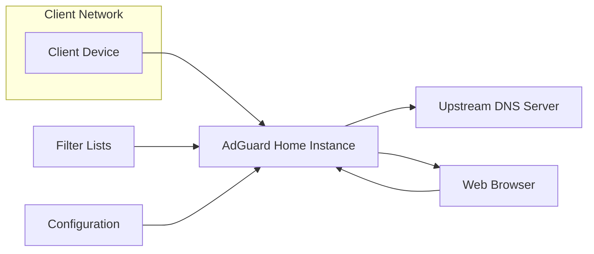
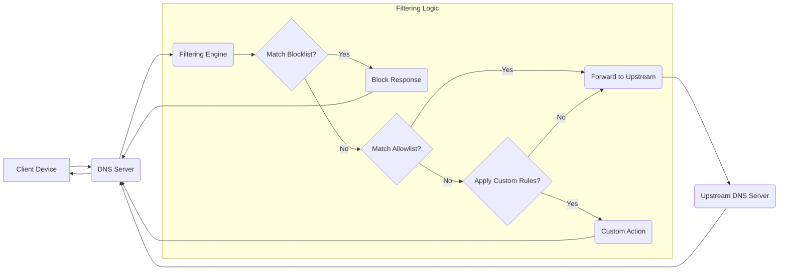
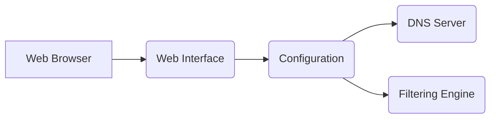
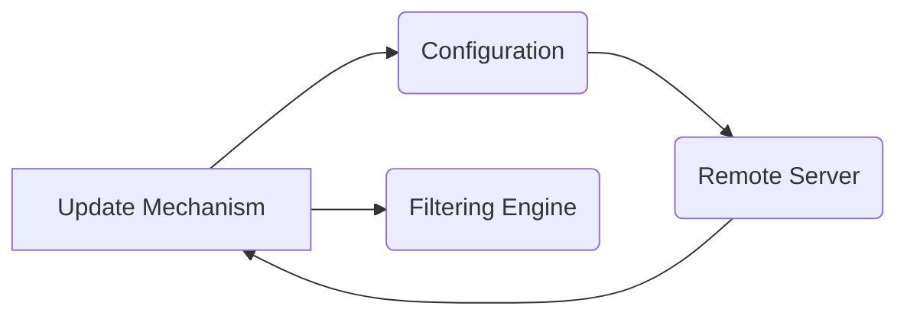

# Project Design Document: AdGuard Home

**Version:** 1.1
**Date:** October 26, 2023
**Author:** AI Software Architect

## 1. Introduction

This document provides a detailed design overview of the AdGuard Home project, an open-source, network-wide software for blocking ads and online trackers. This document aims to provide a comprehensive understanding of the system's architecture, components, and data flows, which will serve as the foundation for subsequent threat modeling activities. This revision includes more detail on component interactions and potential security considerations.

## 2. Goals

*   Clearly define the architecture and components of AdGuard Home.
*   Describe the interactions and data flow between different components with greater specificity.
*   Identify key functionalities and their dependencies.
*   Provide a robust basis for identifying potential security vulnerabilities and attack vectors.

## 3. System Overview

AdGuard Home operates as a DNS server that filters DNS queries based on predefined rules and filter lists. It intercepts DNS requests from client devices on the network, applies filtering logic, and forwards the modified or original requests to upstream DNS servers. It also provides a web interface for configuration and monitoring.

Here's a high-level overview of the system's architecture:

**Key Components:**

*   Client Device: Any device on the network making DNS requests.
*   AdGuard Home Instance: The core software responsible for DNS filtering and management.
*   Upstream DNS Server: External DNS servers used to resolve queries after filtering.
*   Web Browser: Used to access the AdGuard Home web interface.
*   Filter Lists: External sources of blocking rules.
*   Configuration: Stores the settings and rules for AdGuard Home.

## 4. Component Details

This section provides a detailed description of the key components within the AdGuard Home instance.

### 4.1. DNS Server

*   **Description:** The core component responsible for listening on port 53 (or configured port) for incoming DNS queries. It parses these queries and initiates the filtering process. This component likely utilizes standard DNS server libraries and protocols.
*   **Responsibilities:**
    *   Receiving and parsing DNS queries (A, AAAA, MX, TXT, etc.) according to RFC 1035 and related standards.
    *   Managing a local DNS cache to improve response times and reduce upstream queries. Cache entries include TTL (Time-to-Live) management.
    *   Forwarding queries to the Filtering Engine, including relevant query information (e.g., client IP, query type, domain).
    *   Receiving filtered DNS responses from the Filtering Engine, which may include modified IP addresses or error codes.
    *   Forwarding responses back to the requesting client, adhering to DNS protocol specifications.
    *   Handling different DNS protocols (UDP, TCP, DNS-over-TLS on port 853, DNS-over-HTTPS on port 443), including protocol-specific error handling and security considerations.
*   **Inputs:**
    *   Raw DNS query packets from client devices over UDP or TCP.
    *   Encrypted DNS queries over TLS or HTTPS.
    *   Filtered DNS response packets from the Filtering Engine.
    *   Configuration settings from the Configuration component (e.g., listening address, port, upstream DNS servers, cache settings).
*   **Outputs:**
    *   Parsed DNS queries to the Filtering Engine in a structured format.
    *   Raw DNS response packets to client devices over UDP or TCP.
    *   Encrypted DNS responses over TLS or HTTPS.
    *   DNS query packets to Upstream DNS Servers.
*   **Interactions:**
    *   Listens for and communicates with Client Devices on the network, managing connections and sessions.
    *   Sends and receives data to/from the Filtering Engine, likely through in-memory function calls or local inter-process communication.
    *   Communicates with Upstream DNS Servers using configured protocols, handling potential network errors and timeouts.

### 4.2. Filtering Engine

*   **Description:** This component applies the configured filtering rules and filter lists to incoming DNS queries. It determines whether a query should be blocked, allowed, or modified. This component likely implements efficient string matching and rule processing algorithms.
*   **Responsibilities:**
    *   Receiving parsed DNS queries from the DNS Server, including the queried domain and query type.
    *   Matching the queried domain against configured blocklists and allowlists, considering wildcard domains and regular expressions.
    *   Applying custom filtering rules, which may include more complex logic based on domain, client IP, or other factors.
    *   Implementing advanced filtering features such as CNAME cloaking mitigation, which requires resolving CNAME records.
    *   Returning filtered DNS responses to the DNS Server, indicating the action taken (e.g., NXDOMAIN for blocked domains, original IP for allowed domains, modified IP for redirection).
    *   Maintaining statistics on blocked and allowed queries.
*   **Inputs:**
    *   Parsed DNS queries from the DNS Server.
    *   Filter lists loaded from local storage or fetched from remote sources (likely in formats like plain text domain lists or Adblock-style filter syntax).
    *   Custom filtering rules loaded from the Configuration component (potentially in a specific rule language).
*   **Outputs:**
    *   Filtered DNS responses to the DNS Server, including appropriate DNS response codes and potentially modified resource records.
    *   Logging information about filtering actions.
*   **Interactions:**
    *   Receives queries from and sends responses to the DNS Server through defined interfaces.
    *   Loads and periodically updates filter lists from local storage or by fetching them from remote URLs over HTTP/HTTPS.
    *   Reads custom filtering rules and settings from the Configuration component.

### 4.3. Web Interface

*   **Description:** A web-based user interface for configuring and monitoring AdGuard Home. It allows users to manage settings, view statistics, and update filter lists. This component likely uses a web framework and includes authentication and authorization mechanisms.
*   **Responsibilities:**
    *   Providing a user-friendly interface for managing AdGuard Home, typically using HTML, CSS, and JavaScript.
    *   Authenticating users for access control, potentially using username/password or other authentication methods.
    *   Authorizing user actions based on roles or permissions.
    *   Allowing configuration of DNS settings (e.g., upstream servers, listening ports), filter lists (adding, removing, updating), and custom rules through web forms and API calls.
    *   Displaying real-time and historical statistics on blocked queries, top domains, client activity, and other relevant metrics.
    *   Providing tools for testing DNS queries and troubleshooting filtering issues.
    *   Handling user sessions and maintaining state.
*   **Inputs:**
    *   HTTP/HTTPS requests from user web browsers, including authentication credentials and data for configuration changes.
    *   Requests for data from the Configuration component and potentially other components for displaying statistics.
*   **Outputs:**
    *   Dynamically generated web pages (HTML, CSS, JavaScript) rendered in the user's browser.
    *   API responses (typically JSON) for data retrieval and updates, following RESTful principles.
    *   Redirection responses for navigation.
*   **Interactions:**
    *   Handles user interactions through standard web protocols (HTTP/HTTPS).
    *   Communicates with the Configuration component to read and write settings, likely through an API provided by the Configuration component.
    *   May interact with the Filtering Engine or DNS Server indirectly through the Configuration component or through separate API calls for real-time data or control.

### 4.4. Configuration

*   **Description:** This component manages the persistent storage of AdGuard Home's configuration settings, including filter lists, custom rules, upstream DNS servers, and user preferences. This component likely uses a file-based storage (e.g., YAML, JSON) or a lightweight database.
*   **Responsibilities:**
    *   Storing and retrieving configuration data in a persistent manner.
    *   Providing an API (Application Programming Interface) for other components to access and modify configuration settings. This API should handle concurrent access and ensure data integrity.
    *   Validating configuration data to prevent invalid settings.
    *   Potentially managing different configuration profiles or backups.
    *   Handling encryption of sensitive configuration data (e.g., API keys for fetching filter lists).
*   **Inputs:**
    *   Configuration updates from the Web Interface, Update Mechanism, or potentially other internal components, typically in a structured data format (e.g., JSON).
*   **Outputs:**
    *   Configuration data to other components (DNS Server, Filtering Engine, Web Interface, Update Mechanism) in a structured format.
    *   Notifications to other components about configuration changes.
*   **Interactions:**
    *   Receives configuration update requests from the Web Interface, validating and storing the changes.
    *   Provides configuration data to the DNS Server and Filtering Engine on startup and when changes occur.
    *   Provides filter list URLs and update schedules to the Update Mechanism.

### 4.5. Update Mechanism

*   **Description:** This component is responsible for periodically checking for and downloading updates to filter lists and potentially the AdGuard Home software itself. This component likely uses scheduled tasks and HTTP/HTTPS clients for fetching updates.
*   **Responsibilities:**
    *   Scheduling checks for updates to filter lists based on configured intervals.
    *   Fetching new versions of filter lists from configured URLs using HTTP/HTTPS, handling redirects and potential errors.
    *   Verifying the integrity of downloaded updates, potentially using checksums or digital signatures.
    *   Applying updated filter lists to the Filtering Engine, ensuring a smooth transition without interrupting service.
    *   Potentially handling software updates by downloading new versions and triggering an update process (if implemented).
    *   Logging update activities and potential errors.
*   **Inputs:**
    *   Configuration settings for update intervals, filter list URLs, and checksums from the Configuration component.
    *   Remote filter list files from specified URLs.
*   **Outputs:**
    *   Updated filter lists to the Filtering Engine in the expected format.
    *   Potentially updated software binaries or notifications about available software updates.
    *   Log messages indicating update status.
*   **Interactions:**
    *   Reads configuration settings for update schedules and sources from the Configuration component.
    *   Communicates with remote servers over HTTP/HTTPS to download updates.
    *   Notifies the Filtering Engine about new filter lists, triggering a reload or update process.

## 5. Data Flow Diagrams

This section illustrates the flow of data through the system for key operations.

### 5.1. DNS Query Processing

**Data Flow:**

1. "Client Device" sends a DNS query to the "DNS Server".
2. The "DNS Server" forwards the query to the "Filtering Engine".
3. The "Filtering Engine" checks the query against the "Blocklist?".
4. If "Yes", a "Block Response" is sent back to the "DNS Server".
5. If "No", the query is checked against the "Allowlist?".
6. If "Yes", the query is "Forward to Upstream".
7. If "No", "Apply Custom Rules?".
8. If "Yes", perform "Custom Action".
9. If "No", "Forward to Upstream".
10. If forwarded, the "Upstream DNS Server" resolves the query and sends the response back to the "DNS Server".
11. The "DNS Server" sends the final response back to the "Client Device".

### 5.2. Configuration Update via Web Interface

**Data Flow:**

1. User interacts with the "Web Browser" to change a configuration setting.
2. The "Web Browser" sends the updated configuration data to the "Web Interface".
3. The "Web Interface" sends the updated configuration data to the "Configuration" component.
4. The "Configuration" component stores the new settings.
5. The "Configuration" component notifies the "DNS Server" about the changes.
6. The "Configuration" component notifies the "Filtering Engine" about the changes.

### 5.3. Filter List Update

**Data Flow:**

1. The "Update Mechanism", based on its schedule, reads the configured filter list sources from the "Configuration".
2. The "Update Mechanism" fetches the latest filter lists from the "Remote Server".
3. The "Remote Server" provides the filter lists to the "Update Mechanism".
4. The "Update Mechanism" updates the "Filtering Engine" with the new filter lists.

## 6. Security Considerations (Initial Thoughts)

This section outlines initial security considerations based on the system design. A more detailed threat model will be developed based on this document.

*   **DNS Spoofing/Cache Poisoning:**
    *   Vulnerabilities in the "DNS Server" component could allow attackers to inject malicious DNS records into the cache, leading to clients being redirected to malicious sites.
    *   Lack of proper validation of DNS responses from upstream servers could be exploited.
*   **Web Interface Vulnerabilities:**
    *   Cross-Site Scripting (XSS) vulnerabilities could allow attackers to inject malicious scripts into the web interface, potentially stealing user credentials or performing actions on behalf of the user.
    *   Cross-Site Request Forgery (CSRF) vulnerabilities could allow attackers to trick authenticated users into performing unintended actions.
    *   Authentication bypass vulnerabilities could grant unauthorized access to the web interface.
    *   Insecure session management could lead to session hijacking.
    *   Exposure of sensitive information through error messages or insecure headers.
*   **Configuration Tampering:**
    *   Unauthorized access to the "Configuration" component could allow attackers to modify settings, disable filtering, redirect traffic, or add malicious filter lists.
    *   Insecure storage of configuration data, such as storing credentials in plaintext.
*   **Filter List Integrity:**
    *   Compromised filter list sources could lead to the blocking of legitimate websites (denial of service) or the allowance of malicious ones.
    *   Lack of integrity checks on downloaded filter lists could allow attackers to inject malicious entries.
*   **Update Mechanism Security:**
    *   A compromised "Update Mechanism" could be used to distribute malicious software updates or manipulate filter lists without proper verification.
    *   Man-in-the-middle attacks during filter list downloads.
*   **Access Control:**
    *   Weak or default credentials for the web interface are a significant risk.
    *   Lack of proper authorization checks within the web interface.
*   **Data Privacy:**
    *   Logging of DNS queries and user activity could expose sensitive information if not handled securely.
    *   Lack of options for users to control data retention and anonymization.
*   **Denial of Service (DoS):**
    *   The "DNS Server" could be targeted with DoS attacks, overwhelming it with requests and preventing it from serving legitimate clients.
    *   Resource exhaustion vulnerabilities in any component.
*   **Code Injection:**
    *   Vulnerabilities in how the system processes user-supplied data (e.g., in custom filtering rules) could lead to code injection.

## 7. Deployment Considerations

AdGuard Home is typically deployed as a self-hosted application on a local network. Common deployment scenarios include:

*   **Standalone Server:** Running on a dedicated machine (e.g., Raspberry Pi, Linux server, virtual machine). This offers isolation but requires dedicated hardware. Security considerations include securing the operating system and network access to the server.
*   **Containerized Environment:** Deployed using Docker or other containerization technologies. This provides portability and isolation. Security considerations include securing the container runtime and image sources.
*   **Network Router Integration:** Some router firmwares support running AdGuard Home directly as an add-on or built-in feature. This simplifies deployment but may have limited resources and security hardening options. Security considerations depend on the router's firmware security.
*   **Cloud Instance:** Deploying on a cloud virtual machine offers scalability but introduces complexities related to cloud security, network configuration, and cost.

Deployment choices significantly impact the attack surface and the security measures required. For example, a publicly exposed web interface requires stricter authentication and input validation than an interface accessible only on a private network.

## 8. Future Considerations

*   **Integration with other services:** Potential for integration with VPNs or other network security tools to enhance privacy and security.
*   **Advanced analytics and reporting:** More detailed insights into network traffic, blocked requests, and potential threats.
*   **Centralized management:** For managing multiple AdGuard Home instances across different networks.
*   **Plugin architecture:** Allowing users to extend functionality with custom modules.

## 9. Conclusion

This document provides an enhanced design overview of the AdGuard Home project, offering greater detail on component interactions and security considerations. This information will be crucial for conducting a thorough threat model to identify potential security vulnerabilities and develop appropriate mitigation strategies. The detailed component descriptions and data flow diagrams provide a solid foundation for understanding the system's inner workings and potential attack vectors.