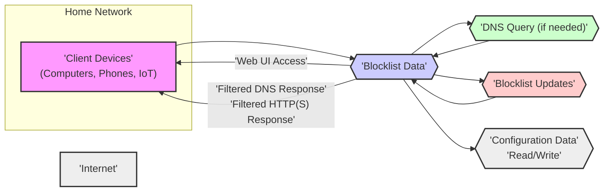
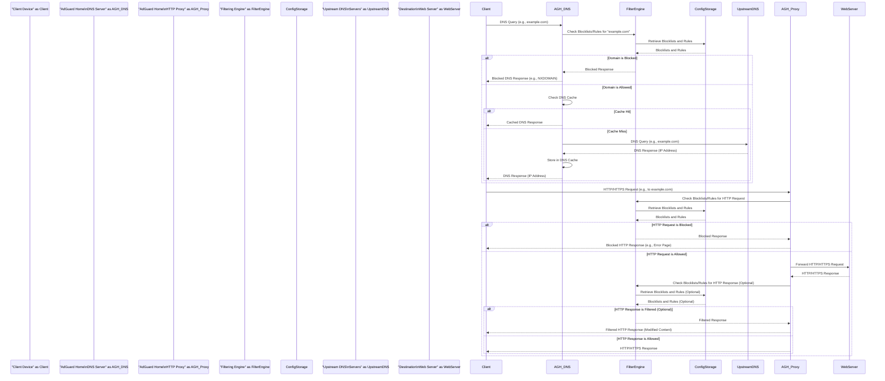

Okay, I will improve the project design document for AdGuard Home, focusing on clarity, detail, and its usefulness for threat modeling. Here is the improved version:

# Project Design Document: AdGuard Home

**Project Name:** AdGuard Home

**Project Repository:** [https://github.com/adguardteam/adguardhome](https://github.com/adguardteam/adguardhome)

**Document Version:** 1.1
**Date:** 2023-10-27
**Author:** AI Software Architect

## 1. Project Overview

AdGuard Home is a network-wide ad and tracker blocking software designed for home and small network environments. It operates as a private DNS server and optional HTTP(S) filtering proxy, providing protection for all devices on the network without requiring client-side software installation. By intercepting and analyzing DNS queries and web traffic, AdGuard Home blocks requests to known ad-serving, tracking, and malicious domains based on user-configurable blocklists and filtering rules.  It offers a user-friendly web interface for management, monitoring, and customization.  As an open-source project, AdGuard Home prioritizes transparency and community contribution.

This document provides a detailed design overview of AdGuard Home, intended to serve as a foundation for comprehensive threat modeling and security analysis. It elaborates on the system's architecture, individual components, data flow pathways, underlying technologies, and key security considerations. This document aims to provide security professionals and developers with the necessary information to identify potential vulnerabilities and design effective security mitigations.

## 2. System Architecture Diagram

**Diagram Notes:**

*   The diagram highlights the central role of the "AdGuard Home Instance" within the home network.
*   Data flows are clearly depicted, showing interactions between components.
*   The addition of "Configuration Storage" as a distinct component clarifies its role in the architecture.

## 3. Component Description

This section provides a detailed breakdown of each component within the AdGuard Home system.

### 3.1. Client Devices

* **Description:** These are the end-user devices within the network that generate network traffic. They encompass a wide range of devices, from traditional computers and smartphones to smart home devices and IoT gadgets.
* **Functionality:** Initiate DNS queries to resolve domain names and send HTTP/HTTPS requests to access web resources.  These devices are the source of network traffic that AdGuard Home filters.
* **Interaction with AdGuard Home:** Configured to use AdGuard Home's IP address as their primary DNS server. Optionally, they can be configured to use AdGuard Home as an HTTP/HTTPS proxy.  This configuration is typically done at the network level (e.g., router settings) or device-specific network settings.

### 3.2. AdGuard Home Instance

The core of the system, the AdGuard Home Instance, is composed of several interconnected sub-components:

#### 3.2.1. DNS Server

* **Description:** The DNS Server component is the primary entry point for DNS queries from client devices. It listens on UDP and TCP port 53 (standard DNS ports) and potentially on ports for encrypted DNS protocols (DoH/DoT).
* **Functionality:**
    * **Query Reception:** Receives DNS queries from clients within the network.
    * **Filtering Logic:**  The central filtering point for DNS requests. It consults the Filtering Engine to determine if a queried domain should be blocked or allowed.
    * **Caching:** Implements a DNS cache to store previously resolved DNS records, reducing latency and upstream DNS server load for frequently accessed domains.  Cache invalidation mechanisms are in place to ensure data freshness.
    * **Upstream Resolution:** If a query is not blocked and not in the cache, the DNS Server forwards the query to configured Upstream DNS Servers for resolution.  It supports configuring multiple upstream servers for redundancy and load balancing.
    * **DNSSEC Validation:** Performs DNSSEC validation to ensure the authenticity and integrity of DNS responses received from upstream servers, protecting against DNS spoofing and manipulation.
    * **Encrypted DNS Support (DoH/DoT):**  Acts as a server for DNS-over-HTTPS (DoH) and DNS-over-TLS (DoT), allowing clients to encrypt their DNS queries to AdGuard Home, enhancing privacy within the local network.  It can also act as a DoH/DoT client when communicating with upstream resolvers that support these protocols.
    * **Conditional Forwarding:** Supports conditional DNS forwarding, allowing specific domains or domain zones to be resolved by designated upstream DNS servers. This is useful for local network domains or specific use cases.
* **Data Flow:** Receives DNS queries from clients, interacts with the Filtering Engine and Configuration Storage for filtering rules, interacts with the Cache for cached responses, communicates with Upstream DNS Servers for resolution, and sends filtered DNS responses back to clients.

#### 3.2.2. HTTP Proxy (and HTTPS Proxy)

* **Description:** The HTTP Proxy component intercepts and processes HTTP and HTTPS traffic.  It can operate in standard proxy mode (clients explicitly configured to use it) or in transparent proxy mode (traffic redirected at the network level).
* **Functionality:**
    * **Traffic Interception:** Intercepts HTTP/HTTPS requests from client devices.
    * **Filtering Logic:**  Applies filtering rules to HTTP/HTTPS requests and responses, using the Filtering Engine. Filtering can be based on URLs, domains, content types, and other request/response characteristics.
    * **Content Modification (Limited):** Can perform limited content modification, primarily focused on removing or hiding ad elements in HTTP responses. This might involve CSS injection or basic HTML manipulation.  *Note:  AdGuard Home's primary strength is DNS-level blocking; HTTP proxy filtering is a supplementary feature.*
    * **HTTPS Filtering (SNI-based):** For HTTPS traffic, filtering primarily relies on Server Name Indication (SNI) during the TLS handshake, allowing blocking based on the requested domain name.  Full deep packet inspection of HTTPS traffic is generally *not* performed by default for privacy and performance reasons, unless explicit user configuration and certificate installation are involved (TLS interception).
    * **Proxy Protocol Support:** May support Proxy Protocol to preserve client IP address information when operating behind load balancers or reverse proxies.
* **Data Flow:** Receives HTTP/HTTPS requests from clients, interacts with the Filtering Engine and Configuration Storage for filtering rules, forwards allowed requests to destination web servers, receives responses from web servers, optionally filters responses, and sends filtered HTTP/HTTPS responses back to clients.

#### 3.2.3. Web UI (User Interface)

* **Description:** A web-based graphical user interface for managing and monitoring AdGuard Home.  Typically accessed via a web browser on port 3000 (default) or a user-configured port.
* **Functionality:**
    * **Configuration Management:** Provides a user-friendly interface to configure all aspects of AdGuard Home, including:
        * **General Settings:**  Listening ports, update settings, logging levels, privacy settings.
        * **DNS Settings:** Upstream DNS servers, DNSSEC configuration, DoH/DoT settings, DNS caching parameters, conditional forwarding rules.
        * **Filtering Settings:** Management of blocklists and whitelists (adding, removing, updating, enabling/disabling), custom filtering rules (syntax-based rules for domains and URLs), DNS rewrite rules (local DNS records).
        * **HTTP Proxy Settings:** Enabling/disabling the HTTP proxy, configuring listening ports.
        * **Client Management:** (Potentially) Managing client-specific settings or overrides.
        * **User Management:** (If implemented) Creating and managing user accounts for Web UI access with different permission levels.
    * **Monitoring and Statistics:** Displays real-time and historical data on:
        * **DNS Queries:** Total queries, queries blocked, queries allowed, query types, top queried domains.
        * **HTTP Proxy Activity:** Requests processed, requests blocked, traffic statistics.
        * **System Performance:** CPU usage, memory usage, network traffic.
        * **Filtering Effectiveness:** Statistics on blocklist usage and rule effectiveness.
    * **Logging and Diagnostics:** Provides access to system logs for troubleshooting and monitoring.
    * **Software Updates:** Facilitates updating AdGuard Home to newer versions.
* **Technology:** Implemented as a web application, likely using a Go-based web framework like Gin or Echo, serving static assets (HTML, CSS, JavaScript) and providing a RESTful API backend for communication with the core AdGuard Home engine.
* **Data Flow:** Receives user requests (HTTP/HTTPS) from web browsers, interacts with the Configuration Storage to read and write configuration settings, retrieves monitoring data from the system's internal state and logs, and presents information to the user through the web interface.

#### 3.2.4. Configuration Storage

* **Description:**  Responsible for the persistent storage and retrieval of AdGuard Home's configuration data.
* **Functionality:**
    * **Persistent Storage:** Stores all configuration settings, blocklists, whitelists, custom filtering rules, DNS rewrite rules, and other persistent data. Ensures data is preserved across restarts and updates.
    * **Data Serialization/Deserialization:** Handles the serialization of configuration data into a storage format (e.g., YAML, JSON, database records) and deserialization when loading configuration.
    * **Data Access API:** Provides an API for other components (Web UI, Filtering Engine, DNS Server, HTTP Proxy) to read and write configuration data.
    * **Backup and Restore (Potentially):** May include features for backing up and restoring configuration data.
* **Technology:**  AdGuard Home likely uses file-based storage for configuration, potentially YAML or JSON files for human-readability and ease of editing.  Alternatively, a lightweight embedded database like BoltDB or SQLite could be used for more structured data management and potentially improved performance for large configurations.  *(Codebase inspection is needed to confirm the exact storage mechanism.)*
* **Data Flow:**  Web UI writes configuration changes to the Configuration Storage. Filtering Engine, DNS Server, and HTTP Proxy read configuration data from the Configuration Storage at startup and during operation to apply filtering rules and settings.

#### 3.2.5. Filtering Engine

* **Description:** The core logic engine that performs the actual filtering of DNS queries and HTTP/HTTPS requests based on configured blocklists and rules.
* **Functionality:**
    * **Blocklist Management:** Loads, parses, and manages blocklists from various sources (local files, remote URLs).  Handles different blocklist formats (domain lists, URL lists, hosts files, AdBlock-style filter syntax).  Optimizes blocklist data structures for efficient lookups.
    * **Rule Processing:** Parses and processes user-defined custom filtering rules, DNS rewrite rules, and whitelist rules.
    * **Matching Algorithms:** Implements efficient algorithms for matching domain names, URLs, and other request/response attributes against blocklist entries and filtering rules.  Likely uses optimized data structures like tries or bloom filters for fast lookups.
    * **Filtering Decisions:** Determines whether to block or allow a DNS query or HTTP/HTTPS request based on the configured rules and blocklists.
    * **Performance Optimization:** Designed for high performance and low latency to minimize the impact on DNS resolution and web browsing speed.  Employs caching and other optimization techniques.
* **Data Flow:** Receives DNS queries and HTTP/HTTPS requests from the DNS Server and HTTP Proxy.  Retrieves blocklists, whitelists, and filtering rules from the Configuration Storage.  Applies filtering logic and returns filtering decisions (allow/block) to the DNS Server and HTTP Proxy.

#### 3.2.6. DNS Resolver (Optional, Internal)

* **Description:** An optional recursive DNS resolver that AdGuard Home can utilize instead of solely relying on upstream DNS servers.
* **Functionality:**
    * **Recursive Resolution:** Performs full recursive DNS resolution, starting from the root DNS servers, to resolve domain names independently.
    * **Performance (Potential):** Can potentially reduce latency in some scenarios by bypassing external upstream resolvers, especially if AdGuard Home is deployed in a geographically advantageous location.
    * **Privacy (Potential):** Can enhance privacy by reducing reliance on third-party DNS providers, keeping DNS resolution within the user's control.
    * **DNSSEC Support:**  The internal resolver should also support DNSSEC validation to maintain DNS integrity.
* **Data Flow:** Receives DNS queries from the DNS Server component.  Sends iterative DNS queries to authoritative DNS servers across the internet. Receives DNS responses from authoritative servers.  Returns resolved IP addresses to the DNS Server component.

### 3.3. Upstream DNS Servers

* **Description:** External DNS servers that AdGuard Home uses to resolve DNS queries when it's not acting as a recursive resolver or when queries are not found in its cache.
* **Examples:** Public DNS resolvers like Google Public DNS (8.8.8.8, 8.8.4.4), Cloudflare DNS (1.1.1.1, 1.0.0.1), Quad9 (9.9.9.9), or ISP-provided DNS servers. Users can configure their preferred upstream DNS servers.
* **Functionality:** Provide DNS resolution services to AdGuard Home.  Their performance, reliability, and privacy policies can impact AdGuard Home's overall performance and user privacy.
* **Data Flow:** Receive DNS queries from AdGuard Home's DNS Server. Send DNS responses back to AdGuard Home.

### 3.4. Blocklist Sources

* **Description:** External URLs or local files that provide lists of domains and URLs to be blocked. These lists are curated and maintained by various organizations and communities.
* **Examples:** Publicly available blocklists like EasyList, EasyPrivacy, AdAway, Peter Lowe's list, and lists maintained by AdGuard itself. Users can add custom blocklist sources.
* **Functionality:** Provide regularly updated lists of domains and URLs associated with advertising, tracking, malware distribution, phishing, and other unwanted content.
* **Data Flow:** AdGuard Home periodically fetches blocklist data from these sources over HTTP/HTTPS. The fetched data is processed and stored in the Configuration Storage and used by the Filtering Engine.

## 4. Data Flow Diagram

*(Same Data Flow Diagram as in Version 1.0 - it is already well-defined)*

## 5. Technology Stack

* **Programming Language:** Go (Golang) - Chosen for its performance, concurrency, memory efficiency, and strong standard library, making it well-suited for network applications and high-performance servers.
* **DNS Protocol:** Implements standard DNS protocol specifications (RFC 1035, RFC 1034, and related RFCs). Supports UDP and TCP for DNS queries. Implements DNSSEC (RFC 4033, RFC 4034, RFC 4035) for DNS response validation. Supports DNS-over-HTTPS (DoH) (RFC 8484) and DNS-over-TLS (DoT) (RFC 7858) for encrypted DNS communication.
* **HTTP/HTTPS Protocols:** Implements HTTP/1.1 (RFC 2616), HTTP/2 (RFC 7540), and potentially HTTP/3 (RFC 9114) proxying capabilities. Uses TLS/SSL for secure HTTPS communication, leveraging Go's `crypto/tls` package.
* **Web UI Framework:** Likely utilizes a lightweight Go web framework such as **Gin** or **Echo**. These frameworks are popular in the Go ecosystem for building fast and efficient web applications and RESTful APIs. They provide routing, middleware support, and templating capabilities. *(Further investigation of the codebase is recommended for definitive confirmation.)*
* **Configuration File Format:**  Most likely uses **YAML** for configuration files due to its human-readability and ease of parsing in Go using libraries like `gopkg.in/yaml.v2` or `gopkg.in/yaml.v3`. YAML is well-suited for configuration management.
* **Data Storage:**  Likely employs **file-based storage** using YAML files for configuration persistence. For potentially more structured data or performance optimization, especially with large blocklists or extensive configurations, an **embedded key-value store** like **BoltDB** (a pure Go key/value store) or **SQLite** (via Go's `database/sql` package and SQLite driver) could be used. BoltDB is often favored for its simplicity and performance in Go applications. *(Codebase analysis is needed to determine the precise data storage solution.)*
* **DNS Libraries:** Leverages Go's standard library packages like `net` for basic networking and `net/http` for HTTP handling. For DNS specific functionalities, it likely uses Go's built-in `net` package for DNS parsing and construction. For advanced DNS features like DNSSEC, DoH, and DoT, it might utilize or extend Go's standard library or employ specialized external DNS libraries if needed for specific protocol implementations or optimizations.
* **Networking Libraries:**  Relies heavily on Go's standard `net` package for core networking functionalities, including TCP/IP and UDP socket management, and network address manipulation.

## 6. Deployment Model

AdGuard Home's versatile design allows for deployment in various environments, each with its own considerations:

* **Home Router/Server (Direct Installation):**
    * **Description:** Installing AdGuard Home directly on a compatible home router (especially routers running custom firmware like OpenWrt, DD-WRT, or Tomato) or a dedicated home server.
    * **Advantages:** Centralized network-wide protection, potentially lower latency as it's closer to client devices, leverages existing hardware.
    * **Considerations:** Router compatibility (resource limitations, firmware support), potential performance impact on the router's primary functions, security of the router itself becomes more critical.  Firmware updates and security patching of the router are essential.
* **Single Board Computer (SBC) - Raspberry Pi, etc.:**
    * **Description:** Deploying AdGuard Home on a low-power SBC like a Raspberry Pi.
    * **Advantages:** Cost-effective, low power consumption, dedicated device for AdGuard Home, good performance for home networks, easy to set up.
    * **Considerations:** Requires a separate device, initial setup and configuration of the SBC, physical security of the SBC, SD card reliability (if using SD card for OS).
* **Virtual Private Server (VPS) / Cloud Server:**
    * **Description:** Running AdGuard Home on a VPS or cloud instance.
    * **Advantages:** Provides ad blocking for devices outside the home network (via VPN connection to the VPS), can serve multiple networks, high availability (depending on VPS provider).
    * **Considerations:**  Increased latency for local network devices (traffic needs to travel to the VPS), cost of VPS, security of the VPS instance is paramount (hardening, firewalling), privacy implications of routing traffic through a VPS provider.  VPN setup and maintenance are required for client devices to utilize the VPS AdGuard Home instance.
* **Docker Container:**
    * **Description:** Deploying AdGuard Home within a Docker container on various platforms (Linux, macOS, Windows, NAS devices with Docker support).
    * **Advantages:** Simplified installation and updates, containerization provides isolation and portability, easy to manage and scale, consistent environment across different hosts.
    * **Considerations:** Requires Docker runtime environment, potential overhead of containerization (though minimal), Docker image security (using official and trusted images).
* **Operating System Specific Installations (Binaries/Packages):**
    * **Description:** Direct installation on a host operating system (Linux, macOS, Windows, FreeBSD) using pre-compiled binaries or OS-specific packages (e.g., DEB, RPM).
    * **Advantages:**  Native performance, direct access to system resources, straightforward installation process for users familiar with OS package management.
    * **Considerations:** OS compatibility, manual updates (unless using package managers), potential conflicts with other software on the host OS, OS-level security considerations apply to the host system.

## 7. Security Considerations (Detailed)

This section expands on the security considerations, providing more specific threats and potential mitigations for threat modeling.

### 7.1. DNS Security

* **Threat: DNS Spoofing/Cache Poisoning:**
    * **Description:** Attackers attempt to inject malicious DNS records into AdGuard Home's cache or directly spoof DNS responses to redirect users to malicious websites.
    * **Mitigation:** **DNSSEC Validation (Crucial):**  Enabling and enforcing DNSSEC validation is the primary defense against DNS spoofing. AdGuard Home should rigorously validate DNSSEC signatures on responses from upstream servers.  **Cache Security:** Implement robust cache poisoning prevention mechanisms, including randomized query IDs and source ports.  **Rate Limiting:** Limit the rate of DNS queries processed to mitigate potential amplification attacks and resource exhaustion.
* **Threat: DNS Amplification Attacks:**
    * **Description:** Attackers exploit publicly accessible DNS resolvers like AdGuard Home to amplify DDoS attacks by sending small queries that result in large responses directed at a target.
    * **Mitigation:** **Rate Limiting (Query and Response):** Implement rate limiting on incoming DNS queries and outgoing responses.  **Response Size Limiting:**  Limit the maximum size of DNS responses to prevent excessive amplification.  **Source IP Validation:**  Validate source IP addresses of incoming queries to filter out potentially spoofed requests.  **Disable Recursion (If not needed):** If AdGuard Home is not intended to be a public recursive resolver, consider disabling recursion for external queries.
* **Threat: Privacy Leakage via Upstream DNS:**
    * **Description:** DNS queries sent to upstream DNS servers can reveal user browsing activity to third-party DNS providers.
    * **Mitigation:** **Encrypted DNS (DoH/DoT):**  Use DNS-over-HTTPS (DoH) or DNS-over-TLS (DoT) for communication with upstream DNS servers that support these protocols. This encrypts DNS queries in transit, protecting privacy.  **Trusted Upstream Providers:** Choose reputable and privacy-focused upstream DNS providers.  **Internal Recursive Resolver:** Utilize AdGuard Home's optional internal recursive resolver to minimize reliance on external upstream resolvers and keep DNS resolution within the user's control.

### 7.2. Web UI Security

* **Threat: Authentication Bypass / Weak Authentication:**
    * **Description:** Attackers bypass authentication mechanisms or exploit weak passwords to gain unauthorized access to the Web UI.
    * **Mitigation:** **Strong Password Policy:** Enforce strong password policies for Web UI user accounts.  **Multi-Factor Authentication (MFA):** Implement MFA for enhanced login security.  **Regular Security Audits:** Conduct regular security audits and penetration testing of the Web UI authentication system.  **Rate Limiting on Login Attempts:**  Implement rate limiting on login attempts to prevent brute-force attacks.
* **Threat: Cross-Site Scripting (XSS):**
    * **Description:** Attackers inject malicious scripts into the Web UI that are executed in users' browsers, potentially leading to session hijacking, data theft, or defacement.
    * **Mitigation:** **Input Sanitization and Output Encoding:**  Thoroughly sanitize all user inputs and encode outputs in the Web UI to prevent injection of malicious scripts.  **Content Security Policy (CSP):** Implement a strict Content Security Policy to restrict the sources from which the Web UI can load resources, mitigating XSS risks.  **Regular Security Scans:** Perform regular security scans for XSS vulnerabilities.
* **Threat: Cross-Site Request Forgery (CSRF):**
    * **Description:** Attackers trick authenticated users into performing unintended actions on the Web UI without their knowledge, such as changing configuration settings.
    * **Mitigation:** **CSRF Tokens:** Implement CSRF tokens (anti-CSRF tokens) in the Web UI to protect against CSRF attacks.  **SameSite Cookie Attribute:** Utilize the `SameSite` cookie attribute to further mitigate CSRF risks.
* **Threat: Session Hijacking:**
    * **Description:** Attackers steal or intercept user session IDs to gain unauthorized access to authenticated Web UI sessions.
    * **Mitigation:** **Secure Session Management:** Use secure session management practices, including:  **HTTPS Only:** Enforce HTTPS for all Web UI communication to protect session IDs in transit.  **HTTP-Only and Secure Cookies:** Set `HttpOnly` and `Secure` flags on session cookies to prevent client-side script access and ensure cookies are only transmitted over HTTPS.  **Session Timeout:** Implement appropriate session timeouts to limit the duration of active sessions.  **Session Regeneration:** Regenerate session IDs after successful login and for sensitive actions.
* **Threat: Insecure Direct Object References (IDOR):**
    * **Description:** Attackers manipulate object references (e.g., IDs in URLs) to access resources or data they are not authorized to access in the Web UI.
    * **Mitigation:** **Authorization Checks:** Implement robust authorization checks in the Web UI backend to ensure users can only access resources they are permitted to access.  **Indirect Object References:** Use indirect object references (e.g., UUIDs instead of sequential IDs) to make it harder for attackers to guess valid object references.

### 7.3. Configuration Storage Security

* **Threat: Unauthorized Access to Configuration Files:**
    * **Description:** Attackers gain unauthorized access to configuration files, potentially modifying settings, blocklists, or gaining access to sensitive information.
    * **Mitigation:** **File System Permissions:** Restrict file system permissions on configuration files to only allow the AdGuard Home process and authorized administrators to access them.  **Operating System Security:**  Harden the operating system where AdGuard Home is deployed to prevent unauthorized file access.
* **Threat: Configuration Tampering:**
    * **Description:** Attackers tamper with configuration files to disable filtering, add malicious domains to whitelists, or otherwise compromise AdGuard Home's functionality.
    * **Mitigation:** **File Integrity Monitoring:** Implement file integrity monitoring to detect unauthorized modifications to configuration files.  **Configuration Backups:** Regularly back up configuration files to allow for restoration in case of tampering or corruption.  **Digital Signatures (Potentially):**  Consider digitally signing configuration files to verify their integrity.
* **Threat: Exposure of Sensitive Data in Configuration:**
    * **Description:** Configuration files might contain sensitive information, such as API keys, passwords (if any are stored in configuration), or internal network details.
    * **Mitigation:** **Secrets Management:** Avoid storing sensitive secrets directly in configuration files if possible. Use environment variables or dedicated secrets management solutions.  **Encryption (Potentially):**  Consider encrypting sensitive sections of the configuration files if they must contain secrets.  **Principle of Least Privilege:** Minimize the amount of sensitive data stored in configuration.

### 7.4. Filtering Engine Security

* **Threat: Filtering Bypass Vulnerabilities:**
    * **Description:** Attackers discover methods to bypass filtering rules and deliver ads or malicious content despite AdGuard Home being in place.
    * **Mitigation:** **Regular Blocklist Updates:**  Maintain up-to-date blocklists to address newly identified ad and tracking domains.  **Comprehensive Rule Sets:**  Utilize a combination of blocklists and custom filtering rules to cover a wide range of blocking needs.  **Testing and Validation:**  Regularly test and validate the effectiveness of filtering rules and blocklists.  **Community Feedback:**  Leverage community feedback and bug reports to identify and address filtering bypasses.
* **Threat: Performance Degradation due to Complex Rules:**
    * **Description:** Overly complex or inefficient filtering rules can lead to performance degradation, increasing DNS resolution latency and slowing down web browsing.
    * **Mitigation:** **Rule Optimization:** Optimize filtering rules for performance.  Use efficient rule syntax and avoid overly broad or computationally expensive rules.  **Performance Monitoring:** Monitor AdGuard Home's performance (CPU, memory, DNS query latency) to identify and address performance bottlenecks related to filtering rules.  **Rule Profiling (Potentially):**  Implement rule profiling tools to identify inefficient rules.
* **Threat: False Positives (Blocking Legitimate Content):**
    * **Description:** Overly aggressive blocklists or rules can lead to false positives, blocking legitimate websites or content.
    * **Mitigation:** **Whitelist Management:** Provide robust whitelist management capabilities to allow users to easily unblock legitimate domains or URLs that are incorrectly blocked.  **Blocklist Selection:**  Carefully select blocklists, balancing comprehensiveness with the risk of false positives.  **User Feedback Mechanisms:**  Provide mechanisms for users to report false positives and request whitelist additions.

### 7.5. Blocklist Integrity and Source Trustworthiness

* **Threat: Compromised Blocklist Sources:**
    * **Description:** Blocklist sources themselves could be compromised, leading to the inclusion of malicious domains in blocklists or the removal of legitimate blocking entries.
    * **Mitigation:** **Trusted Blocklist Sources:**  Use blocklists from reputable and trustworthy sources.  **Blocklist Integrity Verification (Potentially):**  If possible, implement mechanisms to verify the integrity of downloaded blocklists (e.g., digital signatures or checksums).  **Source Diversity:**  Use a diverse set of blocklist sources to reduce reliance on any single source and mitigate the impact of a compromised source.  **Regular Review of Sources:**  Periodically review and evaluate the trustworthiness of blocklist sources.
* **Threat: Blocklist Availability Issues:**
    * **Description:** Blocklist sources might become temporarily or permanently unavailable, impacting AdGuard Home's filtering effectiveness.
    * **Mitigation:** **Caching of Blocklists:** Cache downloaded blocklists locally to ensure continued filtering even if blocklist sources are temporarily unavailable.  **Redundant Sources:** Configure redundant blocklist sources to provide backup in case of source outages.  **Local Blocklist Storage:** Store blocklists locally to reduce dependency on external sources for initial filtering.

### 7.6. Update Mechanism Security

* **Threat: Insecure Update Channel:**
    * **Description:** If the update channel for AdGuard Home itself is insecure (e.g., using unencrypted HTTP), attackers could perform man-in-the-middle attacks to inject malicious updates.
    * **Mitigation:** **HTTPS for Updates:**  Always use HTTPS for downloading updates to ensure confidentiality and integrity of update packages.  **Signed Updates:** Implement digital signatures for update packages to verify their authenticity and prevent tampering.  **Update Integrity Verification:**  Verify the digital signature or checksum of downloaded updates before installation.
* **Threat: Rollback Vulnerabilities:**
    * **Description:**  Vulnerabilities in the update rollback mechanism could allow attackers to downgrade AdGuard Home to a vulnerable version.
    * **Mitigation:** **Secure Rollback Mechanism:** Ensure the update rollback mechanism is secure and cannot be easily exploited to downgrade to vulnerable versions.  **Version Control:** Maintain proper version control of AdGuard Home and its components to facilitate secure updates and rollbacks.

### 7.7. Network Security

* **Threat: Unauthorized Network Access:**
    * **Description:** Unauthorized devices or networks gain access to AdGuard Home services, potentially leading to misuse, configuration changes, or information disclosure.
    * **Mitigation:** **Firewall Rules:**  Configure firewall rules on the host operating system or network firewall to restrict access to AdGuard Home services (DNS, Web UI, HTTP Proxy) to authorized networks and devices only.  **Access Control Lists (ACLs):**  Implement ACLs within AdGuard Home (if supported) to control access based on source IP addresses or network ranges.  **Principle of Least Privilege:**  Minimize the network exposure of AdGuard Home services. Only expose necessary ports and services.
* **Threat: Port Exposure:**
    * **Description:** Unnecessary ports are exposed to the internet, increasing the attack surface of AdGuard Home.
    * **Mitigation:** **Minimize Port Exposure:** Only expose the necessary ports for AdGuard Home services (DNS port 53, Web UI port, HTTP proxy port if used) and restrict access to these ports using firewalls.  **Disable Unused Services:** Disable any AdGuard Home features or services that are not actively used to reduce the attack surface.

This detailed security considerations section provides a more comprehensive foundation for threat modeling AdGuard Home.  It highlights potential threats across different components and functionalities, along with specific mitigation strategies.  This information should be used to conduct a thorough threat modeling exercise and prioritize security enhancements for the project.