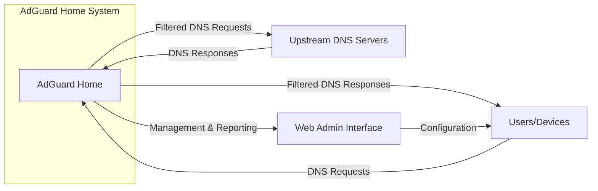
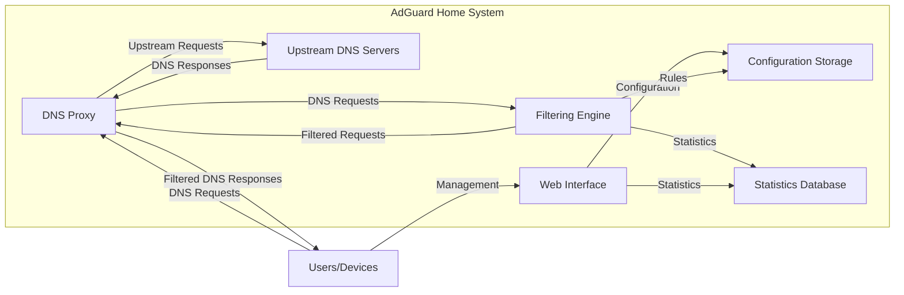
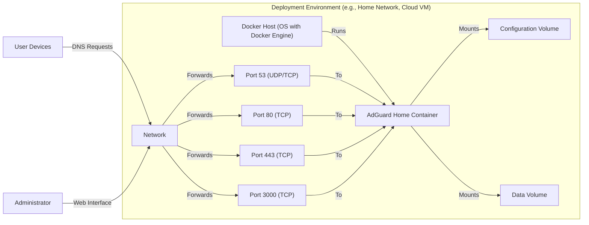
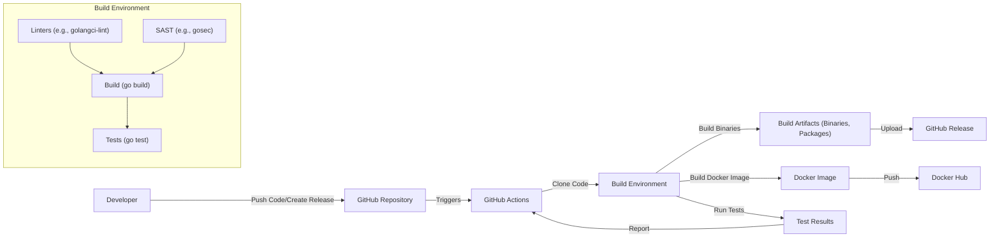

# BUSINESS POSTURE

AdGuard Home is a network-wide software for blocking ads and tracking. It acts as a DNS server that redirects ad and tracking domains to a "black hole," preventing devices on the network from connecting to those servers. The project is open-source and aims to provide a free and privacy-focused alternative to commercial ad blockers and DNS services.

Business Priorities and Goals:

*   Provide a free, open-source, and privacy-respecting solution for ad and tracking blocking.
*   Offer a user-friendly and easy-to-install/configure solution for home and small business users.
*   Maintain a high level of performance and stability to ensure a smooth browsing experience.
*   Continuously update and improve the software to address new ad and tracking techniques.
*   Build a strong community around the project to foster collaboration and support.
*   Protect users from malicious advertising and tracking.
*   Reduce bandwidth consumption by blocking unwanted content.
*   Improve page load times by preventing ads and trackers from loading.

Most Important Business Risks:

*   Reputational Risk: Failure to effectively block ads and trackers, or introducing bugs that negatively impact user experience, could damage the project's reputation and user trust.
*   Maintenance and Support Risk: As an open-source project, maintaining and supporting AdGuard Home relies on the continued contribution of developers and the community. A lack of active development or community engagement could lead to the project becoming outdated or abandoned.
*   Legal Risk: Blocking ads and trackers could potentially lead to legal challenges from advertisers or content providers.
*   Security Risk: Vulnerabilities in the software could be exploited by attackers to compromise user privacy or network security.
*   Scalability Risk: While designed for home and small business use, unexpected growth or adoption in larger environments could lead to performance or stability issues.

# SECURITY POSTURE

Existing Security Controls:

*   security control: DNS filtering: The core functionality of AdGuard Home is based on DNS filtering, which blocks access to known ad and tracking domains. Implemented in core logic.
*   security control: Regular expression filtering: AdGuard Home supports regular expression filtering for more advanced blocking rules. Implemented in core logic.
*   security control: Custom filtering rules: Users can add their own custom filtering rules to block or allow specific domains. Implemented in core logic and configuration files.
*   security control: DNSSEC validation: AdGuard Home supports DNSSEC to ensure the authenticity and integrity of DNS responses. Implemented in core logic.
*   security control: HTTPS filtering (optional): AdGuard Home can optionally filter HTTPS traffic, which requires installing a custom root certificate on client devices. Implemented in core logic and configuration files.
*   security control: Access control: AdGuard Home allows configuring which clients are allowed to use it. Implemented in core logic and configuration files.
*   security control: Regular updates: The AdGuard Home team regularly releases updates to address bugs, improve performance, and add new features. Implemented in update mechanism.
*   security control: Open source: The project's open-source nature allows for community scrutiny and contributions, which can help identify and address security vulnerabilities. Implemented by design.
*   security control: Go language: Go is a memory-safe language, which reduces the risk of memory-related vulnerabilities like buffer overflows. Implemented by design.

Accepted Risks:

*   accepted risk: HTTPS filtering requires user trust: Enabling HTTPS filtering requires users to install a custom root certificate, which could potentially be abused if the AdGuard Home server is compromised.
*   accepted risk: Potential for false positives/negatives: DNS filtering is not perfect and may occasionally block legitimate domains (false positives) or fail to block malicious ones (false negatives).
*   accepted risk: Reliance on community-maintained blocklists: The effectiveness of AdGuard Home depends on the quality and maintenance of the blocklists it uses.

Recommended Security Controls:

*   security control: Implement robust input validation for all user-provided data, including custom filtering rules and configuration settings.
*   security control: Consider implementing a Content Security Policy (CSP) for the web interface to mitigate XSS vulnerabilities.
*   security control: Regularly conduct security audits and penetration testing to identify and address potential vulnerabilities.
*   security control: Implement a secure update mechanism to ensure that updates are downloaded and installed securely.
*   security control: Provide clear and concise documentation on security best practices for configuring and using AdGuard Home.
*   security control: Implement rate limiting to prevent abuse and denial-of-service attacks.
*   security control: Consider adding support for two-factor authentication (2FA) for the web interface.

Security Requirements:

*   Authentication:
    *   The web interface should require strong password authentication.
    *   Consider offering two-factor authentication (2FA) for enhanced security.
*   Authorization:
    *   Access control lists (ACLs) should be used to restrict access to sensitive features and configuration settings.
    *   The principle of least privilege should be applied, granting users only the necessary permissions.
*   Input Validation:
    *   All user-provided input, including custom filtering rules, configuration settings, and API requests, should be strictly validated to prevent injection attacks and other vulnerabilities.
    *   Regular expressions used for filtering should be carefully crafted to avoid ReDoS (Regular Expression Denial of Service) vulnerabilities.
*   Cryptography:
    *   DNSSEC should be enabled by default to ensure the authenticity and integrity of DNS responses.
    *   If HTTPS filtering is enabled, strong cryptographic protocols and ciphers should be used.
    *   Sensitive data, such as passwords, should be stored securely using appropriate hashing algorithms.
*   Other:
    *   Regular security audits and penetration testing.
    *   Secure update mechanism.
    *   Rate limiting.

# DESIGN

## C4 CONTEXT

Element Descriptions:

*   Element:
    *   Name: User
    *   Type: Person
    *   Description: Represents users and their devices (computers, smartphones, tablets, etc.) that connect to the network and use AdGuard Home for DNS resolution.
    *   Responsibilities: Send DNS requests, receive filtered DNS responses, configure AdGuard Home via the web interface.
    *   Security controls: Strong passwords for web interface, optional 2FA, client-side security software (antivirus, firewall).

*   Element:
    *   Name: AdGuard Home
    *   Type: Software System
    *   Description: The core AdGuard Home software, acting as a DNS server and filtering requests based on configured rules and blocklists.
    *   Responsibilities: Receive DNS requests, filter requests based on blocklists and rules, forward requests to upstream DNS servers, return filtered responses, provide a web interface for management.
    *   Security controls: DNS filtering, regular expression filtering, custom filtering rules, DNSSEC validation, optional HTTPS filtering, access control, regular updates.

*   Element:
    *   Name: Upstream DNS Servers
    *   Type: Software System
    *   Description: External DNS servers (e.g., Google DNS, Cloudflare DNS, Quad9) that AdGuard Home uses to resolve DNS requests that are not blocked.
    *   Responsibilities: Resolve DNS requests, return DNS responses.
    *   Security controls: Rely on the security measures implemented by the chosen upstream DNS provider (e.g., DNSSEC, DoH/DoT).

*   Element:
    *   Name: Web Admin Interface
    *   Type: Software System
    *   Description: Web-based interface for managing and configuring AdGuard Home.
    *   Responsibilities: Provide an interface for configuring settings, viewing logs and statistics, managing clients and filters.
    *   Security controls: Authentication (username/password), access control, input validation, HTTPS (recommended), CSP (recommended).

## C4 CONTAINER

Element Descriptions:

*   Element:
    *   Name: DNS Proxy
    *   Type: Container
    *   Description: Receives DNS requests from clients, interacts with the Filtering Engine, and forwards requests to upstream DNS servers.
    *   Responsibilities: Listen for DNS requests, forward requests to the Filtering Engine, send requests to upstream DNS servers, return responses to clients.
    *   Security controls: Access control (client filtering), rate limiting.

*   Element:
    *   Name: Filtering Engine
    *   Type: Container
    *   Description: Applies filtering rules and blocklists to DNS requests.
    *   Responsibilities: Evaluate DNS requests against blocklists and rules, determine whether to block or allow a request.
    *   Security controls: DNS filtering, regular expression filtering, custom filtering rules, DNSSEC validation.

*   Element:
    *   Name: Web Interface
    *   Type: Container
    *   Description: Provides the web-based management interface.
    *   Responsibilities: Handle user authentication, display configuration settings, allow users to modify settings, display statistics and logs.
    *   Security controls: Authentication (username/password), access control, input validation, HTTPS (recommended), CSP (recommended).

*   Element:
    *   Name: Configuration Storage
    *   Type: Container
    *   Description: Stores the configuration settings for AdGuard Home.
    *   Responsibilities: Persist configuration data, provide access to configuration data for other components.
    *   Security controls: Access control, data validation.

*   Element:
    *   Name: Statistics Database
    *   Type: Container
    *   Description: Stores statistics and logs related to DNS queries and filtering.
    *   Responsibilities: Store statistical data, provide access to statistical data for the Web Interface.
    *   Security controls: Access control.

*   Element:
    *   Name: Upstream DNS Servers
    *   Type: Software System
    *   Description: External DNS servers (e.g., Google DNS, Cloudflare DNS, Quad9) that AdGuard Home uses to resolve DNS requests that are not blocked.
    *   Responsibilities: Resolve DNS requests, return DNS responses.
    *   Security controls: Rely on the security measures implemented by the chosen upstream DNS provider (e.g., DNSSEC, DoH/DoT).

*   Element:
    *   Name: User
    *   Type: Person
    *   Description: Represents users and their devices (computers, smartphones, tablets, etc.) that connect to the network and use AdGuard Home for DNS resolution.
    *   Responsibilities: Send DNS requests, receive filtered DNS responses, configure AdGuard Home via the web interface.
    *   Security controls: Strong passwords for web interface, optional 2FA, client-side security software (antivirus, firewall).

## DEPLOYMENT

Possible deployment solutions:

1.  Bare-metal/VM installation: Installing AdGuard Home directly on a server (physical or virtual) running a supported operating system (Linux, Windows, macOS, FreeBSD).
2.  Docker container: Deploying AdGuard Home as a Docker container.
3.  Pre-built packages: Using pre-built packages for specific operating systems (e.g., .deb for Debian/Ubuntu, .rpm for Fedora/CentOS).
4.  Cloud instances: Deploy on cloud platforms like AWS, Azure, GCP using VM images or container services.

Chosen deployment solution (Docker Container):

Element Descriptions:

*   Element:
    *   Name: Docker Host
    *   Type: Infrastructure Node
    *   Description: The physical or virtual machine running the Docker Engine.
    *   Responsibilities: Host and manage Docker containers.
    *   Security controls: OS-level security hardening, firewall, regular security updates.

*   Element:
    *   Name: AdGuard Home Container
    *   Type: Container Instance
    *   Description: The running instance of the AdGuard Home Docker image.
    *   Responsibilities: Run the AdGuard Home application, handle DNS requests, provide the web interface.
    *   Security controls: Container isolation, minimal base image, regular image updates.

*   Element:
    *   Name: Network
    *   Type: Infrastructure Node
    *   Description: The network that connects user devices to the Docker Host.
    *   Responsibilities: Route network traffic.
    *   Security controls: Firewall, network segmentation (if applicable).

*   Element:
    *   Name: Port Mapping (53 UDP/TCP)
    *   Type: Infrastructure Node
    *   Description: Maps port 53 on the Docker Host to port 53 inside the AdGuard Home container (for DNS traffic).
    *   Responsibilities: Forward DNS traffic to the container.
    *   Security controls: Firewall rules.

*   Element:
    *   Name: Port Mapping (80 TCP)
    *   Type: Infrastructure Node
    *   Description: Maps port 80 on the Docker Host to the corresponding port inside the AdGuard Home container (for HTTP web interface, optional).
    *   Responsibilities: Forward HTTP traffic to the container.
    *   Security controls: Firewall rules.

*   Element:
    *   Name: Port Mapping (443 TCP)
    *   Type: Infrastructure Node
    *   Description: Maps port 443 on the Docker Host to the corresponding port inside the AdGuard Home container (for HTTPS web interface, recommended).
    *   Responsibilities: Forward HTTPS traffic to the container.
    *   Security controls: Firewall rules, TLS certificates.

*   Element:
    *   Name: Port Mapping (3000 TCP)
    *   Type: Infrastructure Node
    *   Description: Maps port 3000 on the Docker Host to the corresponding port inside the AdGuard Home container (initial setup).
    *   Responsibilities: Forward HTTP traffic to the container.
    *   Security controls: Firewall rules.

*   Element:
    *   Name: Configuration Volume
    *   Type: Data Store
    *   Description: A Docker volume used to persist AdGuard Home's configuration data.
    *   Responsibilities: Store configuration files.
    *   Security controls: Access control (restrict access to the volume).

*   Element:
    *   Name: Data Volume
    *   Type: Data Store
    *   Description: A Docker volume used to persist AdGuard Home's data (logs, statistics).
    *   Responsibilities: Store data files.
    *   Security controls: Access control (restrict access to the volume).

*   Element:
    *   Name: User Devices
    *   Type: Person
    *   Description: Represents users and their devices (computers, smartphones, tablets, etc.) that connect to the network and use AdGuard Home for DNS resolution.
    *   Responsibilities: Send DNS requests, receive filtered DNS responses.
    *   Security controls: Client-side security software (antivirus, firewall).

*   Element:
    *   Name: Administrator
    *   Type: Person
    *   Description: The person responsible for managing and configuring AdGuard Home.
    *   Responsibilities: Configure AdGuard Home, monitor its performance, update the software.
    *   Security controls: Strong passwords, secure access to the Docker Host and web interface.

## BUILD

The AdGuard Home build process is automated using GitHub Actions. The process starts when a developer pushes code to the repository or creates a new release.

Security Controls in Build Process:

*   security control: Automated Build: The entire build process is automated using GitHub Actions, reducing the risk of manual errors and ensuring consistency.
*   security control: Version Control: The source code is managed using Git, providing a complete history of changes and allowing for easy rollback to previous versions.
*   security control: Dependency Management: Go modules are used for dependency management, ensuring that dependencies are tracked and versioned.
*   security control: Static Analysis: Linters (e.g., golangci-lint) and SAST tools (e.g., gosec) are used to identify potential code quality and security issues during the build process.
*   security control: Automated Testing: Unit tests and integration tests are run automatically as part of the build process to verify the functionality and security of the code.
*   security control: Signed Releases: Releases are likely signed to ensure their authenticity and integrity. (Needs verification)
*   security control: Docker Image Build: A Docker image is built as part of the build process, providing a consistent and reproducible runtime environment.
*   security control: Minimal Base Image: The Docker image is likely based on a minimal base image (e.g., Alpine Linux) to reduce the attack surface. (Needs verification)

# RISK ASSESSMENT

Critical Business Processes to Protect:

*   DNS resolution: Ensuring that AdGuard Home can reliably and accurately resolve DNS requests is critical for users to access the internet.
*   Ad and tracking blocking: The core functionality of blocking ads and trackers must be effective and up-to-date to protect user privacy and improve browsing experience.
*   Configuration and management: The ability for users to configure and manage AdGuard Home through the web interface is essential for usability.

Data to Protect and Sensitivity:

*   DNS query logs: These logs contain information about the websites and services users access, which is considered sensitive personal information.
*   Configuration data: This includes user-defined filtering rules, client settings, and potentially sensitive network information. While not directly PII, it could be used to infer user behavior or network configuration.
*   Statistics data: Aggregated statistics about DNS queries and blocked domains. Less sensitive than query logs, but still potentially revealing.

# QUESTIONS & ASSUMPTIONS

Questions:

*   Are there any specific compliance requirements (e.g., GDPR, CCPA) that AdGuard Home needs to adhere to?
*   What is the expected scale of deployment (number of users/devices)?
*   What are the specific upstream DNS servers used by default, and what are their security and privacy policies?
*   Are there any plans to implement more advanced security features, such as intrusion detection/prevention or support for DNS over HTTPS (DoH) or DNS over TLS (DoT) for client connections?
*   What is the process for handling security vulnerabilities reported by external researchers?
*   Is there a mechanism for users to report false positives or false negatives?
*   Are releases signed?
*   Is the Docker image based on minimal base image?

Assumptions:

*   BUSINESS POSTURE: The primary goal of AdGuard Home is to provide a free, open-source, and privacy-focused solution for ad and tracking blocking.
*   BUSINESS POSTURE: The project has a relatively high risk appetite, as it is open-source and primarily targeted at home and small business users.
*   SECURITY POSTURE: AdGuard Home relies heavily on community-maintained blocklists and the security of upstream DNS servers.
*   SECURITY POSTURE: Users are responsible for securing their own networks and devices.
*   DESIGN: The deployment environment is assumed to be a home network or a small business network, with a relatively small number of connected devices.
*   DESIGN: The Docker deployment model is the preferred method for deploying AdGuard Home.
*   DESIGN: The build process is secure and follows best practices for software development.