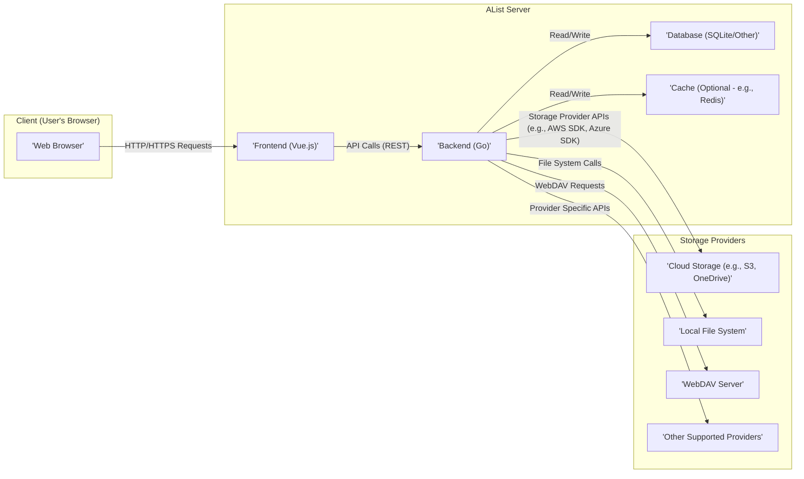
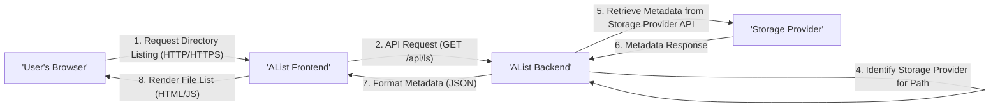
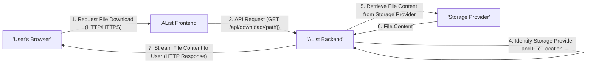
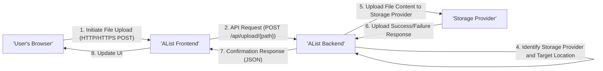

# Project Design Document: AList - File List Program

**Version:** 1.1
**Date:** October 26, 2023
**Author:** AI Software Architect

## 1. Introduction

This document provides an enhanced and more detailed design overview of the AList project, a program that supports multiple storage providers and displays them as a unified file list. This revised document aims to provide a more robust foundation for subsequent threat modeling activities by elaborating on component interactions, data flows, and security considerations.

## 2. System Overview

AList aggregates files from diverse storage providers (e.g., cloud services, local storage, WebDAV) and presents them through a user-friendly web interface. Users can browse, download, and potentially upload files, subject to configured permissions and the capabilities of the underlying storage provider. The system's core function involves retrieving file metadata from configured storage sources and rendering it in a consistent and accessible manner.

## 3. Architectural Design

AList employs a client-server architecture where the backend manages storage provider interactions, user authentication, and authorization, while the frontend delivers the user interface for file browsing and management.

### 3.1. Component Diagram

### 3.2. Component Descriptions

*   **Web Browser:** The user's primary point of interaction with AList, responsible for rendering the frontend application and handling user input.
*   **Frontend (Vue.js):**  A dynamic JavaScript application that provides the user interface. Key responsibilities include:
    *   Handling user interactions (clicks, form submissions).
    *   Making asynchronous API calls to the backend.
    *   Rendering file lists and other UI elements based on data received from the backend.
    *   Managing client-side state related to the current view and user interactions.
*   **Backend (Go):** The core application logic, responsible for:
    *   **API Endpoints:** Exposing a RESTful API for the frontend to interact with, handling requests for file listings, downloads, uploads (if enabled), and other administrative tasks.
    *   **Storage Provider Integration:** Implementing the necessary logic and using SDKs or libraries to communicate with various storage providers, handling authentication, authorization, and data retrieval/manipulation.
    *   **Authentication and Authorization:** Managing user accounts, sessions, and access control policies to determine which users can access specific storage mounts and perform certain actions.
    *   **Configuration Management:** Loading and managing application configuration, including storage provider details (credentials, endpoints), user settings, and system-wide parameters.
    *   **Caching (Optional):** Implementing a caching layer (e.g., using Redis) to store frequently accessed file metadata, reducing the load on storage providers and improving response times.
    *   **Task Scheduling (Potentially):**  Handling background tasks such as refreshing metadata caches or performing periodic checks.
*   **Database (SQLite/Other):**  A persistent data store used to store:
    *   User credentials (usernames, hashed passwords, roles).
    *   Storage provider configurations (API keys, secrets, endpoints, mount paths).
    *   Mount point configurations, including access permissions and associated storage providers.
    *   Potentially, audit logs of user actions.
*   **Cache (Optional - e.g., Redis):** An in-memory data store used for temporary storage of frequently accessed data to improve performance. This can include:
    *   File metadata retrieved from storage providers.
    *   User session data.
*   **Storage Providers:** External services or systems where the actual files are stored. These can include:
    *   Cloud object storage services (e.g., Amazon S3, Microsoft Azure Blob Storage, Google Cloud Storage).
    *   Cloud file storage services (e.g., OneDrive, Google Drive).
    *   Local file systems on the server where AList is running.
    *   WebDAV servers.
    *   Other protocols like FTP, SFTP (depending on implementation).

## 4. Data Flow

This section details the typical data flow for common user interactions.

### 4.1. Data Flow Diagram (Browsing Files)

### 4.2. Data Flow Diagram (Downloading a File)

### 4.3. Data Flow Diagram (Uploading a File)

## 5. Key Technologies

*   **Programming Languages:**
    *   Backend: Go
    *   Frontend: JavaScript (Vue.js)
*   **Web Frameworks/Libraries:**
    *   Backend:  Likely using a Go web framework such as Gin, Echo, or Fiber.
    *   Frontend: Vue.js with associated libraries (e.g., Vue Router, Vuex).
*   **Database:** SQLite (default, for ease of setup), with potential support for more robust database systems like MySQL, PostgreSQL for larger deployments.
*   **Caching (Optional):** Redis or Memcached are common choices for in-memory caching.
*   **Storage Provider SDKs/Libraries:**  Utilizes specific SDKs or libraries provided by each storage provider to interact with their APIs (e.g., `aws-sdk-go-v2`, `azure-sdk-for-go`).
*   **Operating System:**  Designed to be platform-independent, capable of running on Linux, macOS, and Windows.
*   **Deployment:** Typically deployed as a standalone executable or within a Docker container for easier management and scalability.

## 6. Deployment Model

AList is commonly deployed as a single-instance application, often behind a reverse proxy. Common deployment scenarios include:

*   **Standalone Binary:**  The compiled Go executable is run directly on a server. This is simple but requires manual management of dependencies and updates.
*   **Docker Container:**  AList is packaged as a Docker container, simplifying deployment, ensuring consistent environments, and facilitating orchestration with tools like Docker Compose or Kubernetes.
*   **Reverse Proxy (Nginx, Apache):**  A reverse proxy is often used in front of AList to handle:
    *   **SSL/TLS Termination:** Encrypting traffic between the user and the server.
    *   **Load Balancing:** Distributing traffic across multiple AList instances (for scalability).
    *   **Security Headers:** Adding security-related HTTP headers to protect against common web vulnerabilities.
    *   **Caching (Static Assets):**  Serving static assets (like CSS and JavaScript) more efficiently.
    *   **Rate Limiting:** Protecting the backend from excessive requests.

## 7. Security Considerations

This section expands on the initial security considerations, providing more detail on potential risks and mitigation strategies.

*   **Authentication:**
    *   **Risk:** Unauthorized access to the application and its data.
    *   **Mitigation:** Employ strong password hashing algorithms (e.g., bcrypt, Argon2), enforce password complexity policies, consider multi-factor authentication (MFA).
*   **Authorization:**
    *   **Risk:** Users accessing storage mounts or performing actions they are not permitted to.
    *   **Mitigation:** Implement a robust role-based access control (RBAC) system, carefully define permissions for each storage mount, ensure proper enforcement of access controls in the backend logic.
*   **Storage Provider Credentials Management:**
    *   **Risk:** Exposure of sensitive API keys or secrets, leading to unauthorized access to the underlying storage.
    *   **Mitigation:** Store credentials securely (e.g., using environment variables, encrypted configuration files, or dedicated secrets management solutions), avoid hardcoding credentials in the application code, restrict access to the configuration.
*   **Input Validation:**
    *   **Risk:** Vulnerabilities like Cross-Site Scripting (XSS), SQL Injection, and command injection.
    *   **Mitigation:** Sanitize and validate all user inputs on both the frontend and backend, use parameterized queries for database interactions, avoid executing arbitrary code based on user input.
*   **Data Encryption:**
    *   **Risk:** Sensitive data being compromised if the database or storage is accessed by unauthorized parties.
    *   **Mitigation:** Use HTTPS to encrypt data in transit, encrypt sensitive data at rest in the database (e.g., using database encryption features), consider client-side encryption for highly sensitive data.
*   **Session Management:**
    *   **Risk:** Session hijacking or fixation, allowing attackers to impersonate legitimate users.
    *   **Mitigation:** Use secure session cookies with `HttpOnly` and `Secure` flags, implement session timeouts, regenerate session IDs after login, protect against Cross-Site Request Forgery (CSRF) attacks.
*   **Rate Limiting:**
    *   **Risk:** Brute-force attacks against login endpoints or denial-of-service (DoS) attacks.
    *   **Mitigation:** Implement rate limiting on API endpoints, especially authentication endpoints, to restrict the number of requests from a single IP address within a given timeframe.
*   **Dependency Management:**
    *   **Risk:** Using vulnerable third-party libraries with known security flaws.
    *   **Mitigation:** Regularly update dependencies to their latest versions, use dependency scanning tools to identify and address vulnerabilities.
*   **Secure Configuration:**
    *   **Risk:** Misconfigurations leading to security vulnerabilities (e.g., default passwords, exposed debug endpoints).
    *   **Mitigation:** Provide secure default configurations, guide users on secure configuration practices, avoid exposing sensitive information in configuration files, disable unnecessary features in production.
*   **Error Handling and Logging:**
    *   **Risk:** Exposing sensitive information in error messages or insufficient logging hindering incident response.
    *   **Mitigation:** Implement proper error handling that doesn't reveal sensitive details, maintain comprehensive audit logs of user actions and system events.

## 8. Assumptions and Constraints

*   The underlying operating system and network infrastructure are assumed to be reasonably secure and properly maintained.
*   The security of the individual storage providers is the responsibility of those providers. AList relies on their security mechanisms.
*   Users are expected to follow best practices for managing their own credentials and devices.
*   This design document focuses on the core functionality and common deployment scenarios of AList. More complex configurations might introduce additional considerations.

## 9. Future Considerations

*   **Enhanced Access Control:** Implementing more fine-grained access control mechanisms, such as per-file or per-folder permissions.
*   **Security Audits and Penetration Testing:** Regularly conducting security assessments to identify and address potential vulnerabilities.
*   **Security Incident Response Plan:** Developing a plan for handling security incidents effectively.
*   **Content Security Policy (CSP):** Implementing CSP to mitigate XSS attacks.
*   **Subresource Integrity (SRI):** Using SRI to ensure that resources fetched from CDNs haven't been tampered with.
*   **Integration with Identity Providers (OAuth 2.0, OpenID Connect):**  Supporting integration with external identity providers for more robust authentication and authorization.

This improved design document provides a more detailed and comprehensive understanding of the AList project, enhancing its value for subsequent threat modeling activities. The added details on data flows, security considerations, and deployment models offer a more complete picture of the system's architecture and potential attack surfaces.