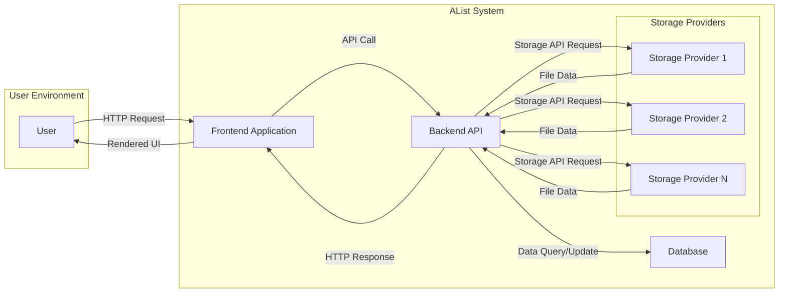
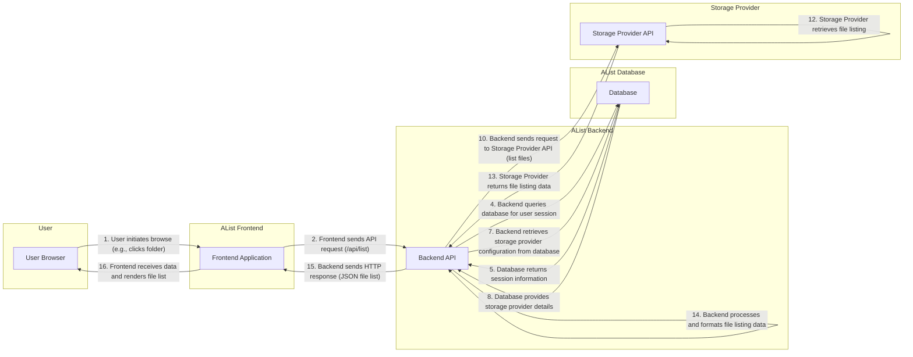

## Project Design Document: AList - File List Program (Improved)

**1. Introduction**

This document provides an enhanced and detailed design overview of the AList project, an open-source program facilitating access to files from various storage providers through a web interface. The primary purpose of this document is to offer a comprehensive understanding of the system's architecture, individual components, and the flow of data within it. This detailed information will serve as a robust foundation for subsequent threat modeling activities, enabling a thorough assessment of potential security vulnerabilities.

**2. Goals**

* To present a clear, detailed, and improved architectural overview of the AList project.
* To thoroughly identify and describe the key components of the system and their interactions.
* To provide a more granular description of the data flow within the system, outlining each step.
* To explicitly state the technologies likely employed within the AList project.
* To serve as a precise and informative basis for identifying and analyzing potential security vulnerabilities during the threat modeling process.

**3. Scope**

This document comprehensively covers the core architecture and functionalities of the AList project, based on the information available in the linked GitHub repository. The focus is on delineating the essential components involved in serving file listings, providing previews, and managing user interactions. While the document touches upon the integration with various storage providers, it does not delve into the intricate implementation specifics of each individual provider's API interaction. Similarly, future planned features are excluded unless they are demonstrably part of the current core functionality.

**4. Architectural Overview**

AList employs a client-server architecture, where the user interacts with a frontend application served by a backend that manages data and interacts with external storage. The primary components are:

* **User:** The individual interacting with the AList system, typically through a web browser.
* **Frontend:** The user-facing web interface, responsible for rendering the user experience and managing user interactions.
* **Backend:** The central application logic, responsible for processing user requests, handling authentication and authorization, managing storage provider interactions, and orchestrating data retrieval and delivery.
* **Database:**  A persistent storage mechanism for storing metadata related to users, storage configurations, application settings, and potentially cached file information.
* **Storage Providers:** External services or systems where the actual file data resides (e.g., cloud storage platforms like OneDrive, Google Drive, Amazon S3, or local file systems).

**5. Component Details**

* **Frontend Application:**
    * **Purpose:** To provide a user-friendly interface for browsing and interacting with files managed by AList.
    * **Technology:** Likely implemented using a modern JavaScript framework or library (e.g., React, Vue.js, Svelte).
    * **Responsibilities:**
        * Rendering the user interface components (file listings, navigation elements, preview windows).
        * Handling user interactions such as clicks, form submissions, and keyboard input.
        * Making asynchronous API calls to the backend to retrieve data and trigger actions.
        * Displaying real-time feedback, loading indicators, and error messages to the user.
        * Managing the application's state and routing within the browser.
    * **Key Considerations for Threat Modeling:**
        * Susceptibility to Cross-Site Scripting (XSS) attacks if user-generated or backend-provided data is not properly sanitized before rendering.
        * Potential for vulnerabilities related to the handling of sensitive data within the browser's memory or local storage.
        * Dependence on the security and integrity of the backend API.

* **Backend API:**
    * **Purpose:** To serve as the core logic and control center of the AList application, handling requests from the frontend and managing interactions with other components.
    * **Technology:**  Likely implemented using the Go programming language, as indicated by the GitHub repository name.
    * **Responsibilities:**
        * Receiving and processing HTTP requests from the frontend application.
        * Implementing authentication and authorization mechanisms to verify user identity and permissions.
        * Managing configurations for various storage providers, including storing and retrieving connection details.
        * Interacting with storage provider APIs to retrieve file and folder listings, download file content, and potentially perform other actions.
        * Generating previews for supported file types by either directly processing the file data or delegating to external libraries or services.
        * Implementing API endpoints for managing user accounts, settings, and other administrative tasks.
        * Enforcing rate limiting and other security measures to prevent abuse.
    * **Key Considerations for Threat Modeling:**
        * Security of API endpoints, ensuring proper authentication and authorization are enforced for all sensitive operations.
        * Secure management of user credentials, including the use of strong hashing algorithms and salting techniques.
        * Secure handling of storage provider credentials (API keys, tokens), preventing unauthorized access to external storage.
        * Robust input validation to prevent injection attacks (e.g., SQL injection, command injection) and other forms of malicious input.
        * Proper session management to prevent session hijacking and other related attacks.

* **Database:**
    * **Purpose:** To persistently store application data that needs to be retained between user sessions and application restarts.
    * **Technology:** Could be a relational database (e.g., SQLite, MySQL, PostgreSQL) for structured data or a NoSQL database depending on the specific data storage requirements.
    * **Responsibilities:**
        * Storing user account information, including usernames, hashed passwords, and potentially other profile details.
        * Storing configurations for connected storage providers, such as API keys, access tokens, and connection settings.
        * Storing application-specific settings and preferences.
        * Potentially caching file metadata (e.g., file names, sizes, modification times) to improve performance.
    * **Key Considerations for Threat Modeling:**
        * Secure storage of sensitive data, including encryption at rest to protect against unauthorized access in case of a data breach.
        * Protection against SQL injection vulnerabilities if a relational database is used, requiring parameterized queries and input sanitization.
        * Implementation of appropriate access controls to restrict database access to authorized components only.
        * Regular backups and disaster recovery plans to ensure data availability and integrity.

* **Storage Providers:**
    * **Purpose:** To provide the underlying storage infrastructure for the files managed by AList.
    * **Technology:** Varies significantly depending on the provider, ranging from cloud storage services with RESTful APIs to local file systems accessed through operating system calls.
    * **Responsibilities:**
        * Storing and serving the actual file data.
        * Providing APIs or interfaces for accessing and managing files and folders.
        * Implementing their own authentication and authorization mechanisms to control access to stored data.
    * **Key Considerations for Threat Modeling:**
        * Security of the credentials (API keys, access tokens) used by AList to authenticate with these providers.
        * Potential vulnerabilities within the storage provider's own security infrastructure, which are outside of AList's direct control.
        * Data privacy and compliance considerations related to the location and security practices of the chosen storage providers.

**6. Data Flow (Detailed)**

The following outlines a more granular data flow for a user browsing files within AList:

**Detailed Steps:**

1. **User Initiates Browse:** The user interacts with the frontend, for example, by clicking on a folder within the file listing.
2. **Frontend Sends API Request:** The frontend application sends an asynchronous API request to the backend, typically to a specific endpoint like `/api/list`, indicating the desired path or directory.
3. **Backend Receives Request, Initiates Authentication:** The backend API receives the request and begins the process of authenticating the user.
4. **Backend Queries Database for User Session:** The backend queries the database to retrieve the current user's session information, typically using a session identifier (e.g., a cookie).
5. **Database Returns Session Information:** The database responds with the relevant session data, if a valid session exists.
6. **Backend Verifies User Authentication and Authorization:** The backend verifies the user's authentication status based on the retrieved session information and checks if the user has the necessary permissions to access the requested resource.
7. **Backend Retrieves Storage Provider Configuration from Database:** If the user is authorized, the backend retrieves the configuration details for the relevant storage provider associated with the requested path from the database.
8. **Database Provides Storage Provider Details:** The database returns the necessary connection details, such as API keys, access tokens, or other authentication credentials.
9. **Backend Constructs API Request for Storage Provider:** The backend constructs a request to the specific storage provider's API, using the retrieved configuration details and the requested path.
10. **Backend Sends Request to Storage Provider API:** The backend sends the API request to the appropriate storage provider to retrieve the list of files and folders.
11. **Storage Provider Authenticates Request:** The storage provider authenticates the incoming request using the provided credentials.
12. **Storage Provider Retrieves File Listing:** Upon successful authentication, the storage provider retrieves the requested file listing from its storage infrastructure.
13. **Storage Provider Returns File Listing Data:** The storage provider sends the file listing data back to the AList backend.
14. **Backend Processes and Formats File Listing Data:** The backend receives the raw file listing data from the storage provider and processes it, potentially applying transformations, filtering, or sorting.
15. **Backend Sends HTTP Response:** The backend sends an HTTP response back to the frontend, typically containing the formatted file listing data in JSON format.
16. **Frontend Receives Data and Renders File List:** The frontend application receives the JSON data and dynamically updates the user interface to display the file listing in the user's browser.

**7. Security Considerations (Expanded)**

Building upon the initial security considerations, here's a more detailed breakdown for threat modeling:

* **Authentication and Authorization Vulnerabilities:**
    * **Brute-force attacks:**  Attempts to guess user credentials through repeated login attempts.
    * **Credential stuffing:** Using compromised credentials from other services to gain access.
    * **Insecure password storage:** Using weak hashing algorithms or not salting passwords.
    * **Session hijacking:**  Stealing or intercepting user session identifiers to impersonate legitimate users.
    * **Lack of multi-factor authentication (MFA):**  Increasing the risk of unauthorized access even with compromised passwords.
    * **Insufficient authorization checks:**  Allowing users to access resources or perform actions they are not permitted to.
* **API Security Vulnerabilities:**
    * **Injection attacks:** Exploiting vulnerabilities in input validation to inject malicious code (e.g., SQL injection, command injection).
    * **Cross-Site Scripting (XSS):** Injecting malicious scripts into web pages viewed by other users.
    * **Cross-Site Request Forgery (CSRF):**  Tricking authenticated users into performing unintended actions.
    * **Broken authentication and authorization:**  Flaws in the implementation of authentication and authorization mechanisms.
    * **Security misconfiguration:**  Improperly configured API endpoints or server settings.
    * **Sensitive data exposure:**  Unintentionally revealing sensitive information through API responses.
    * **Lack of rate limiting:** Allowing excessive requests that can lead to denial-of-service.
* **Storage Provider Integration Vulnerabilities:**
    * **Exposure of API keys and tokens:**  Storing or transmitting storage provider credentials insecurely.
    * **Insufficient permission management:** Granting excessive permissions to AList on the storage provider.
    * **Man-in-the-middle attacks:** Intercepting communication between AList and storage providers.
    * **Vulnerabilities in storage provider APIs:** Exploiting security flaws in the external storage provider's API.
* **Data Security Vulnerabilities:**
    * **Data breaches:** Unauthorized access to sensitive data stored in the database or on storage providers.
    * **Data leakage:** Unintentional disclosure of sensitive information.
    * **Insufficient encryption:** Not encrypting sensitive data at rest or in transit.
    * **Insecure handling of temporary files:**  Leaving sensitive data exposed in temporary files.
* **General Security Practices:**
    * **Use of vulnerable dependencies:**  Including libraries or frameworks with known security flaws.
    * **Lack of security testing:**  Not performing adequate penetration testing or vulnerability scanning.
    * **Insufficient logging and monitoring:**  Difficulty in detecting and responding to security incidents.
    * **Insecure software development practices:**  Introducing vulnerabilities through poor coding practices.

**8. Technology Stack (More Specific)**

Based on common practices and the project's nature, the technology stack likely includes:

* **Backend:**
    * **Programming Language:** Go
    * **Web Framework:** Potentially a lightweight Go framework like Gin or Echo, or using the standard `net/http` library.
    * **Database Interaction:**  Likely using Go database drivers for the chosen database (e.g., `lib/pq` for PostgreSQL, `go-sql-driver/mysql` for MySQL, `mattn/go-sqlite3` for SQLite).
* **Frontend:**
    * **JavaScript Framework/Library:**  Likely React, Vue.js, or Svelte for building the user interface.
    * **State Management:** Potentially Redux, Vuex, or the built-in state management of the chosen framework.
    * **UI Components:**  Likely utilizing a UI library or framework (e.g., Material UI, Ant Design, Tailwind CSS).
    * **Bundler:**  Likely Webpack, Parcel, or Rollup for bundling JavaScript assets.
* **Database:**
    * **Options:** SQLite (for simpler deployments), MySQL, PostgreSQL, or potentially a NoSQL database depending on specific needs.
* **Web Server:**
    * **Potentially Embedded:** The Go backend might serve static frontend assets directly.
    * **Reverse Proxy:**  Alternatively, a reverse proxy like Nginx or Apache might be used in front of the Go backend for handling static files, SSL termination, and load balancing.

**9. Deployment (Elaborated)**

AList offers flexibility in deployment, catering to various needs and environments:

* **Self-Hosted:**
    * **Description:**  Running AList directly on a personal server, virtual private server (VPS), or a physical machine.
    * **Considerations:** Requires manual installation, configuration, and maintenance of the operating system, dependencies, and the AList application itself. Offers maximum control but requires technical expertise.
* **Containerized (Docker):**
    * **Description:** Packaging AList and its dependencies into a Docker container for easier deployment and management.
    * **Considerations:** Simplifies deployment and ensures consistency across different environments. Requires Docker to be installed on the host system. Enables easier scaling and orchestration using tools like Docker Compose or Kubernetes.
* **Cloud Platforms:**
    * **Description:** Deploying AList on cloud service providers like AWS, Azure, or Google Cloud Platform.
    * **Considerations:** Leverages the scalability, reliability, and managed services offered by cloud providers. Deployment can be done using various services like virtual machines, container services (e.g., AWS ECS, Azure Container Instances, Google Kubernetes Engine), or serverless functions (depending on the architecture). Offers different pricing models and requires familiarity with the chosen cloud platform.

**10. Future Considerations (Impact on Security)**

Potential future features could introduce new attack vectors and require further security analysis:

* **File Upload Functionality:**
    * **Threats:** Malware uploads, storage space abuse, data exfiltration.
    * **Mitigation:** Implementing robust file scanning, size limits, access controls, and secure storage practices.
* **User Management Features (Beyond Basic Authentication):**
    * **Threats:** Privilege escalation, unauthorized access to other users' data.
    * **Mitigation:** Implementing granular role-based access control (RBAC) and secure user management interfaces.
* **Plugin System/Extensibility:**
    * **Threats:** Malicious plugins compromising the system, introducing vulnerabilities.
    * **Mitigation:**  Implementing strict plugin sandboxing, code signing, and review processes.
* **Shared Links/Public Access:**
    * **Threats:** Data leaks, unauthorized access to sensitive files.
    * **Mitigation:** Implementing secure link generation, expiration dates, and access controls for shared links.

This improved design document provides a more detailed and comprehensive understanding of the AList project's architecture and components. This enhanced information will be invaluable for conducting thorough threat modeling exercises and identifying potential security vulnerabilities.