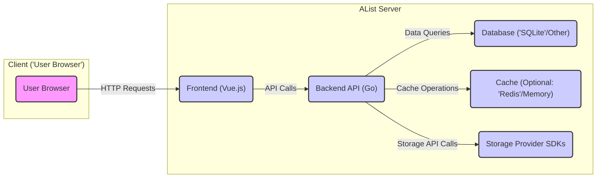
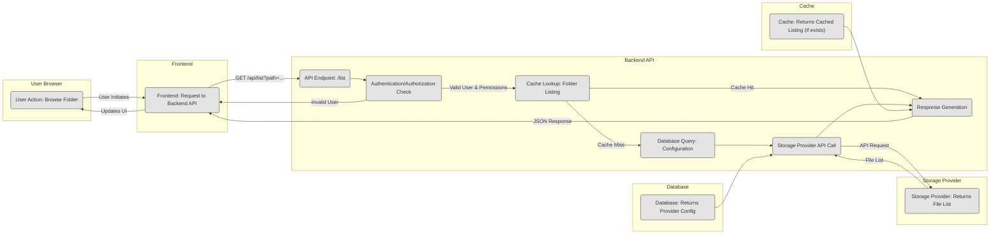
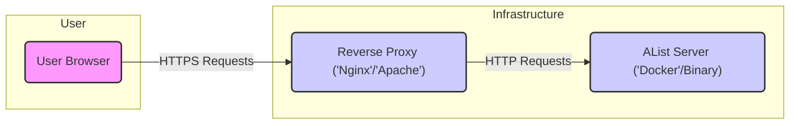

# Project Design Document: AList - File List Program

**Version:** 1.1
**Date:** October 26, 2023
**Author:** AI Software Architect

## 1. Introduction

This document provides an enhanced and more detailed design overview of the AList project, a program that supports multiple storage providers and displays file lists in a unified web interface. This document is intended to serve as a robust foundation for subsequent threat modeling activities. It elaborates on the system's architecture, components, data flow, and key technologies, providing greater clarity and specificity.

## 2. Project Overview

AList is a file listing program designed to offer users a centralized and convenient way to access and manage files stored across various cloud storage providers (e.g., OneDrive, Google Drive, S3) through a single, intuitive web interface. It aims to simplify file browsing and interaction, abstracting away the complexities of managing multiple storage accounts.

## 3. System Architecture

AList employs a client-server architecture, with a clear separation of concerns between the user-facing frontend and the backend responsible for core logic and data management.

### 3.1. High-Level Architecture Diagram

### 3.2. Component Description

*   **Frontend ('Vue.js'):**
    *   Renders the user interface within the user's web browser using HTML, CSS, and JavaScript.
    *   Handles user interactions such as browsing directories, initiating file downloads, and potentially other actions.
    *   Communicates with the Backend API via asynchronous HTTP requests (e.g., AJAX).
    *   Manages the application's state on the client-side, often using a state management library like Vuex.
    *   Implements client-side routing to navigate between different views within the application.

*   **Backend API ('Go'):**
    *   Serves as the central processing unit, handling requests from the frontend and coordinating interactions with other components.
    *   Manages user authentication (verifying user identity) and authorization (determining user permissions).
    *   Stores and manages configurations for different storage providers, including API keys, access tokens, and other necessary credentials.
    *   Utilizes Storage Provider SDKs to interact with the APIs of various cloud storage services, performing operations like listing files, downloading files, and potentially uploading or deleting files.
    *   Implements optional caching mechanisms to improve performance by storing frequently accessed data in memory or a dedicated cache like Redis.
    *   Persists application data, including user accounts, storage provider settings, and potentially cached file metadata, in the database.
    *   Exposes a set of RESTful API endpoints for the frontend to consume.

*   **Database ('SQLite'/Other):**
    *   Provides persistent storage for the application's data.
    *   Key data stored includes:
        *   User account information (usernames, hashed passwords, email addresses).
        *   Storage provider configurations (names, types, API keys, OAuth tokens, etc.).
        *   Application-specific settings and preferences.
        *   Potentially cached metadata about files and directories to reduce API calls to storage providers.

*   **Cache (Optional: 'Redis'/Memory):**
    *   An optional layer to enhance performance by storing frequently accessed data closer to the application.
    *   Could cache:
        *   Lists of files and directories retrieved from storage providers.
        *   User session data to avoid repeated authentication.
        *   Configuration data.

*   **Storage Provider SDKs:**
    *   Software Development Kits or client libraries that provide convenient interfaces for interacting with the APIs of different cloud storage providers.
    *   Examples include:
        *   `aws-sdk-go-v2` for Amazon S3.
        *   Google Cloud Client Libraries for Google Drive.
        *   Microsoft Graph SDK for OneDrive.

## 4. Detailed Design

### 4.1. User Interaction Flow: Browsing a Directory

**Detailed Steps for Browsing a Directory:**

*   **User Action:** The user clicks on a folder in the frontend interface.
*   **Frontend Request:** The frontend sends an HTTP GET request to the backend API, typically to an endpoint like `/api/list` with the folder path as a parameter.
*   **API Endpoint:** The Backend API receives the request at the designated endpoint.
*   **Authentication/Authorization Check:** The backend verifies the user's session and permissions to access the requested resource. This might involve checking session cookies or JWT tokens.
*   **Cache Lookup:** The backend checks if the requested folder listing is already present in the cache.
    *   **Cache Hit:** If the listing is found in the cache, it's returned directly to the frontend, improving response time.
    *   **Cache Miss:** If the listing is not in the cache, the process continues.
*   **Database Query (Configuration):** The backend retrieves the configuration details for the relevant storage provider from the database, including API credentials.
*   **Storage Provider API Call:** Using the retrieved configuration, the backend interacts with the appropriate storage provider's API (e.g., Google Drive API, AWS S3 API) to request the list of files and subdirectories within the specified path.
*   **Response Generation:** The backend receives the file list from the storage provider, formats it into a JSON response, and sends it back to the frontend. The backend might also update the cache with the new listing.
*   **Frontend Update:** The frontend receives the JSON response and updates the user interface to display the files and folders.

### 4.2. Data Flow

*   **User Credentials:** Entered during login, transmitted securely (e.g., over HTTPS) to the backend for authentication, and potentially stored as a hashed password in the database. Session information might be stored in cookies or a session store.
*   **Storage Provider Configuration Data:** Sensitive information like API keys, OAuth tokens, and secrets are stored securely (ideally encrypted) in the database and used by the backend to authenticate with storage providers.
*   **File Metadata:** Information about files and directories (name, size, modification date, type) is retrieved from storage providers and passed between the backend and frontend. This data might also be temporarily stored in the cache.
*   **File Content:** When a user downloads a file, the content is streamed directly from the storage provider to the user's browser, often through the backend as a proxy or a direct redirect depending on the implementation.
*   **Authentication Tokens/Session IDs:** Used to maintain user sessions and authenticate subsequent requests. These are typically stored in cookies or local storage on the client-side and validated by the backend.

### 4.3. Key Technologies

*   **Backend Programming Language:** Go (chosen for its performance, concurrency features, and strong ecosystem for backend development).
*   **Frontend Framework:** Vue.js (a progressive JavaScript framework for building user interfaces).
*   **Backend Web Framework:** Likely a framework like Gin or Echo (popular, lightweight Go frameworks for building web APIs).
*   **Database:**
    *   Default: SQLite (suitable for single-instance deployments and ease of setup).
    *   Potential Support for: MySQL, PostgreSQL, or other relational databases for more robust and scalable deployments.
*   **Caching (Optional):**
    *   In-memory caching (for simple deployments).
    *   Redis (a popular in-memory data store for more advanced caching needs).
*   **Storage Provider SDKs:** Specific SDKs for each supported cloud storage provider (e.g., `aws-sdk-go-v2`, Google's Go client libraries, Azure SDK for Go).
*   **Authentication/Authorization:**  Potentially using libraries like `jwt-go` for JWT-based authentication or standard session management techniques.
*   **Build Tools:** Go modules for managing backend dependencies, npm or yarn for frontend dependencies.

## 5. Deployment Architecture

AList is commonly deployed as a self-contained application, often leveraging containerization for ease of deployment and management.

*   **Deployment Options:**
    *   **Standalone Binary:** The compiled Go application can be executed directly on a server.
    *   **Docker Container:** Packaging the application and its dependencies into a Docker container allows for consistent and reproducible deployments across different environments. This simplifies deployment and management.
*   **Reverse Proxy (Highly Recommended):**
    *   A reverse proxy like Nginx or Apache is strongly recommended in front of the AList application.
    *   **Benefits:**
        *   **SSL/TLS Termination:** Handles encryption and decryption of HTTPS traffic, securing communication between the user and the server.
        *   **Load Balancing:** Distributes traffic across multiple AList instances for improved scalability and resilience.
        *   **Security:** Provides an additional layer of security by hiding the internal structure of the application and offering features like request filtering and rate limiting.
        *   **Caching (Static Assets):** Can cache static assets served by the frontend, reducing load on the AList server.

## 6. Security Considerations (Detailed)

This section expands on potential security concerns, providing more specific examples relevant for threat modeling.

*   **Authentication and Authorization:**
    *   **Threat:** Brute-force attacks on login forms to guess user credentials.
    *   **Threat:** Weak password policies leading to easily compromised accounts.
    *   **Threat:** Session hijacking if session IDs are not securely managed or transmitted.
    *   **Threat:** Privilege escalation if authorization checks are not implemented correctly, allowing users to access resources they shouldn't.
*   **Storage Provider Credentials:**
    *   **Threat:** Exposure of API keys or OAuth tokens if stored insecurely in the database or configuration files.
    *   **Threat:** Unauthorized access to storage providers if credentials are leaked or compromised.
    *   **Threat:** Insufficiently scoped permissions granted to AList for storage providers, potentially allowing for unintended actions.
*   **API Security:**
    *   **Threat:** Cross-Site Scripting (XSS) vulnerabilities if user-provided data is not properly sanitized before being displayed in the frontend.
    *   **Threat:** SQL Injection vulnerabilities if database queries are constructed using unsanitized user input.
    *   **Threat:** Cross-Site Request Forgery (CSRF) attacks if requests are not properly protected with anti-CSRF tokens.
    *   **Threat:** Insecure Direct Object References (IDOR) if users can manipulate IDs in API requests to access resources they shouldn't.
    *   **Threat:** Rate limiting not implemented, leading to potential denial-of-service attacks.
    *   **Threat:** Lack of input validation allowing for unexpected data to be processed, potentially causing errors or security vulnerabilities.
*   **Data Privacy:**
    *   **Threat:** Exposure of user data or file metadata if the application is compromised.
    *   **Threat:** Lack of encryption for sensitive data at rest (in the database) or in transit (between the client and server, or between the backend and storage providers).
*   **Dependency Management:**
    *   **Threat:** Using outdated dependencies with known security vulnerabilities.
    *   **Threat:** Supply chain attacks if malicious code is introduced through compromised dependencies.
*   **Deployment Security:**
    *   **Threat:** Misconfigured reverse proxy allowing unauthorized access or exposing sensitive information.
    *   **Threat:** Running the AList server with excessive privileges.
    *   **Threat:** Exposing unnecessary ports or services on the server.
    *   **Threat:** Storing sensitive configuration data (e.g., database credentials) in plain text in environment variables or configuration files.

## 7. Assumptions and Constraints

*   It is assumed that users will access AList over HTTPS.
*   The security of the underlying storage providers is the responsibility of those providers. AList focuses on securely managing access to them.
*   The design assumes a modern web browser environment with JavaScript enabled.
*   Specific security features of individual storage provider APIs are considered during integration.
*   The choice of specific security libraries and implementations within the Go backend is subject to development decisions.

## 8. Future Considerations

*   Implementation of more granular access controls and permissions within AList.
*   Support for file uploading and other write operations.
*   Integration with logging and monitoring systems for security auditing.
*   Regular security audits and penetration testing.
*   Consideration of Content Security Policy (CSP) to mitigate XSS attacks.

This improved design document provides a more detailed and nuanced understanding of the AList project, offering a stronger foundation for identifying and mitigating potential security threats during the threat modeling process. The added details about component interactions, data flow, and specific security considerations will be invaluable for a comprehensive security analysis.