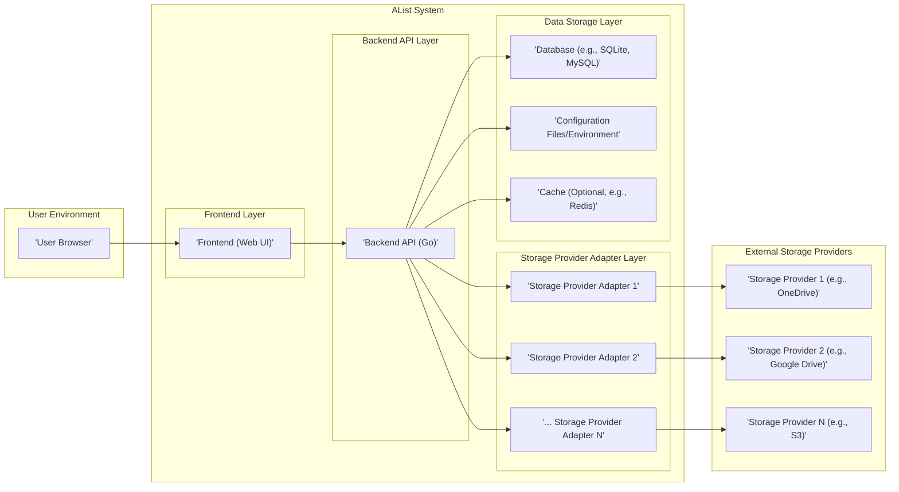

# Project Design Document: AList (Improved)

## 1. Introduction

### 1.1. Project Overview

AList is a versatile and efficient open-source file listing and sharing program. It aggregates files from diverse storage providers, including cloud services and local storage, into a unified, user-friendly web interface.  AList prioritizes simplicity and speed, offering a streamlined experience for browsing, managing, and sharing files across platforms.  Key features include support for numerous storage providers (e.g., OneDrive, Google Drive, AWS S3, local file systems, WebDAV), file operations (browsing, downloading, uploading where supported), file searching, and basic user management for access control.  Its lightweight nature makes it suitable for various deployment environments, from personal servers to larger infrastructures.

### 1.2. Purpose of this Document

This document provides a comprehensive design specification for the AList project, focusing on architectural details relevant to security analysis and threat modeling. It outlines the system's components, data flows, technology stack, and deployment models. This detailed design serves as the foundation for identifying potential security vulnerabilities and designing appropriate mitigation strategies.  This document is specifically tailored to facilitate subsequent threat modeling activities by providing a clear and structured representation of the AList system.

## 2. System Architecture

### 2.1. High-Level Architecture Diagram



### 2.2. Component Description

#### 2.2.1. Frontend (Web UI)

*   **Description:** The Frontend is the client-side web application that provides the user interface for AList. It is responsible for:
    *   **User Interaction:** Handling all user interactions, including browsing directories, initiating downloads/uploads, searching for files, and managing user settings.
    *   **Data Presentation:** Rendering file listings, directory structures, and application status information in a user-friendly manner.
    *   **API Communication:** Communicating with the Backend API via HTTP requests (typically RESTful API calls) to fetch data and trigger actions.
    *   **Session Management (Client-Side):** Managing user sessions on the client-side, typically using browser cookies or local storage for session tokens.
*   **Technology:**  Built using web standards: HTML5, CSS3, and JavaScript. Likely utilizes a modern JavaScript framework or library for component management and UI reactivity (e.g., React, Vue.js, or Svelte - project code inspection is needed for definitive identification).  AJAX for asynchronous communication with the Backend API.
*   **Security Considerations:**
    *   **Cross-Site Scripting (XSS):**  Vulnerable to XSS if user-provided data (filenames, directory names, metadata from storage providers) is not properly sanitized before rendering in the browser.
    *   **Client-Side Logic Vulnerabilities:**  Potential for vulnerabilities in JavaScript code that could be exploited to bypass security checks or expose sensitive information.
    *   **Exposure of Sensitive Data in Client-Side Code:**  Accidental inclusion of API keys, secrets, or sensitive logic in the frontend JavaScript code.
    *   **Dependency Vulnerabilities:**  Vulnerabilities in frontend JavaScript libraries and frameworks used (e.g., outdated or vulnerable npm packages).
    *   **Cross-Site Request Forgery (CSRF):**  Potential CSRF vulnerabilities if proper anti-CSRF tokens are not implemented for state-changing requests to the Backend API.

#### 2.2.2. Backend API (Go)

*   **Description:** The Backend API is the server-side component written in Go, forming the core application logic. It acts as the central processing unit of AList, responsible for:
    *   **Request Handling:** Receiving and processing requests from the Frontend.
    *   **Authentication and Authorization:** Verifying user identities and enforcing access control policies.
    *   **Business Logic Implementation:** Implementing core functionalities such as file listing, searching, downloading, uploading, user management, and configuration management.
    *   **Data Orchestration:** Interacting with the Database, Configuration, Cache, and Storage Provider Adapters to retrieve and manipulate data.
    *   **API Endpoint Security:** Securing API endpoints and implementing rate limiting and other security measures.
*   **Technology:** Go programming language, leveraging its performance and concurrency capabilities. Likely built using a Go web framework (e.g., Gin, Echo, Fiber, or standard `net/http` with a routing library).  Uses Go standard libraries and potentially third-party libraries for database interaction, networking, and storage provider SDKs.
*   **Security Considerations:**
    *   **Authentication and Authorization Flaws:** Weak authentication mechanisms, insecure session management, or flawed authorization logic leading to unauthorized access.
    *   **Injection Vulnerabilities:** Susceptible to SQL injection (if using SQL database), command injection, and other injection attacks if input validation and sanitization are insufficient.
    *   **Business Logic Vulnerabilities:** Flaws in the application's logic that can be exploited to bypass security controls or cause unintended behavior.
    *   **API Security Misconfigurations:**  Insecure API endpoint configurations, lack of rate limiting, or insufficient security headers.
    *   **Sensitive Data Exposure:**  Accidental logging or exposure of sensitive data (API keys, user credentials, file contents) in logs, error messages, or API responses.
    *   **Denial of Service (DoS):** Vulnerable to DoS attacks if not properly protected with rate limiting and resource management.
    *   **Dependency Vulnerabilities:** Vulnerabilities in Go libraries and frameworks used by the Backend API.
    *   **Insecure Deserialization:** If deserialization of user-controlled data is performed, it could be vulnerable to insecure deserialization attacks.

#### 2.2.3. Storage Provider Adapters

*   **Description:** Storage Provider Adapters are modular components that provide an abstraction layer for interacting with different storage services. Each adapter is specifically designed to handle the API and authentication methods of a particular storage provider. Their key functions are:
    *   **API Abstraction:** Hiding the complexities and variations of different storage provider APIs from the Backend API.
    *   **Authentication Handling:** Managing authentication and authorization with each storage provider, including storing and using API keys, access tokens, or credentials.
    *   **Data Translation:** Translating generic file operations (list, download, upload, search) into provider-specific API calls and vice versa.
    *   **Error Handling:** Handling errors and exceptions from storage provider APIs and translating them into a consistent error format for the Backend API.
*   **Technology:** Go programming language. Utilizes official or community-developed SDKs and libraries for each supported storage provider (e.g., AWS SDK for Go, Google Cloud Client Libraries for Go, Microsoft Graph API SDK for OneDrive).
*   **Security Considerations:**
    *   **Credential Management Vulnerabilities:** Insecure storage or handling of storage provider API keys, access tokens, and secrets within the adapters or configuration.
    *   **API Key Exposure:** Accidental exposure of storage provider API keys in logs, error messages, or code.
    *   **Insufficient Input Validation:** Lack of proper validation of data received from storage provider APIs, potentially leading to vulnerabilities if this data is used in subsequent operations.
    *   **Insecure Communication with Storage Providers:**  Failure to use HTTPS for communication with storage providers, leading to potential man-in-the-middle attacks.
    *   **Permissions and Access Control Issues:** Misconfiguration of permissions or access control settings on the storage provider side, potentially leading to unauthorized access or data breaches.
    *   **Dependency Vulnerabilities:** Vulnerabilities in storage provider SDKs and libraries used within the adapters.

#### 2.2.4. Database

*   **Description:** The Database component provides persistent storage for AList's operational data. It stores:
    *   **User Accounts:** User credentials (usernames, hashed passwords), user roles, and permissions.
    *   **Configuration Settings:** Application-wide settings, storage provider configurations, and user preferences.
    *   **Metadata Caching (Optional):**  Potentially caches file metadata to improve performance and reduce API calls to storage providers (depending on implementation and configuration).
    *   **Audit Logs (Optional):**  May store audit logs of user activities and system events for security monitoring and compliance.
*   **Technology:**  Designed to be database-agnostic, supporting various database systems. Common choices include:
    *   **SQLite:** File-based database, suitable for simpler deployments and lower resource environments.
    *   **MySQL/MariaDB:** Popular open-source relational databases for more robust and scalable deployments.
    *   **PostgreSQL:** Another robust open-source relational database known for its features and extensibility.
    *   The specific database is configurable during AList setup.
*   **Security Considerations:**
    *   **SQL Injection Vulnerabilities:** If using a SQL database, susceptible to SQL injection attacks if database queries are not properly parameterized.
    *   **Database Access Control:** Weak database access control, allowing unauthorized access to the database server or data.
    *   **Data at Rest Encryption:** Lack of encryption for sensitive data stored in the database files (especially for SQLite file or database server storage).
    *   **Database Credential Security:** Insecure storage or management of database credentials (username, password) in configuration files or environment variables.
    *   **Database Backup and Recovery:** Insufficient backup and recovery procedures, potentially leading to data loss in case of failures.
    *   **Database Server Vulnerabilities:** Vulnerabilities in the database server software itself if not properly patched and maintained.

#### 2.2.5. Configuration Management

*   **Description:** The Configuration Management component handles the loading, parsing, and management of AList's configuration settings. Configuration sources can include:
    *   **Configuration Files:**  YAML, JSON, or TOML files used to store application settings.
    *   **Environment Variables:** System environment variables used to override or supplement configuration file settings.
    *   **Command-Line Arguments:**  Command-line flags passed when starting the AList application.
    *   Configuration includes database connection details, storage provider credentials, server ports, user management settings, logging levels, and other operational parameters.
*   **Technology:**  Go standard libraries for file I/O and environment variable access.  Likely uses libraries for parsing configuration file formats (e.g., `yaml.v3`, `encoding/json`, `toml`).
*   **Security Considerations:**
    *   **Storing Sensitive Information in Plaintext:** Storing sensitive data (passwords, API keys, database credentials) in plaintext within configuration files or environment variables.
    *   **Insecure File Permissions:**  Incorrect file permissions on configuration files, allowing unauthorized users to read or modify sensitive settings.
    *   **Exposure of Configuration Details:**  Accidental exposure of configuration files or environment variables through insecure channels (e.g., in version control systems, logs, or error messages).
    *   **Lack of Input Validation on Configuration:**  Insufficient validation of configuration parameters, potentially leading to misconfigurations or vulnerabilities.
    *   **Default Credentials:**  Using default or weak default configuration settings that are easily exploitable.

#### 2.2.6. Cache (Optional)

*   **Description:** An optional caching layer to improve performance by reducing redundant requests to storage providers and the database.  Can cache:
    *   **File Metadata:**  Directory listings, file attributes, and other metadata retrieved from storage providers.
    *   **API Responses:**  Responses from storage provider APIs to reduce latency and API usage.
    *   **Database Query Results:**  Results of frequently executed database queries.
*   **Technology:**  Potentially uses in-memory caching (e.g., Go's `sync.Map`) or a dedicated caching system like Redis or Memcached. The choice of caching technology is likely configurable.
*   **Security Considerations:**
    *   **Cache Poisoning:**  Vulnerability to cache poisoning attacks if cache entries are not properly validated or if the caching mechanism is flawed.
    *   **Data Leakage through Cache:**  Accidental leakage of sensitive data through the cache if not properly secured or if cache entries are not invalidated correctly.
    *   **Cache Invalidation Issues:**  Incorrect cache invalidation logic leading to stale data being served, potentially causing functional or security issues.
    *   **Security of Cache System:** If using a separate cache system (e.g., Redis), the security of the cache system itself needs to be considered (access control, authentication, data encryption).

## 3. Data Flow (Improved)

### 3.1. User Authentication Flow (Detailed)

```mermaid
graph LR
    subgraph "User Browser"
        UB["'User Browser'"]
    end
    subgraph "Frontend"
        FE_AUTH["'Frontend (Auth Page)'"]
    end
    subgraph "Backend API"
        BE_AUTH_EP["'Backend API (Auth Endpoint)'"]
        BE_AUTH_SVC["'Backend API (Auth Service)'"]
    end
    subgraph "Database"
        DB_AUTH["'Database (User Credentials)'"]
    end

    UB --> FE_AUTH: "User Login Request (Username/Password)"
    FE_AUTH --> BE_AUTH_EP: "Credentials (Username/Password) via HTTPS POST"
    BE_AUTH_EP --> BE_AUTH_SVC: "Validate Credentials"
    BE_AUTH_SVC --> DB_AUTH: "Retrieve User Credentials (by Username)"
    DB_AUTH --> BE_AUTH_SVC: "Hashed Password, Salt (if applicable)"
    BE_AUTH_SVC --> BE_AUTH_SVC: "Password Hash Verification (e.g., bcrypt)"
    BE_AUTH_SVC --> BE_AUTH_EP: "Authentication Result (Success/Failure)"
    BE_AUTH_EP --> FE_AUTH: "Authentication Token (e.g., JWT) or Session Cookie (via HTTPS)"
    FE_AUTH --> UB: "Store Token/Cookie, Session Established"
    UB --> BE_AUTH_EP: "Subsequent Requests with Auth Token/Cookie in Headers"
```

**Description (Detailed):**

1.  The User initiates a login request by submitting their username and password through the Frontend's login page. This request is sent over HTTPS to ensure confidentiality of credentials in transit.
2.  The Frontend sends the credentials to the Backend API's dedicated authentication endpoint (`/auth/login`) via an HTTPS POST request.
3.  The Backend API's authentication endpoint delegates the credential validation to an Authentication Service component within the Backend.
4.  The Authentication Service queries the Database to retrieve the stored user credentials associated with the provided username.
5.  The Database returns the hashed password and salt (if used) for the user.
6.  The Authentication Service performs password hash verification using a secure hashing algorithm (e.g., bcrypt, Argon2) to compare the provided password with the stored hashed password.
7.  The Authentication Service determines the authentication result (success or failure) and returns it to the authentication endpoint.
8.  Upon successful authentication, the authentication endpoint generates an authentication token (e.g., a JSON Web Token - JWT) or sets a secure session cookie. This token/cookie is sent back to the Frontend via an HTTPS response.  The `HttpOnly` and `Secure` flags should be set for session cookies to enhance security.
9.  The Frontend stores the received authentication token (e.g., in local storage or session storage) or the browser automatically handles the session cookie. The user session is now established.
10. For subsequent requests to protected resources, the User Browser automatically includes the authentication token (typically in the `Authorization` header as a Bearer token) or the session cookie in the HTTP headers. The Backend API then validates this token/cookie to authorize the request.

### 3.2. File Browsing Flow (Detailed)

```mermaid
graph LR
    subgraph "User Browser"
        UB_BROWSE["'User Browser'"]
    end
    subgraph "Frontend"
        FE_BROWSE["'Frontend (File Browser)'"]
    end
    subgraph "Backend API"
        BE_BROWSE_EP["'Backend API (File List Endpoint)'"]
        BE_AUTHZ["'Backend API (Authorization)'"]
        BE_ROUTE["'Backend API (Routing)'"]
        BE_ADAPT_SELECT["'Backend API (Adapter Selection)'"]
    end
    subgraph "Storage Provider Adapter"
        SPA_BROWSE["'Storage Provider Adapter'"]
    end
    subgraph "External Storage Provider"
        ESP_BROWSE["'External Storage Provider'"]
    end
    subgraph "Cache (Optional)"
        CACHE_BROWSE["'Cache (Optional)'"]
    end

    UB_BROWSE --> FE_BROWSE: "User Browses Directory (e.g., '/path/to/directory')"
    FE_BROWSE --> BE_BROWSE_EP: "Request File List (GET /api/list?path=/path/to/directory, Auth Token)"
    BE_BROWSE_EP --> BE_AUTHZ: "Authorization Check (Validate Auth Token, User Permissions for Path)"
    BE_AUTHZ --> BE_BROWSE_EP: "Authorization Result (Permitted/Denied)"
    BE_BROWSE_EP -- Permitted --> BE_ROUTE: "Route Request to File List Handler"
    BE_ROUTE --> BE_ADAPT_SELECT: "Select Storage Provider Adapter (based on path/configuration)"
    BE_ADAPT_SELECT --> CACHE_BROWSE: "Check Cache for File List (Path)"
    CACHE_BROWSE -- Cache Hit --> BE_BROWSE_EP: "File List Data (from Cache)"
    CACHE_BROWSE -- Cache Miss --> BE_ADAPT_SELECT: "Cache Miss"
    BE_ADAPT_SELECT -- Cache Miss --> SPA_BROWSE: "Request File List (Path, Provider Credentials)"
    SPA_BROWSE --> ESP_BROWSE: "API Call to Storage Provider (List Files in Path, Authenticated)"
    ESP_BROWSE --> SPA_BROWSE: "File List Data (Provider-Specific Format)"
    SPA_BROWSE --> BE_ADAPT_SELECT: "File List Data (Normalized Format)"
    BE_ADAPT_SELECT --> CACHE_BROWSE: "Store File List in Cache (Path, Data)"
    CACHE_BROWSE --> BE_BROWSE_EP: "File List Data (Normalized)"
    BE_BROWSE_EP --> FE_BROWSE: "File List Data (JSON Response)"
    FE_BROWSE --> UB_BROWSE: "Display File List in Browser"
```

**Description (Detailed):**

1.  The User interacts with the Frontend to browse a directory (e.g., by clicking on a folder).
2.  The Frontend sends an HTTP GET request to the Backend API's file list endpoint (`/api/list`) with the requested directory path and the user's authentication token in the request headers.
3.  The Backend API's file list endpoint first performs an authorization check. It validates the authentication token and verifies if the authenticated user has the necessary permissions to access the requested path.
4.  The Authorization component returns the authorization result (permitted or denied).
5.  If authorized, the request is routed to the file list handler within the Backend API.
6.  The Backend API selects the appropriate Storage Provider Adapter based on the requested path and the configured storage provider for that path.
7.  Before contacting the storage provider, the Backend checks the Cache (if enabled) for a cached file list for the requested path.
8.  **Cache Hit:** If a valid cached file list is found, it is retrieved from the Cache and returned directly to the file list endpoint.
9.  **Cache Miss:** If no valid cached file list is found (or cache is disabled), the Backend proceeds to fetch the file list from the storage provider.
10. The Backend API instructs the selected Storage Provider Adapter to retrieve the file list for the specified path, providing the necessary storage provider credentials.
11. The Storage Provider Adapter makes an authenticated API call to the External Storage Provider to list files in the requested directory.
12. The External Storage Provider returns the file list data in its provider-specific format.
13. The Storage Provider Adapter normalizes the file list data into a consistent, application-internal format.
14. The normalized file list data is then stored in the Cache (if enabled) for future requests.
15. The Backend API's file list endpoint receives the normalized file list data.
16. The Backend API formats the file list data (e.g., as JSON) and sends it back to the Frontend in an HTTP response.
17. The Frontend receives the JSON response and renders the file list in the User's browser.

### 3.3. File Download Flow (Detailed)

```mermaid
graph LR
    subgraph "User Browser"
        UB_DOWNLOAD["'User Browser'"]
    end
    subgraph "Frontend"
        FE_DOWNLOAD["'Frontend (Download Link)'"]
    end
    subgraph "Backend API"
        BE_DOWNLOAD_EP["'Backend API (Download Endpoint)'"]
        BE_AUTHZ_DL["'Backend API (Authorization - Download)'"]
        BE_ADAPT_SELECT_DL["'Backend API (Adapter Selection - Download)'"]
    end
    subgraph "Storage Provider Adapter"
        SPA_DOWNLOAD["'Storage Provider Adapter'"]
    end
    subgraph "External Storage Provider"
        ESP_DOWNLOAD["'External Storage Provider'"]
    end

    UB_DOWNLOAD --> FE_DOWNLOAD: "User Clicks Download Link (for file '/path/to/file')"
    FE_DOWNLOAD --> BE_DOWNLOAD_EP: "Request File Download (GET /api/download?path=/path/to/file, Auth Token)"
    BE_DOWNLOAD_EP --> BE_AUTHZ_DL: "Authorization Check (Validate Auth Token, User Permissions for File)"
    BE_AUTHZ_DL --> BE_DOWNLOAD_EP: "Authorization Result (Permitted/Denied)"
    BE_DOWNLOAD_EP -- Permitted --> BE_ADAPT_SELECT_DL: "Select Storage Provider Adapter (based on file path/configuration)"
    BE_ADAPT_SELECT_DL --> SPA_DOWNLOAD: "Request File Download URL (File Path, Provider Credentials)"
    SPA_DOWNLOAD --> ESP_DOWNLOAD: "API Call to Storage Provider (Get Pre-signed Download URL for File, Authenticated)"
    ESP_DOWNLOAD --> SPA_DOWNLOAD: "Direct Download URL (Pre-signed, Time-Limited)"
    SPA_DOWNLOAD --> BE_ADAPT_SELECT_DL: "Download URL"
    BE_ADAPT_SELECT_DL --> BE_DOWNLOAD_EP: "Download URL"
    BE_DOWNLOAD_EP --> FE_DOWNLOAD: "HTTP Redirect (302) to Download URL"
    FE_DOWNLOAD --> UB_DOWNLOAD: "Browser Redirects to Download URL"
    UB_DOWNLOAD --> ESP_DOWNLOAD: "Browser Initiates File Download Directly from Storage Provider (using Pre-signed URL)"
```

**Description (Detailed):**

1.  The User clicks a download link for a specific file in the Frontend.
2.  The Frontend sends an HTTP GET request to the Backend API's download endpoint (`/api/download`) with the file path and the user's authentication token.
3.  The Backend API's download endpoint performs authorization, verifying the user's token and permissions to download the requested file.
4.  The Authorization component returns the result.
5.  If authorized, the request is routed to the download handler.
6.  The Backend API selects the appropriate Storage Provider Adapter based on the file path and configured storage provider.
7.  The Backend API instructs the Storage Provider Adapter to retrieve a pre-signed download URL for the file. This URL provides temporary, authenticated access to download the file directly from the storage provider.
8.  The Storage Provider Adapter makes an API call to the External Storage Provider to obtain the pre-signed download URL.
9.  The External Storage Provider generates and returns a pre-signed download URL (which is typically time-limited for security).
10. The Storage Provider Adapter returns the pre-signed download URL to the Backend API.
11. The Backend API's download endpoint receives the download URL.
12. The Backend API sends an HTTP Redirect (302) response to the Frontend, instructing the browser to redirect to the pre-signed download URL.
13. The Frontend (browser) automatically follows the redirect and navigates to the pre-signed download URL.
14. The User's browser then directly initiates the file download from the External Storage Provider using the pre-signed URL.  The Backend API is no longer involved in the actual file transfer, improving efficiency and scalability.

## 4. Technology Stack (Detailed)

*   **Programming Language (Backend):** Go (Golang) - Version 1.x (Specific version should be determined from project files for accurate dependency analysis).
*   **Frontend Technologies:**
    *   HTML5, CSS3, JavaScript (ES6+).
    *   Likely a JavaScript Framework/Library:  (Inspect project code to confirm - React, Vue.js, Svelte are common choices for modern SPAs).
    *   AJAX (XMLHttpRequest or Fetch API) for asynchronous communication.
    *   Potentially a UI component library (e.g., Material UI, Bootstrap, Tailwind CSS).
*   **Database:** Configurable, with likely support for:
    *   **Embedded:** SQLite (for ease of setup and single-instance deployments).
    *   **Relational (SQL):** MySQL/MariaDB, PostgreSQL (for scalability and robustness).
    *   Potentially other SQL or NoSQL databases depending on extensibility and community contributions.
    *   Database Driver/ORM:  Go database drivers (e.g., `database/sql` package, `go-sql-driver/mysql`, `lib/pq` for PostgreSQL) and potentially an ORM or query builder (though likely using raw SQL queries for performance and simplicity in a lightweight application).
*   **Web Server/Framework (Backend):**
    *   Likely using a lightweight Go web framework: Gin, Echo, Fiber, or potentially standard `net/http` with a routing library like `gorilla/mux`. (Project code inspection needed for definitive identification).
    *   HTTP/2 support likely enabled for performance.
*   **Storage Provider SDKs/Libraries (Go):**
    *   AWS SDK for Go (`aws-sdk-go-v2` or `aws-sdk-go`).
    *   Google Cloud Client Libraries for Go (`cloud.google.com/go`).
    *   Azure SDK for Go (`github.com/Azure/azure-sdk-for-go`).
    *   Microsoft Graph API SDK for Go (for OneDrive/SharePoint).
    *   Potentially community libraries for other storage providers (WebDAV, FTP, etc.).
*   **Configuration Management:**
    *   YAML (likely using `gopkg.in/yaml.v3` or similar Go YAML library).
    *   JSON (using Go's `encoding/json` standard library).
    *   TOML (potentially using `github.com/BurntSushi/toml`).
    *   Environment variables (using Go's `os` package).
*   **Caching (Optional):**
    *   In-memory cache (using Go's `sync.Map` or similar).
    *   Redis (using a Go Redis client library like `github.com/go-redis/redis/v8`).
    *   Memcached (using a Go Memcached client library).
*   **Logging:**
    *   Go's `log` standard library or a more structured logging library (e.g., `logrus`, `zap`).
    *   Logging to standard output/error and potentially to files.
*   **Operating System:** Platform independent (Go is cross-platform). Designed to run on Linux, Windows, macOS, and potentially other OSes supported by Go.
*   **Deployment:**
    *   Standalone binary executable.
    *   Docker container (Dockerfile likely provided in the project).
    *   Potentially deployable as a systemd service (on Linux).

## 5. Deployment Model (Expanded)

### 5.1. Self-Hosted (Detailed)

*   **Description:** The primary deployment model for AList is self-hosting, giving users full control over their data and infrastructure.
*   **Deployment Steps (Detailed):**
    1.  **Download or Build:** Download the pre-compiled AList binary for the target OS and architecture from the releases page or build from source code using Go toolchain.
    2.  **Configuration:** Create or modify the configuration file (e.g., `config.yaml`, `config.json`, `config.toml`) or set environment variables. Configure:
        *   Database settings (database type, connection string, credentials).
        *   Storage provider configurations (API keys, secrets, mount points).
        *   Server settings (port, address, HTTPS configuration).
        *   User management settings (initial admin user, user registration).
        *   Caching settings (cache type, connection details).
        *   Logging settings (log level, output location).
    3.  **Database Setup:** If using a database other than SQLite, set up the database server (e.g., MySQL, PostgreSQL) and create the necessary database and user. For SQLite, the database file will be created automatically.
    4.  **Run AList:** Execute the AList binary from the command line or as a background process.
    5.  **Reverse Proxy (Recommended):** Configure a reverse proxy (e.g., Nginx, Apache, Caddy) in front of AList for:
        *   HTTPS termination (handling SSL/TLS certificates).
        *   Load balancing (if deploying multiple AList instances).
        *   Web Application Firewall (WAF) integration for enhanced security.
        *   Serving static files (if Frontend is served separately).
    6.  **Firewall Configuration:** Configure firewall rules to allow access to the AList server port (typically 80 or 443 if using HTTPS) and restrict access from unauthorized networks.
    7.  **Monitoring and Logging:** Set up monitoring and logging tools to track AList's performance, resource usage, and security events.

*   **Infrastructure (Self-Hosted):**
    *   **Bare Metal Server:** Physical server hardware.
    *   **Virtual Machine (VM):** VPS (Virtual Private Server) from cloud providers or on-premises virtualization platforms (VMware, VirtualBox, Hyper-V).
    *   **Container Runtime:** Docker or Podman on a server or VM.
    *   **Single Board Computer (SBC):** Raspberry Pi or similar for personal use or home servers.

### 5.2. Cloud Deployment (Concrete Examples)

*   **Description:** AList can be effectively deployed in various cloud environments, leveraging cloud-managed services for scalability, resilience, and reduced operational overhead.
*   **Deployment Options (Concrete Examples):**
    1.  **Containerized Deployment on Kubernetes (e.g., GKE, EKS, AKS):**
        *   Package AList as a Docker container.
        *   Deploy to a managed Kubernetes cluster (Google Kubernetes Engine, Amazon EKS, Azure Kubernetes Service).
        *   Use Kubernetes Deployments and Services for scaling and load balancing.
        *   Utilize Kubernetes Secrets for managing sensitive configuration data (database credentials, API keys).
        *   Integrate with cloud-managed databases (e.g., Google Cloud SQL, Amazon RDS, Azure Database for PostgreSQL) via Kubernetes Secrets and ConfigMaps.
        *   Use cloud load balancers (e.g., Google Cloud Load Balancer, AWS ELB, Azure Load Balancer) to expose AList service externally.
    2.  **Cloud VM Deployment (e.g., AWS EC2, Google Compute Engine, Azure VMs):**
        *   Provision a cloud VM instance (e.g., AWS EC2 instance, Google Compute Engine VM, Azure Virtual Machine).
        *   Install the AList binary and dependencies on the VM.
        *   Configure AList as a system service (e.g., systemd on Linux).
        *   Use cloud-managed databases (e.g., AWS RDS, Google Cloud SQL, Azure Database for MySQL) or install a database server directly on the VM.
        *   Configure cloud firewalls (e.g., AWS Security Groups, Google Cloud Firewall, Azure Network Security Groups) to control network access.
        *   Use cloud load balancers (e.g., AWS ELB, Google Cloud Load Balancer, Azure Load Balancer) for external access and HTTPS termination.
    3.  **Platform-as-a-Service (PaaS) (e.g., Heroku, Google App Engine, AWS Elastic Beanstalk - Less Common but Possible):**
        *   Potentially deployable on PaaS platforms that support Go applications and custom Dockerfiles (depending on PaaS capabilities and AList's specific requirements).
        *   PaaS platforms often simplify deployment and management but might offer less configuration flexibility compared to Kubernetes or VM deployments.
        *   Integration with PaaS-managed databases and services.

*   **Cloud Services Integration (Cloud Deployments):**
    *   **Database:** Cloud-managed database services (AWS RDS, Google Cloud SQL, Azure SQL Database, etc.) for improved scalability, availability, and managed backups.
    *   **Object Storage:** Cloud object storage (AWS S3, Google Cloud Storage, Azure Blob Storage) for storing application data (less likely for primary file storage, but potentially for configuration backups or audit logs).
    *   **Load Balancing:** Cloud load balancers (AWS ELB, Google Cloud Load Balancer, Azure Load Balancer) for distributing traffic and ensuring high availability.
    *   **Content Delivery Network (CDN):** Cloud CDNs (AWS CloudFront, Google Cloud CDN, Azure CDN) for caching static assets (Frontend files) and improving performance for geographically distributed users.
    *   **Web Application Firewall (WAF):** Cloud WAFs (AWS WAF, Google Cloud Armor, Azure WAF) for protecting against web application attacks (OWASP Top 10, bot protection).
    *   **Monitoring and Logging:** Cloud monitoring and logging services (AWS CloudWatch, Google Cloud Monitoring/Logging, Azure Monitor) for centralized logging, performance monitoring, and alerting.
    *   **Secret Management:** Cloud secret management services (AWS Secrets Manager, Google Secret Manager, Azure Key Vault) for securely storing and managing sensitive configuration data (API keys, database credentials).

## 6. Security Considerations (Pre-Threat Modeling - Specific Threats)

This section expands on the initial security considerations, providing more specific examples of potential threats within each category to better inform the threat modeling process.

*   **6.1. Authentication and Authorization:**
    *   **Threat:** **Brute-force attacks on login:** Attackers attempting to guess user passwords through repeated login attempts. Mitigation: Implement rate limiting on login attempts, account lockout policies, and strong password policies.
    *   **Threat:** **Credential stuffing:** Attackers using lists of compromised credentials from other breaches to attempt login. Mitigation: Strong password policies, multi-factor authentication (MFA), and monitoring for suspicious login patterns.
    *   **Threat:** **Session hijacking:** Attackers stealing or intercepting user session tokens to gain unauthorized access. Mitigation: Use secure session management (HTTPS, HttpOnly and Secure cookies, short session timeouts), and consider token rotation.
    *   **Threat:** **Insufficient authorization checks:** Flaws in authorization logic allowing users to access resources or perform actions they are not permitted to. Mitigation: Implement robust and granular role-based access control (RBAC), thoroughly test authorization logic for all API endpoints and functionalities.
    *   **Threat:** **Insecure password storage:** Storing passwords in plaintext or using weak hashing algorithms. Mitigation: Use strong, salted password hashing algorithms (bcrypt, Argon2) and secure password storage practices.

*   **6.2. Data Storage Security:**
    *   **Threat:** **Database compromise:** Attackers gaining access to the database and stealing sensitive data (user credentials, configuration). Mitigation: Strong database access control, database firewall, data at rest encryption for the database, regular security patching of the database server.
    *   **Threat:** **Exposure of storage provider credentials:** Accidental exposure of API keys or access tokens in configuration files, logs, or code. Mitigation: Securely store credentials using environment variables or dedicated secret management services, avoid hardcoding credentials, and implement proper access control for configuration files.
    *   **Threat:** **Man-in-the-middle attacks:** Interception of communication between AList components and external storage providers if HTTPS is not used. Mitigation: Enforce HTTPS for all communication channels, including Frontend-Backend API, Backend API-Storage Provider Adapters, and Backend API-Database.
    *   **Threat:** **Data leakage through insecure storage provider configurations:** Misconfigured permissions on storage providers allowing unauthorized public access to files. Mitigation: Regularly review and harden storage provider access control configurations, implement least privilege principles.

*   **6.3. API Security:**
    *   **Threat:** **SQL Injection:** Attackers injecting malicious SQL code through API inputs to manipulate database queries. Mitigation: Use parameterized queries or ORMs to prevent SQL injection, implement strict input validation and sanitization.
    *   **Threat:** **Command Injection:** Attackers injecting malicious commands through API inputs to execute arbitrary commands on the server. Mitigation: Avoid executing system commands based on user input, implement strict input validation and sanitization, and use secure coding practices.
    *   **Threat:** **Cross-Site Scripting (XSS):** Attackers injecting malicious scripts into web pages viewed by other users. Mitigation: Implement proper output encoding and sanitization in the Frontend to prevent XSS, use Content Security Policy (CSP) headers.
    *   **Threat:** **API abuse and Denial of Service (DoS):** Attackers overwhelming the API with excessive requests to cause service disruption. Mitigation: Implement rate limiting on API endpoints, use CAPTCHA for sensitive operations, and implement resource management to prevent DoS.
    *   **Threat:** **Insecure API endpoints:** Lack of authentication or authorization on API endpoints, allowing unauthorized access to sensitive functionalities. Mitigation: Enforce authentication and authorization for all API endpoints, follow REST API security best practices.

*   **6.4. Input Validation:**
    *   **Threat:** **Path traversal vulnerabilities:** Attackers manipulating file paths to access files outside of the intended directories. Mitigation: Implement strict input validation and sanitization for file paths, use allowlists instead of blocklists for path validation, and restrict file system access to necessary directories.
    *   **Threat:** **Configuration injection:** Attackers manipulating configuration parameters to inject malicious settings or bypass security controls. Mitigation: Validate all configuration parameters, use a secure configuration management approach, and restrict access to configuration files.
    *   **Threat:** **Data manipulation through input:** Attackers manipulating input data to alter application behavior or bypass security checks. Mitigation: Implement comprehensive input validation and sanitization on both Frontend and Backend, validate data types, formats, and ranges.

*   **6.5. Dependency Management:**
    *   **Threat:** **Vulnerabilities in third-party libraries:** Exploiting known vulnerabilities in outdated or insecure third-party libraries used by AList. Mitigation: Regularly update dependencies to the latest versions, use dependency vulnerability scanning tools, and monitor security advisories for used libraries.
    *   **Threat:** **Supply chain attacks:** Attackers compromising dependencies or build pipelines to inject malicious code into AList. Mitigation: Use trusted dependency sources, verify checksums of downloaded dependencies, and implement secure build and release processes.

This improved design document provides a more detailed and security-focused overview of the AList project. It is now better prepared to serve as a robust input for a comprehensive threat modeling exercise. The next step would be to conduct threat modeling sessions using methodologies like STRIDE or PASTA, utilizing this document and the expertise of security professionals to identify and prioritize potential threats and design appropriate security controls.