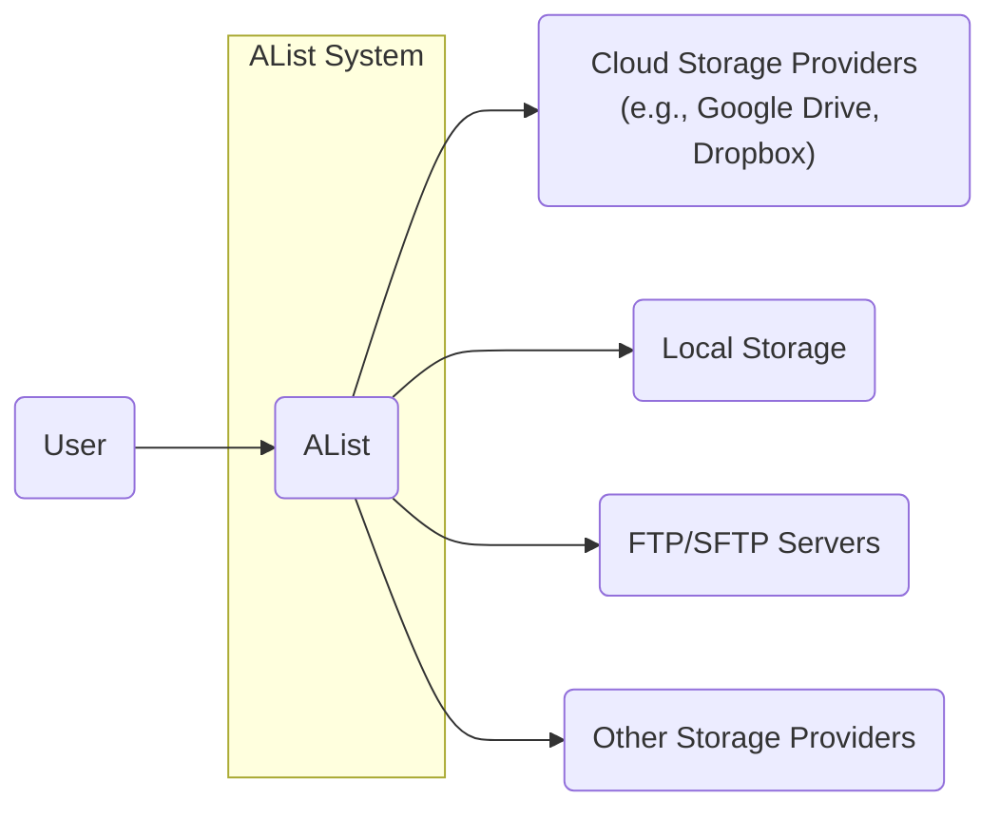
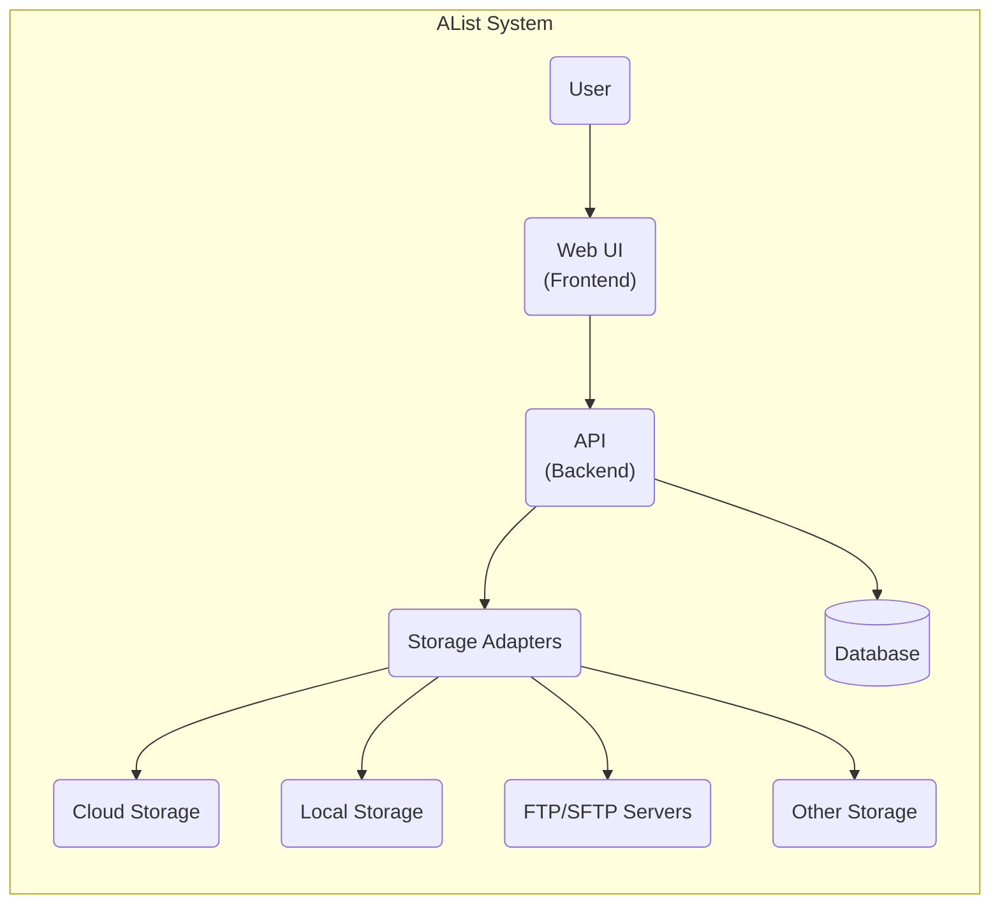
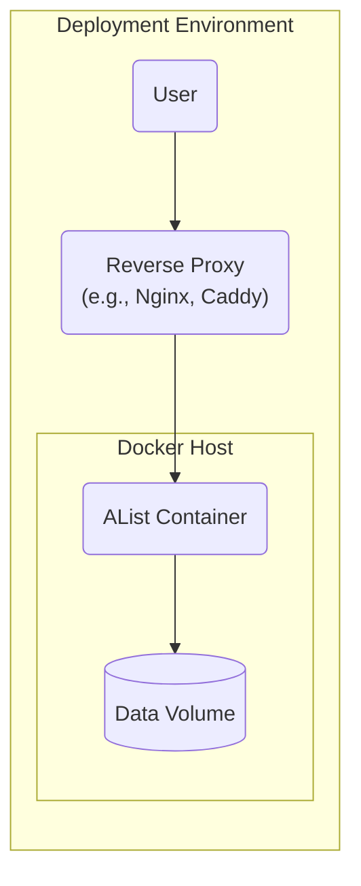
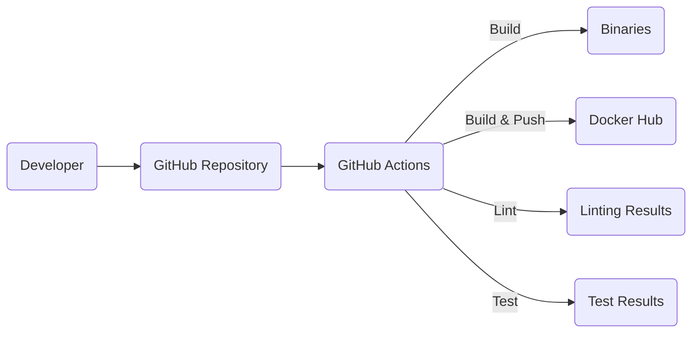

Okay, let's create a design document for the AList project, focusing on aspects relevant to threat modeling.

# BUSINESS POSTURE

AList is a file list program that supports multiple storage providers.  It's designed to be a versatile and user-friendly way to access and manage files across various locations.  The project appears to be open-source and community-driven, suggesting a focus on accessibility and collaboration.  The business priorities likely revolve around:

*   User Adoption:  Growing the user base by providing a useful and reliable tool.
*   Storage Provider Support:  Expanding compatibility with a wide range of storage services.
*   Ease of Use:  Maintaining a simple and intuitive user interface.
*   Community Engagement:  Fostering a community of contributors and users.
*   Data Accessibility: Providing reliable access to user's data.

Based on these priorities, the most important business risks are:

*   Data Breach: Unauthorized access to user files stored through AList. This is the most critical risk, as it directly impacts user trust and data privacy.
*   Service Disruption:  AList becoming unavailable or unreliable, preventing users from accessing their files.
*   Reputation Damage:  Security vulnerabilities or data breaches could severely damage the project's reputation and hinder adoption.
*   Malicious Use:  AList being exploited to host or distribute malicious content.
*   Integration Failures:  Issues with integrating with various storage providers, leading to data loss or inaccessibility.
*   Lack of Maintenance: Insufficient maintenance and updates, leading to security vulnerabilities and compatibility issues.

# SECURITY POSTURE

Based on the GitHub repository, the following security controls and accepted risks can be identified.  It's important to note that this is an assessment based on the *publicly available* information, and a deeper dive would be needed for a complete analysis.

Existing Security Controls:

*   security control: Authentication: AList supports various authentication methods, including username/password, and potentially OAuth for some storage providers (implied, needs verification). Described in documentation and source code.
*   security control: Authorization: AList likely implements some level of authorization to control access to files and folders based on user permissions (implied, needs verification). Described in documentation and source code.
*   security control: Multiple Storage Providers: Supports various storage providers, including local storage, cloud storage services (e.g., Google Drive, Dropbox, OneDrive), and FTP/SFTP servers. Described in documentation and source code.
*   security control: HTTPS Support: The documentation suggests that HTTPS can be configured, which is crucial for protecting data in transit. Described in documentation.
*   security control: Input Validation: Some degree of input validation is likely present to prevent common web vulnerabilities (needs verification). Partially described in source code.

Accepted Risks:

*   accepted risk: Third-Party Dependencies: AList relies on numerous third-party libraries, which introduce the risk of supply chain attacks.
*   accepted risk: Storage Provider Security: AList's security is partially dependent on the security of the underlying storage providers it connects to. A vulnerability in a provider could expose user data.
*   accepted risk: User Misconfiguration: Users might misconfigure AList or their storage providers, leading to security vulnerabilities.
*   accepted risk: Limited Security Auditing: As an open-source project, the extent of formal security auditing is unclear.

Recommended Security Controls (High Priority):

*   security control: Implement a robust Content Security Policy (CSP) to mitigate XSS vulnerabilities.
*   security control: Conduct regular security audits and penetration testing, ideally by independent security researchers.
*   security control: Implement a dependency management system that automatically checks for known vulnerabilities in third-party libraries.
*   security control: Provide clear and concise security documentation, including best practices for secure configuration.
*   security control: Implement rate limiting to protect against brute-force attacks on authentication.
*   security control: Implement robust logging and monitoring to detect and respond to security incidents.
*   security control: Offer Two-Factor Authentication (2FA) for enhanced account security.

Security Requirements:

*   Authentication:
    *   Support strong password policies.
    *   Protect against brute-force attacks.
    *   Offer 2FA options.
    *   Securely store and manage user credentials.
    *   Provide secure session management.

*   Authorization:
    *   Implement granular access control based on user roles and permissions.
    *   Enforce the principle of least privilege.
    *   Prevent unauthorized access to files and folders.

*   Input Validation:
    *   Validate all user inputs on the server-side.
    *   Sanitize user inputs to prevent XSS and other injection attacks.
    *   Use parameterized queries to prevent SQL injection (if applicable).

*   Cryptography:
    *   Use HTTPS for all communication between the client and server.
    *   Use strong encryption algorithms for storing sensitive data at rest (if applicable).
    *   Securely manage cryptographic keys.

# DESIGN

## C4 CONTEXT

C4 Context Element Descriptions:

*   Element:
    *   Name: User
    *   Type: Person
    *   Description: A person who interacts with AList to access and manage their files.
    *   Responsibilities: Authenticates with AList, browses files, uploads/downloads files, manages shares.
    *   Security controls: Strong passwords, 2FA (recommended).

*   Element:
    *   Name: AList
    *   Type: Software System
    *   Description: The file list program that supports multiple storage providers.
    *   Responsibilities: Provides a unified interface for accessing files, manages connections to storage providers, handles user authentication and authorization.
    *   Security controls: Authentication, authorization, input validation, HTTPS support, CSP (recommended), rate limiting (recommended).

*   Element:
    *   Name: Cloud Storage Providers
    *   Type: External System
    *   Description: Third-party cloud storage services like Google Drive, Dropbox, OneDrive, etc.
    *   Responsibilities: Storing user files, managing user accounts and permissions within their respective platforms.
    *   Security controls: Relies on the security controls implemented by the respective cloud providers.

*   Element:
    *   Name: Local Storage
    *   Type: External System
    *   Description: The local file system of the server where AList is running.
    *   Responsibilities: Storing user files locally.
    *   Security controls: Relies on the operating system's file system permissions and security controls.

*   Element:
    *   Name: FTP/SFTP Servers
    *   Type: External System
    *   Description: Remote servers accessed via FTP or SFTP protocols.
    *   Responsibilities: Storing user files and managing access via FTP/SFTP.
    *   Security controls: Relies on the security controls implemented by the FTP/SFTP server and the chosen protocol (SFTP is preferred for security).

*   Element:
    *   Name: Other Storage Providers
    *   Type: External System
    *   Description: Other storage providers supported by AList, such as object storage services.
    *   Responsibilities: Storing user files and managing access based on their specific protocols.
    *   Security controls: Relies on the security controls implemented by the respective storage providers.

## C4 CONTAINER

C4 Container Element Descriptions:

*   Element:
    *   Name: Web UI
    *   Type: Web Application
    *   Description: The user interface that users interact with, typically rendered in a web browser.
    *   Responsibilities: Displays files and folders, handles user interactions, communicates with the API.
    *   Security controls: CSP (recommended), XSS prevention, input validation (client-side).

*   Element:
    *   Name: API
    *   Type: API
    *   Description: The backend component that handles requests from the Web UI and interacts with storage providers.
    *   Responsibilities: Processes user requests, authenticates users, authorizes access, manages storage adapters.
    *   Security controls: Authentication, authorization, input validation (server-side), rate limiting (recommended), logging and monitoring (recommended).

*   Element:
    *   Name: Storage Adapters
    *   Type: Components
    *   Description: A set of components that provide a unified interface for interacting with different storage providers.
    *   Responsibilities: Translates API requests into storage provider-specific commands, handles data transfer.
    *   Security controls: Secure communication with storage providers (e.g., using HTTPS, SFTP), proper handling of credentials.

*   Element:
    *   Name: Database
    *   Type: Database
    *   Description: Stores metadata about files, users, and configurations.
    *   Responsibilities: Persisting data, providing efficient data retrieval.
    *   Security controls: Access control, encryption at rest (recommended), regular backups.

*   Element:
    *   Name: Cloud Storage
    *   Type: External System
    *   Description: Third-party cloud storage services.
    *   Responsibilities: Storing user files.
    *   Security controls: Relies on the security controls of the cloud providers.

*   Element:
    *   Name: Local Storage
    *   Type: External System
    *   Description: Local file system.
    *   Responsibilities: Storing user files.
    *   Security controls: Relies on OS file system permissions.

*   Element:
    *   Name: FTP/SFTP Servers
    *   Type: External System
    *   Description: Remote servers accessed via FTP/SFTP.
    *   Responsibilities: Storing user files.
    *   Security controls: Relies on FTP/SFTP server security.

*   Element:
    *   Name: Other Storage
    *   Type: External System
    *   Description: Other supported storage providers.
    *   Responsibilities: Storing user files.
    *   Security controls: Relies on the security controls of the specific providers.

## DEPLOYMENT

AList can be deployed in several ways:

1.  **Standalone Binary:** Download and run the pre-compiled binary for the target operating system.
2.  **Docker Container:** Use the official Docker image to run AList in a containerized environment.
3.  **Source Code:** Build AList from source and deploy it manually.

The **Docker Container** deployment is the recommended and most convenient option, and will be described in detail.

Deployment Element Descriptions:

*   Element:
    *   Name: User
    *   Type: Person
    *   Description: A person accessing AList.
    *   Responsibilities: Interacting with AList through a web browser.
    *   Security controls: Strong passwords, 2FA (recommended).

*   Element:
    *   Name: Reverse Proxy
    *   Type: Web Server
    *   Description: A reverse proxy server (e.g., Nginx, Caddy) that sits in front of the AList container.
    *   Responsibilities: Handles incoming requests, terminates SSL/TLS, forwards requests to the AList container.
    *   Security controls: HTTPS configuration, SSL/TLS certificates, firewall rules.

*   Element:
    *   Name: Docker Host
    *   Type: Server
    *   Description: The server that hosts the Docker engine and runs the AList container.
    *   Responsibilities: Provides the runtime environment for the container.
    *   Security controls: Operating system security, Docker daemon security, firewall rules.

*   Element:
    *   Name: AList Container
    *   Type: Container
    *   Description: The Docker container running the AList application.
    *   Responsibilities: Runs the AList application, handles requests from the reverse proxy.
    *   Security controls: Container security best practices (e.g., running as a non-root user, using minimal base images).

*   Element:
    *   Name: Data Volume
    *   Type: Persistent Storage
    *   Description: A Docker volume used to persist AList's data (configuration, database, etc.).
    *   Responsibilities: Stores data persistently across container restarts.
    *   Security controls: Access control to the Docker volume, encryption at rest (recommended).

## BUILD

AList provides pre-built binaries and Docker images. The build process, based on the GitHub Actions workflow, can be summarized as follows:

Build Process Description:

1.  **Developer:** Developers write code and push changes to the GitHub repository.
2.  **GitHub Repository:** The central repository for the AList source code.
3.  **GitHub Actions:**  Automated workflows triggered by events in the repository (e.g., pushes, pull requests).  These workflows handle building, testing, and packaging AList.
4.  **Build:** The build process compiles the Go code into executable binaries for various platforms.
5.  **Binaries:** The compiled binaries are created as artifacts.
6.  **Docker Hub:** The Docker image is built and pushed to Docker Hub.
7.  **Linting:** Code linting is performed to enforce code style and identify potential issues.
8.  **Linting Results:** Results of the linting process.
9.  **Test:** Automated tests are run to ensure code quality and functionality.
10. **Test Results:** Results of the tests.

Security Controls in Build Process:

*   security control: GitHub Actions: Uses GitHub Actions for automated builds and testing, providing a consistent and reproducible build environment.
*   security control: Linting: Includes code linting to identify potential code quality and security issues.
*   security control: Testing: Includes automated tests to verify functionality and potentially identify security vulnerabilities.
*   security control: (Recommended) Dependency Scanning: Integrate a tool to scan dependencies for known vulnerabilities during the build process.
*   security control: (Recommended) Static Application Security Testing (SAST): Integrate a SAST tool to scan the source code for security vulnerabilities.

# RISK ASSESSMENT

*   **Critical Business Processes:**
    *   Providing access to user files stored across various storage providers.
    *   Maintaining the availability and reliability of the AList service.
    *   Protecting user data from unauthorized access and modification.

*   **Data Sensitivity:**
    *   **User Files:** The primary data AList handles are user files, which can range from low to high sensitivity depending on the user and the content of the files. This is the most critical data to protect.
    *   **User Credentials:** AList stores or handles user credentials for accessing storage providers. These credentials are highly sensitive and must be protected with strong security measures.
    *   **Configuration Data:** AList's configuration data, including database connection strings and other settings, is moderately sensitive and should be protected from unauthorized access.
    *   **Metadata:** Metadata about files (e.g., filenames, sizes, timestamps) is generally low sensitivity, but could be used in combination with other information to compromise user privacy.

# QUESTIONS & ASSUMPTIONS

*   **Questions:**
    *   What specific OAuth providers are supported, and how are OAuth tokens managed?
    *   What is the exact database schema used by AList?
    *   Are there any existing security audit reports or penetration testing results?
    *   What are the specific logging and monitoring capabilities of AList?
    *   What is the process for handling security vulnerabilities reported by users or researchers?
    *   Are there any plans to implement 2FA?
    *   What are the specific input validation rules implemented in AList?
    *   How are secrets (e.g., API keys, database passwords) managed in different deployment scenarios?

*   **Assumptions:**
    *   BUSINESS POSTURE: The project prioritizes user adoption and ease of use, potentially leading to a slightly higher risk tolerance in some areas.
    *   SECURITY POSTURE: The project relies heavily on the security of third-party storage providers and libraries.
    *   SECURITY POSTURE: The project has limited formal security auditing.
    *   DESIGN: The provided C4 diagrams are a reasonable representation of the system architecture based on the available information.
    *   DESIGN: The Docker deployment is the primary deployment method.
    *   DESIGN: The GitHub Actions workflow is the primary build mechanism.
    *   DESIGN: A reverse proxy is used in production deployments.