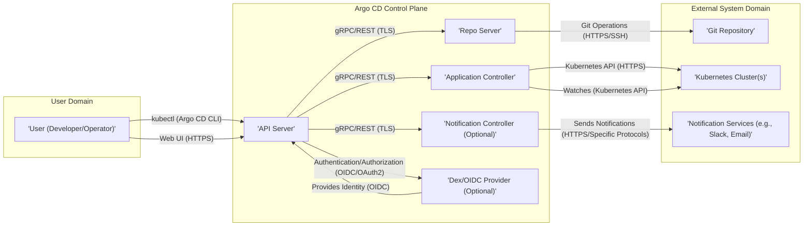

# Project Design Document: Argo CD

**Version:** 1.1
**Date:** October 26, 2023
**Author:** AI Software Architect

## 1. Introduction

This document provides an enhanced architectural overview of Argo CD, a declarative, GitOps continuous delivery tool for Kubernetes. This document is intended to serve as a robust foundation for subsequent threat modeling activities. It meticulously outlines the key components, their interactions, and the data flows within the Argo CD system, with a stronger emphasis on security considerations.

## 2. Goals

* Provide a more detailed and refined architectural description of Argo CD.
* Enhance the descriptions of key components and their security responsibilities.
* Illustrate the data flow within the system with a focus on security-relevant data transmission.
* Highlight important interactions and trust boundaries with greater clarity on potential vulnerabilities.
* Serve as a more comprehensive basis for identifying potential security threats and vulnerabilities during threat modeling.

## 3. Target Audience

This document is intended for:

* Security engineers and architects deeply involved in threat modeling and security assessments of Argo CD deployments.
* Development teams working with or extending Argo CD, requiring a deeper understanding of its security architecture.
* Operations teams responsible for deploying, managing, and securing Argo CD in production environments.

## 4. Architectural Overview

Argo CD employs a client-server architecture with distinct components collaborating to deliver GitOps capabilities. The following diagram illustrates the high-level architecture:

## 5. Component Details

This section provides an in-depth description of each major component within the Argo CD architecture, emphasizing their roles and security considerations.

* **User (Developer/Operator):**
    * Interacts with Argo CD to define, manage, and monitor application deployments, representing a key point of entry and potential vulnerability if compromised.
    * Utilizes the Argo CD CLI (`kubectl argo cd`), requiring secure configuration and management of `kubectl` and Argo CD CLI credentials.
    * Accesses the Web UI, necessitating secure authentication and protection against web-based attacks.

* **API Server:**
    * Serves as the central, secured gateway to the Argo CD system, handling all management operations.
    * Exposes a gRPC and REST API, both of which should enforce TLS encryption for all communication.
    * Manages authentication and authorization of user requests, relying on integrations with identity providers like Dex or other OIDC compliant systems. Proper configuration is crucial to prevent unauthorized access.
    * Persists application state and configuration within its internal data store (typically Kubernetes Custom Resource Definitions - CRDs), requiring appropriate RBAC controls on these CRDs within the Kubernetes cluster.

* **Repo Server:**
    * Responsible for securely fetching and caching application manifests from Git repositories, a critical function where compromised repositories can lead to malicious deployments.
    * Supports various Git protocols (HTTPS, SSH), each with its own security implications regarding credential management and transport security.
    * Performs template processing (e.g., Helm, Kustomize, plain YAML), which can introduce vulnerabilities if templates are not properly secured or if external dependencies are compromised.
    * Isolates Git operations from other components, enhancing security by limiting the blast radius of potential Git-related vulnerabilities. Securely stores Git credentials.

* **Application Controller:**
    * Continuously monitors the desired state of applications defined in Git and compares it to the actual state in the target Kubernetes cluster(s), acting as the enforcement engine of GitOps principles.
    * Triggers synchronization operations to reconcile differences, requiring secure communication with the Kubernetes API and appropriate permissions.
    * Manages the deployment lifecycle of applications, including resource creation, updates, and deletions, making its security posture critical for cluster stability and security.
    * Watches Kubernetes resources for changes, requiring read access to various Kubernetes objects, which should be granted based on the principle of least privilege.

* **Notification Controller (Optional):**
    * Provides a mechanism for sending notifications about application events, potentially exposing sensitive information if not configured securely.
    * Integrates with various notification services (e.g., Slack, email, webhooks), each with its own security considerations regarding authentication, authorization, and data transmission.
    * Requires careful configuration to avoid leaking sensitive data in notifications and to prevent unauthorized access to notification channels.

* **Dex/OIDC Provider (Optional):**
    * Handles user authentication for the Argo CD Web UI and API, a fundamental security component.
    * Supports various identity providers through OIDC or its internal user management, requiring secure configuration and management of secrets and client registrations.
    * Proper configuration is essential to prevent unauthorized access and account compromise.

* **Git Repository:**
    * Stores the declarative configuration of the target applications, representing the single source of truth and a prime target for attackers seeking to inject malicious code or configurations.
    * Acts as the immutable record of desired application state, emphasizing the need for access controls, audit trails, and potentially signing of commits.
    * Can be hosted on various platforms (e.g., GitHub, GitLab, Bitbucket), each with its own security features and potential vulnerabilities.

* **Kubernetes Cluster(s):**
    * The target environment where applications are deployed and managed by Argo CD, requiring robust security measures to protect the deployed workloads and the cluster itself.
    * Argo CD interacts with the Kubernetes API server, necessitating secure authentication and authorization using service accounts with appropriately scoped RBAC permissions.

* **Notification Services (e.g., Slack, Email):**
    * External services used by the Notification Controller to send alerts and updates, requiring secure integration and consideration of their own security postures.

## 6. Data Flow

This section details the typical data flow within the Argo CD system during an application deployment or synchronization, highlighting security-relevant data transmission and potential vulnerabilities.

1. **User Initiates Action:** A user (developer or operator) securely interacts with Argo CD through the CLI or Web UI (HTTPS) to create, update, or synchronize an application.
2. **Request to API Server:** The user's authenticated request is securely sent (HTTPS/TLS) to the Argo CD API Server.
3. **Authentication and Authorization:** The API Server authenticates and authorizes the user's request, securely communicating (OIDC/OAuth2) with Dex/OIDC.
4. **Retrieve Application Configuration:** The API Server securely instructs (gRPC/TLS) the Repo Server to fetch the application manifests from the configured Git repository, using stored credentials.
5. **Manifest Processing:** The Repo Server securely clones (HTTPS/SSH) the Git repository, processes the manifests, and returns the rendered Kubernetes resources securely (gRPC/TLS).
6. **State Comparison:** The API Server or Application Controller securely compares the desired state (from Git) with the actual state in the target Kubernetes cluster by querying the Kubernetes API (HTTPS).
7. **Synchronization (if needed):** If differences exist, the Application Controller initiates a synchronization process, securely communicating with the Kubernetes API (HTTPS).
8. **Kubernetes API Interaction:** The Application Controller securely interacts with the Kubernetes API server (HTTPS) using service account credentials to create, update, or delete resources.
9. **Status Updates:** The Application Controller monitors the status of deployed resources and securely updates the application status within Argo CD.
10. **Notification (Optional):** If configured, the Notification Controller sends notifications about the deployment status to configured services, using secure protocols where available.
11. **User Feedback:** The user can securely view (HTTPS) the application status and deployment details through the CLI or Web UI, retrieving information securely from the API Server.

## 7. Key Interactions

This section emphasizes critical interactions between components, focusing on potential security implications and vulnerabilities.

* **User Authentication and Authorization:**
    * Users authenticate with the API Server, typically through an OIDC provider managed by Dex, requiring strong password policies, multi-factor authentication where possible, and secure session management.
    * Proper authentication and authorization are paramount to prevent unauthorized access and malicious modifications. Vulnerabilities in the authentication flow or misconfigured authorization rules can lead to significant security breaches.
    * Permissions are managed within Argo CD, controlling user actions on applications and repositories. Regular review and enforcement of least privilege are essential.

* **Accessing Git Repositories:**
    * The Repo Server requires securely stored credentials (HTTPS tokens, SSH keys) to access Git repositories. Compromise of these credentials allows attackers to manipulate application configurations.
    * Secure storage and management of these credentials, potentially using secrets management solutions, are vital. Regular rotation of credentials is recommended.
    * Access control on the Git repository itself is crucial. Branch protection rules and code review processes can mitigate risks.

* **Interacting with Kubernetes API:**
    * The Application Controller utilizes Kubernetes service accounts with specific permissions (RBAC) to interact with target clusters. Overly permissive service accounts pose a significant security risk.
    * Least privilege principles must be strictly applied to these service accounts, granting only the necessary permissions for Argo CD to function. Regular auditing of RBAC configurations is important.
    * Securely storing and managing the Kubernetes cluster credentials (e.g., using Kubernetes secrets or external secrets managers) is essential to prevent unauthorized cluster access.

* **Web UI Security:**
    * The Web UI must be rigorously protected against common web vulnerabilities such as Cross-Site Scripting (XSS), Cross-Site Request Forgery (CSRF), and injection attacks. Regular security assessments and penetration testing are recommended.
    * Secure communication (HTTPS) with strong TLS configurations is mandatory to protect user credentials and sensitive data in transit.

* **API Security:**
    * The API Server must enforce strong authentication and authorization for all requests. Rate limiting and other security measures can help prevent denial-of-service attacks and abuse.
    * Input validation and sanitization are crucial to prevent injection attacks through the API.

* **Notification Security:**
    * Sensitive information might be included in notifications. Secure communication channels (e.g., TLS for webhooks) should be used.
    * Authentication and authorization might be required for notification services to prevent unauthorized access or manipulation of notification streams.

## 8. Security Considerations

This section provides a more detailed overview of potential security considerations based on the architecture, offering specific examples and potential mitigation strategies.

* **Credential Management:**
    * **Risk:** Storing Git and Kubernetes credentials insecurely can lead to unauthorized access and control.
    * **Mitigation:** Utilize secure secrets management solutions (e.g., HashiCorp Vault, Kubernetes Secrets with encryption at rest), enforce regular credential rotation, and avoid storing credentials in plain text.

* **Authentication and Authorization:**
    * **Risk:** Weak or misconfigured authentication and authorization can allow unauthorized users to access and modify applications and infrastructure.
    * **Mitigation:** Enforce strong password policies, implement multi-factor authentication, regularly review and audit RBAC configurations, and adhere to the principle of least privilege.

* **Network Security:**
    * **Risk:** Unencrypted communication can expose sensitive data. Open network access can increase the attack surface.
    * **Mitigation:** Enforce TLS/HTTPS for all communication, implement network segmentation to isolate Argo CD components and target clusters, and use firewalls to restrict access.

* **Input Validation:**
    * **Risk:** Failure to validate inputs from Git repositories or user interactions can lead to injection attacks (e.g., command injection, YAML injection).
    * **Mitigation:** Implement robust input validation and sanitization mechanisms, use templating engines securely, and regularly scan Git repositories for potential vulnerabilities.

* **Supply Chain Security:**
    * **Risk:** Compromised dependencies or a malicious Argo CD installation can introduce vulnerabilities.
    * **Mitigation:** Use trusted sources for Argo CD installations, verify checksums, regularly update Argo CD and its dependencies, and implement security scanning of container images.

* **Auditing and Logging:**
    * **Risk:** Insufficient logging can hinder incident response and forensic analysis.
    * **Mitigation:** Enable comprehensive audit logging for all Argo CD components and Kubernetes API interactions, securely store and monitor logs, and implement alerting for suspicious activity.

* **Secrets Management (within Applications):**
    * **Risk:** Secrets stored directly in Git repositories or Kubernetes manifests can be exposed.
    * **Mitigation:** Utilize Kubernetes Secrets (encrypted at rest), external secrets management solutions, or tools like Sealed Secrets to manage sensitive data within applications.

* **RBAC and Least Privilege:**
    * **Risk:** Overly permissive RBAC roles for Argo CD service accounts can grant excessive access to Kubernetes resources.
    * **Mitigation:** Implement granular RBAC policies, granting only the necessary permissions for Argo CD to function correctly. Regularly review and refine RBAC configurations.

* **Web UI Security:**
    * **Risk:** Vulnerabilities in the Web UI can be exploited to compromise user accounts or gain unauthorized access.
    * **Mitigation:** Implement security best practices for web application development, regularly scan for vulnerabilities, and enforce Content Security Policy (CSP).

## 9. Future Considerations

* **Enhanced Multi-Tenancy:**  Develop more robust mechanisms for securely isolating different teams and applications within a shared Argo CD instance, including namespace isolation and fine-grained access control.
* **Advanced Disaster Recovery:** Implement comprehensive disaster recovery strategies for Argo CD itself, ensuring the ability to restore its state and managed applications in case of failures.
* **Scalability and Performance Optimization:** Continuously evaluate and optimize the performance and scalability of Argo CD to handle increasing workloads and the management of a large number of applications and clusters.
* **Integration with Security Scanning Tools:** Explore and implement integrations with static and dynamic application security testing (SAST/DAST) tools to proactively identify vulnerabilities in application configurations.

This enhanced document provides a more detailed and security-focused overview of the Argo CD architecture, serving as a more robust foundation for a thorough threat modeling exercise. By deeply understanding the components, data flows, and interactions, with a strong emphasis on security considerations, security professionals can more effectively identify and mitigate potential security risks.