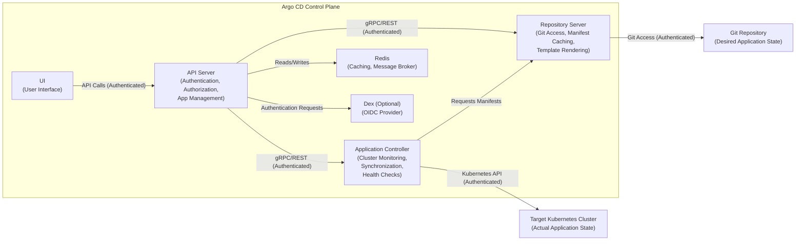

# Project Design Document: Argo CD for Threat Modeling (Improved)

**Version:** 1.1
**Date:** October 26, 2023
**Author:** AI Software Architect

## 1. Introduction

This document provides an enhanced architectural overview of Argo CD, a declarative GitOps continuous delivery tool for Kubernetes, specifically tailored for threat modeling. Building upon the previous version, this document offers more granular detail regarding component responsibilities, data flows, and security considerations. The primary goal remains to establish a robust foundation for identifying potential vulnerabilities and designing effective security mitigations.

### 1.1. Purpose

* To provide a detailed and security-focused architectural description of Argo CD.
* To serve as the primary resource for identifying potential security threats, vulnerabilities, and attack vectors.
* To facilitate deeper, more informed discussions and decision-making regarding security controls and risk mitigation strategies.

### 1.2. Scope

This document encompasses the core components, functionalities, and interactions within Argo CD, drawing upon official documentation and source code (as of the provided GitHub link). The focus is explicitly on architectural elements relevant to security, with more detailed explanations of data handling, authentication mechanisms, and potential points of compromise. Implementation details are included where they directly impact security.

### 1.3. Target Audience

* Security Engineers and Architects
* Threat Intelligence and Red Teams
* DevOps Engineers with security responsibilities
* Software Architects and Development Leads

## 2. Overview of Argo CD

Argo CD facilitates GitOps for Kubernetes, ensuring that the state of deployed applications matches the desired state defined in Git repositories. It continuously monitors Git repositories and compares the declared configuration with the live state in Kubernetes clusters. Deviations trigger synchronization, either automatically or manually, to reconcile the environment with the Git source of truth. This document delves deeper into the underlying architecture to expose potential security weaknesses.

## 3. System Architecture

Argo CD's architecture comprises several interconnected components, each with specific responsibilities and security implications.

### 3.1. Core Components (Detailed)

* **API Server:**
    * **Functionality:** The central point of interaction, exposing gRPC and REST APIs for user interfaces, CLIs, and internal components. Manages application definitions, deployments, health status, and configurations. Enforces authentication and authorization policies. Stores application state and configuration in the data store.
    * **Security Relevance:** A critical attack surface. Vulnerabilities here could lead to unauthorized access, data breaches, and control plane compromise. Improperly configured authentication or authorization can grant excessive privileges.
* **Repository Server:**
    * **Functionality:** Fetches and caches Git repositories containing application manifests (Kubernetes YAML, Helm charts, Kustomize configurations). Supports various Git providers and authentication methods. Performs template rendering. Provides secure access to repository contents for other Argo CD components.
    * **Security Relevance:**  A potential target for supply chain attacks if compromised. Stored credentials for accessing Git repositories are sensitive. Vulnerabilities could allow access to application secrets and infrastructure configurations.
* **Application Controller:**
    * **Functionality:** Continuously monitors the actual state of applications in target Kubernetes clusters by interacting with their APIs. Compares the desired state (from the Repository Server) with the actual state. Detects drifts and initiates synchronization processes. Manages application health checks, rollouts, and resource reconciliation.
    * **Security Relevance:** Requires privileged access to target Kubernetes clusters. Compromise could lead to unauthorized modifications or deletion of resources within those clusters. Improper handling of Kubernetes credentials poses a significant risk.
* **Redis:**
    * **Functionality:** Used as a high-performance in-memory data store, primarily for caching and as a message broker for inter-component communication. Stores temporary data related to application state and synchronization processes.
    * **Security Relevance:** While primarily a cache, sensitive information could reside temporarily. Unsecured Redis instances can be vulnerable to unauthorized access and data leakage.
* **Dex (Optional):**
    * **Functionality:** An OpenID Connect (OIDC) provider used for federated authentication. Allows integration with various identity providers (e.g., Google, GitHub, LDAP). Simplifies user authentication and management.
    * **Security Relevance:**  A critical component for authentication. Misconfiguration or vulnerabilities in Dex could lead to authentication bypass or credential compromise, granting unauthorized access to Argo CD.
* **UI (User Interface):**
    * **Functionality:** A web-based interface providing a visual representation of application deployments, health status, and synchronization history. Allows users to manage applications, trigger synchronizations, and view logs. Interacts with the API Server.
    * **Security Relevance:** Subject to common web application vulnerabilities (e.g., XSS, CSRF). Access control vulnerabilities could allow unauthorized users to view sensitive information or perform actions.

### 3.2. Component Diagram (Improved)

### 3.3. Data Flow (Detailed)

This section elaborates on the data flow, highlighting sensitive data and potential interception points.

* **Application Definition and Storage:**
    * User defines the desired application state (manifests, charts, etc.) in a Git repository (G). This often includes sensitive configurations and potentially secrets.
    * User registers the application with the Argo CD API Server (A) via the UI (F), CLI, or API. This involves transmitting application metadata and Git repository access details.
    * The API Server (A) stores the application configuration, including Git repository URLs and potentially access credentials, in its data store (within the API Server's persistence layer).
* **State Synchronization Process:**
    * The Application Controller (C) periodically checks for updates in registered Git repositories by querying the Repository Server (B). This request is authenticated.
    * The Repository Server (B) fetches the latest version of the Git repository (G), authenticating with the Git provider using stored credentials. This transfer may contain sensitive application configurations and secrets.
    * The Repository Server (B) processes templates (e.g., Helm) to generate Kubernetes manifests. This process might involve accessing and rendering secrets.
    * The Application Controller (C) retrieves the rendered manifests from the Repository Server (B).
    * The Application Controller (C) compares the desired state with the actual state in the target Kubernetes cluster (H) by interacting with the Kubernetes API. This communication is authenticated and often encrypted.
    * If a drift is detected, the Application Controller (C) applies the necessary changes to the target Kubernetes cluster (H) via the Kubernetes API, using its configured credentials. This involves transmitting Kubernetes objects, which may contain secrets.
* **User Interaction and Monitoring:**
    * Users interact with the Argo CD UI (F) or CLI, which communicate with the API Server (A) to view application status, logs, and trigger actions. These interactions are authenticated.
    * The API Server (A) retrieves application status and history from its data store and potentially from the Application Controller (C).

### 3.4. Key Interactions (Security Focused)

* **User to API Server:** All user interactions require authentication and authorization. Vulnerabilities in these mechanisms could lead to unauthorized access.
* **API Server to Repository Server:** Authentication is crucial to prevent unauthorized access to Git repositories. Secure storage of Git credentials is paramount.
* **Application Controller to Repository Server:** This interaction involves retrieving application manifests, which may contain sensitive information. Secure communication is necessary.
* **Application Controller to Kubernetes API:** This interaction requires highly privileged credentials. Secure storage and management of these credentials are vital. Least privilege principles should be applied.
* **API Server to Redis:** While primarily for caching, securing the connection and access to Redis is important to prevent potential data leaks.
* **Authentication Flow (via Dex):** The security of the OIDC flow is critical. Misconfigurations or vulnerabilities in Dex or the integrated identity providers can compromise authentication.

## 4. Security Considerations (Expanded)

This section provides a more detailed analysis of security considerations.

### 4.1. Authentication and Authorization (In-Depth)

* **API Server Authentication:**
    * **Threats:** Brute-force attacks, credential stuffing, compromised credentials, authentication bypass vulnerabilities.
    * **Mitigations:** Strong password policies, multi-factor authentication (MFA), rate limiting, regular credential rotation, vulnerability scanning of authentication mechanisms.
* **Authorization (RBAC):**
    * **Threats:** Privilege escalation, unauthorized access to applications or clusters, data breaches due to overly permissive roles.
    * **Mitigations:** Principle of least privilege, regular review of RBAC configurations, automated enforcement of policies, segregation of duties.
* **Repository Server Authentication:**
    * **Threats:** Compromised Git credentials leading to unauthorized access to application configurations and secrets, man-in-the-middle attacks.
    * **Mitigations:** Secure storage of Git credentials (e.g., using Kubernetes Secrets with encryption at rest, dedicated secrets management tools), use of SSH keys with passphrase protection, enforcing HTTPS for Git access, regular credential rotation.
* **Target Cluster Authentication:**
    * **Threats:** Compromised Kubernetes service account credentials leading to full control over the target cluster, unauthorized resource manipulation.
    * **Mitigations:** Secure storage of kubeconfig files or service account tokens (e.g., Kubernetes Secrets with encryption at rest), principle of least privilege for service accounts, regular rotation of credentials, network segmentation to limit access.

### 4.2. Secrets Management (Detailed)

* **Threats:** Exposure of sensitive information (API keys, database credentials, etc.) stored in Git repositories or within Argo CD's configuration.
* **Mitigations:**
    * **Avoid storing secrets directly in Git:** Utilize methods like Sealed Secrets, HashiCorp Vault, AWS Secrets Manager, Azure Key Vault, or other external secrets management solutions.
    * **Kubernetes Secrets with Encryption at Rest:** If using Kubernetes Secrets, ensure encryption at rest is enabled for the Kubernetes etcd datastore.
    * **Argo CD Secrets Management Features:** Leverage Argo CD's built-in support for integrating with external secrets management tools.
    * **Regular Audits:** Periodically audit how secrets are managed and accessed within Argo CD.

### 4.3. Network Security (Expanded)

* **Communication between Components:**
    * **Threats:** Man-in-the-middle attacks, eavesdropping on sensitive data.
    * **Mitigations:** Enforce TLS/SSL for all internal communication between Argo CD components. Utilize mutual TLS (mTLS) for enhanced security.
* **Access to Git Repositories:**
    * **Threats:** Unauthorized access to application configurations, potential for injecting malicious code.
    * **Mitigations:** Restrict network access to Git repositories to only authorized Argo CD components. Use firewalls and network policies. Enforce authentication and authorization at the Git provider level.
* **Access to Target Clusters:**
    * **Threats:** Unauthorized access to the Kubernetes API, potential for cluster compromise.
    * **Mitigations:** Restrict network access to the Kubernetes API to only the Argo CD Application Controller. Utilize network policies and firewalls. Implement strong authentication and authorization on the Kubernetes API server.
* **Ingress/Egress Control:**
    * **Threats:** Unauthorized access to the Argo CD API Server and UI, potential for exploitation of web application vulnerabilities.
    * **Mitigations:** Securely configure ingress controllers, implement web application firewalls (WAFs), enforce HTTPS, restrict access based on IP address or other criteria.

### 4.4. Data Security (More Specific)

* **Data at Rest:**
    * **Threats:** Unauthorized access to sensitive data stored within Argo CD's persistence layer (e.g., application configurations, credentials).
    * **Mitigations:** Enable encryption at rest for the underlying data store used by the API Server.
* **Data in Transit:**
    * **Threats:** Eavesdropping on sensitive data transmitted between components or to external systems.
    * **Mitigations:** Enforce TLS/SSL for all communication, including connections to Git repositories and target Kubernetes clusters.

### 4.5. Audit Logging (Enhanced)

* **Threats:** Lack of visibility into security events, difficulty in detecting and responding to incidents.
* **Mitigations:** Configure comprehensive audit logging for all Argo CD components. Ensure logs include details about user actions, API calls, and system events. Securely store and monitor audit logs. Integrate with security information and event management (SIEM) systems.

### 4.6. Input Validation (Detailed Examples)

* **Threats:** Injection attacks (e.g., command injection, YAML injection) through user-provided inputs or data retrieved from Git repositories.
* **Mitigations:** Implement strict input validation and sanitization for all user inputs and data retrieved from Git. Use parameterized queries or prepared statements where applicable. Be cautious when processing templating languages (Helm, Kustomize) to prevent malicious code execution.

### 4.7. Supply Chain Security (Specific to Argo CD)

* **Threats:** Compromised application manifests or configurations in Git repositories leading to the deployment of malicious applications.
* **Mitigations:** Implement code signing for Git commits, enforce policies on the content of Git repositories, regularly scan repositories for vulnerabilities, utilize trusted base images for container deployments.

## 5. Deployment Considerations (Security Focused)

The deployment model significantly impacts Argo CD's security posture.

* **Deployment Location:**
    * **Threats:** If deployed in a shared or untrusted environment, Argo CD and its secrets could be compromised.
    * **Mitigations:** Deploy Argo CD within a dedicated, well-secured management cluster. Isolate the Argo CD namespace and resources.
* **High Availability (HA):**
    * **Threats:** While not directly a security threat, loss of availability can disrupt critical deployment processes. Security measures should not hinder availability.
    * **Mitigations:** Implement HA for Argo CD components. Ensure secure replication and failover mechanisms.
* **Multi-Tenancy:**
    * **Threats:** Data breaches or unauthorized access between tenants if proper isolation is not implemented.
    * **Mitigations:** Implement strong tenant isolation using Kubernetes namespaces, RBAC, and network policies. Carefully manage resource quotas and limits.

## 6. Assumptions and Dependencies

* It is assumed that the underlying Kubernetes infrastructure is secured according to industry best practices.
* The security of the Git repositories used by Argo CD is a critical dependency.
* The security of any integrated identity providers (e.g., Dex) is essential.

## 7. Out of Scope

* Security considerations for the applications deployed *by* Argo CD (focus is on Argo CD itself).
* Detailed configuration specifics for all possible integrations and providers.
* Operational security procedures beyond the architectural design.

This improved document provides a more detailed and security-focused architectural overview of Argo CD, intended to facilitate comprehensive threat modeling activities. It highlights potential vulnerabilities and suggests mitigation strategies to enhance the security posture of Argo CD deployments.
