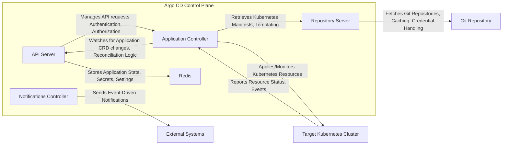
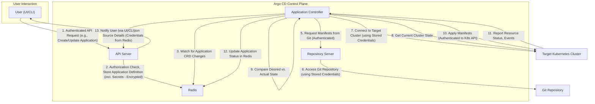

# Project Design Document: Argo CD

**Version:** 1.1
**Date:** October 26, 2023
**Author:** AI Software Architect

## 1. Introduction

This document provides a detailed architectural design of Argo CD, a declarative, GitOps continuous delivery tool for Kubernetes. This document aims to provide a comprehensive understanding of Argo CD's components, their interactions, and data flow, which will serve as the foundation for subsequent threat modeling activities.

### 1.1. Purpose

The purpose of this document is to:

* Clearly define the architecture of Argo CD.
* Identify the key components and their responsibilities with greater detail.
* Describe the interactions between components, including specific data exchanged.
* Outline the data flow within the system, emphasizing security-relevant aspects.
* Provide a robust basis for identifying potential security vulnerabilities and threats.

### 1.2. Scope

This document covers the core architectural components of Argo CD, including:

* API Server (with emphasis on authentication and authorization)
* Application Controller (detailing reconciliation logic)
* Repository Server (including Git access and manifest generation)
* Notifications Controller (and its interaction with external systems)
* Redis (as a state store and message broker)
* Cluster Resources (Custom Resource Definitions - CRDs) and their role
* Interactions with Git repositories and target Kubernetes clusters, focusing on credential management.

This document does not cover:

* Specific deployment configurations (e.g., High Availability setups, scaling strategies) in detail.
* Low-level implementation specifics of individual components' internal logic.
* User interface (UI) implementation details beyond its interaction with the API Server.

### 1.3. Audience

This document is intended for:

* Security engineers and architects involved in threat modeling and security assessments.
* Development teams working with or extending Argo CD, requiring a deep understanding of its architecture.
* Operations teams responsible for deploying, managing, and securing Argo CD.

## 2. Overview

Argo CD follows the GitOps paradigm, where the desired state of Kubernetes applications is declared in Git repositories. Argo CD automates the deployment of the declared application states to target Kubernetes environments. It continuously monitors the actual state of applications against the desired state in Git and automatically reconciles any discrepancies. This reconciliation process is central to its functionality and security.

### 2.1. Key Concepts

* **Application:** A logical grouping of Kubernetes resources defined in Git that Argo CD manages, represented by a Kubernetes Custom Resource.
* **Application Source:** The Git repository (or other supported source like Helm charts) containing the declarative configuration of the application. This includes manifests, Helm charts, Kustomize configurations, etc.
* **Target Cluster:** The specific Kubernetes cluster where the application will be deployed, identified by its API server endpoint and credentials.
* **Sync:** The core process of deploying the desired state from the Application Source to the Target Cluster. This involves creating, updating, or deleting Kubernetes resources.
* **Health Status:** Argo CD actively monitors the health of deployed Kubernetes resources based on built-in Kubernetes health checks and custom health checks.
* **Sync Status:** Indicates whether the actual state of the application in the Target Cluster matches the desired state defined in the Application Source. Possible states include Synced, OutOfSync, Unknown, and Progressing.
* **Rollback:** The capability to revert an application to a previously deployed state, effectively undoing changes introduced by a recent sync. This relies on Argo CD's history tracking.
* **Projects:** A way to logically group applications and enforce access control policies, enhancing multi-tenancy and security.

## 3. Architectural Design

The following diagram illustrates the high-level architecture of Argo CD:

### 3.1. Components

* **API Server:**
    * Serves as the central point of interaction with Argo CD, exposing a RESTful API and a gRPC interface for the UI, CLI, and other clients.
    * Handles user authentication (e.g., local users, OIDC, SAML, GitHub OAuth2) and authorization based on RBAC policies defined within Argo CD.
    * Manages the lifecycle of Application CRDs, Projects, and other Argo CD specific resources.
    * Stores application definitions, configurations, secrets (encrypted at rest), and operational status in Redis.
    * Enforces validation rules for API requests.

* **Application Controller:**
    * The core engine responsible for the continuous reconciliation loop.
    * Watches for changes in Application CRDs and other relevant Kubernetes resources within the Argo CD namespace.
    * Retrieves the desired application state (Kubernetes manifests) from the Repository Server.
    * Connects to the Target Kubernetes Cluster (using stored credentials) to fetch the current state of deployed resources.
    * Performs a diff between the desired and actual states to identify necessary changes.
    * Initiates sync operations by applying Kubernetes manifests to the Target Cluster, creating, updating, or deleting resources as needed.
    * Monitors the health and sync status of deployed applications by observing Kubernetes resource statuses and events.
    * Manages application rollbacks by reverting to previous deployments.

* **Repository Server:**
    * Responsible for securely accessing and caching Git repositories (or other supported sources) containing application manifests.
    * Supports various Git authentication methods, including SSH private keys, HTTPS username/password, and access tokens. Credentials are securely stored and managed.
    * Performs template processing for manifests using tools like Helm, Kustomize, and plain YAML, generating the final Kubernetes manifests to be deployed.
    * Implements caching mechanisms to improve performance and reduce load on Git repositories.
    * Enforces configured repository access restrictions and policies.

* **Notifications Controller:**
    * An event-driven component that sends notifications about application events and status changes.
    * Subscribes to events within Argo CD (e.g., sync status changes, health status updates, errors).
    * Integrates with various notification providers (e.g., Slack, Email, Webhooks, Argo Events) through configurable integrations.
    * Uses templates to customize the content and format of notifications.
    * Allows for defining triggers based on event conditions to selectively send notifications.

* **Redis:**
    * Serves as a high-performance, in-memory data store for Argo CD.
    * Used by the API Server to store application state, cached data, user sessions, and RBAC information.
    * Acts as a message broker for asynchronous communication between different Argo CD components, particularly for event notifications.

### 3.2. External Entities

* **Git Repository:**
    * Stores the declarative configuration of Kubernetes applications, representing the desired state.
    * Acts as the single source of truth for application deployments, enabling auditability and rollback capabilities.
    * Supports version control, allowing for tracking changes and collaborating on application configurations.

* **Target Kubernetes Cluster:**
    * The Kubernetes environment where applications managed by Argo CD are deployed and run.
    * Argo CD requires specific permissions (via RBAC) within this cluster to manage resources.
    * The security of this cluster is paramount, and Argo CD's access should be carefully controlled.

* **External Systems (for Notifications):**
    * Various services and platforms that receive notifications from the Notifications Controller, providing real-time updates on application deployments and status.

## 4. Data Flow

The typical workflow of Argo CD involves the following data flow, highlighting key security interactions:

**Detailed Steps:**

1. **Authenticated API Request:** A user interacts with Argo CD through the UI or CLI. The API Server authenticates the user (e.g., using OIDC) and authorizes the request based on configured RBAC policies.
2. **Authorization Check, Store Application Definition:** The API Server verifies the user's permissions to perform the requested action. If authorized, the application definition (including potentially sensitive information like repository credentials, which are encrypted before storing) is stored in Redis.
3. **Watch for Application CRD Changes:** The Application Controller monitors Redis for changes in Application CRDs.
4. **Retrieve Application Source Details:** Upon detecting a change, the Application Controller retrieves the application's source details, including potentially encrypted repository credentials, from the API Server/Redis. These credentials are decrypted for use.
5. **Request Manifests from Git:** The Application Controller instructs the Repository Server to fetch the Kubernetes manifests from the specified Git repository. This request includes necessary authentication information.
6. **Access Git Repository:** The Repository Server authenticates to the Git repository using the stored (and decrypted) credentials and retrieves the manifests.
7. **Connect to Target Cluster:** The Application Controller connects to the Target Kubernetes Cluster using stored cluster credentials (e.g., kubeconfig). These credentials should be securely managed and access should adhere to the principle of least privilege.
8. **Get Current Cluster State:** The Application Controller retrieves the current state of the resources associated with the application from the Target Cluster's API server.
9. **Compare Desired vs. Actual State:** The Application Controller compares the desired state (from Git) with the actual state in the Target Cluster to determine the necessary changes.
10. **Apply Manifests:** The Application Controller applies the necessary changes to the Target Cluster's API server, creating, updating, or deleting resources to align with the desired state. This action is performed using the stored cluster credentials.
11. **Report Resource Status, Events:** The Target Kubernetes Cluster reports the status of the applied resources and related events back to the Application Controller.
12. **Update Application Status in Redis:** The Application Controller updates the application's health and sync status in Redis.
13. **Notify User:** The user can view the updated application status through the UI or CLI. The API Server retrieves this information from Redis.

## 5. Security Considerations

This section expands on the security considerations for Argo CD, providing more specific examples and potential threats.

* **Authentication and Authorization:**
    * **API Server:**
        * **Threat:** Unauthorized access to the Argo CD API could allow malicious actors to view sensitive application configurations, trigger deployments, or disrupt operations.
        * **Mitigation:** Enforce strong authentication mechanisms (e.g., OIDC, SAML), implement robust RBAC policies to restrict access based on the principle of least privilege, regularly review and audit user permissions.
    * **Repository Server:**
        * **Threat:** Compromised Git repository credentials could allow unauthorized modification of application configurations, leading to the deployment of malicious code.
        * **Mitigation:** Securely store Git credentials (encrypted at rest), use strong authentication methods for Git access (e.g., SSH keys with passphrases), implement Git repository access controls, consider using signed commits.
    * **Application Controller:**
        * **Threat:** Compromised Target Cluster credentials could grant unauthorized access to the Kubernetes cluster, allowing for arbitrary resource manipulation.
        * **Mitigation:** Securely store and manage Target Cluster credentials (e.g., using Kubernetes Secrets with encryption at rest), adhere to the principle of least privilege when granting permissions to Argo CD's service accounts in the Target Cluster, regularly rotate cluster credentials.

* **Data Security:**
    * **Secrets Management:**
        * **Threat:** Exposure of sensitive information like Git credentials or API keys could lead to unauthorized access and control.
        * **Mitigation:** Encrypt secrets at rest in Redis, consider using external secret management solutions (e.g., HashiCorp Vault) integrated with Argo CD, avoid storing sensitive information directly in Git repositories.
    * **Data Storage:**
        * **Threat:** Unauthorized access to the Redis instance could expose sensitive application state and configuration data.
        * **Mitigation:** Secure the Redis instance with authentication and network policies, encrypt data in transit and at rest if supported by the Redis deployment.
    * **Audit Logging:**
        * **Threat:** Insufficient logging can hinder incident response and forensic analysis.
        * **Mitigation:** Enable comprehensive audit logging for all Argo CD components, including API access, sync operations, and configuration changes. Securely store and monitor audit logs.

* **Network Security:**
    * **Communication between components:**
        * **Threat:** Man-in-the-middle attacks could intercept sensitive data exchanged between Argo CD components.
        * **Mitigation:** Ensure all communication between Argo CD components is encrypted using TLS, implement network segmentation and firewalls to restrict communication paths.
    * **Access to Git repositories:**
        * **Threat:** Unsecured network access to Git repositories could expose credentials or allow for unauthorized access.
        * **Mitigation:** Use secure protocols (HTTPS or SSH) for accessing Git repositories, restrict network access to Git hosting providers.
    * **Access to target clusters:**
        * **Threat:** Unsecured network access to Target Clusters could allow unauthorized access to the Kubernetes API.
        * **Mitigation:** Secure network access to managed Kubernetes clusters, use VPNs or private network connections, implement network policies to restrict access to the Kubernetes API server.

* **Supply Chain Security:**
    * **Image verification:**
        * **Threat:** Using compromised container images for Argo CD components could introduce vulnerabilities.
        * **Mitigation:** Verify the integrity and authenticity of container images used by Argo CD components, use trusted image registries, implement image scanning and vulnerability management.
    * **Dependency management:**
        * **Threat:** Vulnerabilities in dependencies of Argo CD components could be exploited.
        * **Mitigation:** Regularly update dependencies of Argo CD components, perform security scanning of dependencies.

* **RBAC and Permissions:**
    * **Argo CD RBAC:**
        * **Threat:** Overly permissive RBAC policies within Argo CD could grant users excessive privileges.
        * **Mitigation:** Implement fine-grained RBAC policies within Argo CD, adhering to the principle of least privilege, regularly review and audit RBAC configurations.
    * **Kubernetes RBAC:**
        * **Threat:** Insufficient or excessive permissions granted to Argo CD's service accounts in Target Clusters could hinder functionality or create security risks.
        * **Mitigation:** Grant only the necessary Kubernetes RBAC permissions to Argo CD's service accounts required for managing applications, regularly review and audit these permissions.

## 6. Deployment Considerations

Secure deployment practices are crucial for Argo CD.

* **Namespace Isolation:** Deploy Argo CD in a dedicated Kubernetes namespace to provide isolation from other applications.
* **Resource Quotas and Limits:** Configure resource quotas and limits for Argo CD components to prevent resource exhaustion.
* **Network Policies:** Implement network policies to restrict network traffic to and from Argo CD components.
* **Secret Management:** Utilize Kubernetes Secrets (with encryption at rest) or external secret management solutions for storing sensitive credentials.
* **Regular Updates:** Keep Argo CD components updated to the latest versions to patch security vulnerabilities.

## 7. Future Considerations

* **Enhanced Security Features:** Exploring integration with policy enforcement tools (e.g., OPA), vulnerability scanning tools, and more advanced authentication mechanisms.
* **Improved Scalability and Performance:** Optimizations for handling a larger number of applications and clusters efficiently.
* **Enhanced Multi-Tenancy:** Further improvements to project-based isolation and resource management for multi-tenant environments.

This improved document provides a more detailed and security-focused overview of the Argo CD architecture, serving as a stronger foundation for subsequent threat modeling activities. The enhanced descriptions of components, data flows, and security considerations offer a clearer understanding of potential vulnerabilities and mitigation strategies.