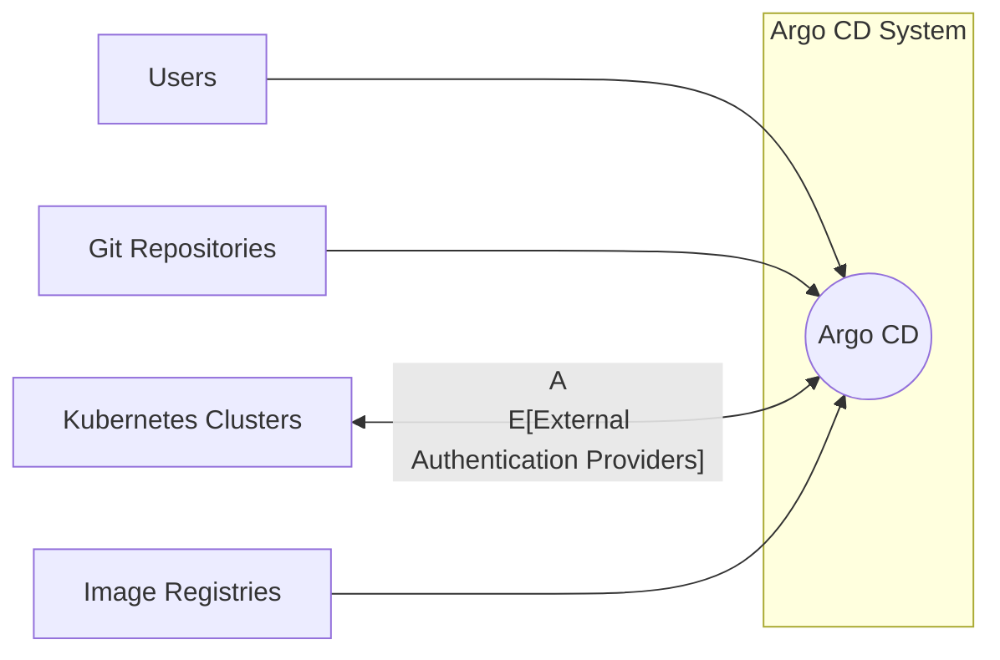
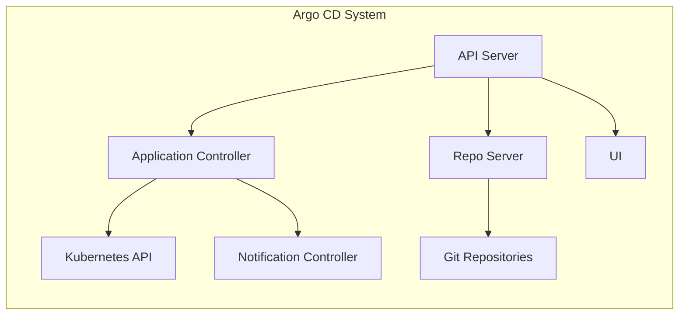
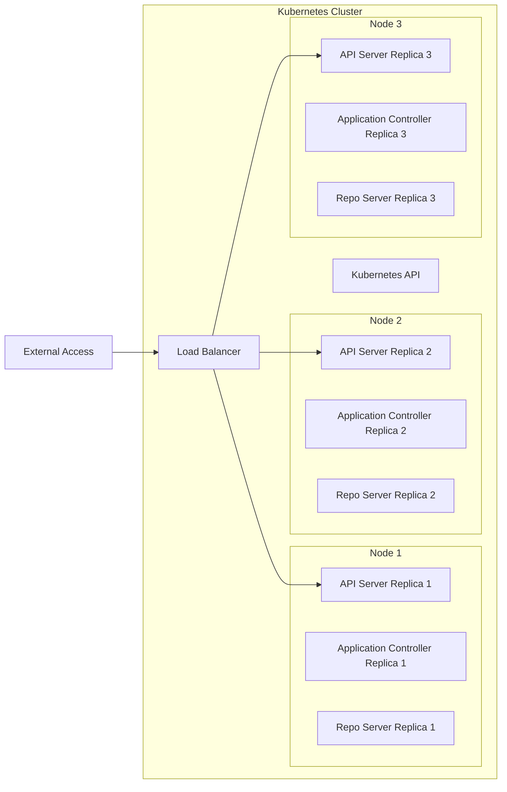

# BUSINESS POSTURE

Business Priorities and Goals:

*   Provide a declarative, GitOps-based continuous delivery solution for Kubernetes applications.
*   Automate the deployment of applications to Kubernetes clusters.
*   Enable developers to manage application deployments through Git.
*   Provide visibility and control over the application deployment process.
*   Ensure application deployments are consistent and reproducible.
*   Support multiple Kubernetes clusters and environments.
*   Integrate with existing CI/CD pipelines.
*   Offer a user-friendly interface for managing deployments.
*   Provide rollback capabilities for failed deployments.
*   Support various Kubernetes resource types and deployment strategies.

Most Important Business Risks:

*   Unauthorized access to Kubernetes clusters and applications.
*   Deployment of malicious or vulnerable applications.
*   Inconsistent application deployments across environments.
*   Lack of visibility into the deployment process.
*   Inability to recover from failed deployments.
*   Compromise of Git repositories containing application configurations.
*   Supply chain attacks targeting Argo CD or its dependencies.
*   Data breaches related to sensitive application data or secrets.
*   Denial of service attacks against Argo CD or deployed applications.
*   Non-compliance with regulatory requirements.

# SECURITY POSTURE

Existing Security Controls:

*   security control: Authentication via Dex, OIDC, or GitLab/GitHub/SAML. (Described in Argo CD documentation and configuration files).
*   security control: Role-Based Access Control (RBAC) to manage user permissions. (Described in Argo CD documentation and configuration files).
*   security control: HTTPS for secure communication. (Described in Argo CD documentation and configuration files).
*   security control: Integration with Kubernetes RBAC. (Described in Argo CD documentation and configuration files).
*   security control: Support for Kubernetes Secrets management. (Described in Argo CD documentation and configuration files).
*   security control: Audit logging of user actions and system events. (Described in Argo CD documentation and configuration files).
*   security control: Regular security updates and vulnerability patching. (Described in Argo CD release notes and security advisories).
*   security control: Use of minimal Docker base images to reduce attack surface. (Described in Argo CD Dockerfiles).

Accepted Risks:

*   accepted risk: Reliance on third-party authentication providers (e.g., Dex, OIDC providers).
*   accepted risk: Potential for misconfiguration of RBAC policies.
*   accepted risk: Exposure to vulnerabilities in Kubernetes itself.
*   accepted risk: Dependence on the security of the underlying Git infrastructure.

Recommended Security Controls:

*   security control: Implement network policies to restrict traffic to and from Argo CD pods.
*   security control: Enable two-factor authentication (2FA) for all users.
*   security control: Integrate with a secrets management solution (e.g., HashiCorp Vault) for enhanced secret protection.
*   security control: Regularly conduct penetration testing and security assessments.
*   security control: Implement a robust monitoring and alerting system to detect and respond to security incidents.
*   security control: Enforce strong password policies.
*   security control: Use a dedicated service account for Argo CD with minimal privileges.
*   security control: Regularly review and update RBAC policies.
*   security control: Implement image scanning to detect vulnerabilities in container images.
*   security control: Use signed commits in Git repositories.

Security Requirements:

*   Authentication:
    *   Support for multiple authentication providers (OIDC, SAML, LDAP, etc.).
    *   Integration with existing identity management systems.
    *   Enforcement of strong password policies.
    *   Support for multi-factor authentication.
*   Authorization:
    *   Fine-grained access control based on roles and permissions.
    *   Ability to restrict access to specific Kubernetes resources and namespaces.
    *   Integration with Kubernetes RBAC.
*   Input Validation:
    *   Validation of all user inputs to prevent injection attacks.
    *   Validation of Git repository URLs and commit hashes.
    *   Validation of Kubernetes manifests.
*   Cryptography:
    *   Use of TLS/SSL for all communication channels.
    *   Secure storage of sensitive data (e.g., API keys, passwords).
    *   Use of strong cryptographic algorithms.
    *   Key management best practices.

# DESIGN

## C4 CONTEXT



Element Descriptions:

*   Element:
    *   Name: Argo CD
    *   Type: System
    *   Description: The core Argo CD system responsible for continuous delivery.
    *   Responsibilities:
        *   Managing application deployments.
        *   Monitoring application state.
        *   Synchronizing application state with Git repositories.
        *   Providing a user interface and API.
    *   Security controls: Authentication, RBAC, HTTPS, Audit logging, Kubernetes Secrets management.

*   Element:
    *   Name: Users
    *   Type: Person
    *   Description: Developers, operators, and other users interacting with Argo CD.
    *   Responsibilities:
        *   Defining application configurations in Git.
        *   Managing application deployments through the Argo CD UI or API.
        *   Monitoring application status.
    *   Security controls: Authentication, RBAC.

*   Element:
    *   Name: Git Repositories
    *   Type: System
    *   Description: Repositories containing application configurations and manifests.
    *   Responsibilities:
        *   Storing application definitions.
        *   Providing version control for application configurations.
    *   Security controls: Access controls, commit signing, branch protection rules.

*   Element:
    *   Name: Kubernetes Clusters
    *   Type: System
    *   Description: Target clusters where applications are deployed.
    *   Responsibilities:
        *   Running application workloads.
        *   Providing container orchestration.
    *   Security controls: Kubernetes RBAC, network policies, pod security policies.

*   Element:
    *   Name: External Authentication Providers
    *   Type: System
    *   Description: Identity providers used for user authentication (e.g., Dex, OIDC, SAML).
    *   Responsibilities:
        *   Authenticating users.
        *   Providing user identity information.
    *   Security controls: Authentication protocols, secure communication.

*   Element:
    *   Name: Image Registries
    *   Type: System
    *   Description: Repositories containing container images.
    *   Responsibilities:
        *   Storing container images.
        *   Providing access to container images.
    *   Security controls: Access controls, image scanning, vulnerability management.

## C4 CONTAINER



Element Descriptions:

*   Element:
    *   Name: API Server
    *   Type: Container
    *   Description: Provides a REST API for interacting with Argo CD.
    *   Responsibilities:
        *   Handling API requests.
        *   Authenticating and authorizing users.
        *   Managing application resources.
    *   Security controls: Authentication, RBAC, HTTPS, input validation.

*   Element:
    *   Name: Application Controller
    *   Type: Container
    *   Description: Monitors application state and reconciles it with the desired state in Git.
    *   Responsibilities:
        *   Detecting changes in Git repositories.
        *   Applying changes to Kubernetes clusters.
        *   Monitoring application health.
    *   Security controls: Kubernetes RBAC, access to Kubernetes API.

*   Element:
    *   Name: Repo Server
    *   Type: Container
    *   Description: Fetches application manifests from Git repositories.
    *   Responsibilities:
        *   Cloning Git repositories.
        *   Generating Kubernetes manifests.
        *   Caching manifests.
    *   Security controls: Access to Git repositories, input validation.

*   Element:
    *   Name: UI
    *   Type: Container
    *   Description: Provides a web-based user interface for interacting with Argo CD.
    *   Responsibilities:
        *   Displaying application status.
        *   Providing controls for managing deployments.
        *   Visualizing application resources.
    *   Security controls: Authentication, RBAC, HTTPS.

*   Element:
    *   Name: Kubernetes API
    *   Type: External System
    *   Description: The API server of the target Kubernetes cluster.
    *   Responsibilities:
        *   Managing Kubernetes resources.
        *   Providing access to cluster state.
    *   Security controls: Kubernetes RBAC, network policies.

*   Element:
    *   Name: Git Repositories
    *   Type: External System
    *   Description: Repositories containing application configurations.
    *   Responsibilities:
        *   Storing application definitions.
        *   Providing version control.
    *   Security controls: Access controls, commit signing.

*   Element:
    *   Name: Notification Controller
    *   Type: Container
    *   Description: Sends notifications about application events.
    *   Responsibilities:
        *   Sending notifications to configured channels (e.g., Slack, email).
        *   Monitoring application events.
    *   Security controls: Access to notification services.

## DEPLOYMENT

Possible Deployment Solutions:

1.  **High Availability (HA) Deployment:** Multiple replicas of Argo CD components (API server, application controller, repo server) running across multiple Kubernetes nodes. This provides redundancy and fault tolerance.
2.  **Standard Deployment:** Single replicas of Argo CD components. Simpler to set up but less resilient.
3.  **Namespace-Scoped Deployment:** Argo CD deployed within a specific Kubernetes namespace, limiting its scope of operation.
4.  **Cluster-Scoped Deployment:** Argo CD deployed with cluster-wide access, allowing it to manage applications across all namespaces.

Chosen Solution (HA Deployment):



Element Descriptions:

*   Element:
    *   Name: API Server Replica 1/2/3
    *   Type: Container Instance
    *   Description: Replicas of the Argo CD API server.
    *   Responsibilities: Handling API requests, authentication, authorization.
    *   Security controls: Authentication, RBAC, HTTPS, input validation.

*   Element:
    *   Name: Application Controller Replica 1/2/3
    *   Type: Container Instance
    *   Description: Replicas of the Argo CD application controller.
    *   Responsibilities: Monitoring application state, reconciling with Git.
    *   Security controls: Kubernetes RBAC, access to Kubernetes API.

*   Element:
    *   Name: Repo Server Replica 1/2/3
    *   Type: Container Instance
    *   Description: Replicas of the Argo CD repo server.
    *   Responsibilities: Fetching manifests from Git.
    *   Security controls: Access to Git repositories, input validation.

*   Element:
    *   Name: Load Balancer
    *   Type: Infrastructure
    *   Description: Distributes traffic across API server replicas.
    *   Responsibilities: Load balancing, health checks.
    *   Security controls: HTTPS termination, access controls.

*   Element:
    *   Name: Kubernetes API
    *   Type: External System
    *   Description: The API server of the Kubernetes cluster.
    *   Responsibilities: Managing Kubernetes resources.
    *   Security controls: Kubernetes RBAC, network policies.

*   Element:
    *   Name: External Access
    *   Type: External User/System
    *   Description: Users or systems accessing Argo CD from outside the cluster.
    *   Responsibilities: Interacting with Argo CD.
    *   Security controls: Authentication, RBAC.

*   Element:
    *   Name: Node 1/2/3
    *   Type: Infrastructure
    *   Description: Kubernetes nodes hosting Argo CD components.
    *   Responsibilities: Running container workloads.
    *   Security controls: Node-level security, OS hardening.

## BUILD

Argo CD's build process is primarily managed through Makefiles and Dockerfiles. The build process leverages GitHub Actions for CI/CD.

```mermaid
graph LR
    A[Developer] --> B[GitHub Repository]
    B --> C[GitHub Actions]
    C --> D[Build (Make)]
    D --> E[Test (Unit, Integration)]
    E --> F[Build Docker Images]
    F --> G[Push to Image Registry]
    G --> H[Argo CD Release]
```

Build Process Description:

1.  **Developer:** Developers commit code changes to the Argo CD GitHub repository.
2.  **GitHub Repository:** The central repository for Argo CD source code.
3.  **GitHub Actions:** CI/CD pipelines triggered by events in the GitHub repository (e.g., push, pull request).
4.  **Build (Make):** The `make` command is used to compile the code, build binaries, and generate necessary artifacts.
5.  **Test (Unit, Integration):** Unit and integration tests are executed to ensure code quality and functionality.
6.  **Build Docker Images:** Dockerfiles are used to build container images for the various Argo CD components (API server, application controller, repo server).
7.  **Push to Image Registry:** The built container images are pushed to a container image registry (e.g., Docker Hub, Quay.io).
8.  **Argo CD Release:** New releases of Argo CD are created based on the built artifacts and container images.

Security Controls in Build Process:

*   security control: GitHub Actions workflows are defined in code and version-controlled, providing an audit trail.
*   security control: Use of signed commits in the Git repository.
*   security control: Automated testing (unit, integration) to identify bugs and vulnerabilities early.
*   security control: Use of minimal Docker base images to reduce the attack surface.
*   security control: Dependency management to track and update third-party libraries.
*   security control: Static analysis (linters, code quality checks) integrated into the build process.
*   security control: Secrets management (e.g., API keys, credentials) handled securely within GitHub Actions.
*   security control: Image signing (optional, but recommended) to ensure image integrity.
*   security control: Vulnerability scanning of container images (optional, but recommended) before pushing to the registry.

# RISK ASSESSMENT

Critical Business Processes:

*   Continuous Delivery of Applications: Argo CD is critical for automating and managing the deployment of applications to Kubernetes clusters. Any disruption to Argo CD can impact the ability to deploy new features, bug fixes, and security updates.
*   Application Management: Argo CD provides a central point of control for managing application configurations and deployments. Compromise of Argo CD could lead to unauthorized changes to applications.

Data Sensitivity:

*   Application Configurations (Low to High Sensitivity): Git repositories managed by Argo CD contain application configurations, which may include sensitive information such as database connection strings, API keys, and other secrets. The sensitivity depends on how secrets are managed (e.g., using Kubernetes Secrets, external secrets management solutions).
*   Kubernetes Credentials (High Sensitivity): Argo CD requires credentials to access Kubernetes clusters. These credentials must be protected to prevent unauthorized access to the clusters.
*   User Credentials (High Sensitivity): User credentials used to authenticate with Argo CD must be protected to prevent unauthorized access to the system.
*   Audit Logs (Medium Sensitivity): Audit logs contain information about user actions and system events, which can be valuable for security investigations.
*   Application Data (Varies): The sensitivity of application data depends on the specific applications being deployed. Argo CD itself does not directly handle application data, but it manages the deployment of applications that may process sensitive data.

# QUESTIONS & ASSUMPTIONS

Questions:

*   What specific secrets management solution is being used (or planned to be used) with Argo CD?
*   What are the specific network policies in place for the Kubernetes clusters where Argo CD is deployed?
*   What is the process for managing and rotating Kubernetes credentials used by Argo CD?
*   What are the specific requirements for audit logging and monitoring?
*   Are there any compliance requirements (e.g., PCI DSS, HIPAA) that need to be considered?
*   What is the disaster recovery plan for Argo CD?
*   What is the process for handling security vulnerabilities in Argo CD or its dependencies?
*   What level of access do developers have to the production Kubernetes clusters?

Assumptions:

*   BUSINESS POSTURE: The organization prioritizes the availability, integrity, and confidentiality of its applications and infrastructure.
*   BUSINESS POSTURE: The organization has a mature DevOps culture and practices.
*   BUSINESS POSTURE: The organization has a dedicated security team or personnel responsible for security.
*   SECURITY POSTURE: Kubernetes Secrets are used for managing sensitive application data.
*   SECURITY POSTURE: Basic network security measures (e.g., firewalls) are in place.
*   SECURITY POSTURE: Regular backups of Argo CD configuration and data are performed.
*   DESIGN: Argo CD is deployed in a Kubernetes cluster.
*   DESIGN: Argo CD is used to manage applications deployed in the same Kubernetes cluster where it is running.
*   DESIGN: Git repositories are used as the source of truth for application configurations.
*   DESIGN: Developers have limited access to production environments.