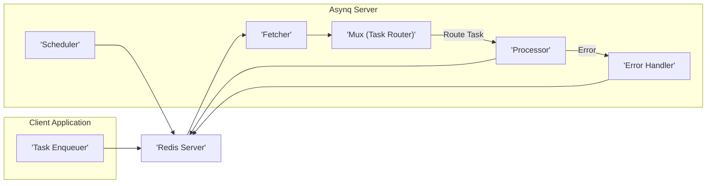
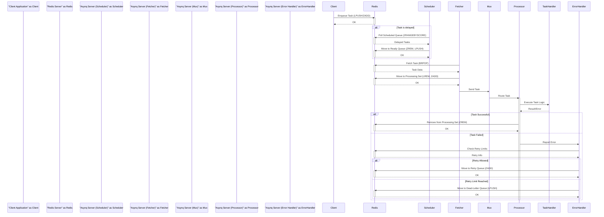

# Project Design Document: Asynq Task Queue

**Version:** 1.1
**Date:** October 26, 2023
**Author:** AI Software Architect

## 1. Introduction

This document provides an enhanced design overview of the Asynq task queue project, as found on GitHub at [https://github.com/hibiken/asynq](https://github.com/hibiken/asynq). This revised document aims to provide even greater clarity and detail regarding the system's architecture, components, and data flow, specifically to facilitate thorough threat modeling activities.

Asynq is a robust, lightweight, and in-process distributed task queue that leverages Redis as its reliable message broker. It is specifically designed for executing background jobs asynchronously, thereby significantly improving application responsiveness and efficiently handling long-running or resource-intensive tasks without blocking the main application flow.

## 2. Goals and Objectives

The core goals underpinning the design of Asynq are:

* **Highly Reliable Task Processing:** Guarantee that tasks are executed at least once, even in the face of transient failures or network issues. This includes robust retry mechanisms.
* **Efficient and Flexible Task Scheduling:** Provide versatile mechanisms for scheduling tasks for immediate execution or with specified delays, offering control over when tasks are processed.
* **Horizontal Scalability:** Enable the scaling of task processing capacity by adding more worker instances, distributing the workload effectively.
* **Comprehensive Observability:** Offer deep insights into the task queue's operational status, including key processing metrics, error rates, and queue lengths, facilitating monitoring and debugging.
* **Architectural Simplicity:** Maintain a clear and straightforward API and underlying architecture to promote ease of use, understanding, and maintainability.

## 3. System Architecture

Asynq employs a client-server architecture, critically relying on Redis for persistent storage of tasks and as the central message broker facilitating communication between components.

### 3.1. High-Level Components:

* **Client Application (Task Enqueuer):** This is the application code responsible for the creation of tasks and their subsequent enqueueing into the Asynq system.
* **Redis Server:** This serves as the central, persistent message broker for Asynq. It leverages Redis's powerful data structures to manage and store tasks.
* **Asynq Server:** This is the core processing unit of the system, responsible for fetching tasks from Redis, routing them to the appropriate handlers, and executing them. It comprises several key sub-components.
    * **Scheduler:** This component is responsible for monitoring delayed tasks and moving them to the ready queue at their designated execution time.
    * **Fetcher:** This component continuously retrieves tasks from the various Redis queues (ready, retry, scheduled) based on availability and priority.
    * **Processor:** This component is responsible for executing the actual task handler function associated with a given task.
    * **Mux (Task Router):** This component acts as a router, directing incoming tasks to the correct processor based on the task type.
    * **Error Handler:** This component manages task failures, implementing retry policies and handling tasks that exceed their retry limits.

## 4. Detailed Component Description

### 4.1. Client Application (Task Enqueuer)

* **Functionality:**
    * Constructs task payloads, encapsulating all the necessary data required for processing the task.
    * Enqueues these tasks into specific queues within Redis using the Asynq client library, specifying the target queue.
    * Configures task options such as priority levels, execution delays, and the maximum number of retry attempts.
* **Key Interactions:**
    * Establishes a connection with the Redis server to interact with it.
    * Utilizes Redis commands like `LPUSH` (to add to the ready queue) and `ZADD` (to add to sorted sets like the scheduled or retry queues).

### 4.2. Redis Server

* **Functionality:**
    * Acts as the central message broker, providing persistent storage for all tasks within the system.
    * Offers various data structures crucial for managing different task queues, ensuring proper ordering and retrieval.
    * Facilitates seamless communication and coordination between the client application and the Asynq server instances.
* **Key Data Structures Used by Asynq:**
    * **Ready Queue (List):**  Contains tasks that are immediately available and ready for processing by worker instances.
    * **Retry Queue (Sorted Set):** Holds tasks that have failed during processing and are scheduled for a subsequent retry attempt. The score in the sorted set represents the timestamp for the next retry.
    * **Scheduled Queue (Sorted Set):** Stores tasks that are scheduled for execution at a future time. The score represents the intended execution timestamp.
    * **Dead-Letter Queue (List):** Contains tasks that have failed irrecoverably, exceeding their defined retry limits or encountering fatal errors during processing.
    * **Processing Set (Sorted Set):**  Temporarily holds tasks that are currently being actively processed by worker instances. This is used for tracking and recovery in case of worker failures.
    * **Pause Set (Set):**  Allows for the pausing of specific queues, preventing tasks in those queues from being processed.

### 4.3. Asynq Server

#### 4.3.1. Scheduler

* **Functionality:**
    * Periodically polls the Redis scheduled queue to identify tasks whose scheduled execution time has arrived.
    * Moves these eligible tasks from the scheduled queue to the ready queue, making them available for immediate processing.
* **Key Interactions:**
    * Connects to the Redis server to access and manipulate task queues.
    * Uses Redis commands such as `ZRANGEBYSCORE` (to find tasks ready for execution), `ZREM` (to remove tasks from the scheduled queue), and `LPUSH` (to add tasks to the ready queue).

#### 4.3.2. Fetcher

* **Functionality:**
    * Continuously monitors Redis for new tasks available in the ready queue.
    * Implements a priority-based fetching mechanism when multiple queues with different priorities are configured, ensuring higher-priority tasks are processed first.
    * Upon fetching a task, it moves it from the ready queue to the processing set, indicating that a worker is actively working on it.
* **Key Interactions:**
    * Connects to Redis to retrieve and manage tasks.
    * Uses Redis commands like `BRPOP` (to atomically retrieve and remove a task from the ready queue), `LREM` (to remove from the ready queue if `BRPOP` isn't used), and `ZADD` (to add the task to the processing set).

#### 4.3.3. Processor

* **Functionality:**
    * Receives tasks from the fetcher component.
    * Executes the specific task handler function that has been registered for the given task type.
    * Handles the outcome of the task execution, whether it completes successfully or encounters an error.
* **Key Interactions:**
    * Invokes the user-defined task handler functions, passing the task payload as an argument.
    * Interacts with Redis to update the task's status, removing it from the processing set upon successful completion or triggering error handling upon failure.

#### 4.3.4. Mux (Task Router)

* **Functionality:**
    * Receives tasks from the fetcher component.
    * Examines the task type specified within the task payload.
    * Routes the task to the appropriate processor instance that has been registered to handle that specific task type.
    * Ensures that a corresponding handler exists for each received task type, preventing unhandled tasks.
* **Key Interactions:**
    * Maintains an internal mapping or registry of task types to their corresponding handler functions.

#### 4.3.5. Error Handler

* **Functionality:**
    * Manages errors that occur during the processing of tasks.
    * Implements configurable retry logic based on the task's options, including maximum retry attempts and backoff strategies (e.g., exponential backoff).
    * Moves failed tasks to the retry queue for a subsequent attempt or to the dead-letter queue if the retry limit is exceeded.
* **Key Interactions:**
    * Interacts with Redis to move tasks between different queues, using commands like `ZADD` (to add to the retry queue with a retry timestamp) and `LPUSH` (to add to the dead-letter queue).

## 5. Data Flow

The typical lifecycle of a task within Asynq involves the following steps:

1. **Task Enqueueing:** The client application creates a task, including its payload and any specific options, and enqueues it into Redis. Depending on whether a delay is specified, the task is added to either the ready queue for immediate processing or the scheduled queue for later execution.
2. **Task Scheduling (if delayed):** The scheduler component periodically checks the scheduled queue in Redis. When the scheduled execution time for a task arrives, the scheduler moves that task from the scheduled queue to the ready queue.
3. **Task Fetching:** The fetcher component continuously monitors the ready queue in Redis for available tasks. Upon finding a task, it retrieves it and moves it to the processing set, indicating that a worker has picked it up.
4. **Task Routing:** The mux component receives the fetched task and examines its type. Based on the task type, it routes the task to the appropriate processor instance that is registered to handle that specific type of task.
5. **Task Processing:** The designated processor component executes the registered handler function for the task, performing the intended business logic.
6. **Task Completion or Failure:**
    * **Success:** If the task is executed successfully, the processor removes it from the processing set in Redis, marking the task as completed.
    * **Failure:** If the task encounters an error during processing, the processor reports the error to the error handler. The error handler then consults the task's retry options.
        * **Retry:** If retries are allowed and the retry limit has not been reached, the error handler moves the task to the retry queue with a timestamp calculated based on the configured backoff strategy.
        * **Dead-Letter:** If the retry limit is reached or a fatal error occurs that prevents further retries, the error handler moves the task to the dead-letter queue for manual inspection or archival.

## 6. Security Considerations

This section details crucial security considerations for the Asynq project, providing a basis for comprehensive threat modeling.

* **Redis Security:**  Asynq's security is heavily reliant on the security posture of the underlying Redis instance.
    * **Authentication:**  Enforcing strong authentication using Redis's `requirepass` directive is paramount to prevent unauthorized access to task data and manipulation of the task queues. Without this, any network-accessible client could potentially interfere with task processing.
    * **Network Security:**  Implementing robust network security measures, such as firewalls, is essential to restrict access to the Redis server to only authorized Asynq components. Consider using TLS encryption (via `stunnel` or similar) for all communication between Asynq components and the Redis server to protect data in transit.
    * **Data Confidentiality:** Task payloads may contain sensitive information. Employing encryption at rest for Redis (if supported by the Redis deployment) and considering application-level encryption of sensitive data within task payloads is crucial.
* **Task Handler Security:** The security of the task handlers themselves is a critical concern.
    * **Code Injection Vulnerabilities:**  Thoroughly sanitize and validate all input data received within task handlers to prevent various code injection attacks (e.g., SQL injection, command injection).
    * **Resource Exhaustion:**  Implement safeguards to prevent malicious or poorly written task handlers from consuming excessive system resources (CPU, memory, network), potentially leading to denial-of-service conditions. This might involve setting resource limits or timeouts for task execution.
* **Access Control:** Implementing proper access controls is vital to ensure only authorized entities can interact with Asynq.
    * **Authorization for Task Enqueueing:**  Consider mechanisms to control which clients or services are permitted to enqueue specific types of tasks. This could involve API keys, authentication tokens, or network-level restrictions.
    * **Internal Access Control:** Restrict access to the Asynq server instances and their configuration files to prevent unauthorized modifications or access to sensitive information.
* **Denial of Service (DoS) Attacks:** Asynq is susceptible to various DoS attacks.
    * **Queue Overflow:**  Implement mechanisms to limit the size of the task queues to prevent a malicious actor from flooding the system with an overwhelming number of tasks, which could exhaust resources and prevent legitimate tasks from being processed. Monitoring queue lengths and implementing alerts is crucial.
    * **Task Processing Bottlenecks:**  Carefully review task handler logic to identify potential performance bottlenecks that could be exploited to slow down task processing or cause resource exhaustion.
* **Monitoring and Logging:** Comprehensive monitoring and logging are essential for security auditing and incident response.
    * **Security Auditing:** Implement detailed logging of task enqueueing, processing attempts (including failures and retries), and any errors encountered. This log data can be invaluable for identifying suspicious activity or security breaches.
    * **Alerting:** Configure alerts for unusual patterns, such as a sudden surge in task enqueueing, a high rate of task failures, or access attempts from unauthorized sources.
* **Dependency Management:** Maintaining up-to-date dependencies is crucial for security.
    * Regularly audit and update all dependencies, including the Redis client library and any other libraries used by Asynq, to patch known security vulnerabilities.

## 7. Deployment Considerations

Asynq offers flexibility in deployment scenarios:

* **Single Instance Deployment:**  Suitable for development or low-traffic applications, where the Asynq server and the client application can reside on the same machine, connecting to a locally hosted Redis instance.
* **Distributed Worker Deployment:**  For applications requiring higher throughput and improved resilience, multiple Asynq server instances (workers) can be deployed. All workers connect to the same central Redis instance, enabling parallel processing of tasks and distributing the workload.
* **Cloud Environment Deployment:**  Asynq is well-suited for deployment in cloud environments, often leveraging containerization technologies like Docker and orchestration platforms such as Kubernetes. Managed Redis services offered by cloud providers are commonly used in these deployments for enhanced reliability and scalability.

## 8. Future Considerations

* **Enhanced Monitoring and Observability Integrations:**  Explore deeper integration with industry-standard monitoring tools like Prometheus and visualization platforms like Grafana to provide more granular and insightful metrics on queue performance, resource utilization, and overall system health.
* **Web-Based User Interface (UI):**  Consider developing or integrating with a web-based UI to simplify task management operations, provide real-time monitoring dashboards, and facilitate easier analysis of task failures and dead-letter queues.
* **Advanced Message Prioritization Schemes:**  Investigate and potentially implement more sophisticated task prioritization mechanisms beyond basic queue ordering, allowing for more fine-grained control over task execution order based on various criteria.
* **Integration with Distributed Tracing Systems:**  Explore integration with distributed tracing systems (e.g., Jaeger, Zipkin) to enable end-to-end tracking of tasks as they move through different services and components, aiding in performance analysis and debugging of complex workflows.

This enhanced document provides a more detailed and comprehensive design overview of the Asynq task queue project, with a stronger emphasis on security considerations. It serves as a robust foundation for understanding the system's architecture and will be highly valuable for conducting thorough threat modeling activities.