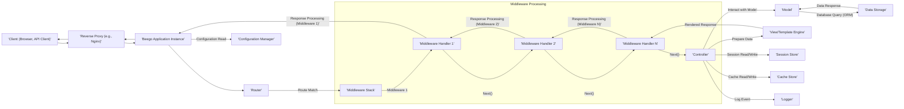

# Project Design Document: Beego Web Framework (Improved)

**Version:** 1.1
**Date:** October 26, 2023
**Author:** AI Software Architect

## 1. Introduction

This document provides an enhanced architectural design of the Beego web framework, specifically tailored for comprehensive threat modeling. Building upon the previous version, this iteration offers more granular detail on components, data flows, and potential security considerations. The aim is to provide security engineers and developers with an even more robust foundation for identifying and mitigating potential vulnerabilities within Beego-based applications.

### 1.1. Purpose

The primary purpose remains to furnish a detailed understanding of the Beego framework's architecture to facilitate thorough security analysis and threat identification. This improved document aims to provide a more nuanced view of the framework's inner workings, enabling more precise and effective threat modeling exercises.

### 1.2. Scope

This document encompasses the core architectural elements of the Beego framework and their interactions within a typical web application context. It delves deeper into specific aspects like middleware processing and data handling nuances. The focus remains on the framework itself, not individual applications built with it.

### 1.3. Target Audience

The target audience remains consistent:

*   Security engineers and architects
*   Developers working with the Beego framework
*   Individuals involved in threat modeling and security assessments

## 2. Overview of Beego

Beego is a high-productivity web framework for the Go language, drawing inspiration from Django. It offers a comprehensive suite of features for building web applications, RESTful APIs, and backend services efficiently. Key features include:

*   Model-View-Controller (MVC) architectural pattern
*   Object-Relational Mapper (ORM) with support for various databases
*   Built-in template engine for dynamic content generation
*   Robust session management capabilities
*   Flexible caching mechanisms
*   Comprehensive logging facilities
*   Asynchronous task queue management
*   Extensible middleware support

## 3. System Architecture

This section provides a more detailed breakdown of the components within a Beego application and their interactions.

### 3.1. Components

*   **Client (User Agent):** The entity initiating the request (e.g., web browser, mobile app, API client).
*   **Reverse Proxy/Load Balancer:** (Optional but common) Handles incoming traffic, SSL termination, and distributes requests across multiple instances. Examples include Nginx and HAProxy.
*   **Beego Application Instance:** A running instance of the Go application built with the Beego framework.
*   **Router:**  The central dispatcher, responsible for mapping incoming HTTP requests to specific controller actions based on defined URL patterns and HTTP methods.
*   **Middleware Stack:** An ordered chain of handlers that intercept and process requests before they reach the controller and responses before they are sent back to the client. Middleware can handle tasks like:
    *   Authentication
    *   Authorization
    *   Logging
    *   Request/Response modification
    *   CORS handling
    *   Error handling
*   **Controller:**  The handler for specific requests. It receives input, interacts with models, and prepares data for the view.
*   **Model:** Represents the application's data structure and provides an interface for data access and manipulation, often interacting with the ORM.
*   **View/Template Engine:** Responsible for rendering dynamic content using templates and data provided by the controller. Beego supports various template engines.
*   **Object-Relational Mapper (ORM):**  Abstracts database interactions, allowing developers to work with Go objects instead of raw SQL. Supports various database systems.
*   **Session Manager:** Manages user session data, typically stored in memory, files, cookies, or external stores like Redis or databases.
*   **Cache Manager:** Provides mechanisms for storing and retrieving frequently accessed data to improve performance. Supports various caching backends.
*   **Configuration Manager:**  Handles loading and managing application configuration settings from files (e.g., `app.conf`), environment variables, or other sources.
*   **Logger:**  Records application events, errors, and debugging information to various outputs (e.g., files, console).
*   **Data Storage:** The underlying database system (e.g., MySQL, PostgreSQL, MongoDB) where application data is persisted.
*   **External Services:**  Other services the Beego application might interact with (e.g., payment gateways, third-party APIs).

### 3.2. Interactions and Data Flow

**Detailed Data Flow Description:**

1. A **Client** initiates an HTTP request.
2. The request is received by the **Reverse Proxy/Load Balancer** (if present).
3. The reverse proxy forwards the request to a specific **Beego Application Instance**.
4. The **Router** component analyzes the request URL and method to determine the matching route.
5. The request is then passed through the **Middleware Stack**. Each middleware handler in the stack can:
    *   Inspect and modify the request.
    *   Perform authentication and authorization checks.
    *   Log request details.
    *   Handle errors.
    *   Short-circuit the request and return a response directly.
6. If no middleware short-circuits the request, it reaches the designated **Controller**.
7. The **Controller** processes the request:
    *   It may interact with the **Model** to retrieve or manipulate data.
    *   The **Model** uses the **ORM** to interact with the **Data Storage**.
    *   The **Controller** might read configuration from the **Configuration Manager**.
    *   It may interact with the **Session Store** to manage user sessions.
    *   It might also interact with the **Cache Store** to retrieve or store cached data.
    *   The **Logger** is used to record events.
8. The **Controller** prepares data to be rendered by the **View/Template Engine**.
9. The **View/Template Engine** generates the response (e.g., HTML, JSON).
10. The response is passed back through the **Middleware Stack** in reverse order. Middleware can:
    *   Modify the response.
    *   Add headers.
    *   Perform final logging.
11. The **Beego Application Instance** sends the response back to the **Reverse Proxy/Load Balancer**.
12. The reverse proxy forwards the response to the **Client**.

## 4. Key Data Flows for Threat Modeling

This section highlights critical data flows from a security perspective, providing specific examples.

*   **User Authentication Flow:**
    *   Client submits login credentials (username/password) via a form or API request.
    *   Router directs the request to the authentication controller.
    *   Authentication middleware might intercept the request.
    *   Controller retrieves user credentials.
    *   Controller interacts with the Model to verify credentials against the user database (potentially hashing the provided password and comparing it to the stored hash).
    *   Upon successful authentication, the Session Manager creates a new session and stores session data in the Session Store.
    *   A session identifier (e.g., a cookie) is sent to the client.
*   **Handling User Input:**
    *   Client submits data through forms, API requests (JSON, XML, etc.), or URL parameters.
    *   Router directs the request to the appropriate Controller.
    *   Middleware might perform initial input validation or sanitization.
    *   Controller receives and processes the input data.
    *   Data is often validated and sanitized again within the controller before being used in business logic or database queries.
    *   Controller interacts with the Model to store or update data in the Data Storage.
*   **Rendering Dynamic Content:**
    *   Controller retrieves data from the Model or other sources.
    *   Controller passes data to the View/Template Engine.
    *   The template engine processes the template, embedding the provided data.
    *   The rendered output (e.g., HTML) is sent back to the client.
*   **Session Management Lifecycle:**
    *   Each subsequent request from the client includes the session identifier.
    *   Middleware or the Controller retrieves the session data from the Session Store using the identifier.
    *   Session data is used to maintain user state (e.g., logged-in status, user preferences).
    *   Session data might be updated or destroyed during the request lifecycle (e.g., logout).
*   **File Upload Process:**
    *   Client uploads a file through a form.
    *   Router directs the request to the file upload controller.
    *   Middleware might handle file size limits or basic type checks.
    *   Controller receives the file upload.
    *   The file is typically stored on the server's file system or in cloud storage.
    *   Metadata about the file might be stored in the Data Storage.

## 5. External Dependencies

Beego applications commonly interact with the following external components:

*   **Relational Databases:** MySQL, PostgreSQL, MariaDB (accessed via the ORM).
*   **NoSQL Databases:** MongoDB (accessed via specific drivers or ORM extensions).
*   **Caching Systems:** Redis, Memcached (for improving performance).
*   **Session Stores:** Redis, Memcached, database systems, file system (for persistent session storage).
*   **Message Brokers:** RabbitMQ, Kafka (for asynchronous task processing and communication).
*   **Email Servers (SMTP):** For sending email notifications.
*   **Cloud Storage Providers:** AWS S3, Google Cloud Storage, Azure Blob Storage (for storing files and assets).
*   **Third-Party APIs:** External services for various functionalities (e.g., payment processing, social media integration).

## 6. Security Considerations (Detailed for Threat Modeling)

This section expands on potential security vulnerabilities based on the Beego architecture.

*   **Input Validation Vulnerabilities:**
    *   **Cross-Site Scripting (XSS):** Failure to sanitize user input before rendering it in templates can allow attackers to inject malicious scripts.
    *   **SQL Injection:** Improperly sanitized user input used in database queries can allow attackers to execute arbitrary SQL commands.
    *   **Command Injection:**  If user input is used to construct system commands without proper sanitization, attackers can execute arbitrary commands on the server.
    *   **Path Traversal:**  Insufficient validation of file paths provided by users can allow access to unauthorized files.
*   **Authentication and Authorization Weaknesses:**
    *   **Broken Authentication:** Weak password policies, insecure storage of credentials, or vulnerabilities in the authentication logic.
    *   **Broken Authorization:**  Failure to properly enforce access controls, allowing users to access resources they shouldn't.
    *   **Session Fixation:**  Allowing attackers to hijack a user's session by providing them with a valid session ID.
    *   **Insufficient Session Expiration:**  Sessions that remain active for too long increase the risk of unauthorized access.
*   **Cross-Site Request Forgery (CSRF):**  Lack of proper CSRF protection allows attackers to trick users into performing unintended actions on the application.
*   **Template Injection:**  If user-controlled data is directly embedded into template code without proper escaping, attackers can execute arbitrary code on the server.
*   **File Upload Vulnerabilities:**
    *   **Unrestricted File Upload:** Allowing users to upload any type of file can lead to malicious file uploads (e.g., web shells).
    *   **Lack of File Content Validation:**  Not validating the content of uploaded files can allow malicious content to be stored and potentially executed.
    *   **Path Manipulation:**  Attackers might manipulate file paths during upload to overwrite critical files.
*   **Dependency Vulnerabilities:**  Using outdated or vulnerable third-party libraries can introduce security risks.
*   **Logging and Error Handling Issues:**
    *   **Information Disclosure:**  Logging sensitive information (e.g., passwords, API keys) can expose it to attackers.
    *   **Verbose Error Messages:**  Displaying detailed error messages to users can reveal information about the application's internal workings.
*   **Security Misconfiguration:**
    *   **Default Credentials:**  Using default credentials for databases or other services.
    *   **Open Ports and Services:**  Exposing unnecessary ports and services.
    *   **Lack of Security Headers:**  Missing security headers (e.g., `Strict-Transport-Security`, `X-Frame-Options`) can leave the application vulnerable to certain attacks.
*   **Denial of Service (DoS):**  Vulnerabilities that allow attackers to overwhelm the application with requests, making it unavailable to legitimate users.

## 7. Assumptions and Constraints

*   This document assumes a standard web application deployment model for Beego.
*   The analysis focuses on the inherent security characteristics of the Beego framework itself. Security of applications built with Beego also depends on developer practices.
*   The information is based on the publicly available documentation and source code of Beego at the time of writing.

## 8. Future Considerations

*   Detailed analysis of specific Beego middleware implementations and their security implications.
*   Evaluation of Beego's built-in security features and recommendations for their effective use.
*   Assessment of common deployment configurations and associated security risks and mitigations.
*   Integration of security scanning tools and static/dynamic analysis techniques for Beego applications.
*   Regular updates to this document to reflect changes in the Beego framework and emerging security threats.
