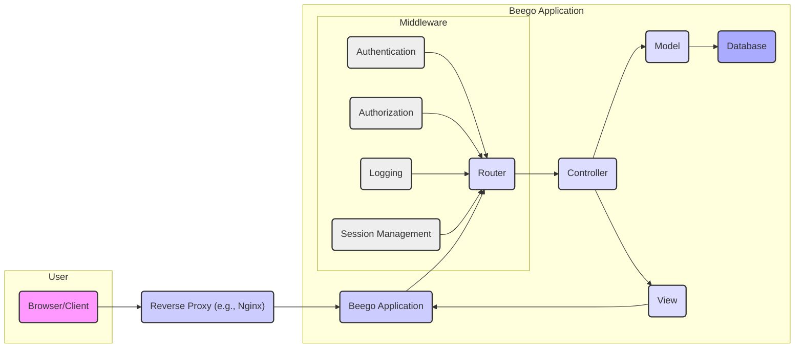
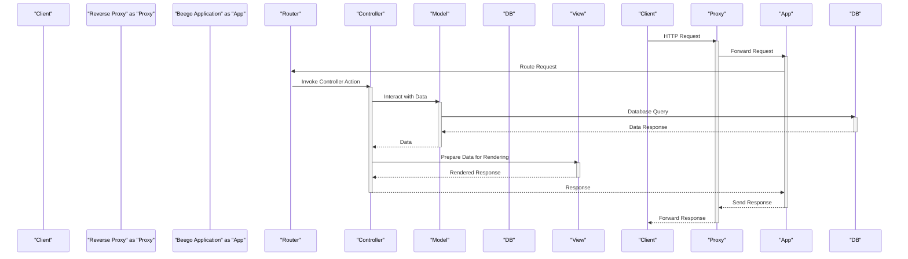

# Project Design Document: Beego Web Framework

**Version:** 1.1
**Date:** October 26, 2023
**Author:** AI Software Architect

## 1. Introduction

This document provides a detailed design overview of the Beego web framework, an open-source, high-performance web framework written in Go. This document aims to provide a comprehensive understanding of Beego's architecture, components, and data flow, which will serve as the foundation for subsequent threat modeling activities. This revision incorporates minor clarifications and ensures adherence to specified formatting guidelines.

## 2. Goals and Objectives

The primary goals of this design document are to:

*   Clearly articulate the architecture and key components of the Beego framework.
*   Describe the interactions and data flow between different components.
*   Identify potential areas of interest for security analysis and threat modeling.
*   Provide a structured and detailed reference for security engineers and developers.

## 3. System Architecture

Beego follows a traditional Model-View-Controller (MVC) architectural pattern. It provides a set of features and tools to build web applications efficiently.

### 3.1. High-Level Architecture

### 3.2. Component Description

*   **Browser/Client:** The user's web browser or any other client application making requests to the Beego application.
*   **Reverse Proxy (e.g., Nginx):** An optional but common component that sits in front of the Beego application. It handles tasks like SSL/TLS termination, load balancing, and serving static files.
*   **Beego Application:** The core of the system, built using the Beego framework.
    *   **Router:** Responsible for mapping incoming HTTP requests to specific controller actions based on defined routes. This component handles URL parsing and route matching.
    *   **Controller:** Handles the application's business logic, receives user input from the request, interacts with the model to manage data, and prepares data for the view to render the response.
    *   **Model:** Represents the data structure of the application and handles interactions with the data storage layer (e.g., database). It encapsulates the application's data and the logic to manipulate that data.
    *   **View:** Responsible for rendering the user interface, typically generating HTML, JSON, or XML responses based on data provided by the controller. This separates the presentation logic from the business logic.
    *   **Middleware:** Functions that intercept HTTP requests and responses to perform cross-cutting concerns like authentication, authorization, logging, and session management. Middleware functions are executed in a defined order.
        *   **Authentication:** Verifies the identity of the user making the request, typically by checking credentials.
        *   **Authorization:** Determines if an authenticated user has the necessary permissions to access a specific resource or perform an action.
        *   **Logging:** Records events and activities within the application, including request details, errors, and security-related events, for monitoring and debugging purposes.
        *   **Session Management:** Manages user sessions to maintain state across multiple requests, allowing the application to remember user preferences and login status.
    *   **Database:** The persistent storage for the application's data. Beego supports various database systems through its ORM (Object-Relational Mapper).

## 4. Data Flow

The typical data flow for a request in a Beego application is as follows:

1. A user sends an HTTP request from their **Browser/Client**.
2. The request is received by the **Reverse Proxy** (if present). The reverse proxy might perform actions like SSL/TLS termination, load balancing, request routing, and caching.
3. The request is forwarded to the **Beego Application**.
4. The **Router** analyzes the request URL and matches it to a defined route. This involves pattern matching against the configured routes.
5. The **Router** invokes the corresponding action in the **Controller**.
6. The **Controller** processes the request:
    *   It may interact with the **Model** to retrieve or manipulate data from the **Database**.
    *   It performs business logic based on the request parameters and application state.
7. The **Model** interacts with the **Database** to perform data operations (CRUD - Create, Read, Update, Delete). This interaction is often facilitated by Beego's ORM.
8. The **Controller** prepares the data to be presented to the user. This might involve data transformation or aggregation.
9. The **Controller** passes the data to the **View**.
10. The **View** renders the response, typically generating HTML, JSON, or XML. The rendering process uses the provided data to dynamically create the output.
11. The rendered response is sent back to the **Beego Application**.
12. The **Beego Application** sends the response back to the **Reverse Proxy** (if present).
13. The **Reverse Proxy** forwards the response to the **Browser/Client**.
14. The **Browser/Client** displays the response to the user.

**Data Flow Diagram:**

## 5. Security Considerations

This section outlines potential areas of security concern within the Beego framework. These points will be further explored during the threat modeling process.

*   **Input Validation:** Ensuring that all user-provided input, whether from forms, URLs, or APIs, is rigorously validated to prevent injection attacks such as SQL injection, Cross-Site Scripting (XSS), and command injection. Implement both client-side and server-side validation.
*   **Authentication and Authorization:** Implementing robust authentication mechanisms to verify user identities and fine-grained authorization controls to ensure users only access resources they are permitted to. Consider using established protocols like OAuth 2.0 or OpenID Connect.
*   **Session Management:**  Implementing secure session handling practices, including using secure and HTTP-only cookies, setting appropriate session timeouts, and regenerating session IDs after successful login to prevent session hijacking and fixation attacks.
*   **Cross-Site Request Forgery (CSRF) Protection:** Implementing CSRF protection mechanisms, such as synchronizer tokens, to prevent malicious websites from making unauthorized requests on behalf of authenticated users.
*   **Output Encoding:** Properly encoding data before rendering it in views to prevent XSS vulnerabilities. This includes escaping HTML characters, JavaScript, and URLs based on the context.
*   **Database Security:**  Securely configuring the database server, using parameterized queries or ORM features to prevent SQL injection, and implementing appropriate access controls to the database.
*   **Dependency Management:**  Regularly reviewing and updating dependencies to patch known security vulnerabilities. Utilize dependency scanning tools to identify potential risks.
*   **Error Handling and Logging:**  Implementing secure error handling to avoid leaking sensitive information in error messages. Implement comprehensive logging for security auditing and intrusion detection, ensuring sensitive data is not logged.
*   **File Upload Security:**  Securely handling file uploads by validating file types and sizes, sanitizing file names, and storing uploaded files in a secure location with restricted access. Prevent path traversal vulnerabilities.
*   **API Security (if applicable):**  Implementing security measures for any APIs exposed by the application, such as authentication (API keys, OAuth 2.0), authorization, rate limiting to prevent abuse, and input validation.
*   **Middleware Security:** Ensuring the security of both custom and built-in middleware components. Regularly review and audit middleware for potential vulnerabilities.
*   **Security Headers:**  Configuring appropriate security headers (e.g., Content Security Policy, HTTP Strict Transport Security, X-Frame-Options, X-Content-Type-Options) to enhance the application's security posture.

## 6. Deployment Considerations

Beego applications are typically deployed as standalone executables. Common deployment scenarios include:

*   **Directly on a server:** The Beego application runs directly on a server, often behind a reverse proxy like Nginx or Apache, which handles tasks like SSL/TLS termination and load balancing.
*   **Containerized environments (e.g., Docker, Kubernetes):**  Deploying the application within containers for improved scalability, portability, and resource management. Container images should be built securely.
*   **Cloud platforms (e.g., AWS, Google Cloud, Azure):** Utilizing cloud services for infrastructure and deployment, leveraging features like auto-scaling, managed databases, and security services. Ensure proper configuration of cloud resources.

The deployment environment introduces additional security considerations, such as network security (firewalls, network segmentation), access control (IAM roles and permissions), and infrastructure hardening. Secure configuration of the deployment environment is crucial.

## 7. Future Considerations

*   **Microservices Architecture:**  Exploring the potential for breaking down the application into smaller, independent services to improve scalability, maintainability, and fault isolation.
*   **GraphQL Integration:**  Considering the integration of GraphQL for more flexible and efficient data querying, potentially as an alternative or complement to RESTful APIs.
*   **Real-time Communication:**  Investigating the use of WebSockets or other real-time communication technologies for features requiring bidirectional communication between the server and clients.
*   **Improved Testing and Security Auditing Tools Integration:** Exploring and integrating advanced testing frameworks and security auditing tools into the development pipeline for continuous security assessment.

This document provides a foundational understanding of the Beego framework's design. It will be used as a key input for the subsequent threat modeling process, where potential security vulnerabilities will be identified, analyzed, and mitigated.