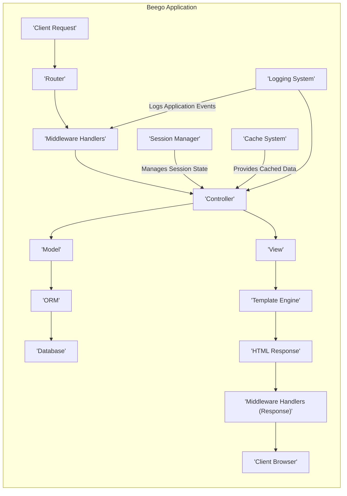
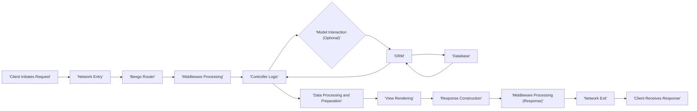

# Project Design Document: Beego Web Framework

**Version:** 1.1
**Date:** October 26, 2023
**Author:** AI Software Architect

## 1. Introduction

This document provides an enhanced design overview of the Beego web framework, an open-source, high-performance framework for building web applications in Go. It aims to clearly articulate the framework's architecture, key components, and data flow, specifically for use in subsequent threat modeling exercises. The focus is on providing a detailed yet concise understanding of the system's inner workings to facilitate the identification of potential security vulnerabilities.

This document serves as the primary reference for understanding the system's design from a security perspective.

## 2. System Architecture

Beego implements the Model-View-Controller (MVC) pattern to structure web applications. The following components are central to its architecture:

### 2.1 Core Components

*   **Router:**  The entry point for incoming HTTP requests. It analyzes the request URL and directs it to the appropriate controller action based on predefined routing rules.
*   **Controller:**  Responsible for handling specific business logic related to incoming requests. It receives input from the router, interacts with the model to retrieve or modify data, and prepares data for the view.
*   **Model:** Represents the data structure of the application and encapsulates the logic for interacting with the data storage layer. Beego's ORM simplifies database interactions.
*   **View:**  Handles the presentation layer, rendering dynamic web pages using templates and data provided by the controller.
*   **ORM (Object-Relational Mapper):**  Provides an abstraction layer for database interactions, allowing developers to work with data using Go objects rather than raw SQL queries. It supports various database systems.
*   **Session Management:**  Manages user sessions, storing and retrieving user-specific data across multiple requests. This is crucial for maintaining user state and implementing authentication.
*   **Cache System:** Offers mechanisms to store frequently accessed data in memory or other fast storage, reducing database load and improving application performance.
*   **Logging System:**  Provides facilities for recording application events, errors, and debugging information. This is essential for monitoring and security auditing.
*   **Configuration Manager:**  Handles the loading and management of application settings from various sources (e.g., configuration files, environment variables).
*   **Context:**  A per-request object that holds request-specific information, such as request and response objects, user session data, and other relevant details.
*   **Middleware Handlers:**  Functions that intercept HTTP requests and responses, enabling cross-cutting concerns like authentication, authorization, request logging, and data transformation. Middleware forms a pipeline through which requests pass.
*   **Task Queue/Background Jobs:**  Enables the execution of asynchronous tasks, improving responsiveness by offloading long-running operations.
*   **WebSocket Handler:**  Provides support for establishing persistent, bidirectional communication channels between the server and clients.

### 2.2 Component Interactions

A typical HTTP request processed by a Beego application follows these steps:

1. A **Client Request** arrives at the server.
2. The **Router** receives the request and uses its defined routes to determine the appropriate **Controller** action.
3. **Middleware Handlers** configured for the route are executed in order, potentially modifying the request or response. This can include authentication checks, logging, etc.
4. The designated **Controller** action is invoked.
5. The **Controller** interacts with the **Model** to retrieve or manipulate data.
6. The **Model** uses the **ORM** to interact with the **Database**.
7. The **Controller** prepares data to be presented to the user.
8. The **Controller** selects a **View** template.
9. The **View** uses the **Template Engine** to render the HTML response, incorporating the data provided by the controller.
10. The rendered HTML response is sent back to the client, passing through any remaining **Middleware Handlers** on the response path.
11. **Session Management** components may be involved throughout this process to manage user authentication and state.
12. The **Cache System** might be used to retrieve frequently accessed data, bypassing database interactions.
13. The **Logging System** records relevant events during the request processing lifecycle.

## 3. Data Flow

The flow of data within a Beego application can be visualized as follows:

*   **Client Initiates Request:** A user interacts with the application, triggering an HTTP request (e.g., clicking a link, submitting a form).
*   **Network Entry:** The request enters the server infrastructure hosting the Beego application.
*   **Routing Decision:** The Beego **Router** analyzes the request URL and matches it to a defined route.
*   **Middleware Processing:**  The request passes through a series of **Middleware Handlers**, which can inspect and modify the request.
*   **Controller Logic:** The designated **Controller** receives the request and executes its business logic.
*   **Model Interaction (Optional):** The controller may interact with the **Model** to retrieve or update data.
*   **ORM and Database:** The **Model** uses the **ORM** to communicate with the underlying **Database** (e.g., querying data, inserting new records).
*   **Data Retrieval:** Data is retrieved from the database (if needed).
*   **Data Processing and Preparation:** The controller processes the retrieved data and prepares it for presentation.
*   **View Rendering:** The controller passes data to the **View**, which uses the **Template Engine** to generate the HTML response.
*   **Response Construction:** The HTML response is constructed.
*   **Middleware Processing (Response):** The response passes through middleware handlers on the way back to the client.
*   **Network Exit:** The response is sent back to the client.
*   **Client Receives Response:** The user's browser receives and renders the HTML response.

## 4. Key Technologies

Beego relies on the following core technologies:

*   **Go Programming Language:** The foundation upon which Beego is built, providing performance and concurrency.
*   **net/http Package (Go Standard Library):**  Used for handling fundamental HTTP request and response processing.
*   **Template Engine (e.g., html/template):**  Enables dynamic generation of HTML content. Beego supports various template engines.
*   **Database Drivers (e.g., for MySQL, PostgreSQL):**  Specific drivers are used by the ORM to interact with different database systems.
*   **JSON and XML Libraries (e.g., encoding/json, encoding/xml):** Used for serializing and deserializing data for API communication or data storage.
*   **Logging Libraries (e.g., log/slog, third-party libraries):**  Provide structured logging capabilities.
*   **Session Storage Mechanisms (e.g., in-memory, file-based, database-backed, Redis):**  Used to store session data.
*   **WebSocket Libraries (if using WebSocket functionality):** Libraries to handle WebSocket connections and communication.

## 5. Deployment Model

Beego applications can be deployed in several ways, each with its own security implications:

*   **Standalone Server Deployment:**  A single instance of the Beego application running directly on a server. This is simple but may lack redundancy and scalability.
*   **Load Balanced Deployment:** Multiple instances of the Beego application running behind a load balancer. This improves availability and scalability but introduces complexity in session management and shared state.
*   **Containerized Deployment (Docker, Podman):** Packaging the Beego application and its dependencies into containers for consistent and portable deployments. Container orchestration (e.g., Kubernetes) can further enhance scalability and management.
*   **Cloud Platform Deployment (AWS, Azure, GCP):** Leveraging cloud services for hosting, scaling, and managing Beego applications. This often involves using managed services for databases, load balancing, and other infrastructure components.

## 6. Security Considerations (Initial)

When considering the security of Beego applications, the following areas are crucial:

*   **Input Validation and Sanitization:**  Thoroughly validate and sanitize all user-provided input to prevent injection attacks (SQL injection, command injection, XSS).
*   **Authentication and Authorization Mechanisms:** Implement robust authentication to verify user identities and authorization to control access to resources based on roles and permissions.
*   **Secure Session Management:** Protect session IDs from hijacking (e.g., using HTTPOnly and Secure flags), implement session timeouts, and consider secure session storage.
*   **Cross-Site Scripting (XSS) Prevention:**  Employ output encoding and sanitization techniques to prevent the injection of malicious scripts into web pages.
*   **Cross-Site Request Forgery (CSRF) Protection:** Implement anti-CSRF tokens to prevent unauthorized actions on behalf of authenticated users.
*   **Secure Configuration Management:**  Store sensitive configuration data (e.g., database credentials, API keys) securely, avoiding hardcoding and using environment variables or secrets management systems.
*   **Dependency Vulnerability Management:** Regularly update dependencies to patch known security vulnerabilities.
*   **Error Handling and Logging for Security:** Implement secure error handling to avoid leaking sensitive information and maintain comprehensive logs for security auditing and incident response.
*   **Transport Layer Security (TLS/SSL):**  Enforce HTTPS to encrypt communication between the client and server, protecting data in transit.
*   **Rate Limiting and Throttling:** Implement mechanisms to limit the number of requests from a single source to mitigate denial-of-service attacks.
*   **CORS (Cross-Origin Resource Sharing) Configuration:**  Properly configure CORS policies to control which domains can access the application's resources.
*   **Protection Against Common Web Attacks:**  Consider defenses against common attacks like clickjacking, HTTP header injection, and others.

## 7. Diagrams

### 7.1 Architecture Diagram

### 7.2 Data Flow Diagram

This improved design document provides a more detailed and structured overview of the Beego framework, enhancing its utility for threat modeling activities. The added details in component descriptions, interactions, and security considerations offer a more comprehensive understanding of the system's attack surface.