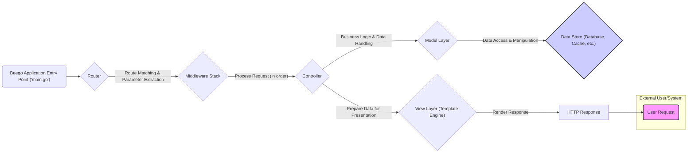
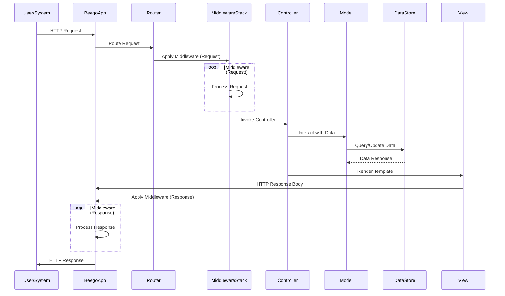

## Project Design Document: Beego Web Framework (Improved)

**1. Project Overview**

Beego is a high-productivity web framework for the Go programming language, drawing inspiration from Django and Tornado. It offers a comprehensive suite of features for building web applications, RESTful APIs, and backend services. This document details the architectural design of Beego, specifically for the purpose of facilitating thorough threat modeling and security analysis.

**2. Goals**

* To provide a clear, detailed, and accurate representation of Beego's architecture.
* To identify and describe the key components, their responsibilities, and their interactions within the framework.
* To illustrate the typical data flow within a Beego application, highlighting potential points of interest for security analysis.
* To explicitly outline potential security considerations and areas of vulnerability within the Beego framework to guide subsequent threat modeling activities.

**3. Target Audience**

* Security engineers responsible for performing threat modeling, penetration testing, and security audits of Beego-based applications or the framework itself.
* Software developers building applications using the Beego framework who need to understand its internal workings and security implications.
* System architects designing systems that incorporate Beego as a component.

**4. Scope**

This document focuses on the core architectural elements and the request lifecycle within the Beego framework. It covers the flow of data from the initial request to the final response, encompassing key modules and their interactions. The scope is limited to the framework itself and does not extend to specific user applications built on top of Beego, although it provides a foundation for understanding their security context.

**5. High-Level Architecture**

The Beego framework follows a Model-View-Controller (MVC) architectural pattern, augmented with additional components like the Router and Middleware to manage request handling and application logic.

**6. Component Details**

* **External User/System:** The entity initiating HTTP requests to the Beego application. This could be a web browser, a mobile application, another service, or an automated script.
* **Beego Application Entry Point ('main.go'):** The starting point of the Go application. It initializes the Beego framework, sets up configurations (including routing rules and middleware), and starts the HTTP server.
* **Router:**  The component responsible for receiving incoming HTTP requests and mapping them to the appropriate Controller action based on predefined routes.
    * Performs pattern matching on the request URL.
    * Extracts parameters from the URL.
    * Supports various routing strategies, including static routes, dynamic parameters, and regular expressions.
    * Can be a point of vulnerability if not configured securely (e.g., overly permissive routing).
* **Middleware Stack:** An ordered chain of handlers that intercept HTTP requests before they reach the Controller and responses before they are sent back to the client.
    * Used for implementing cross-cutting concerns such as authentication, authorization, logging, request modification, response manipulation, and security headers.
    * Middleware is executed sequentially, and the order is crucial for security.
    * Vulnerabilities in custom middleware or misconfiguration can introduce significant security risks.
* **Controller:**  Handles the core business logic for incoming requests.
    * Receives processed input from the Router and potentially modified by Middleware.
    * Interacts with the Model layer to retrieve or manipulate data.
    * Selects the appropriate View to render the response.
    * A primary area for security vulnerabilities if input is not validated or output is not encoded properly.
* **Model Layer:**  Responsible for interacting with data sources.
    * Encapsulates data access logic, abstracting the underlying data store.
    * May use an Object-Relational Mapper (ORM) or direct database interaction.
    * Vulnerabilities here can lead to data breaches or manipulation.
* **Data Store (Database, Cache, etc.):** The persistent storage for the application's data. This could be a relational database, a NoSQL database, a cache system, or an external API.
    * Security depends on proper configuration, access controls, and secure communication protocols.
* **View Layer (Template Engine):**  Responsible for rendering the response to the client, typically using HTML templates.
    * Beego supports various template engines (e.g., Go templates, Pongo2).
    * Receives data from the Controller to populate the template.
    * A critical area for Cross-Site Scripting (XSS) vulnerabilities if data is not properly escaped.
* **HTTP Response:** The formatted response sent back to the initiating user or system. This can be HTML, JSON, XML, or other data formats.

**7. Data Flow**

The typical lifecycle of an HTTP request within a Beego application follows these steps:

1. **User Request Initiation:** An external user or system sends an HTTP request to the Beego application.
2. **Entry Point Reception:** The request is received by the application's entry point (`main.go`).
3. **Routing and Matching:** The Router analyzes the request URL and matches it against the defined routing rules. Parameters are extracted from the URL.
4. **Middleware Processing (Request):** The request passes through the configured Middleware stack in a defined order. Each middleware can inspect, modify, or terminate the request. This is where authentication, authorization, and other pre-processing steps often occur.
5. **Controller Invocation:** Once the middleware stack has processed the request, the Router invokes the appropriate Controller action based on the matched route.
6. **Business Logic Execution:** The Controller executes the application's business logic, often involving interaction with the Model layer.
7. **Model Interaction:** The Controller interacts with the Model layer to retrieve, create, update, or delete data from the underlying Data Store.
8. **Data Store Communication:** The Model layer communicates with the Data Store (e.g., database) to perform the requested data operations.
9. **View Rendering:** The Controller selects a View (template) and passes data to it for rendering the response.
10. **Middleware Processing (Response):** The generated response passes back through the Middleware stack in reverse order. Middleware can modify the response headers, body, or perform post-processing actions.
11. **Response Transmission:** The Beego application sends the final HTTP response back to the initiating user or system.

**8. Security Considerations**

Based on the architectural components and data flow, the following are key areas of security concern for threat modeling:

* **Routing Vulnerabilities:**
    * **Insecure Direct Object References:**  Exposing internal object IDs directly in URLs without proper authorization checks.
    * **Route Hijacking:**  Exploiting vulnerabilities in the routing logic to redirect users to malicious sites or execute unintended code.
    * **Parameter Tampering:**  Manipulating URL parameters to bypass security checks or access unauthorized resources.
* **Middleware Security:**
    * **Authentication and Authorization Bypass:**  Flaws in authentication or authorization middleware allowing unauthorized access.
    * **Session Management Issues:**  Vulnerabilities related to session creation, storage, or invalidation.
    * **Security Header Misconfiguration:**  Missing or incorrectly configured security headers (e.g., `Content-Security-Policy`, `Strict-Transport-Security`).
    * **Denial of Service (DoS):**  Middleware that performs expensive operations on every request can be targeted for DoS attacks.
* **Controller Security:**
    * **Injection Attacks:**  SQL injection, command injection, LDAP injection, etc., due to unsanitized user input being used in database queries or system commands.
    * **Cross-Site Request Forgery (CSRF):**  Lack of CSRF protection allowing attackers to perform actions on behalf of authenticated users.
    * **Business Logic Flaws:**  Vulnerabilities in the application's logic that can be exploited for malicious purposes.
    * **Insecure File Uploads:**  Allowing users to upload malicious files that can be executed on the server.
* **Model Security:**
    * **ORM Injection:**  Exploiting vulnerabilities in the ORM layer to execute arbitrary SQL queries.
    * **Data Exposure:**  Accidental exposure of sensitive data due to insecure data access patterns.
    * **Mass Assignment Vulnerabilities:**  Allowing users to modify unintended data fields through request parameters.
* **View Security:**
    * **Cross-Site Scripting (XSS):**  Failing to properly escape user-provided data before rendering it in HTML templates.
    * **Server-Side Template Injection (SSTI):**  Allowing attackers to inject malicious code into template expressions.
    * **Information Disclosure:**  Accidentally exposing sensitive information in HTML comments or error messages.
* **Data Store Security:**
    * **Unauthorized Access:**  Lack of proper access controls allowing unauthorized users or applications to access the database.
    * **Data Breaches:**  Vulnerabilities leading to the theft or exposure of sensitive data.
    * **Data Integrity Issues:**  Vulnerabilities allowing attackers to modify or corrupt data.
* **Session Management:**
    * **Session Fixation:**  Allowing attackers to force a user to use a known session ID.
    * **Session Hijacking:**  Stealing a user's session ID to gain unauthorized access.
    * **Insecure Session Storage:**  Storing session data in a way that is vulnerable to compromise.
* **Dependency Management:**
    * **Using Components with Known Vulnerabilities:**  Including third-party libraries or frameworks with publicly disclosed security flaws.
    * **Supply Chain Attacks:**  Compromise of dependencies leading to vulnerabilities in the application.
* **Error Handling and Logging:**
    * **Information Disclosure through Error Messages:**  Exposing sensitive information in error messages displayed to users.
    * **Insufficient Logging:**  Lack of adequate logging making it difficult to detect and investigate security incidents.
    * **Logging Sensitive Data:**  Accidentally logging sensitive information that could be compromised.
* **Static File Handling:**
    * **Exposure of Sensitive Files:**  Incorrectly configured static file serving allowing access to configuration files or other sensitive data.
    * **Path Traversal Vulnerabilities:**  Allowing attackers to access files outside of the intended static file directory.

**9. Dependencies**

Beego applications rely on various Go packages and potentially external services. Security considerations should extend to these dependencies:

* **Database Drivers (e.g., `github.com/go-sql-driver/mysql`, `github.com/lib/pq`):**  Ensure the drivers are up-to-date and do not have known vulnerabilities. Secure connection configurations (e.g., TLS) are crucial.
* **ORM Libraries (e.g., `gorm.io/gorm`):**  Be aware of potential ORM injection vulnerabilities and follow secure coding practices when using ORMs.
* **Template Engines (e.g., standard `html/template`, `github.com/flosch/pongo2`):**  Choose template engines carefully and ensure proper escaping mechanisms are used to prevent XSS.
* **Session Management Libraries:**  Select libraries that implement secure session management practices (e.g., secure session IDs, HTTPOnly and Secure flags).
* **Authentication and Authorization Libraries:**  Use well-vetted libraries for implementing authentication and authorization to avoid common pitfalls.
* **Security Libraries (e.g., for cryptography, input validation):**  Utilize established and reputable security libraries for cryptographic operations and input validation.
* **Caching Libraries:**  Ensure caching mechanisms do not introduce security vulnerabilities (e.g., storing sensitive data in insecure caches).

**10. Deployment Considerations**

The security of a Beego application is also influenced by its deployment environment:

* **HTTPS Configuration:**  Enforce HTTPS to protect data in transit using TLS certificates. Ensure proper certificate management and configuration.
* **Firewall Configuration:**  Use firewalls to restrict network access to the application and its dependencies.
* **Network Segmentation:**  Isolate the application and its components within the network to limit the impact of a potential breach.
* **Operating System Security:**  Keep the underlying operating system and its components up-to-date with security patches.
* **Container Security (if using Docker/Kubernetes):**  Follow secure container image building practices and secure container orchestration configurations.
* **Cloud Provider Security (if using AWS, GCP, Azure):**  Utilize the security features provided by the cloud provider (e.g., IAM, security groups, encryption).
* **Secrets Management:**  Securely manage sensitive credentials (e.g., database passwords, API keys) using dedicated secrets management solutions.

**11. Future Considerations**

As the Beego framework evolves, new features and changes may introduce new security considerations. This document should be reviewed and updated regularly to reflect the current architecture and potential threats. Future threat modeling efforts should consider any new components, data flows, or dependencies introduced in newer versions of the framework.