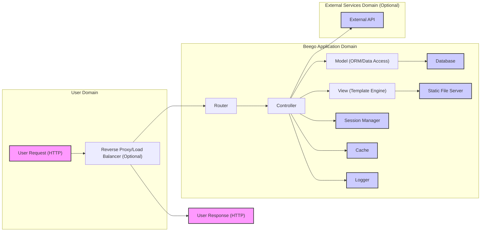
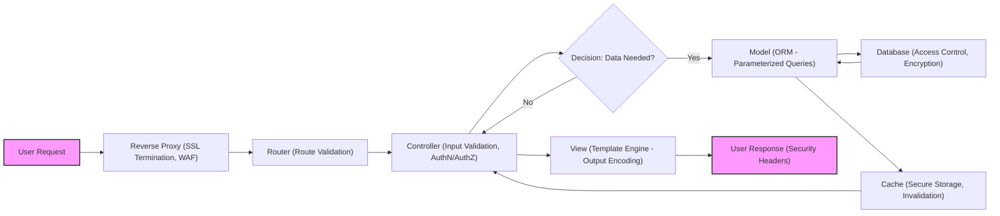

# Project Design Document: Beego Web Framework for Threat Modeling (Improved)

**Project Name:** Beego Web Framework

**Project Repository:** [https://github.com/beego/beego](https://github.com/beego/beego)

**Document Version:** 1.1

**Date:** 2023-10-27

**Author:** AI Software Architecture Expert

## 1. Introduction

This document provides an enhanced design overview of the Beego web framework, specifically tailored for threat modeling and security analysis. Building upon version 1.0, this document offers more detailed security considerations and actionable insights to facilitate a comprehensive threat modeling exercise. It outlines the key architectural components, data flow, and technologies involved, serving as a robust foundation for identifying potential security vulnerabilities and developing effective mitigation strategies.

Beego is a powerful and versatile open-source web framework written in Go, known for its high performance and Go-centric design. Its comprehensive feature set makes it suitable for building a wide range of web applications, APIs, and backend services. A thorough understanding of its architecture, as detailed in this document, is paramount for accurately assessing and improving its security posture. This document is intended to be used by security professionals, developers, and anyone involved in securing Beego-based applications.

## 2. System Architecture Overview

Beego adheres to the Model-View-Controller (MVC) architectural pattern, enriched with additional components to enhance its capabilities. The following diagram illustrates the high-level architecture of a Beego application, emphasizing the data flow and component interactions relevant for security analysis:

**Components:** (Same as Version 1.0, descriptions are enhanced in Section 3)

*   **User Request (HTTP):**  Initiating HTTP requests from end-users or client applications.
*   **Reverse Proxy/Load Balancer (Optional):**  Front-facing infrastructure component for SSL termination, load distribution, and request management.
*   **Router:**  Request dispatcher, mapping incoming requests to specific Controller actions based on defined routing rules.
*   **Controller:**  Core application logic handler, processing requests, interacting with Models and Views, and orchestrating application workflows.
*   **Model (ORM/Data Access):**  Data abstraction layer, providing an interface to interact with the database, often using an ORM.
*   **View (Template Engine):**  Presentation layer, rendering dynamic web pages using templates and data provided by the Controller.
*   **Session Manager:**  User session lifecycle management, handling session creation, persistence, and retrieval.
*   **Cache:**  Performance optimization component, storing frequently accessed data in memory or external cache stores.
*   **Logger:**  Application logging and auditing, recording events, errors, and security-related information.
*   **Database:**  Persistent data storage system.
*   **Static File Server:**  Component serving static assets like CSS, JavaScript, and images.
*   **External API (Optional):**  Integration point for interacting with external services and APIs.
*   **User Response (HTTP):**  HTTP response delivered back to the user or client.

## 3. Component Description and Security Considerations (Detailed)

This section provides a more in-depth description of each component, focusing on specific security considerations relevant for threat modeling.

### 3.1. Router

*   **Functionality:**  The Router is the entry point for incoming requests within the Beego application. It parses the request URL and headers, matching them against defined routes (static, dynamic, regex-based). Upon a match, it directs the request to the appropriate Controller action.
*   **Security Considerations for Threat Modeling:**
    *   **Route Definition Vulnerabilities:**
        *   **Overly Broad Routes:**  Wildcard routes or poorly defined regex routes can unintentionally expose sensitive endpoints or functionalities. *Threat:* Unauthorized Access, Information Disclosure. *Mitigation:* Implement specific and restrictive route definitions. Regularly review and audit route configurations.
        *   **Unintended Route Overlap:**  Conflicting route definitions can lead to unpredictable routing behavior and potential bypass of security controls. *Threat:* Logic Errors, Security Control Bypass. *Mitigation:*  Carefully design and test routing rules to avoid overlaps. Use route testing tools.
    *   **Route Parameter Handling:**
        *   **Insufficient Input Validation:** Route parameters (e.g., IDs, filenames) are often directly used in subsequent operations. Lack of validation can lead to injection vulnerabilities (Path Traversal, SQL Injection if used in database queries). *Threat:* Injection Attacks, Data Manipulation, Unauthorized File Access. *Mitigation:* Implement strict input validation and sanitization for all route parameters. Use whitelisting and input type validation.
        *   **Parameter Tampering:**  Attackers might manipulate route parameters to access unauthorized resources or trigger unintended actions. *Threat:* Unauthorized Access, Privilege Escalation. *Mitigation:* Implement server-side validation and authorization checks based on the validated parameters.
    *   **Denial of Service (DoS) via Routing:**
        *   **Complex Regex Routes:**  Extremely complex regular expressions in routes can be computationally expensive to process, leading to CPU exhaustion and DoS. *Threat:* Denial of Service. *Mitigation:*  Avoid overly complex regex in routes. Implement request timeouts and rate limiting at the reverse proxy or application level.

### 3.2. Controller

*   **Functionality:** Controllers are the central processing units of the application. They receive requests from the Router, handle business logic, interact with Models to manage data, and prepare data for rendering by the View. Controllers are responsible for request handling, input processing, business rule enforcement, and response generation.
*   **Security Considerations for Threat Modeling:**
    *   **Input Validation and Sanitization (Crucial):**
        *   **Lack of Validation:** Failure to validate user inputs (form data, API requests, headers) is the root cause of many vulnerabilities. *Threat:* Injection Attacks (SQL, Command, XSS, etc.), Data Corruption, Logic Errors. *Mitigation:* Implement comprehensive input validation at the Controller level. Use validation libraries and frameworks. Apply context-aware sanitization before using input in different parts of the application (database queries, template rendering, etc.).
        *   **Insufficient Sanitization:**  Improper or incomplete sanitization can still leave applications vulnerable to injection attacks. *Threat:* Injection Attacks. *Mitigation:* Use appropriate sanitization techniques for the specific context (e.g., HTML escaping for XSS prevention, parameterized queries for SQL injection prevention).
    *   **Authentication and Authorization (Essential):**
        *   **Missing Authentication:**  Lack of authentication allows unauthorized users to access application functionalities. *Threat:* Unauthorized Access, Data Breach, Data Manipulation. *Mitigation:* Implement robust authentication mechanisms (e.g., username/password, multi-factor authentication, OAuth 2.0).
        *   **Insufficient Authorization:**  Improper authorization allows authenticated users to access resources or perform actions beyond their intended privileges. *Threat:* Privilege Escalation, Unauthorized Access, Data Manipulation. *Mitigation:* Implement fine-grained authorization controls based on roles, permissions, or attributes. Enforce the principle of least privilege.
    *   **Session Management Vulnerabilities:**
        *   **Insecure Session Handling:** Weak session ID generation, lack of HTTPS, or improper session timeouts can lead to session hijacking and fixation. *Threat:* Session Hijacking, Session Fixation, Account Takeover. *Mitigation:* Use strong session ID generation, enforce HTTPS, set appropriate session timeouts, implement session regeneration after authentication.
    *   **Error Handling and Information Disclosure:**
        *   **Verbose Error Messages:**  Detailed error messages in production can leak sensitive information (e.g., database schema, internal paths, framework versions). *Threat:* Information Disclosure. *Mitigation:* Implement generic error pages for production environments. Log detailed errors securely for debugging purposes.
    *   **Business Logic Flaws:**
        *   **Vulnerabilities in Business Rules:**  Flaws in the implementation of business logic can lead to various security issues, such as privilege escalation, data manipulation, or bypassing security controls. *Threat:* Logic Errors, Privilege Escalation, Data Manipulation, Security Control Bypass. *Mitigation:* Thoroughly test business logic, perform code reviews, and consider security implications during design and implementation.

### 3.3. Model (ORM/Data Access)

*   **Functionality:** The Model layer provides an abstraction for interacting with the database. It encapsulates data access logic, often using an ORM to simplify database operations. It handles data retrieval, persistence, and manipulation, shielding the Controller from direct database interactions.
*   **Security Considerations for Threat Modeling:**
    *   **ORM-Related Vulnerabilities:**
        *   **ORM Misconfiguration:** Incorrect ORM configuration or improper usage can introduce vulnerabilities, especially related to SQL injection if not used carefully. *Threat:* SQL Injection. *Mitigation:* Follow ORM security best practices, use parameterized queries or ORM's query building features correctly, keep ORM libraries updated.
        *   **ORM Vulnerabilities:**  ORMs themselves can have vulnerabilities. *Threat:* Various depending on the specific ORM vulnerability. *Mitigation:* Regularly update the ORM library to the latest secure version. Monitor security advisories for the ORM in use.
    *   **Direct Database Access Risks (if bypassing ORM):**
        *   **SQL Injection (High Risk):**  Directly constructing SQL queries without proper parameterization is a major SQL injection risk. *Threat:* SQL Injection, Data Breach, Data Manipulation, Account Takeover. *Mitigation:*  Always use parameterized queries or prepared statements when executing raw SQL.
    *   **Data Access Control within the Model:**
        *   **Insufficient Data Access Control:** Models should enforce data access policies to ensure users can only access data they are authorized to view or modify. *Threat:* Unauthorized Access, Information Disclosure, Data Manipulation. *Mitigation:* Implement data access control logic within the Model layer, based on user roles or permissions.
    *   **Data Sanitization for Output:**
        *   **Lack of Output Sanitization:** Data retrieved from the database and displayed to users needs to be sanitized to prevent XSS. *Threat:* Cross-Site Scripting (XSS). *Mitigation:* Sanitize data retrieved from the database before rendering it in Views, using context-appropriate encoding (e.g., HTML escaping).

### 3.4. View (Template Engine)

*   **Functionality:** The View layer is responsible for rendering the user interface. The template engine processes templates and data from the Controller to generate HTML, JSON, XML, or other output formats for the user.
*   **Security Considerations for Threat Modeling:**
    *   **Cross-Site Scripting (XSS) (Primary Threat):**
        *   **Unescaped User Input in Templates:**  Directly embedding user-provided data into templates without proper escaping is a primary XSS vulnerability. *Threat:* Cross-Site Scripting (XSS), Account Takeover, Malware Distribution. *Mitigation:*  Always escape user-provided data before rendering it in templates. Use the template engine's built-in escaping mechanisms. Understand the default escaping behavior of the template engine.
        *   **Bypass of Escaping Mechanisms:**  Attackers may find ways to bypass template escaping mechanisms if not implemented correctly or if the template engine has vulnerabilities. *Threat:* Cross-Site Scripting (XSS). *Mitigation:*  Use well-vetted and regularly updated template engines. Be aware of potential bypass techniques and test for them.
    *   **Template Injection Vulnerabilities:**
        *   **Insecure Template Configuration:**  Allowing user control over template content or configuration can lead to template injection, allowing attackers to execute arbitrary code on the server. *Threat:* Remote Code Execution (RCE), Server Compromise. *Mitigation:*  Never allow user-controlled input to directly influence template paths or configurations. Restrict template functionality to prevent code execution.
    *   **Information Disclosure in Templates:**
        *   **Accidental Exposure of Sensitive Data:** Templates might inadvertently expose sensitive information in comments, debug outputs, or conditional rendering logic. *Threat:* Information Disclosure. *Mitigation:*  Review templates for accidental exposure of sensitive data. Remove debug information and comments from production templates.

### 3.5. Session Manager

*   **Functionality:** The Session Manager handles user session lifecycle management. It creates, stores, retrieves, and destroys user sessions, allowing the application to maintain state across multiple requests from the same user.
*   **Security Considerations for Threat Modeling:**
    *   **Session Hijacking (Major Threat):**
        *   **Predictable Session IDs:**  Weak session ID generation algorithms can lead to predictable session IDs, allowing attackers to guess and hijack sessions. *Threat:* Session Hijacking, Account Takeover. *Mitigation:* Use cryptographically secure random number generators for session ID generation. Ensure session IDs are long and unpredictable.
        *   **Session ID Exposure:**  Session IDs transmitted over insecure channels (HTTP) or stored insecurely (e.g., in URL parameters) are vulnerable to interception and hijacking. *Threat:* Session Hijacking, Man-in-the-Middle Attacks. *Mitigation:*  Enforce HTTPS for all session-related communication. Use `HttpOnly` and `Secure` flags for session cookies. Store session IDs securely (e.g., in cookies or secure server-side storage).
    *   **Session Fixation Attacks:**
        *   **Session ID Reuse After Authentication:**  If the session ID is not regenerated after successful authentication, attackers can pre-create a session ID and trick a user into authenticating with it, leading to session fixation. *Threat:* Session Fixation, Account Takeover. *Mitigation:* Regenerate session IDs after successful user authentication.
    *   **Session Storage Security:**
        *   **Insecure Session Storage:**  If session data is stored insecurely (e.g., in plaintext files, unencrypted databases), it can be compromised. *Threat:* Information Disclosure, Data Breach. *Mitigation:*  Store session data securely. Consider encrypting sensitive session data at rest and in transit. Use secure session storage mechanisms (e.g., encrypted cookies, secure server-side stores).
    *   **Session Timeout and Logout:**
        *   **Insufficient Session Timeout:**  Long session timeouts increase the window of opportunity for session hijacking. *Threat:* Session Hijacking, Prolonged Exposure of Sensitive Data. *Mitigation:*  Implement appropriate session timeouts based on the sensitivity of the application and user activity patterns.
        *   **Improper Logout Handling:**  Failure to properly invalidate sessions upon logout can leave sessions active and vulnerable. *Threat:* Session Replay, Unauthorized Access. *Mitigation:*  Implement proper session invalidation upon logout. Clear session cookies and server-side session data.

### 3.6. Cache

*   **Functionality:** The Cache component improves application performance by storing frequently accessed data in memory or external cache stores (e.g., Redis, Memcached). This reduces database load and improves response times.
*   **Security Considerations for Threat Modeling:**
    *   **Cache Poisoning:**
        *   **Cache Invalidation Vulnerabilities:**  If cache invalidation logic is flawed, attackers might be able to inject malicious data into the cache, leading to cache poisoning. *Threat:* Cache Poisoning, Serving Malicious Content, Application Logic Errors. *Mitigation:* Implement robust cache invalidation strategies. Validate data before caching. Use cache integrity checks.
    *   **Insecure Cache Storage:**
        *   **Exposure of Sensitive Data in Cache:**  If sensitive data is cached without proper protection, it can be exposed if the cache is compromised. *Threat:* Information Disclosure, Data Breach. *Mitigation:*  Avoid caching sensitive data if possible. If caching sensitive data is necessary, encrypt it in the cache. Secure the cache infrastructure itself.
    *   **Cache Side-Channel Attacks (Less Common, Context-Dependent):**
        *   **Timing Attacks via Cache:**  In specific scenarios, timing differences in cache access might be exploited to infer information about cached data. *Threat:* Information Disclosure (Context-Dependent). *Mitigation:*  Consider cache side-channel attacks in highly sensitive applications. Implement countermeasures if necessary (e.g., constant-time operations, cache partitioning).

### 3.7. Logger

*   **Functionality:** The Logger component handles application logging, recording events, errors, security-related information, and debugging data. Logs are crucial for monitoring, debugging, security auditing, and incident response.
*   **Security Considerations for Threat Modeling:**
    *   **Information Leakage in Logs (Critical):**
        *   **Logging Sensitive Data:**  Accidentally logging sensitive information (passwords, API keys, personal data, etc.) is a major security risk. *Threat:* Information Disclosure, Data Breach, Compliance Violations. *Mitigation:*  Carefully review logging configurations to prevent logging sensitive data. Implement data masking or redaction for sensitive information in logs.
    *   **Log Injection Vulnerabilities:**
        *   **Unsanitized User Input in Logs:**  If user input is directly included in log messages without sanitization, attackers can inject malicious data into logs, potentially leading to log injection attacks. *Threat:* Log Injection, Log Tampering, Potential Command Injection in Log Processing Systems. *Mitigation:* Sanitize user input before including it in log messages. Use structured logging formats to separate data from log messages.
    *   **Log Tampering and Integrity:**
        *   **Lack of Log Integrity Protection:**  Logs should be protected from unauthorized modification or deletion to maintain their integrity for security auditing and incident response. *Threat:* Log Tampering, Cover-up of Malicious Activity, Impaired Auditing. *Mitigation:*  Implement log integrity protection mechanisms (e.g., log signing, centralized and secure log storage, access controls on log files).

### 3.8. Database

*   **Functionality:** The Database is the persistent data storage system for the application. Beego applications can interact with various database systems.
*   **Security Considerations for Threat Modeling:**
    *   **Database Access Control (Fundamental):**
        *   **Weak Database Credentials:**  Default or weak database passwords, exposed database credentials, or overly permissive access controls are critical vulnerabilities. *Threat:* Unauthorized Database Access, Data Breach, Data Manipulation, Data Destruction. *Mitigation:*  Use strong and unique database passwords. Securely manage database credentials (e.g., using secrets management systems). Implement strict database access control policies (principle of least privilege).
        *   **Publicly Accessible Database:**  Exposing the database directly to the internet is a major security risk. *Threat:* Unauthorized Database Access, Data Breach. *Mitigation:*  Ensure the database is not directly accessible from the public internet. Place it behind firewalls and access it only from trusted application servers.
    *   **Database Injection Attacks (SQL, NoSQL):**
        *   **SQL Injection (If using SQL databases):**  Vulnerabilities in application code that allow attackers to inject malicious SQL queries. *Threat:* SQL Injection, Data Breach, Data Manipulation, Account Takeover. *Mitigation:*  Prevent SQL injection by using parameterized queries or ORM features correctly. Validate user inputs.
        *   **NoSQL Injection (If using NoSQL databases):**  Similar injection vulnerabilities can exist in NoSQL databases if queries are not constructed securely. *Threat:* NoSQL Injection, Data Breach, Data Manipulation. *Mitigation:*  Use database-specific security best practices for query construction and input validation in NoSQL environments.
    *   **Database Security Hardening:**
        *   **Unsecured Database Configuration:**  Default database configurations often have security weaknesses. *Threat:* Various depending on the specific misconfiguration. *Mitigation:*  Harden database configurations according to security best practices. Disable unnecessary features and services.
        *   **Lack of Database Encryption:**  Sensitive data stored in the database should be encrypted at rest and in transit. *Threat:* Data Breach if database storage is compromised. *Mitigation:*  Implement database encryption at rest (e.g., Transparent Data Encryption - TDE) and encryption in transit (e.g., TLS/SSL for database connections).
    *   **Database Vulnerabilities and Patching:**
        *   **Unpatched Database Software:**  Outdated database software may contain known vulnerabilities. *Threat:* Exploitation of known database vulnerabilities, Server Compromise. *Mitigation:*  Regularly patch and update the database software to the latest secure versions. Implement a vulnerability management process for database systems.

### 3.9. Static File Server

*   **Functionality:** The Static File Server component serves static assets like CSS, JavaScript, images, and other files directly to the user's browser. This is typically handled by the web server or a dedicated static file server.
*   **Security Considerations for Threat Modeling:**
    *   **Path Traversal Vulnerabilities:**
        *   **Improper Path Handling:**  Misconfiguration or vulnerabilities in the static file server can allow attackers to access files outside the intended static file directory (path traversal). *Threat:* Path Traversal, Unauthorized File Access, Information Disclosure, Potential Remote Code Execution if executable files are accessible. *Mitigation:*  Properly configure the static file server to restrict access to only the intended static file directory. Sanitize file paths. Avoid serving sensitive files as static assets.
    *   **Content Security Policy (CSP) Misconfiguration:**
        *   **Missing or Weak CSP:**  Lack of a strong Content Security Policy can increase the risk of XSS attacks by allowing the browser to load resources from untrusted sources. *Threat:* Cross-Site Scripting (XSS). *Mitigation:*  Implement a strong Content Security Policy (CSP) to control the sources from which the browser is allowed to load resources. Regularly review and update the CSP.
    *   **MIME Type Sniffing Vulnerabilities:**
        *   **Incorrect MIME Type Configuration:**  Incorrect MIME type configuration can lead to MIME type sniffing vulnerabilities, where browsers might misinterpret file types, potentially leading to XSS or other issues. *Threat:* MIME Type Sniffing, Cross-Site Scripting (XSS), Content Confusion. *Mitigation:*  Configure the web server to send correct MIME types for static files. Use the `X-Content-Type-Options: nosniff` header to prevent MIME type sniffing.
    *   **Serving Unnecessary Files:**
        *   **Exposure of Sensitive Files:**  Accidentally serving sensitive files (e.g., configuration files, source code, backups) as static assets can lead to information disclosure. *Threat:* Information Disclosure, Source Code Exposure, Configuration Exposure. *Mitigation:*  Carefully manage static file directories. Only serve necessary static assets. Do not include sensitive files in static file directories.

### 3.10. External API (Optional)

*   **Functionality:** Beego applications can interact with external APIs for various functionalities.
*   **Security Considerations for Threat Modeling:**
    *   **API Key Management (Critical):**
        *   **Hardcoded API Keys:**  Storing API keys directly in the application code is a major security risk. *Threat:* API Key Exposure, Unauthorized API Access, Service Abuse, Financial Loss. *Mitigation:*  Never hardcode API keys in the application code. Use secure secrets management systems (e.g., environment variables, vault services) to store and manage API keys.
        *   **Exposed API Keys in Logs or Version Control:**  Accidentally logging API keys or committing them to version control systems can lead to exposure. *Threat:* API Key Exposure. *Mitigation:*  Prevent logging API keys. Use `.gitignore` or similar mechanisms to exclude secrets from version control.
    *   **API Authentication and Authorization:**
        *   **Weak or Missing API Authentication:**  Insecure or missing authentication for external API calls can lead to unauthorized access and data breaches. *Threat:* Unauthorized API Access, Data Breach, Data Manipulation. *Mitigation:*  Implement proper authentication mechanisms for external API calls (e.g., API keys, OAuth 2.0, JWT).
        *   **Insufficient Authorization for API Calls:**  Ensure that the application only makes API calls with the necessary permissions and scopes. *Threat:* Privilege Escalation, Unauthorized Actions on External Services. *Mitigation:*  Implement authorization controls for API calls. Follow the principle of least privilege when granting API permissions.
    *   **Data Security in Transit to External APIs:**
        *   **Insecure Communication (HTTP):**  Sending sensitive data to external APIs over HTTP exposes it to interception. *Threat:* Man-in-the-Middle Attacks, Data Breach. *Mitigation:*  Always use HTTPS for communication with external APIs to encrypt data in transit.
    *   **API Rate Limiting and Throttling (DoS Prevention):**
        *   **Lack of Rate Limiting:**  Failure to implement rate limiting on external API calls can make the application vulnerable to abuse or DoS attacks on the external API. *Threat:* Denial of Service on External APIs, Service Abuse, Financial Costs. *Mitigation:*  Implement rate limiting and throttling for external API calls to prevent abuse and protect against DoS attacks.

## 4. Data Flow Diagram (Enhanced for Security)

This data flow diagram is enhanced to highlight security-relevant aspects of data flow within a Beego application.

**Data Flow Steps (Security Focused):**

1.  **User Request:** User initiates an HTTP request.
2.  **Reverse Proxy (SSL Termination, WAF):** Reverse proxy handles SSL termination, potentially includes a Web Application Firewall (WAF) for initial request filtering.
3.  **Router (Route Validation):** Router validates the route and parameters, ensuring they conform to expected patterns.
4.  **Controller (Input Validation, AuthN/AuthZ):** Controller performs comprehensive input validation and enforces authentication and authorization checks.
5.  **Decision: Data Needed?:** Controller determines if data retrieval is required.
6.  **Model (ORM - Parameterized Queries):** Model interacts with the database using parameterized queries (or secure ORM practices) to prevent SQL injection.
7.  **Database (Access Control, Encryption):** Database enforces access control and may employ encryption at rest and in transit.
8.  **Cache (Secure Storage, Invalidation):** Cache securely stores data and implements proper invalidation mechanisms to prevent cache poisoning.
9.  **View (Template Engine - Output Encoding):** View renders the response, encoding output to prevent XSS vulnerabilities.
10. **User Response (Security Headers):** User response includes security headers (CSP, HSTS, etc.) to enhance browser-side security.

## 5. Technology Stack (Security Relevant Notes)

*   **Programming Language:** Go (Golang) - *Security Note:* Go's memory safety features help reduce certain types of vulnerabilities.
*   **Web Framework:** Beego - *Security Note:* Framework security depends on proper usage and configuration. Keep Beego updated.
*   **Template Engine:** Beego's built-in template engine (based on Go templates) or integration with other Go template engines. - *Security Note:* Ensure proper output encoding is used to prevent XSS.
*   **ORM (Optional):** Beego supports various ORMs like GORM, XORM, or can be used with direct database/SQL interaction. - *Security Note:* Choose a reputable and actively maintained ORM. Use it securely to prevent ORM-related vulnerabilities and SQL injection.
*   **Database (Optional):** Supports various databases including MySQL, PostgreSQL, SQLite, MongoDB, etc. - *Security Note:* Select a database appropriate for security requirements. Follow database-specific security hardening guidelines.
*   **Caching (Optional):** Supports various caching mechanisms like in-memory cache, Redis, Memcached, etc. - *Security Note:* Choose a cache solution with security features if caching sensitive data. Secure the cache infrastructure.
*   **Session Management:** Built-in session management or integration with external session stores. - *Security Note:* Configure session management securely (HTTPS, HttpOnly, Secure flags, strong session IDs).
*   **Web Server:** Beego applications can be run directly as a web server or behind a reverse proxy like Nginx or Apache. - *Security Note:* Using a reverse proxy (Nginx, Apache) is recommended for production deployments for enhanced security features (SSL termination, WAF, etc.).

## 6. Threat Modeling Approach

This design document is intended to be used as input for a structured threat modeling exercise. A recommended approach would be:

1.  **Identify Assets:**  List the key assets of the Beego application (e.g., user data, application code, database, session data, API keys).
2.  **Identify Entry Points and Data Flows:**  Use the data flow diagrams and component descriptions to map out entry points (user requests, API calls) and data flows through the application.
3.  **Identify Threats per Component:**  For each component described in Section 3, use the "Security Considerations for Threat Modeling" to brainstorm potential threats. Consider threat categories like STRIDE (Spoofing, Tampering, Repudiation, Information Disclosure, Denial of Service, Elevation of Privilege).
4.  **Prioritize Threats:**  Assess the likelihood and impact of each identified threat to prioritize them for mitigation. Use risk assessment frameworks (e.g., DREAD, CVSS).
5.  **Develop Mitigation Strategies:**  For prioritized threats, develop specific mitigation strategies and security controls. These strategies should be mapped back to the components and data flows.
6.  **Document and Review:**  Document the threat model, including identified threats, prioritized risks, and mitigation strategies. Regularly review and update the threat model as the application evolves.

## 7. Conclusion

This improved design document provides a more detailed and security-focused overview of the Beego web framework architecture. By elaborating on component-specific security considerations and enhancing the data flow diagram with security elements, this document aims to be a more effective tool for threat modeling. Utilizing this document in conjunction with a structured threat modeling approach will enable security professionals and developers to proactively identify and mitigate potential security vulnerabilities in Beego-based applications, leading to more robust and secure systems. This document should be considered a living document and updated as the Beego framework and application evolve.