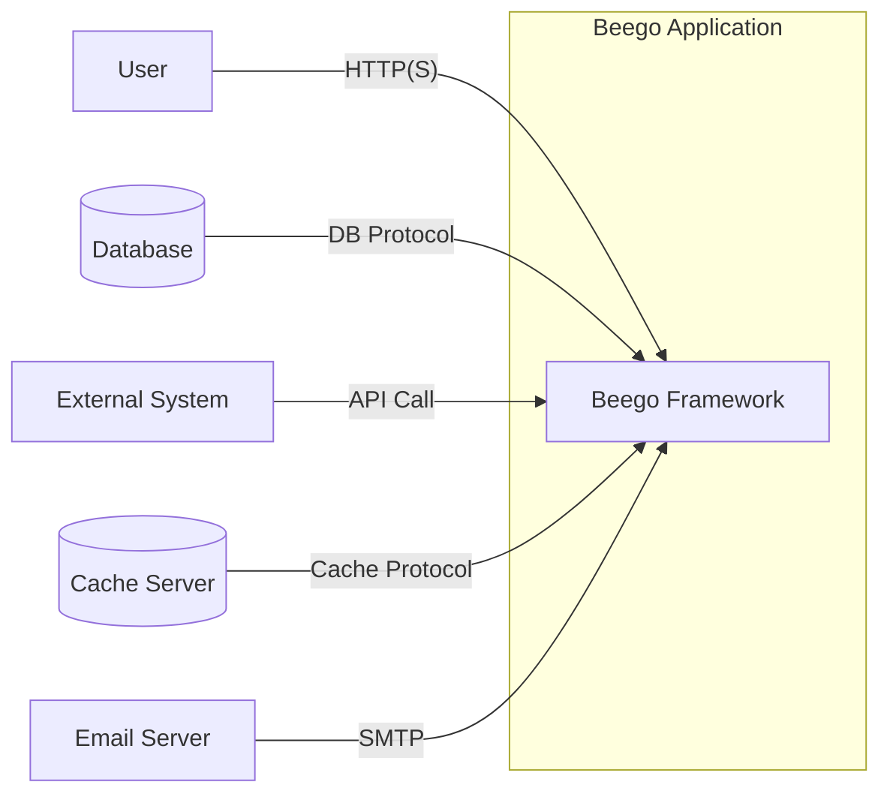
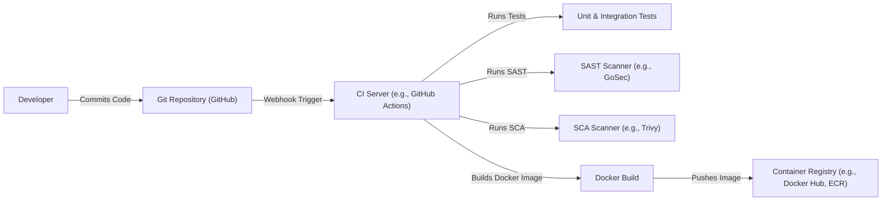

Okay, let's create a design document for the Beego web framework, keeping in mind its use for threat modeling.

# BUSINESS POSTURE

Beego is a Go-based, open-source web framework.  It aims to simplify the development of web applications, APIs, and backend services.  The business priorities and goals can be inferred as follows:

*   _Rapid Development_: Enable developers to build applications quickly and efficiently, reducing time-to-market.
*   _Maintainability_: Provide a structured framework that promotes clean code and easy maintenance.
*   _Performance_: Offer high performance to handle significant user loads and ensure responsiveness.
*   _Scalability_: Allow applications built with Beego to scale easily to meet growing demands.
*   _Community Support_: Foster a strong community to provide support, contribute to the framework's development, and ensure its longevity.
*   _Extensibility_: Make it easy to integrate with other libraries and services.

_Most Important Business Risks_:

*   _Security Vulnerabilities_: Vulnerabilities in the framework could be exploited, leading to data breaches, service disruptions, and reputational damage. This is paramount, as a framework-level vulnerability affects all applications built upon it.
*   _Performance Bottlenecks_: If the framework itself has performance issues, it will limit the scalability and responsiveness of all applications using it.
*   _Lack of Adoption_: If the framework fails to gain sufficient adoption, community support may dwindle, leading to slower development, fewer updates, and potentially unaddressed security issues.
*   _Breaking Changes_: Frequent or poorly managed breaking changes in new versions can disrupt existing applications and discourage adoption.
*   _Dependency Issues_: Reliance on vulnerable or unmaintained third-party dependencies can introduce security and stability risks.

# SECURITY POSTURE

Beego, being a framework, provides building blocks and tools, but the ultimate security posture depends heavily on how it's used by developers.  Here's a breakdown:

*   _security control_: Built-in features like session management, XSS prevention, CSRF protection, and ORM security (when used correctly). These are described in the Beego documentation.
*   _security control_: Encourages the use of Go's built-in security features, such as `net/http`'s security-conscious design.
*   _security control_: Provides mechanisms for input validation and output encoding, crucial for preventing common web vulnerabilities.  Documentation provides guidance on these.
*   _security control_: Offers tools for secure configuration management, helping to avoid hardcoded secrets and insecure defaults.
*   _accepted risk_: The framework itself might have undiscovered vulnerabilities.  This is inherent in any software.
*   _accepted risk_: Developers might misuse the framework's security features or introduce vulnerabilities in their application code. This is a significant risk, as Beego provides tools, but doesn't enforce their correct usage.
*   _accepted risk_: Dependencies (both direct and transitive) might introduce vulnerabilities.
*   _accepted risk_: Secure deployment and infrastructure configuration are outside the scope of the framework itself.

_Recommended Security Controls (High Priority)_:

*   _security control_: Implement a robust vulnerability management process, including regular security audits and penetration testing of the framework itself.
*   _security control_: Provide comprehensive security documentation and tutorials, emphasizing secure coding practices when using Beego.
*   _security control_: Integrate automated security scanning tools (SAST, DAST, SCA) into the framework's CI/CD pipeline.
*   _security control_: Establish a clear security disclosure policy and a process for handling reported vulnerabilities.
*   _security control_: Implement a dependency management system that automatically checks for known vulnerabilities in dependencies.

_Security Requirements_:

*   _Authentication_:
    *   The framework should provide flexible mechanisms for implementing various authentication methods (e.g., session-based, token-based, OAuth).
    *   Support for secure password storage (e.g., using bcrypt or similar hashing algorithms).
    *   Protection against brute-force attacks (e.g., account lockout).
*   _Authorization_:
    *   Support for role-based access control (RBAC) or other authorization models.
    *   Mechanisms to enforce access control at the controller, model, and potentially view levels.
*   _Input Validation_:
    *   Comprehensive input validation capabilities to prevent injection attacks (SQL injection, XSS, command injection).
    *   Support for both whitelist and blacklist validation approaches.
    *   Easy integration with validation libraries.
*   _Cryptography_:
    *   Secure handling of cryptographic keys.
    *   Support for standard encryption algorithms (e.g., AES, RSA).
    *   Guidance on secure use of cryptography for data protection.
*   _Output Encoding_:
    *   Automatic or easy-to-use output encoding to prevent XSS vulnerabilities.
    *   Context-aware encoding (e.g., HTML encoding, JavaScript encoding).

# DESIGN

## C4 CONTEXT



_Elements Description_:

*   1.  _Name_: User
    *   _Type_: Person
    *   _Description_: Represents a user interacting with the Beego application through a web browser or other client.
    *   _Responsibilities_: Accessing the application, providing input, and receiving output.
    *   _Security controls_: Browser-based security controls (e.g., same-origin policy, cookies), HTTPS.

*   2.  _Name_: Beego Framework
    *   _Type_: Software System
    *   _Description_: The core of the application, built using the Beego framework.
    *   _Responsibilities_: Handling HTTP requests, processing data, interacting with other systems, rendering responses.
    *   _Security controls_: Built-in Beego security features (XSS protection, CSRF protection, session management), input validation, output encoding, secure configuration management.

*   3.  _Name_: Database
    *   _Type_: Database System
    *   _Description_: Stores persistent data for the application.
    *   _Responsibilities_: Storing and retrieving data.
    *   _Security controls_: Database access controls, encryption at rest, encryption in transit, auditing.

*   4.  _Name_: External System
    *   _Type_: Software System
    *   _Description_: Any external system that the Beego application interacts with (e.g., payment gateway, social media API).
    *   _Responsibilities_: Providing specific services or data.
    *   _Security controls_: API keys, OAuth, mutual TLS, input validation, output encoding.

*   5.  _Name_: Cache Server
    *   _Type_: Software System
    *   _Description_: Caches frequently accessed data to improve performance.
    *   _Responsibilities_: Storing and retrieving cached data.
    *   _Security controls_: Access controls, data validation.

*   6.  _Name_: Email Server
    *   _Type_: Software System
    *   _Description_: Sends emails on behalf of the application.
    *   _Responsibilities_: Delivering emails.
    *   _Security controls_: Authentication, encryption (TLS).

## C4 CONTAINER

```mermaid
graph LR
    subgraph Beego Application
        controller["Controller"] -- "Handles Requests" --> model["Model"]
        model -- "Accesses Data" --> database[(Database)]
        view["View"] -- "Renders Response" <-- controller
        controller -- "Uses" --> session["Session Manager"]
        controller -- "Uses" --> cache["Cache Manager"]
        controller -- "Sends" --> email["Email Sender"]
        controller -- "Calls" --> externalapi["External API Client"]
    end
    user["User"] -- "HTTP(S)" --> controller
    database[(Database)]
    externalsystem["External System"] -- "API Call" --> externalapi

```

_Elements Description_:

*   1.  _Name_: Controller
    *   _Type_: Container
    *   _Description_: Handles incoming HTTP requests, interacts with models and views.
    *   _Responsibilities_: Request routing, input validation, calling business logic, rendering responses.
    *   _Security controls_: Input validation, CSRF protection, authentication checks, authorization checks.

*   2.  _Name_: Model
    *   _Type_: Container
    *   _Description_: Represents the application's data and business logic.
    *   _Responsibilities_: Data access, data validation, business rules.
    *   _Security controls_: Data validation, secure access to data sources.

*   3.  _Name_: View
    *   _Type_: Container
    *   _Description_: Renders the user interface.
    *   _Responsibilities_: Displaying data, formatting output.
    *   _Security controls_: Output encoding (XSS prevention).

*   4.  _Name_: Session Manager
    *   _Type_: Container
    *   _Description_: Manages user sessions.
    *   _Responsibilities_: Creating, storing, and validating sessions.
    *   _Security controls_: Secure session ID generation, secure storage of session data, session expiration.

*   5.  _Name_: Cache Manager
    *   _Type_: Container
    *   _Description_: Manages caching of data.
    *   _Responsibilities_: Storing and retrieving cached data.
    *   _Security controls_: Data validation.

*   6.  _Name_: Email Sender
    *   _Type_: Container
    *   _Description_: Sends emails.
    *   _Responsibilities_: Formatting and sending emails.
    *   _Security controls_: Authentication with email server, encryption (TLS).

*   7.  _Name_: External API Client
    *   _Type_: Container
    *   _Description_: Communicates with external APIs.
    *   _Responsibilities_: Making API requests, handling responses.
    *   _Security controls_: API keys, OAuth, mutual TLS, input validation, output encoding.

*   8.  _Name_: User
    *   _Type_: Person
    *   _Description_: Represents a user interacting with the Beego application.
    *   _Responsibilities_: Accessing the application, providing input, receiving output.
    *   _Security controls_: Browser security, HTTPS.

*   9.  _Name_: Database
    *   _Type_: Database System
    *   _Description_: Stores persistent data.
    *   _Responsibilities_: Storing and retrieving data.
    *   _Security controls_: Database access controls, encryption.

*   10. _Name_: External System
    *   _Type_: Software System
    *   _Description_: External system providing services.
    *   _Responsibilities_: Providing specific services or data.
    *   _Security controls_: API security measures.

## DEPLOYMENT

_Possible Deployment Solutions_:

1.  _Traditional Server Deployment_: Deploying the Beego application on a virtual machine or bare-metal server, using a process manager like systemd or supervisord.
2.  _Containerized Deployment (Docker)_: Packaging the Beego application and its dependencies into a Docker container and deploying it on a container orchestration platform like Kubernetes or Docker Swarm.
3.  _Platform-as-a-Service (PaaS)_: Deploying the Beego application on a PaaS provider like Heroku, Google App Engine, or AWS Elastic Beanstalk.
4.  _Serverless Deployment_: Deploying individual Beego functions as serverless functions (e.g., AWS Lambda, Google Cloud Functions). This is less common for entire Beego applications but possible for specific API endpoints.

_Chosen Solution: Containerized Deployment (Docker & Kubernetes)_

```mermaid
graph LR
    subgraph Kubernetes Cluster
        subgraph Namespace (e.g., beego-app)
            pod1["Pod (Beego App Instance 1)"] -- "Internal Network" --> pod2["Pod (Beego App Instance 2)"]
            pod1 -- "Internal Network" --> service["Service (Load Balancer)"]
            pod2 -- "Internal Network" --> service
            service -- "Ingress Network" --> ingress["Ingress Controller"]
        end
    end
    ingress -- "HTTPS" --> user["User"]
    pod1 -- "DB Connection" --> db[(Database - External)]
    pod2 -- "DB Connection" --> db

```

_Elements Description_:

*   1.  _Name_: User
    *   _Type_: Person
    *   _Description_: Represents a user accessing the application.
    *   _Responsibilities_: Making requests to the application.
    *   _Security controls_: Browser security, HTTPS.

*   2.  _Name_: Ingress Controller
    *   _Type_: Infrastructure
    *   _Description_: Manages external access to the services within the Kubernetes cluster.
    *   _Responsibilities_: Routing traffic to the correct service, TLS termination.
    *   _Security controls_: TLS certificates, access controls, web application firewall (WAF).

*   3.  _Name_: Service (Load Balancer)
    *   _Type_: Infrastructure
    *   _Description_: Provides a stable IP address and DNS name for accessing the Beego application pods.
    *   _Responsibilities_: Load balancing traffic across multiple pods.
    *   _Security controls_: Network policies.

*   4.  _Name_: Pod (Beego App Instance 1 & 2)
    *   _Type_: Container
    *   _Description_: Runs a single instance of the Beego application container.
    *   _Responsibilities_: Handling requests, processing data.
    *   _Security controls_: Container security (image scanning, minimal base image), resource limits, network policies.

*   5.  _Name_: Database (External)
    *   _Type_: Database System
    *   _Description_: The database server, running outside the Kubernetes cluster.
    *   _Responsibilities_: Storing and retrieving data.
    *   _Security controls_: Database access controls, encryption, firewall.

*   6.  _Name_: Kubernetes Cluster
    *   _Type_: Infrastructure
    *   _Description_: The container orchestration platform.
    *   _Responsibilities_: Managing the lifecycle of the application containers.
    *   _Security controls_: Role-based access control (RBAC), network policies, pod security policies, secrets management.

*   7.  _Name_: Namespace (beego-app)
    *   _Type_: Infrastructure
    *   _Description_: A logical grouping of resources within the Kubernetes cluster.
    *   _Responsibilities_: Isolating the Beego application from other applications.
    *   _Security controls_: Resource quotas, network policies.

## BUILD



_Build Process Description_:

1.  _Developer_: Writes code and commits it to the Git repository.
2.  _Git Repository (GitHub)_: Stores the application's source code.
3.  _CI Server (GitHub Actions)_: Automates the build and testing process. Triggered by events in the Git repository (e.g., push, pull request).
4.  _Unit & Integration Tests_: Run automated tests to verify the functionality of the code.
5.  _SAST Scanner (GoSec)_: Performs static analysis of the Go source code to identify potential security vulnerabilities.
6.  _SCA Scanner (Trivy)_: Scans the project's dependencies for known vulnerabilities.
7.  _Docker Build_: Builds a Docker image containing the Beego application and its dependencies.
8.  _Container Registry (Docker Hub, ECR)_: Stores the built Docker image.

_Security Controls_:

*   _security control_: Git repository access controls (e.g., branch protection rules, code review requirements).
*   _security control_: CI/CD pipeline security (e.g., secure configuration, limited access).
*   _security control_: SAST scanning to identify vulnerabilities in the source code.
*   _security control_: SCA scanning to identify vulnerabilities in dependencies.
*   _security control_: Secure Docker image building practices (e.g., using minimal base images, avoiding hardcoded secrets).
*   _security control_: Container registry access controls.
*   _security control_: Signed commits.
*   _security control_: Signed container images.

# RISK ASSESSMENT

*   _Critical Business Processes_:
    *   User authentication and authorization.
    *   Data processing and storage.
    *   API interactions with external systems.
    *   Serving web content.
    *   Session management.

*   _Data to Protect and Sensitivity_:
    *   _User Data_: Usernames, passwords (hashed), email addresses, personal information (PII), session tokens. _Sensitivity: High_.
    *   _Application Data_: Any data stored by the application, which could include financial data, business data, or other sensitive information. _Sensitivity: Varies depending on the specific application_.
    *   _Configuration Data_: API keys, database credentials, other secrets. _Sensitivity: High_.
    *   _Logs_: Application logs, which may contain sensitive information if not properly handled. _Sensitivity: Medium to High_.

# QUESTIONS & ASSUMPTIONS

*   _Questions_:
    *   What specific types of applications are most commonly built with Beego (e.g., e-commerce, social media, internal tools)? This helps prioritize security considerations.
    *   What is the typical deployment environment for Beego applications (e.g., cloud providers, on-premise)?
    *   What is the level of security expertise among the typical Beego developers?
    *   Are there any specific compliance requirements (e.g., GDPR, HIPAA, PCI DSS) that Beego applications commonly need to meet?
    *   What are the most common external systems that Beego applications integrate with?
    *   What is Beego's current process for handling security vulnerabilities?

*   _Assumptions_:
    *   _BUSINESS POSTURE_: Assumes that rapid development and ease of use are prioritized, but security is also a significant concern.
    *   _SECURITY POSTURE_: Assumes that developers will rely on Beego's built-in security features but may not always implement them correctly. Assumes that the framework itself is reasonably secure but may have undiscovered vulnerabilities.
    *   _DESIGN_: Assumes a typical web application architecture with a database, external services, and potentially a cache. Assumes a containerized deployment using Docker and Kubernetes. Assumes a CI/CD pipeline with automated testing and security scanning.