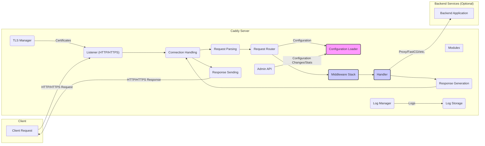

# Project Design Document: Caddy Web Server

**Version:** 1.1
**Date:** October 26, 2023
**Author:** AI Software Architect

## 1. Project Overview

This document outlines the high-level design of the Caddy web server, an open-source, general-purpose web server renowned for its ease of use, automatic HTTPS, and focus on developer experience. This document serves as a foundation for subsequent threat modeling activities.

## 2. Goals and Objectives

*   Provide a clear and concise overview of Caddy's architecture.
*   Identify key components and their interactions, including the module system.
*   Describe the flow of requests and data within the system, highlighting security-relevant data paths.
*   Elaborate on security-relevant aspects of the design, providing context for potential threats.
*   Serve as a basis for identifying potential threats, vulnerabilities, and attack vectors.

## 3. Target Audience

This document is intended for:

*   Security engineers performing threat modeling and security assessments.
*   Developers contributing to the Caddy project, requiring architectural understanding.
*   System administrators deploying and managing Caddy in production environments.
*   Anyone seeking a detailed understanding of Caddy's internal workings for security analysis or development purposes.

## 4. Scope

This document covers the core architecture and functionality of the Caddy web server, including its module system. It focuses on the request lifecycle, key components, data flow, and configuration mechanisms. While specific plugins are not exhaustively detailed, the general plugin architecture is considered.

## 5. System Architecture

Caddy employs a modular and extensible architecture centered around the concept of "modules." The core of Caddy handles fundamental tasks, while functionality is largely implemented through configurable modules.

### 5.1. Key Components

*   **Listener:** Responsible for establishing network connections on specified addresses and ports, supporting both HTTP and HTTPS protocols. It utilizes configured TLS settings from the TLS Manager.
*   **Connection Handling:** Manages individual client connections, handling the underlying TCP/IP protocol and potentially TLS handshake. It buffers incoming data and prepares it for parsing.
*   **Request Parsing:** Parses the raw HTTP request data into a structured format, extracting headers, body, method, URL, and other relevant information according to HTTP specifications.
*   **Request Router:**  Matches the parsed request to a specific handler chain based on the configured routes defined in the Caddy configuration. This involves evaluating request attributes against defined matchers.
*   **Middleware Stack:** An ordered chain of "middleware" modules that process the request before it reaches the final handler. Each middleware can inspect, modify, or short-circuit the request or response.
*   **Handler:** The final "handler" module responsible for generating the response to the request. This could involve serving static files, proxying to backend servers, or executing server-side logic.
*   **Response Generation:** Constructs the HTTP response, including headers, body, and status code, based on the output of the handler and any response-modifying middleware.
*   **Response Sending:** Transmits the generated HTTP response back to the client through the established connection.
*   **Configuration Loader:** Reads, parses, and validates the Caddy configuration, typically from a Caddyfile or JSON structure. It translates the configuration into a set of active modules and their settings.
*   **TLS Manager:**  Manages TLS certificates, including automatic acquisition using ACME protocols (like Let's Encrypt), loading provided certificates, and handling certificate renewal and storage. It provides certificates to the Listeners.
*   **Log Manager:**  Handles logging of various server events, including access logs, error logs, and other diagnostic information, to configured destinations (files, syslog, etc.).
*   **Admin API:** Provides an HTTP API for managing the Caddy server at runtime, including reloading configurations, viewing status, and collecting metrics. Access to this API should be secured.
*   **Modules:** The fundamental building blocks of Caddy's functionality. Listeners, handlers, middleware, loggers, and other components are implemented as modules. This architecture promotes extensibility and customization.

## 6. Data Flow

The typical request lifecycle in Caddy involves the following data flow, highlighting key data transformations and potential security implications:

1. **Client Request:** A client sends an HTTP or HTTPS request (raw bytes over the network) to the Caddy server.
2. **Listener:** The Listener accepts the incoming TCP connection. For HTTPS, a TLS handshake occurs, involving the exchange of cryptographic information and certificate validation.
3. **Connection Handling:** The Connection Handler manages the TCP connection and reads the raw request data into a buffer.
4. **Request Parsing:** The Request Parser transforms the raw bytes into a structured HTTP request object, including headers (key-value pairs), the request body (if present), the HTTP method, and the requested URL.
5. **Request Routing:** The Request Router uses the parsed request information (e.g., hostname, path, headers) and the loaded configuration to select the appropriate handler chain. This involves matching request attributes against configured matchers.
6. **Middleware Processing:** The request object is passed through the configured middleware stack. Each middleware module can:
    *   Inspect and modify the request object (e.g., adding headers, rewriting URLs).
    *   Generate a response and short-circuit the remaining middleware and handler.
    *   Inspect and modify the response generated by subsequent middleware or the handler.
7. **Handler Execution:** The designated Handler module processes the request object. This might involve:
    *   Reading files from the filesystem (for file server handlers).
    *   Forwarding the request to a backend application (for proxy handlers).
    *   Generating dynamic content.
8. **Response Generation:** The Handler generates a response object, including headers, a body (which could be static content, dynamically generated content, or data from a backend), and a status code.
9. **Response Sending:** The Response Sender serializes the response object into HTTP-compliant byte stream and transmits it back to the client over the established connection.
10. **Logging:** Throughout the process, the Log Manager collects relevant information (e.g., request details, response status, errors) and writes it to the configured logging destinations.

**Key Data Elements and their Security Relevance:**

*   **Request Data (Headers, Body, URL):**  Potential target for injection attacks (SQL, command injection, XSS), sensitive information disclosure.
*   **Response Data (Headers, Body):** Can contain sensitive information that needs to be protected in transit and at rest.
*   **Configuration Data (Caddyfile/JSON):**  Defines security policies and routing rules. Misconfigurations can lead to vulnerabilities. Secrets (e.g., API keys) might be present.
*   **TLS Certificates (Private Keys):** Critical for secure communication. Compromise leads to eavesdropping and impersonation.
*   **Log Data:** Can contain sensitive information and should be protected from unauthorized access.

## 7. Security Considerations

Security considerations for Caddy can be categorized as follows:

*   **Transport Layer Security (TLS):**
    *   **Automatic HTTPS:** While beneficial, reliance on automatic HTTPS requires trust in the ACME provider.
    *   **Certificate Management:** Secure storage and handling of private keys are paramount. Vulnerabilities in the TLS Manager could lead to key compromise.
    *   **TLS Configuration:**  Insecure TLS configurations (e.g., outdated protocols, weak ciphers) can weaken security.
*   **Configuration Security:**
    *   **Sensitive Data in Configuration:**  Storing secrets directly in the Caddyfile is discouraged. Environment variables or secret management systems should be used.
    *   **Access Control:**  Restricting access to the Caddy configuration files is crucial to prevent unauthorized modifications.
    *   **Configuration Reloads:**  Securely handling configuration reloads is important to prevent disruptions or the introduction of malicious configurations.
*   **Middleware Security:**
    *   **Vulnerable Middleware:**  Third-party or custom middleware might contain vulnerabilities.
    *   **Middleware Ordering:**  The order of middleware execution can have security implications. Incorrect ordering can bypass security checks.
    *   **Resource Exhaustion:**  Malicious middleware could consume excessive resources, leading to denial of service.
*   **Handler Security:**
    *   **File Server Vulnerabilities:**  Improperly configured file servers can expose sensitive files or allow directory traversal attacks.
    *   **Reverse Proxy Vulnerabilities:**  Open proxies, SSRF vulnerabilities, and improper header handling are potential risks.
    *   **FastCGI/ অন্যান্য Backend Interactions:**  Vulnerabilities in backend applications can be exploited through Caddy. Secure communication and input validation are essential.
*   **Input Validation and Output Encoding:**
    *   **Injection Attacks:**  Failure to properly validate user input can lead to various injection attacks.
    *   **Cross-Site Scripting (XSS):**  Improper output encoding can enable XSS attacks.
*   **Logging Security:**
    *   **Sensitive Information in Logs:**  Logs might contain sensitive data that needs to be protected.
    *   **Log Forgery:**  Mechanisms to prevent log forgery are important for auditability.
    *   **Log Storage Security:**  Secure storage and access control for log files are necessary.
*   **Admin API Security:**
    *   **Authentication and Authorization:**  The Admin API must have strong authentication and authorization mechanisms to prevent unauthorized access and control.
    *   **Exposure:**  The Admin API should not be publicly accessible without proper security measures.
*   **Dependency Management:**
    *   **Vulnerable Dependencies:**  Caddy relies on external libraries. Keeping these dependencies up-to-date is crucial for patching vulnerabilities.
*   **Denial of Service (DoS) Prevention:**
    *   **Rate Limiting:**  Mechanisms to limit the rate of requests can help mitigate DoS attacks.
    *   **Connection Limits:**  Limiting the number of concurrent connections can prevent resource exhaustion.
    *   **Request Size Limits:**  Limiting the size of incoming requests can prevent certain types of DoS attacks.
*   **Sandboxing and Isolation:** Caddy utilizes Go's memory safety features and can be deployed in containerized environments for further isolation.

## 8. Deployment Considerations

Caddy can be deployed in various ways, each with its own security implications:

*   **Standalone Binary:**  Deployed directly on a host operating system. Security depends on the host OS configuration and security practices.
*   **Containerized (Docker, etc.):** Provides isolation and resource management. Security depends on the container image, orchestration platform, and container runtime configuration.
*   **Systemd Service:** Managed as a system service on Linux. Security depends on systemd configuration and user privileges.
*   **Orchestration Platforms (Kubernetes, etc.):**  Deployment within orchestration platforms introduces additional security considerations related to the platform itself (e.g., RBAC, network policies).
*   **Reverse Proxy in Front of Other Applications:**  Caddy can act as a secure entry point, but its configuration is critical to prevent vulnerabilities in the backend applications.

## 9. Future Considerations

*   Detailed threat modeling exercises focusing on specific components and data flows identified in this document.
*   Security analysis of common Caddy modules and their potential vulnerabilities.
*   Evaluation of the security implications of different Caddy configuration patterns.
*   Analysis of the attack surface exposed by the Admin API and recommendations for securing it.
*   Investigation of integration with security information and event management (SIEM) systems for enhanced monitoring and threat detection.
*   Further exploration of Caddy's internal security mechanisms, such as any sandboxing or isolation techniques employed.

This document provides a more detailed and security-focused understanding of Caddy's architecture, serving as a solid foundation for comprehensive threat modeling activities.