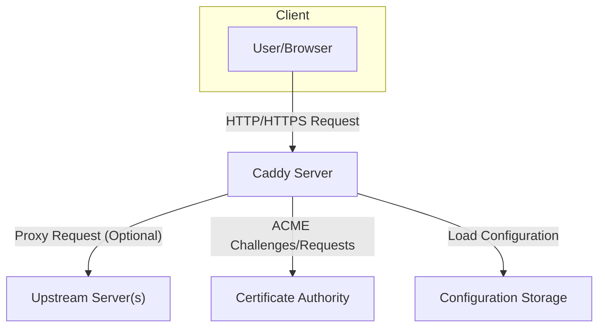
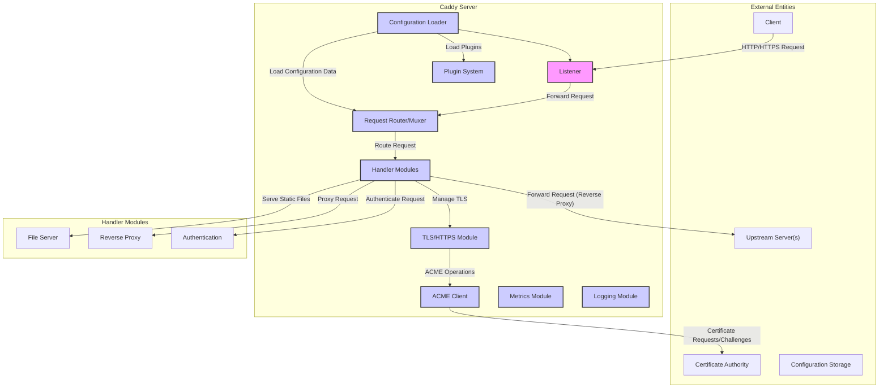
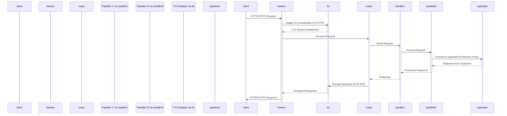

# Project Design Document: Caddy Web Server

**Version:** 1.1
**Date:** October 26, 2023
**Author:** AI Software Architect

## 1. Introduction

This document provides a detailed architectural design of the Caddy web server, an open-source, general-purpose web server renowned for its automatic HTTPS certificate management. This document is intended to serve as a robust foundation for subsequent threat modeling activities. It meticulously outlines the key components, data flow, and interactions within the Caddy ecosystem, providing a comprehensive understanding of its internal workings.

## 2. Goals and Non-Goals

**Goals:**

* To furnish a comprehensive and easily understandable overview of Caddy's architecture.
* To clearly identify the core components of Caddy and delineate their specific responsibilities.
* To accurately describe the flow of data as it traverses the system during request processing.
* To explicitly highlight the security-relevant aspects inherent in Caddy's design.
* To serve as a well-defined and detailed basis for conducting thorough threat modeling exercises.

**Non-Goals:**

* To delve into exhaustive, code-level implementation details of Caddy's internals.
* To enumerate and describe every single configurable option available within Caddy.
* To present performance benchmarks, optimization strategies, or detailed resource utilization metrics.
* To cover the implementation specifics or security implications of every available Caddy plugin.

## 3. High-Level Architecture

Caddy is architected as a modular and highly extensible web server. At a high level, it operates by receiving client requests, processing these requests based on its loaded configuration, and subsequently sending responses back to the client. A defining feature of Caddy is its automatic HTTPS management, which leverages the ACME protocol to obtain and renew TLS certificates seamlessly.

## 4. Detailed Architecture

The Caddy server's internal workings can be dissected into several distinct yet interconnected key components:

* **Listener:**
    * The entry point for all incoming network connections.
    * Responsible for accepting new TCP connections on configured ports, typically 80 (HTTP) and 443 (HTTPS).
    * Handles the initial TCP handshake process to establish a connection with the client.
* **Configuration Loader:**
    * Responsible for parsing the Caddy configuration, which can be expressed in either the human-friendly Caddyfile format or JSON.
    * Translates the user-provided configuration into an internal, structured representation that Caddy's core can understand and utilize.
    * Implements mechanisms to monitor the configuration files for any changes, triggering a graceful reload of the server to apply the new configuration without downtime.
* **Request Router/Muxer:**
    * Acts as the traffic controller within Caddy.
    * Examines incoming HTTP requests, paying attention to attributes like the hostname, URL path, and HTTP headers.
    * Matches these requests against the defined routes and handlers specified in the loaded configuration.
    * Directs each incoming request to the appropriate chain of handler modules for processing.
* **Handler Modules (Middleware Stack):**
    * A sequence of independent modules that process an incoming request in a predefined order, forming a middleware pipeline.
    * Each module performs a specific task on the request or response.
    * Examples of core handler modules include:
        * **File Server:** Serves static files directly from the filesystem based on the request path.
        * **Reverse Proxy:** Forwards incoming requests to one or more upstream servers, acting as an intermediary.
        * **Load Balancer:** Distributes incoming traffic across multiple upstream servers based on configured algorithms.
        * **Authentication/Authorization:** Enforces access control policies, verifying user credentials and permissions before allowing access to resources.
        * **Compression:** Compresses response bodies (e.g., using gzip or Brotli) to reduce bandwidth usage.
        * **Logging:** Records detailed information about requests and server activity to various destinations.
        * **Headers:** Allows for the modification of HTTP request and response headers.
* **TLS/HTTPS Module:**
    * Manages all aspects of TLS (Transport Layer Security) and HTTPS connections.
    * Handles the TLS handshake process, including encryption and decryption of data transmitted over secure connections.
    * Integrates tightly with the ACME client to automate the acquisition and renewal of TLS certificates.
    * Securely stores and manages the lifecycle of TLS certificates and private keys.
* **ACME Client:**
    * Implements the Automatic Certificate Management Environment (ACME) protocol, as defined by RFC 8555.
    * Communicates with configured Certificate Authorities (CAs), such as Let's Encrypt, to obtain TLS certificates.
    * Automates the process of requesting, renewing, and revoking TLS certificates without manual intervention.
    * Performs domain ownership validation challenges (e.g., HTTP-01, DNS-01) as required by the ACME protocol to prove control over the domains for which certificates are requested.
* **Plugin System:**
    * A core design feature that allows for extending Caddy's base functionality through the use of external, dynamically loaded modules.
    * Plugins can introduce new handlers, provisioners (for managing resources), matchers (for request routing), and other components.
    * Loaded at runtime based on directives present in the Caddy configuration.
* **Metrics Module:**
    * Responsible for collecting and exposing internal server metrics, providing insights into Caddy's performance and health.
    * Typically exposes metrics in a standardized format, such as Prometheus' exposition format, allowing for integration with monitoring systems.
* **Logging Module:**
    * Handles the logging of various server events, including access logs (recording details of incoming requests), error logs (capturing server errors and warnings), and other application-specific logs.
    * Offers configurable output formats (e.g., JSON, plain text) and destinations (e.g., files, syslog).

## 5. Data Flow

A typical HTTP/HTTPS request processed by Caddy follows this sequence of steps:

* **Client Request Initiation:** A client (e.g., a web browser) initiates an HTTP or HTTPS request destined for the Caddy server.
* **Listener Reception:** The Listener component accepts the incoming network connection.
* **TLS Handshake (for HTTPS):** If the request is over HTTPS, the TLS/HTTPS Module engages in a TLS handshake with the client to establish a secure, encrypted connection. This involves the exchange of cryptographic information and the verification of the server's certificate.
* **Request Routing and Matching:** The Request Router/Muxer receives the decrypted HTTP request. It examines the request's attributes (hostname, path, headers) and compares them against the routing rules defined in the loaded configuration to determine the appropriate handler chain for this specific request.
* **Handler Chain Processing:** The request is then passed sequentially through the configured Handler Modules. Each module in the chain performs its designated task. For instance:
    * An authentication module might verify the client's identity and authorization to access the requested resource.
    * A reverse proxy module might forward the request to a designated upstream server for further processing.
    * A file server module might locate and serve a static file from the server's filesystem.
* **Response Generation:** The Handler Modules collectively generate an HTTP response. This might involve fetching data from an upstream server, retrieving a static file, or dynamically creating content.
* **Response Processing:** Before sending the response back to the client, certain Handler Modules might perform post-processing tasks, such as modifying response headers, compressing the response body, or adding security-related headers.
* **TLS Encryption (for HTTPS):** If the connection is over HTTPS, the TLS/HTTPS Module encrypts the generated HTTP response before transmission.
* **Response Transmission:** Finally, the Listener component transmits the processed HTTP response back to the requesting client over the established network connection.

## 6. Security Considerations

Several aspects of Caddy's design have significant implications for security and should be carefully considered during threat modeling:

* **Automatic HTTPS via ACME:**
    * **Benefit:**  Dramatically reduces the attack surface by ensuring that connections are encrypted by default, mitigating the risk of eavesdropping and man-in-the-middle attacks.
    * **Threat:** Reliance on the security of the ACME protocol and the chosen Certificate Authority. Compromise of the CA or vulnerabilities in the ACME client implementation could lead to unauthorized certificate issuance or denial of service.
    * **Mitigation:** Regularly update Caddy to benefit from security patches in the ACME client, use reputable CAs, and ensure proper configuration of ACME challenge types.
* **Configuration Security:**
    * **Threat:** The Caddyfile or JSON configuration may contain sensitive information such as API keys, credentials for upstream servers, and authentication details. Unauthorized access to the configuration could lead to significant security breaches.
    * **Mitigation:** Securely store configuration files with appropriate file system permissions, avoid storing sensitive information directly in the configuration (consider using environment variables or secrets management), and implement access controls to restrict who can modify the configuration.
* **Plugin Security:**
    * **Threat:** Malicious or poorly written plugins can introduce vulnerabilities, bypass security controls, or compromise the entire server.
    * **Mitigation:** Exercise caution when using third-party plugins, thoroughly vet plugins before deployment, keep plugins updated, and consider using plugin sandboxing or isolation mechanisms if available.
* **Input Validation:**
    * **Threat:** Failure to properly validate client requests and configuration data can lead to various injection attacks (e.g., cross-site scripting (XSS), SQL injection if interacting with databases via plugins, command injection), and other vulnerabilities.
    * **Mitigation:** Implement robust input validation and sanitization techniques for all data received from clients and during configuration loading. Adhere to the principle of least privilege when processing data.
* **Dependency Management:**
    * **Threat:** Caddy relies on numerous Go libraries (dependencies). Vulnerabilities in these dependencies can be exploited to compromise Caddy.
    * **Mitigation:** Regularly update Caddy to incorporate security updates for its dependencies. Utilize dependency scanning tools to identify and address known vulnerabilities.
* **Resource Management:**
    * **Threat:**  Lack of proper resource management can make Caddy susceptible to denial-of-service (DoS) attacks, where attackers exhaust server resources (CPU, memory, network connections).
    * **Mitigation:** Implement rate limiting, connection limits, request size limits, and timeouts to prevent resource exhaustion.
* **Logging Security:**
    * **Threat:** Logs may contain sensitive information, and if not properly secured, they can be accessed by unauthorized individuals. Conversely, insufficient logging can hinder incident response and forensic analysis.
    * **Mitigation:** Securely store log files with appropriate access controls. Avoid logging overly sensitive data. Implement log rotation and retention policies.
* **Update Mechanism:**
    * **Threat:** A compromised update mechanism could be used to distribute malicious versions of Caddy.
    * **Mitigation:** Ensure that Caddy updates are obtained from trusted sources and are cryptographically signed to verify their integrity.
* **Default Security Posture:**
    * **Benefit:** Caddy's secure-by-default philosophy encourages the use of HTTPS and other security best practices.
    * **Threat:** Users might misconfigure Caddy, overriding secure defaults or introducing vulnerabilities through custom configurations.
    * **Mitigation:** Provide clear and comprehensive documentation on secure configuration practices. Offer security hardening guides and best practices.

## 7. Deployment Considerations

The security of a Caddy deployment is also significantly influenced by the environment in which it operates:

* **Operating System Security:** The underlying operating system should be hardened and kept up-to-date with security patches.
* **Network Security:** Employ network firewalls and intrusion detection/prevention systems to protect the Caddy server from network-based attacks.
* **Containerization:** When deploying Caddy in containers (e.g., Docker, Kubernetes), adhere to container security best practices, such as using minimal base images, running as non-root users, and implementing resource limits.
* **Cloud Environment Security:** Leverage cloud-specific security features provided by platforms like AWS, Azure, or GCP, such as security groups, network ACLs, and identity and access management (IAM).
* **User Permissions:** Run the Caddy process with the least necessary privileges to minimize the impact of potential security breaches.

## 8. Future Considerations

* **Enhanced Plugin Security Mechanisms:** Explore and implement more robust sandboxing or isolation techniques for plugins to limit their access to system resources and prevent them from interfering with other parts of the server.
* **Formal Security Audits:** Conduct regular, independent security audits by external cybersecurity experts to identify potential vulnerabilities and weaknesses in the codebase and architecture.
* **Improved Configuration Validation and Static Analysis:** Implement more rigorous validation of configuration files during loading to catch potential errors and security misconfigurations early. Explore the use of static analysis tools to identify potential security flaws in the codebase.
* **Integration with Security Information and Event Management (SIEM) Systems:** Enhance logging capabilities to facilitate seamless integration with SIEM systems for centralized security monitoring and incident response.
* **Support for Security Headers by Default:**  Consider enabling common security-related HTTP headers (e.g., Content Security Policy, HTTP Strict Transport Security) by default or providing easy configuration options for them.

This document serves as a comprehensive architectural blueprint of the Caddy web server, specifically tailored for threat modeling activities. The detailed descriptions of components, data flows, and inherent security considerations provide a solid foundation for identifying potential vulnerabilities and designing effective mitigation strategies.