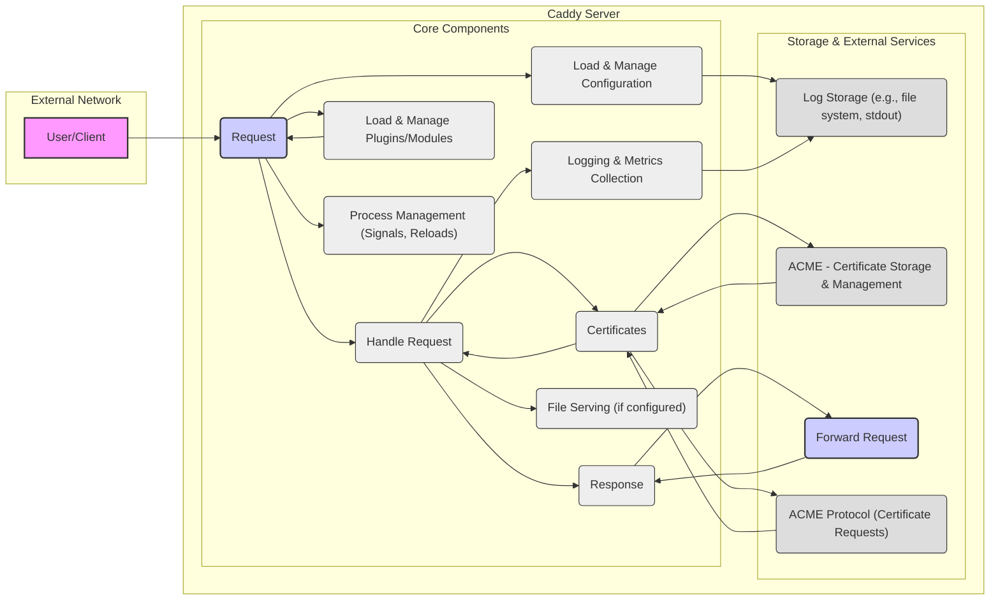

# Project Design Document: Caddy Server (Improved)

**Project Name:** Caddy Server

**Project Repository:** [https://github.com/caddyserver/caddy](https://github.com/caddyserver/caddy)

**Document Version:** 1.1
**Date:** October 26, 2023
**Author:** Gemini (AI Expert in Software, Cloud, and Cybersecurity Architecture)

## 1. Project Overview

Caddy Server is a modern, open-source web server written in Go, designed for ease of use, automatic HTTPS, and extensibility. It serves as a robust and secure platform for serving web applications, static websites, and acting as a reverse proxy and load balancer. Caddy's primary goal is to simplify web infrastructure management while maintaining high security standards.

**Key Features:**

*   **Automatic HTTPS:**  Effortlessly secures websites with TLS certificates obtained and renewed automatically via Let's Encrypt or custom ACME providers. Supports OCSP stapling and HSTS.
*   **HTTP/2 & HTTP/3 Support:**  Enables modern HTTP protocols for optimized performance and reduced latency.
*   **Reverse Proxy with Load Balancing:**  Intelligent reverse proxy capabilities with various load balancing algorithms (round-robin, least_conn) and health checks for backend servers.
*   **Static File Serving:**  Efficiently serves static content with features like directory listings (configurable), index files, and range requests.
*   **Flexible Configuration:**  Supports two primary configuration methods:
    *   **Caddyfile:** A user-friendly, declarative configuration language designed for simplicity.
    *   **JSON:** A programmatic, structured format for advanced configurations and automation.
*   **Extensible Plugin Architecture:**  Modular design allowing for extensive customization and feature expansion through plugins. Plugins can add new directives, handlers, and functionalities.
*   **Cross-Platform Compatibility:**  Runs seamlessly on major operating systems including Linux, macOS, Windows, and BSD variants due to Go's cross-compilation capabilities.
*   **Security by Default:**  Emphasizes secure defaults, including automatic HTTPS, secure cipher suites, and mitigations against common web vulnerabilities.
*   **Graceful Reloads:**  Supports zero-downtime configuration reloads, ensuring continuous service availability.
*   **Metrics and Telemetry:**  Provides built-in metrics endpoints (Prometheus format) for monitoring server performance and health.

**Purpose of this Document:**

This document provides a detailed architectural design of Caddy Server, focusing on components, data flow, and security considerations. It serves as a foundation for threat modeling activities, enabling the identification of potential security vulnerabilities and the design of appropriate security mitigations. This document is intended for security professionals, developers, and operations teams involved in deploying and managing Caddy Server.

## 2. System Architecture Diagram

## 3. Component Description

This section provides a detailed description of each component within the Caddy Server architecture.

*   **A. User/Client:** Represents any external entity initiating requests to Caddy Server, such as web browsers, mobile applications, APIs clients, or automated scripts. This is the primary interface with the external network.

*   **B. Caddy Core:** The central orchestrator of Caddy Server. It manages the lifecycle of requests, configuration, and plugins. Key responsibilities include:
    *   Initialization and management of all modules.
    *   Request routing and dispatching to appropriate handlers.
    *   Configuration management lifecycle (loading, reloading, validation).
    *   Plugin loading, management, and API exposure.
    *   Process management and signal handling for graceful reloads and shutdowns.

*   **C. Configuration Loader & Manager:**  Responsible for loading, parsing, validating, and managing Caddy's configuration.
    *   **Functionality:**
        *   Loads configuration from various sources: Caddyfile, JSON files, environment variables, and potentially external configuration providers (via plugins).
        *   Parses configuration into an internal representation.
        *   Validates configuration syntax and semantics.
        *   Manages configuration changes and triggers graceful reloads.
        *   Provides an API for programmatic configuration management.
    *   **Interaction:** Interacts with `Caddy Core` to provide the active configuration, `Configuration Storage` to read configuration data, and `Process Manager` for graceful reloads upon configuration changes.

*   **D. HTTP/S Server:**  The core HTTP server component responsible for handling incoming HTTP and HTTPS requests.
    *   **Functionality:**
        *   Listens on configured ports (default 80 for HTTP, 443 for HTTPS).
        *   Accepts and processes HTTP/1.1, HTTP/2, and HTTP/3 connections.
        *   Handles request parsing and response generation.
        *   Dispatches requests to appropriate handlers based on configuration (e.g., Reverse Proxy, File Server, Plugins).
        *   Integrates with the `TLS/HTTPS Module` for secure connections.
    *   **Interaction:** Interacts with `Caddy Core` for request handling, `TLS/HTTPS Module` for TLS termination, `Reverse Proxy Module`, `File Server Module`, `Plugin/Module System`, and `Logging & Metrics Module`.

*   **E. TLS/HTTPS Module (ACME, Cert Management):** Manages TLS/HTTPS encryption, certificate acquisition, and renewal.
    *   **Functionality:**
        *   Handles TLS handshake and encryption/decryption using configured TLS settings and cipher suites.
        *   Automatic certificate acquisition and renewal using ACME protocol (e.g., Let's Encrypt, ZeroSSL).
        *   Supports custom ACME providers and manual certificate management.
        *   Manages certificate storage and loading from `ACME Certificate Storage`.
        *   Implements security best practices like OCSP stapling, HSTS, and secure TLS defaults.
    *   **Interaction:** Interacts with `HTTP/S Server` for TLS connection handling, `ACME Certificate Storage` for certificate persistence, and `ACME Provider` for certificate requests and renewals.

*   **F. Reverse Proxy Module (Load Balancer, Health Checks):**  Provides reverse proxy functionality with load balancing and health check capabilities.
    *   **Functionality:**
        *   Proxies requests to backend servers based on configured rules.
        *   Supports various load balancing algorithms (round-robin, least_conn, etc.).
        *   Performs health checks on backend servers to ensure availability.
        *   Supports request and response header manipulation.
        *   Can handle connection pooling and keep-alives to backend servers.
    *   **Interaction:** Interacts with `HTTP/S Server` to receive requests and send responses, `Backend Services` to forward requests and receive responses, and `Logging & Metrics Module` for logging proxy activities.

*   **G. File Server Module (Static Content):**  Serves static files from the file system efficiently.
    *   **Functionality:**
        *   Serves static files (HTML, CSS, JavaScript, images, etc.) from configured directories.
        *   Handles directory listings (configurable to enable or disable).
        *   Supports index files (e.g., `index.html`).
        *   Implements efficient file serving mechanisms (e.g., sendfile).
        *   Handles range requests for efficient media streaming.
    *   **Interaction:** Interacts with `HTTP/S Server` to receive requests and send responses, and the local file system to access and serve files.

*   **H. Logging & Metrics Module:**  Handles logging of server events, access logs, and collects server metrics.
    *   **Functionality:**
        *   Logs server events, errors, and access logs in configurable formats (e.g., JSON, Common Log Format).
        *   Supports various log destinations (files, stdout, syslog, network destinations via plugins).
        *   Provides configurable logging levels and verbosity.
        *   Collects and exposes server metrics in Prometheus format (e.g., request counts, latency, resource usage).
    *   **Interaction:** Interacts with `HTTP/S Server`, `Reverse Proxy Module`, `File Server Module`, and other modules to collect log and metric data. Writes logs to `Configuration Storage` or external logging systems. Exposes metrics via HTTP endpoint.

*   **I. Plugin/Module System & API:**  Provides extensibility and customization capabilities through a plugin architecture and API.
    *   **Functionality:**
        *   Allows users to extend Caddy's functionality by developing and installing plugins.
        *   Plugins can implement new directives, handlers, middleware, log formats, storage backends, and more.
        *   Provides a well-defined API for plugins to interact with Caddy Core and other modules.
        *   Supports dynamic plugin loading and management.
    *   **Interaction:** Interacts with `Caddy Core` for plugin loading and management. Plugins can interact with other Caddy modules and external systems through the provided API.

*   **J. Process Manager (Graceful Reloads):** Manages the Caddy server process, enabling graceful reloads and shutdowns.
    *   **Functionality:**
        *   Handles signals for server control (e.g., reload, shutdown).
        *   Implements graceful reload mechanism to minimize downtime during configuration changes.
        *   Manages child processes (if any, for plugin isolation or other purposes).
        *   Ensures proper shutdown and resource cleanup.
    *   **Interaction:** Interacts with `Caddy Core` to initiate reloads and shutdowns based on configuration changes or external signals.

*   **K. Configuration Storage (Filesystem, Config Providers):**  Persistent storage for Caddy's configuration data.
    *   **Functionality:**
        *   Stores Caddy's configuration files (Caddyfile, JSON).
        *   Default storage is the local file system.
        *   Supports pluggable configuration providers (e.g., etcd, Consul, cloud-based configuration services via plugins).
    *   **Interaction:** Accessed by `Configuration Loader & Manager` to read and potentially write configuration data.

*   **L. ACME Certificate Storage (Filesystem, Key Vaults):** Persistent and secure storage for TLS certificates and private keys obtained via ACME.
    *   **Functionality:**
        *   Stores TLS certificates and private keys obtained from ACME providers.
        *   Default storage is the local file system (securely).
        *   Supports pluggable certificate storage backends (e.g., key vaults, HSMs via plugins) for enhanced security and scalability.
    *   **Interaction:** Accessed by `TLS/HTTPS Module` to store, retrieve, and manage certificates.

*   **M. Backend Services (Optional Application Servers):**  External backend servers that Caddy proxies requests to when acting as a reverse proxy. These can be application servers, databases, API gateways, or other services.

*   **N. ACME Provider (e.g., Let's Encrypt):**  External service providing ACME protocol support for automated certificate issuance. Caddy interacts with ACME providers like Let's Encrypt to obtain and renew TLS certificates automatically.

## 4. Data Flow (Detailed)

The data flow for a client request to Caddy Server, including more detail on specific steps, is as follows:

1.  **Client Request Initiation:** A `User/Client` initiates an HTTP/S request targeting Caddy Server's public IP address or hostname.
2.  **Network Reception:** The request reaches Caddy Server and is received by the `HTTP/S Server` component listening on the configured port (80 or 443).
3.  **Connection Establishment & TLS Handshake (HTTPS):**
    *   For HTTPS requests, the `TLS/HTTPS Module` initiates the TLS handshake process with the client.
    *   This involves certificate exchange, cipher suite negotiation, and key exchange to establish a secure, encrypted connection.
    *   The `TLS/HTTPS Module` retrieves the appropriate TLS certificate from `ACME Certificate Storage`.
4.  **Request Parsing:** The `HTTP/S Server` parses the incoming HTTP request, including headers, method, URI, and body.
5.  **Configuration Lookup & Route Matching:**
    *   `Caddy Core` consults the loaded configuration from `Configuration Loader & Manager`.
    *   Based on the request's hostname, path, and other criteria, Caddy determines the appropriate route and handler to process the request.
6.  **Handler Execution:** Based on the route, one of the following handlers is typically invoked:
    *   **Reverse Proxy Module:** If the route is configured for reverse proxying, the `Reverse Proxy Module` is activated.
        *   It selects a backend server from the configured pool based on the load balancing algorithm.
        *   It forwards the request to the selected `Backend Service`.
        *   Optionally, request headers or body might be modified before forwarding.
    *   **File Server Module:** If the route is configured for static file serving, the `File Server Module` is activated.
        *   It maps the requested path to a file on the file system.
        *   It retrieves the file content from the file system.
    *   **Plugin Handler:** If a plugin provides a custom handler for the route, that plugin's handler is executed.
7.  **Backend Processing (Reverse Proxy):** The `Backend Service` processes the proxied request and generates a response.
8.  **Response Reception (Reverse Proxy):** The `Reverse Proxy Module` receives the response from the `Backend Service`. Optionally, response headers or body might be modified before forwarding to the client.
9.  **Response Generation (File Server or Plugin):** The `File Server Module` retrieves the file content or generates a directory listing as the response. Plugin handlers generate responses based on their logic.
10. **Response Construction & Sending:** The `HTTP/S Server` constructs the HTTP response, including headers and body.
11. **TLS Encryption (HTTPS):** For HTTPS connections, the `TLS/HTTPS Module` encrypts the response before sending it back to the client.
12. **Response Transmission:** The `HTTP/S Server` transmits the response back to the `User/Client` over the network.
13. **Logging & Metrics:** The `Logging & Metrics Module` logs the request details (access logs) and collects relevant metrics about request processing.

## 5. Technology Stack

Caddy Server leverages the following technology stack:

*   **Core Language:** Go (Golang) - chosen for its performance, concurrency, and security features.
*   **Standard Go Libraries:**  Extensive use of Go's standard library, including `net/http` for HTTP handling, `crypto/tls` for TLS, `encoding/json` for JSON configuration, and more.
*   **Third-Party Go Libraries:**  Selectively uses well-vetted third-party libraries for specific functionalities, ensuring security and stability. Examples include libraries for ACME client implementation, Prometheus metrics exposition, and potentially storage backend integrations.
*   **Configuration Languages:**
    *   **Caddyfile:**  Custom, human-readable configuration language. Parsed using a custom parser written in Go.
    *   **JSON:** Standard JSON format for programmatic configuration. Parsed using Go's `encoding/json` library.
*   **TLS Certificate Management:**
    *   **ACME Protocol:**  Primarily uses the ACME protocol (RFC 8555) for automatic certificate issuance and renewal.
    *   **Let's Encrypt:**  The most common ACME provider used by default. Supports other ACME providers.
    *   **x509 Certificates:**  Uses standard x509 certificates for TLS encryption.
*   **Storage:**
    *   **Filesystem:** Default storage backend for configuration and certificates.
    *   **Pluggable Storage Backends:** Supports plugins for integrating with various storage systems like key vaults, cloud storage, databases, etc.
*   **Operating System Compatibility:**  Designed for cross-platform compatibility and runs on Linux, macOS, Windows, FreeBSD, and other OSes supported by the Go runtime.

## 6. Security Considerations for Threat Modeling (Categorized & Detailed)

When conducting threat modeling for Caddy Server, consider the following security aspects, categorized for clarity:

**A. Configuration & Management:**

*   **Configuration File Vulnerabilities:**
    *   **Misconfigurations:**  Accidental or intentional misconfigurations in Caddyfile or JSON can introduce vulnerabilities (e.g., overly permissive reverse proxy rules, insecure TLS settings, exposing sensitive internal paths, allowing directory listings in production).
    *   **Injection Vulnerabilities:**  Potential vulnerabilities in configuration parsing logic that could be exploited through crafted configuration files (e.g., Caddyfile parsing errors leading to unexpected behavior, JSON injection if external data is incorporated into JSON config without proper sanitization).
    *   **Unauthorized Configuration Access/Modification:**  Lack of proper access controls on configuration files could allow unauthorized users to modify Caddy's behavior, leading to service disruption or security breaches.
    *   **Secrets Management:**  Improper handling of secrets (API keys, database credentials) within configuration files. Secrets should be stored securely (e.g., environment variables, key vaults) and not directly embedded in configuration files if possible.

**B. Network & TLS/HTTPS:**

*   **TLS/HTTPS Implementation Vulnerabilities:**
    *   **Vulnerabilities in Go's `crypto/tls` library:** Although Go's TLS library is generally robust, vulnerabilities can be discovered. Keeping Go and Caddy updated is crucial.
    *   **Weak TLS Configurations:**  Using outdated or weak TLS protocol versions (TLS 1.0, 1.1), weak cipher suites, or disabling security features like HSTS or OCSP stapling can weaken security.
    *   **Certificate Validation Issues:**  Problems with certificate validation logic could lead to accepting invalid or malicious certificates, enabling Man-in-the-Middle (MITM) attacks.
    *   **Private Key Exposure:**  Compromise of private keys used for TLS certificates would allow attackers to impersonate the server and decrypt traffic. Secure storage of private keys is paramount.
    *   **ACME Protocol Vulnerabilities:**  Potential vulnerabilities in the ACME client implementation or the ACME protocol itself could be exploited to obtain unauthorized certificates or disrupt certificate management.

**C. Application Logic & Modules:**

*   **Reverse Proxy Vulnerabilities:**
    *   **Server-Side Request Forgery (SSRF):**  Misconfigured reverse proxy rules or insufficient input validation could allow attackers to force Caddy to make requests to internal or external resources, potentially exposing sensitive data or internal services.
    *   **HTTP Request Smuggling:**  Vulnerabilities in request parsing or handling between Caddy and backend servers could lead to HTTP request smuggling attacks, allowing attackers to bypass security controls or inject malicious requests.
    *   **Backend Server Vulnerability Exposure:**  Caddy might inadvertently expose vulnerabilities in backend servers if not properly configured or if request/response sanitization is insufficient.
    *   **Open Proxy Risk:**  Misconfiguration could turn Caddy into an open proxy, allowing attackers to use it to proxy malicious traffic.

*   **File Server Vulnerabilities:**
    *   **Directory Traversal:**  Vulnerabilities allowing attackers to access files outside the intended document root, potentially exposing sensitive files.
    *   **Information Disclosure:**  Accidental exposure of sensitive files due to misconfiguration or overly permissive directory listings.
    *   **Denial of Service (DoS) via File Requests:**  Attackers could exploit file serving functionality to launch DoS attacks by requesting excessively large files or making a large number of requests for static files.

*   **Plugin/Module Security:**
    *   **Third-Party Plugin Vulnerabilities:**  Plugins developed by third parties might contain security vulnerabilities that could compromise Caddy Server. Thoroughly vet and audit plugins before use.
    *   **Malicious Plugins:**  The risk of installing intentionally malicious plugins that could steal data, disrupt service, or compromise the server. Use plugins from trusted sources only.
    *   **Plugin Isolation Issues:**  Insufficient isolation between plugins or between plugins and the Caddy core could allow a vulnerable or malicious plugin to compromise the entire server.

**D. Logging & Monitoring:**

*   **Sensitive Information in Logs:**  Accidental logging of sensitive information (passwords, API keys, personal data) in access logs or error logs. Log redaction and careful log configuration are necessary.
*   **Insufficient Logging:**  Lack of sufficient logging can hinder security auditing, incident response, and forensic analysis. Ensure comprehensive logging of relevant events.
*   **Log Injection Vulnerabilities:**  If log messages are not properly sanitized, attackers might be able to inject malicious data into logs, potentially leading to log manipulation or exploitation of log processing systems.

**E. Dependency Management:**

*   **Third-Party Dependency Vulnerabilities:**  Caddy relies on third-party Go libraries. Vulnerabilities in these dependencies could indirectly affect Caddy. Regular dependency updates and vulnerability scanning are essential.
*   **Supply Chain Attacks:**  Risk of compromised dependencies being introduced into the Caddy build process or plugin ecosystem. Use trusted sources for dependencies and plugins and implement supply chain security measures.

**F. Access Control & Authentication:**

*   **Administrative Interface Security:**  If Caddy exposes any administrative interfaces (e.g., for configuration management or monitoring), ensure they are properly secured with strong authentication and authorization mechanisms to prevent unauthorized access.
*   **Lack of Authentication for Protected Resources:**  Failure to implement authentication and authorization for resources that require protection (e.g., backend services, specific file paths) can lead to unauthorized access.

**G. Denial of Service (DoS):**

*   **Network-Level DoS:**  Susceptibility to network-level DoS attacks targeting Caddy's network infrastructure. Use network security measures (firewalls, rate limiting, DDoS mitigation services).
*   **Application-Level DoS:**  Vulnerabilities that could be exploited to launch application-level DoS attacks, such as resource exhaustion attacks, slowloris attacks, or attacks targeting specific modules (e.g., file server). Implement rate limiting, connection limits, and resource management controls.

**H. Input Validation & Output Encoding:**

*   **Insufficient Input Validation:**  Lack of proper input validation in request handling, configuration parsing, and plugin interfaces can lead to various vulnerabilities, including injection attacks and unexpected behavior.
*   **Cross-Site Scripting (XSS):**  If user-controlled data is reflected in responses without proper output encoding, XSS vulnerabilities could arise, especially if Caddy is used to serve dynamic content or proxy applications that are vulnerable to XSS.

This improved design document provides a more comprehensive and detailed overview of Caddy Server's architecture and security considerations, making it a more effective tool for threat modeling and security analysis. Remember to continuously update this document as Caddy Server evolves and new security threats emerge.