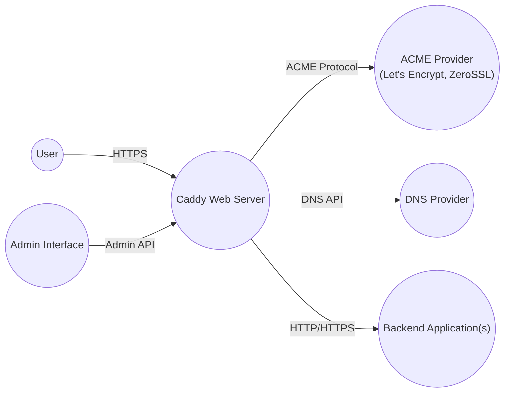
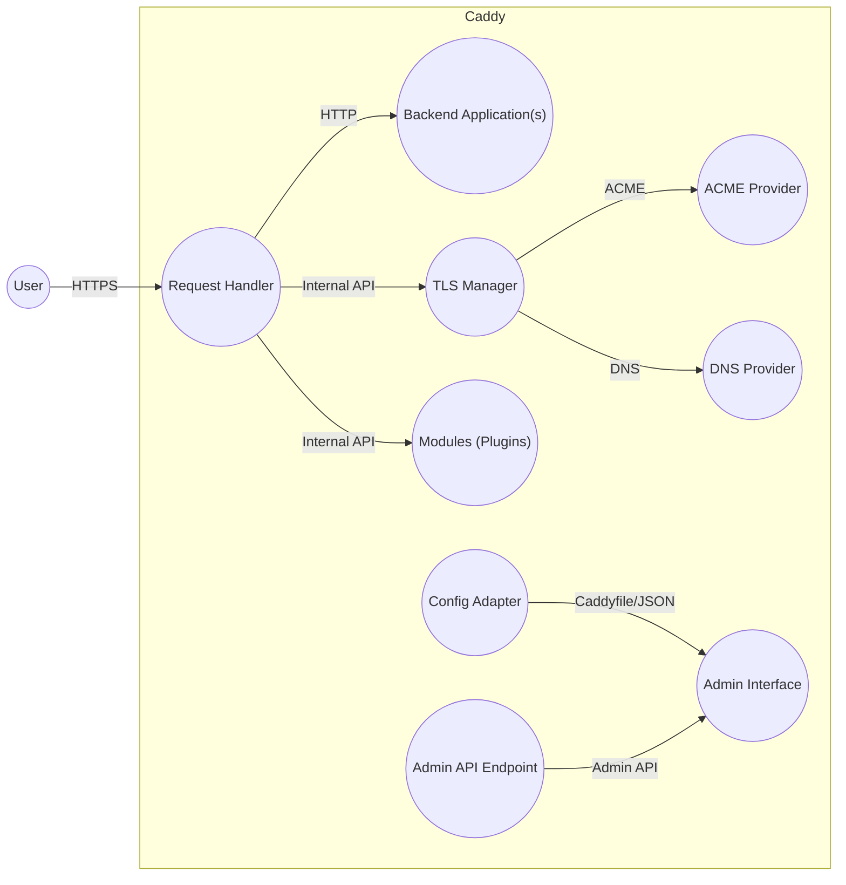
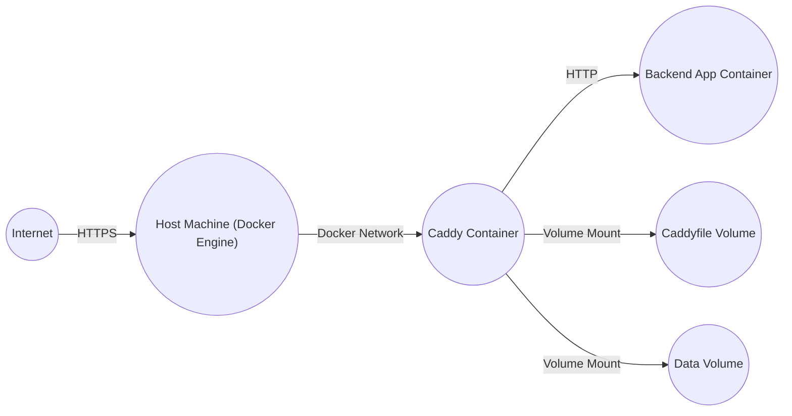
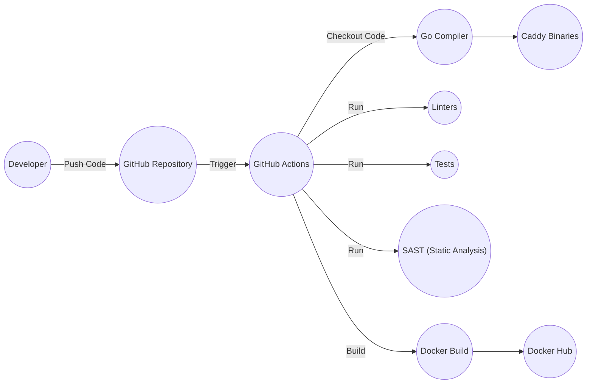

# BUSINESS POSTURE

Caddy is a powerful, open-source web server written in Go. It's designed for ease of use and security, with automatic HTTPS being a core feature. Based on the GitHub repository, here's a breakdown of the business posture:

Priorities and Goals:

*   Provide a user-friendly web server that simplifies HTTPS configuration.
*   Offer a secure-by-default experience, minimizing manual configuration for security features.
*   Maintain high performance and efficiency.
*   Support a wide range of use cases, from simple static sites to complex reverse proxy setups.
*   Foster a strong community and ecosystem around the project.
*   Offer commercial options for users who need additional features or support.

Business Risks:

*   Vulnerabilities in the Caddy codebase could lead to server compromise, data breaches, or denial-of-service attacks.
*   Misconfiguration by users (despite the focus on ease of use) could expose sensitive data or create security vulnerabilities.
*   Dependence on third-party libraries (Go modules) introduces supply chain risks.
*   Failure to keep up with evolving web standards and security best practices could render Caddy less effective or secure over time.
*   Competition from other web servers (e.g., Nginx, Apache) could impact adoption and market share.
*   Reputational damage from security incidents could erode trust in the project.

# SECURITY POSTURE

Existing Security Controls:

*   security control: Automatic HTTPS: Caddy obtains and renews TLS certificates automatically via Let's Encrypt or ZeroSSL. This is a core feature and is described extensively in the documentation.
*   security control: Secure defaults: Caddy is designed with secure defaults, minimizing the need for manual security configuration. This is evident throughout the codebase and documentation.
*   security control: Memory safety: Being written in Go, Caddy benefits from Go's memory safety features, reducing the risk of buffer overflows and other memory-related vulnerabilities.
*   security control: Regular updates: The project has a frequent release cycle, indicating that security patches and updates are likely to be addressed promptly.
*   security control: Community scrutiny: As an open-source project, Caddy benefits from scrutiny by a large community of developers and security researchers.
*   security control: HTTP/2 and HTTP/3 support: Caddy supports modern HTTP protocols, which offer performance and security improvements.
*   security control: Security headers: Caddy allows easy configuration of security headers like HSTS, CSP, etc. (mentioned in documentation).
*   security control: Access logs: Caddy provides access logging capabilities, which are crucial for auditing and incident response.

Accepted Risks:

*   accepted risk: Third-party library vulnerabilities: While Go's package management system helps, there's always a risk of vulnerabilities in dependencies.
*   accepted risk: User misconfiguration: Even with secure defaults, users can still misconfigure Caddy, creating security risks.
*   accepted risk: Zero-day vulnerabilities: Like any software, Caddy is susceptible to unknown vulnerabilities.
*   accepted risk: Denial of Service: While Caddy is performant, it's still vulnerable to DoS attacks, especially if not properly configured with rate limiting or other mitigation techniques.

Recommended Security Controls:

*   Implement a robust vulnerability disclosure program (VDP) to encourage responsible reporting of security issues.
*   Perform regular security audits and penetration testing, both internally and by external experts.
*   Integrate Software Composition Analysis (SCA) tools into the build process to identify and manage vulnerabilities in third-party dependencies.
*   Implement fuzzing to proactively discover potential vulnerabilities.
*   Consider developing a formal security model and threat model for Caddy.

Security Requirements:

*   Authentication:
    *   Caddy itself primarily deals with serving content and doesn't inherently manage user authentication for websites. Authentication is typically handled by applications behind Caddy or through Caddy modules (plugins).
    *   Requirement: If authentication is implemented via modules, ensure secure storage of credentials (e.g., using appropriate hashing algorithms) and protection against common authentication attacks (e.g., brute-force, credential stuffing).
    *   Requirement: Support for multi-factor authentication (MFA) should be considered where appropriate.

*   Authorization:
    *   Caddy can control access to resources based on various criteria (e.g., IP address, request path).
    *   Requirement: Access control mechanisms should follow the principle of least privilege.
    *   Requirement: Ensure that authorization checks are performed consistently and correctly, avoiding bypass vulnerabilities.

*   Input Validation:
    *   Caddy itself handles incoming HTTP requests and must be robust against malformed or malicious input.
    *   Requirement: All input from clients (headers, request bodies, query parameters) should be strictly validated and sanitized to prevent injection attacks (e.g., XSS, command injection).
    *   Requirement: Caddy modules should also perform thorough input validation.

*   Cryptography:
    *   Caddy's core functionality relies on TLS for secure communication.
    *   Requirement: Use strong, up-to-date cryptographic algorithms and protocols (e.g., TLS 1.3).
    *   Requirement: Ensure proper key management and protection.
    *   Requirement: Avoid using weak or deprecated ciphers.
    *   Requirement: If custom cryptography is used in modules, it should be implemented by security experts and thoroughly reviewed.

# DESIGN

## C4 CONTEXT

Element Descriptions:

*   Element:
    *   Name: User
    *   Type: Person
    *   Description: Represents a user accessing websites or services hosted by Caddy.
    *   Responsibilities: Accessing web content, interacting with web applications.
    *   Security controls: Browser security features, HTTPS.

*   Element:
    *   Name: Caddy Web Server
    *   Type: Software System
    *   Description: The Caddy web server itself.
    *   Responsibilities: Serving web content, managing TLS certificates, routing requests, enforcing security policies.
    *   Security controls: Automatic HTTPS, secure defaults, memory safety (Go), HTTP/2 & HTTP/3 support, security headers, access logs.

*   Element:
    *   Name: ACME Provider (Let's Encrypt, ZeroSSL)
    *   Type: External System
    *   Description: An ACME (Automated Certificate Management Environment) provider used for obtaining TLS certificates.
    *   Responsibilities: Issuing and revoking TLS certificates.
    *   Security controls: ACME protocol security, certificate transparency.

*   Element:
    *   Name: DNS Provider
    *   Type: External System
    *   Description: A DNS provider used for managing DNS records, often required for ACME DNS challenges.
    *   Responsibilities: Managing DNS records.
    *   Security controls: DNSSEC, API security.

*   Element:
    *   Name: Backend Application(s)
    *   Type: Software System
    *   Description: Applications or services running behind Caddy, which Caddy may proxy requests to.
    *   Responsibilities: Handling application-specific logic.
    *   Security controls: Application-specific security measures, input validation, authentication, authorization.

*   Element:
    *   Name: Admin Interface
    *   Type: Person/Software System
    *   Description: The interface used to administer Caddy, typically via a command-line interface or a configuration file (Caddyfile).
    *   Responsibilities: Configuring Caddy, monitoring its status.
    *   Security controls: Access controls, secure configuration practices.

## C4 CONTAINER

Element Descriptions:

*   Element:
    *   Name: Request Handler
    *   Type: Container
    *   Description: Handles incoming HTTP requests, routing them to the appropriate modules and backend applications.
    *   Responsibilities: Request parsing, routing, header manipulation, connection management.
    *   Security controls: Input validation, rate limiting, connection security.

*   Element:
    *   Name: TLS Manager
    *   Type: Container
    *   Description: Manages TLS certificates, including obtaining, renewing, and configuring them.
    *   Responsibilities: ACME client, certificate storage, TLS configuration.
    *   Security controls: Secure key management, certificate validation, OCSP stapling.

*   Element:
    *   Name: Modules (Plugins)
    *   Type: Container
    *   Description: Extends Caddy's functionality with additional features (e.g., reverse proxy, caching, authentication).
    *   Responsibilities: Varies depending on the module.
    *   Security controls: Module-specific security measures, input validation.

*   Element:
    *   Name: Config Adapter
    *   Type: Container
    *   Description: Parses and applies configuration from various sources (e.g., Caddyfile, JSON).
    *   Responsibilities: Configuration parsing, validation, and application.
    *   Security controls: Secure configuration parsing, input validation.

*   Element:
    *   Name: Admin API Endpoint
    *   Type: Container
    *   Description: Provides an API for administering Caddy.
    *   Responsibilities: Exposing administrative functions.
    *   Security controls: Authentication, authorization, input validation.

*   Element:
    *   Name: User
    *   Type: Person
    *   Description: Represents a user accessing websites or services hosted by Caddy.
    *   Responsibilities: Accessing web content, interacting with web applications.
    *   Security controls: Browser security features, HTTPS.

*   Element:
    *   Name: ACME Provider
    *   Type: External System
    *   Description: An ACME (Automated Certificate Management Environment) provider used for obtaining TLS certificates.
    *   Responsibilities: Issuing and revoking TLS certificates.
    *   Security controls: ACME protocol security, certificate transparency.

*   Element:
    *   Name: DNS Provider
    *   Type: External System
    *   Description: A DNS provider used for managing DNS records, often required for ACME DNS challenges.
    *   Responsibilities: Managing DNS records.
    *   Security controls: DNSSEC, API security.

*   Element:
    *   Name: Backend Application(s)
    *   Type: Software System
    *   Description: Applications or services running behind Caddy, which Caddy may proxy requests to.
    *   Responsibilities: Handling application-specific logic.
    *   Security controls: Application-specific security measures, input validation, authentication, authorization.

*   Element:
    *   Name: Admin Interface
    *   Type: Person/Software System
    *   Description: The interface used to administer Caddy, typically via a command-line interface or a configuration file (Caddyfile).
    *   Responsibilities: Configuring Caddy, monitoring its status.
    *   Security controls: Access controls, secure configuration practices.

## DEPLOYMENT

Possible Deployment Solutions:

1.  Bare Metal/Virtual Machine: Caddy is downloaded and run directly on a server.
2.  Docker Container: Caddy is run within a Docker container.
3.  Kubernetes: Caddy is deployed as a pod within a Kubernetes cluster, often using an Ingress controller.
4.  Cloud Provider-Specific Services: Using managed services like AWS Fargate, Google Cloud Run, or Azure Container Instances.

Chosen Solution (Detailed Description): Docker Container

Caddy is often deployed as a Docker container due to its ease of use, portability, and reproducibility. The official Caddy Docker image is available on Docker Hub.

Element Descriptions:

*   Element:
    *   Name: Internet
    *   Type: External
    *   Description: The public internet.
    *   Responsibilities: Routing traffic to the host machine.
    *   Security controls: Network firewalls, DDoS protection.

*   Element:
    *   Name: Host Machine (Docker Engine)
    *   Type: Infrastructure Node
    *   Description: The physical or virtual machine running the Docker Engine.
    *   Responsibilities: Running Docker containers.
    *   Security controls: Host OS hardening, firewall, intrusion detection/prevention systems.

*   Element:
    *   Name: Caddy Container
    *   Type: Container Instance
    *   Description: The running instance of the Caddy Docker image.
    *   Responsibilities: Serving web content, managing TLS certificates, routing requests.
    *   Security controls: Container isolation, resource limits, security context.

*   Element:
    *   Name: Backend App Container
    *   Type: Container Instance
    *   Description: A container running a backend application served by Caddy.
    *   Responsibilities: Handling application-specific logic.
    *   Security controls: Container isolation, application-specific security measures.

*   Element:
    *   Name: Caddyfile Volume
    *   Type: Volume
    *   Description: A Docker volume containing the Caddyfile (configuration).
    *   Responsibilities: Persisting Caddy's configuration.
    *   Security controls: File system permissions.

*   Element:
    *   Name: Data Volume
    *   Type: Volume
    *   Description: A Docker volume for persisting Caddy's data (e.g., TLS certificates).
    *   Responsibilities: Persisting Caddy's data.
    *   Security controls: File system permissions.

## BUILD

Caddy's build process is automated using GitHub Actions. The process involves building binaries for various platforms, running tests, and creating Docker images.

Security Controls in Build Process:

*   Automated Build: GitHub Actions provides a consistent and reproducible build environment.
*   Linters: Code linters (like `golangci-lint`) are used to enforce code style and identify potential issues.
*   Tests: Comprehensive tests are run to ensure code quality and prevent regressions.
*   Static Analysis (SAST): Go's built-in security checks and potentially additional SAST tools are used to identify potential security vulnerabilities in the code.
*   Software Composition Analysis (SCA): While not explicitly shown in the diagram, SCA should be part of the build process to identify vulnerabilities in dependencies. This is likely done using tools like `go mod`'s vulnerability checking or dedicated SCA tools.
*   Signed Releases: Caddy releases are likely signed to ensure their integrity.
*   Docker Image Security: The Docker build process should follow best practices for creating secure Docker images (e.g., using minimal base images, avoiding running as root).

# RISK ASSESSMENT

Critical Business Processes:

*   Serving web content securely and reliably.
*   Automatic HTTPS certificate management.
*   Providing a user-friendly and extensible web server platform.

Data to Protect:

*   TLS certificates and private keys (Highest sensitivity): Compromise would allow attackers to impersonate the server.
*   Website content (Variable sensitivity): Depending on the website, this could range from public information to highly sensitive data.
*   User data (Variable sensitivity): If Caddy is used to proxy requests to applications that handle user data, this data is also at risk.
*   Configuration files (High sensitivity): Contain sensitive information about the server setup, including potentially credentials for backend services.
*   Access logs (Medium sensitivity): Contain information about website visitors, which could be subject to privacy regulations.

# QUESTIONS & ASSUMPTIONS

Questions:

*   What specific SAST and SCA tools are used in the Caddy build process?
*   Is there a formal vulnerability disclosure program (VDP) in place?
*   Are regular penetration tests conducted?
*   What are the specific procedures for handling security incidents?
*   What are the plans for addressing potential future vulnerabilities in the ACME protocol or its implementations?
*   Are there any specific compliance requirements (e.g., PCI DSS, GDPR) that Caddy deployments need to meet?

Assumptions:

*   BUSINESS POSTURE: The Caddy project prioritizes security and ease of use.
*   SECURITY POSTURE: The development team follows secure coding practices.
*   SECURITY POSTURE: Regular security updates are released to address vulnerabilities.
*   DESIGN: The Caddyfile is the primary configuration mechanism.
*   DESIGN: The official Docker image is the preferred deployment method for many users.
*   DESIGN: GitHub Actions is the primary CI/CD platform.