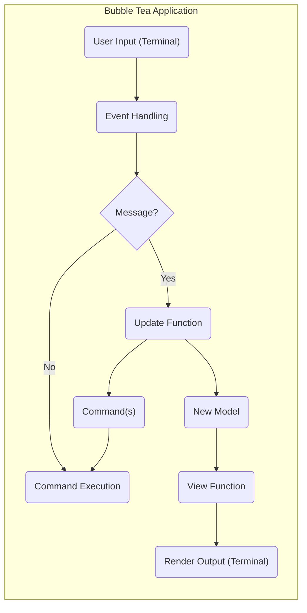
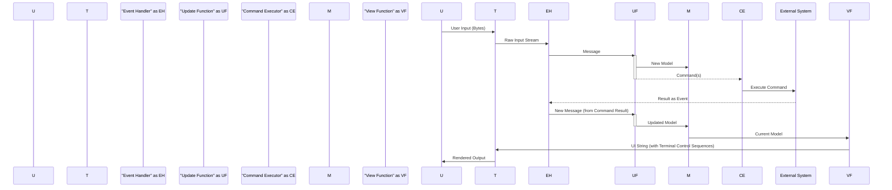

# Project Design Document: Bubble Tea - A Delightful Framework for Terminal UI

**Version:** 1.1
**Date:** October 26, 2023
**Author:** AI Software Architect

## 1. Introduction

This document provides an enhanced and more detailed architectural design for the Bubble Tea framework, a Go library for building terminal user interfaces (TUIs). This revised document aims to provide a clearer and more comprehensive understanding of the components, interactions, and data flow within Bubble Tea, specifically tailored for effective threat modeling activities.

## 2. Goals and Objectives

The primary goal of Bubble Tea is to empower developers to build engaging and functional terminal applications in Go with simplicity and elegance. Key objectives include:

* **Enhanced Simplicity:** Offer an even more intuitive and streamlined API, minimizing boilerplate code and cognitive load.
* **Robust Composability:** Facilitate the creation of intricate UIs through the seamless integration of independent, reusable components.
* **Predictable State Management:** Provide a well-defined and easily understandable mechanism for managing application state transitions.
* **Comprehensive Event Handling:** Offer a flexible and powerful system for capturing and processing a wide range of user inputs and system events.
* **Efficient Rendering:** Ensure performant and reliable rendering of the UI to various terminal environments.

## 3. Architectural Overview

Bubble Tea adheres to the principles of the Elm Architecture, a functional reactive programming pattern known for its clarity and predictability. This architecture promotes immutability, explicit data flow, and a clear separation of concerns. The fundamental components of a Bubble Tea application are:

* **Model:** Encapsulates the entire application state as an immutable data structure.
* **Update:** A pure function that processes incoming messages and the current model to produce a new model and a set of commands.
* **View:** A pure function that transforms the current model into a string representation of the user interface.
* **Message:** Represents an event that necessitates a potential state change within the application.
* **Command:** Represents a side effect or asynchronous operation to be performed outside the core update cycle.

### 3.1. High-Level Architecture Diagram

## 4. Component Descriptions

* **User Input (Terminal):** This represents the raw stream of bytes received from the user's terminal. This includes keystrokes (including special keys and key combinations), mouse events (if supported by the terminal), and signals like window resize events. The encoding and interpretation of this input are terminal-dependent.
* **Event Handling:** This crucial component is responsible for consuming the raw byte stream from the terminal and translating it into structured events or messages that the Bubble Tea application can understand. This involves:
    * **Decoding:** Interpreting the byte stream according to the terminal's encoding (e.g., UTF-8).
    * **Parsing Escape Sequences:** Recognizing and interpreting terminal control sequences for special keys, mouse events, etc.
    * **Event Aggregation:** Potentially combining multiple low-level input events into higher-level semantic events.
    * **Message Creation:**  Constructing specific Message types based on the interpreted events.
* **Message:** A simple, immutable data structure that represents a discrete event that has occurred within or external to the application. Messages are the sole mechanism for triggering state transitions. Examples include:
    * **KeyMsg:** Represents a key press.
    * **MouseMsg:** Represents a mouse event (click, move, scroll).
    * **WindowSizeMsg:** Represents a change in the terminal window size.
    * **Custom Messages:** Application-specific messages representing data received from external sources or internal events.
* **Update Function:** This pure function embodies the core business logic of the application. It takes two arguments:
    * **Current Model:** The current immutable state of the application.
    * **Message:** The event that has occurred.
    It returns a tuple containing:
    * **New Model:** A new, immutable Model representing the updated application state based on the received message. If no state change is needed, it can return the original model.
    * **Command(s):** An optional Command or a list of Commands to be executed as a side effect of the state update.
* **Command:** Represents an instruction to perform an operation that has side effects or is asynchronous. Commands are used to interact with the outside world without directly modifying the application state within the Update function. Examples include:
    * **IO Commands:** Performing file system operations.
    * **Network Commands:** Making HTTP requests or interacting with other network services.
    * **Timer Commands:** Setting timers to trigger future messages.
    * **Custom Commands:** Application-specific commands for interacting with external systems or hardware.
* **Command Execution:** This component is responsible for taking the Commands returned by the Update function and executing them. This often involves interacting with operating system APIs, external libraries, or network services. The results of these command executions are typically transformed into new Messages and fed back into the Update function.
* **Model:** An immutable data structure that holds the entire state of the application at a specific point in time. Immutability ensures predictable state transitions and simplifies reasoning about the application's behavior. The Model can contain any data relevant to the application's current state.
* **View Function:** This pure function is responsible for rendering the user interface. It takes the current Model as input and returns a string representation of the UI to be displayed in the terminal. This involves:
    * **Data Transformation:** Extracting relevant data from the Model.
    * **Layout and Formatting:** Arranging and styling the data using terminal control sequences (e.g., ANSI escape codes for colors, cursor positioning).
    * **String Concatenation:** Building the final UI string.
* **Render Output (Terminal):** This component takes the string output generated by the View function and sends it to the terminal for display. This involves writing the string to the terminal's standard output. The terminal emulator then interprets the control sequences within the string to render the UI visually.

## 5. Data Flow

The data flow in a Bubble Tea application is strictly unidirectional, ensuring a predictable and manageable flow of information:

1. **User Interaction:** The user interacts with the terminal, generating raw input.
2. **Event Handling:** The raw terminal input is captured, decoded, parsed, and translated into a specific Message.
3. **Message Dispatch:** The generated Message is dispatched to the main application loop.
4. **Update Cycle:** The Message and the current Model are passed to the Update function.
5. **State Update:** The Update function processes the Message and returns a new Model representing the updated application state.
6. **Command Generation (Optional):** The Update function may also return one or more Commands to be executed.
7. **Command Execution (Conditional):** If Commands are returned, the Command Execution component executes them.
8. **Command Result as Message:** The results of executed Commands are typically transformed into new Messages.
9. **View Rendering:** The new Model is passed to the View function.
10. **UI Output:** The View function generates a string representation of the UI based on the current Model.
11. **Terminal Rendering:** The UI string is sent to the terminal for rendering.

### 5.1. Data Flow Diagram

## 6. Key Interactions

* **Terminal to Event Handler:** The crucial interaction where raw, unstructured terminal input is transformed into structured, application-understandable events. This is a key area for potential input manipulation attacks.
* **Event Handler to Update Function:** The delivery of Messages, the primary triggers for state changes. The integrity and validity of these messages are important.
* **Update Function to Model:** The core logic for state transitions. Ensuring the Update function is pure and predictable is vital for security and maintainability.
* **Update Function to Command Executor:** The mechanism for initiating side effects. The types of commands and their parameters need careful consideration from a security perspective.
* **Command Executor to External Systems:** Interactions with the outside world, representing potential attack vectors if not handled securely.
* **External Systems to Event Handler (via Command Results):** The feedback loop where results of external operations are converted into Messages. The integrity of this data is important.
* **Model to View Function:** The transformation of application state into the user interface. Care must be taken to avoid displaying sensitive information unintentionally.

## 7. Security Considerations

This section details potential security considerations relevant to Bubble Tea applications, providing a foundation for threat modeling.

* **Input Validation and Sanitization:** Applications must rigorously validate and sanitize all user input received from the terminal. Failure to do so can lead to various vulnerabilities:
    * **Command Injection:** Maliciously crafted input could be interpreted as commands by the underlying shell or application.
    * **Denial of Service (DoS):**  Excessively long or specially crafted input could overwhelm the application or terminal.
    * **Unexpected Behavior:** Invalid input could lead to crashes or incorrect application state.
    * **Consideration:** How does Bubble Tea facilitate input validation? Are there recommended patterns or middleware for sanitizing input before it reaches the Update function?
* **State Management Vulnerabilities:** While immutability helps, vulnerabilities can still arise:
    * **Insecure State Transitions:** Flaws in the Update function logic could lead to unintended or insecure state changes.
    * **Exposure of Sensitive Data in State:**  Storing sensitive information directly in the Model without proper protection could lead to exposure through the View function or debugging tools.
    * **Consideration:** What are the best practices for structuring the Model to minimize the risk of exposing sensitive information? How can developers ensure the Update function enforces secure state transitions?
* **Command Execution Risks:** Executing commands, especially those interacting with external systems, introduces significant security risks:
    * **Arbitrary Code Execution:** If user input or application state directly influences the commands being executed, it could lead to arbitrary code execution on the host system.
    * **Privilege Escalation:**  Commands executed with elevated privileges could be abused.
    * **Data Breaches:** Commands interacting with databases or network services could be exploited to access or modify sensitive data.
    * **Consideration:** How can developers restrict the types of commands that can be executed? How can they ensure that command parameters are safe and not influenced by malicious input? Are there mechanisms for sandboxing or limiting the privileges of command execution?
* **Terminal Emulation Attacks:** While Bubble Tea doesn't directly handle terminal emulation, vulnerabilities in the terminal emulator itself can be exploited:
    * **Escape Sequence Injection:** Maliciously crafted escape sequences embedded in the UI output could be interpreted by the terminal to perform unintended actions (e.g., clearing the screen, changing the window title, even executing commands in some cases).
    * **Consideration:** How can developers mitigate the risk of terminal escape sequence injection? Are there libraries or techniques for sanitizing output before rendering?
* **Information Disclosure:**  Careless rendering of the UI can lead to unintentional disclosure of sensitive information:
    * **Displaying Secrets:** Accidentally displaying passwords, API keys, or other sensitive data in the terminal output.
    * **Verbose Error Messages:**  Displaying overly detailed error messages that reveal internal system information.
    * **Consideration:** What are the best practices for handling and displaying sensitive information in a terminal UI? How can developers prevent accidental disclosure through error messages or debugging output?
* **Dependency Vulnerabilities:**  Like any software project, Bubble Tea applications rely on external libraries. Vulnerabilities in these dependencies can introduce security risks.
    * **Consideration:** What are the recommended practices for managing dependencies and staying updated with security patches in Go projects using Bubble Tea? Are there tools for scanning dependencies for known vulnerabilities?
* **Side-Channel Attacks:**  While less common in terminal applications, consider potential side-channel attacks:
    * **Timing Attacks:**  Information could be leaked based on the time it takes for certain operations to complete.
    * **Consideration:** Are there any performance-sensitive operations in Bubble Tea applications that could be susceptible to timing attacks?

## 8. Deployment Considerations

Secure deployment of Bubble Tea applications involves several key considerations:

* **Binary Security:** Ensure the integrity and authenticity of the compiled binary. Use code signing to verify the publisher.
* **Permissions:**  Apply the principle of least privilege. Ensure the executable runs with the minimum necessary permissions.
* **Environment Variables:** Avoid storing sensitive information directly in environment variables. If necessary, use secure methods for managing and accessing them (e.g., secrets management tools).
* **Distribution Channels:**  Distribute the application through trusted channels to prevent tampering.
* **Updates:**  Establish a mechanism for securely updating the application to patch vulnerabilities.

## 9. Assumptions and Constraints

* **Trusted Terminal Environment:**  The security of a Bubble Tea application relies to some extent on the security of the user's terminal emulator.
* **Go Security Model:**  The underlying security of the Go programming language and its standard library is assumed.
* **Developer Awareness:**  The security of a Bubble Tea application ultimately depends on the developer's awareness of security best practices and their diligent implementation.

## 10. Potential Attack Surfaces

Based on the architecture, potential attack surfaces include:

* **Terminal Input:**  The primary entry point for user interaction and a potential vector for command injection or DoS attacks.
* **Messages:**  While typically generated internally or from validated input, vulnerabilities in message handling could be exploited.
* **Commands:**  The execution of commands, especially those interacting with external systems, represents a significant attack surface.
* **View Output:**  The string output sent to the terminal, which could be vulnerable to escape sequence injection.
* **External System Interactions:** Any interaction with external systems initiated by Commands.
* **Dependencies:** Vulnerabilities in third-party libraries used by the application.

This enhanced design document provides a more detailed and security-focused view of the Bubble Tea framework's architecture. This information will be invaluable for conducting thorough threat modeling and identifying potential vulnerabilities.