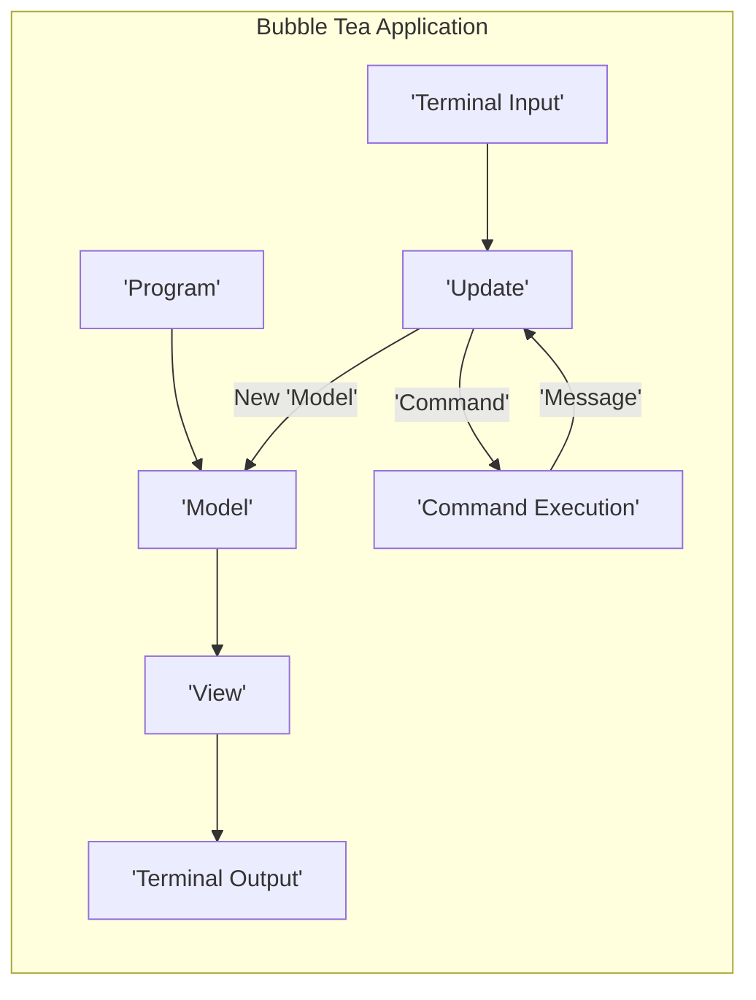
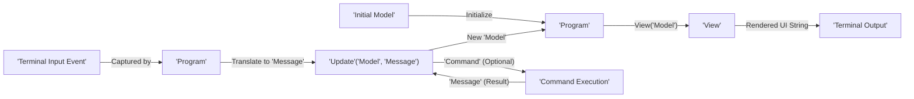

# Project Design Document: Bubble Tea

**Version:** 1.1
**Date:** October 26, 2023
**Author:** AI Software Architect

## 1. Introduction

This document provides a detailed design overview of the Bubble Tea TUI framework, as found in the GitHub repository [https://github.com/charmbracelet/bubbletea](https://github.com/charmbracelet/bubbletea). This document aims to clearly articulate the architecture, components, and data flow of Bubble Tea to facilitate future threat modeling activities. It focuses on the core library and its primary functionalities, providing a more granular understanding of its internal workings.

## 2. Goals and Objectives

The primary goals of Bubble Tea are to:

*   Provide a straightforward and enjoyable method for constructing terminal user interfaces (TUIs) using Go.
*   Hide the intricacies of terminal manipulation and event management from the developer.
*   Offer a well-defined and predictable programming model based on the Elm Architecture (TEA).
*   Empower developers to create interactive, visually appealing, and robust command-line applications.

This design document aims to:

*   Clearly define the major components and their interactions within the Bubble Tea framework.
*   Illustrate the detailed flow of data and control within a Bubble Tea application lifecycle.
*   Identify key dependencies and the nature of their interaction with the underlying operating system and terminal.
*   Provide a solid foundation for identifying potential security vulnerabilities, attack surfaces, and trust boundaries.

## 3. System Architecture

Bubble Tea adheres to the Elm Architecture (TEA), a functional reactive programming pattern that promotes predictable application behavior and maintainability through a unidirectional data flow.

**Detailed Explanation of Components:**

*   **`Program`:** The central runtime and orchestrator of a Bubble Tea application.
    *   Manages the application's lifecycle, including initialization and shutdown.
    *   Implements the main event loop that drives the application.
    *   Connects the `Model`, `View`, and `Update` components.
    *   Handles the execution of `Command`s.
*   **`Model`:** Represents the application's state at any given time.
    *   A data structure (typically a struct in Go) that holds all the information necessary to render the UI.
    *   Immutable in the sense that the `Update` function returns a *new* model rather than modifying the existing one.
    *   The single source of truth for the application's UI.
*   **`View`:**  A pure function responsible for rendering the UI.
    *   Takes the current `Model` as input.
    *   Returns a string representation of the UI to be displayed in the terminal, often leveraging styling capabilities.
    *   Should be deterministic; given the same model, it should always produce the same output.
*   **`Update`:** A pure function that handles events and updates the application's state.
    *   Takes the current `Model` and a `Message` as input.
    *   Returns a tuple containing a new `Model` (representing the updated state) and an optional `Command`.
    *   Contains the core application logic for responding to events.
*   **`Command`:** Represents an asynchronous operation or side effect that needs to be performed outside of the core update cycle.
    *   Examples include fetching data from an API, setting timers, or interacting with the file system.
    *   Returned by the `Update` function.
    *   Executed by the `Program`.
    *   Upon completion, typically dispatches a `Message` back to the `Update` function with the result of the operation.
*   **`Command Execution`:** The part of the Bubble Tea runtime responsible for executing `Command`s.
    *   Manages the asynchronous nature of commands, often using Go routines.
    *   Ensures that the results of commands are delivered back to the `Update` function as `Message`s.
*   **`Terminal Input`:** Represents raw input received from the user's terminal.
    *   Includes key presses, mouse events, and window resize events.
    *   Handled by the `Program` and translated into `Message`s.
*   **`Terminal Output`:** The rendered UI that is displayed in the user's terminal.
    *   Managed by the `Program`, which handles the low-level details of updating the terminal display.

## 4. Data Flow

The data flow in a Bubble Tea application is a continuous loop driven by events, ensuring a predictable and manageable application state.

**Detailed Data Flow Steps:**

1. **Initialization:** The `Program` begins by initializing the application with an `Initial Model`, representing the starting state.
2. **Initial Render:** The `Program` calls the `View` function, passing the `Initial Model`.
3. **Display Initial UI:** The `View` function returns a string representation of the initial UI, which the `Program` renders to the `Terminal Output`.
4. **Input Monitoring:** The `Program` continuously monitors the `Terminal Input` for user interactions and system events.
5. **Event Capture:** When a `Terminal Input Event` occurs (e.g., a key press), the `Program` captures it.
6. **Message Creation:** The `Program` translates the raw input event into a meaningful `Message`. This might involve identifying the specific key pressed or mouse action.
7. **Update Application State:** The `Program` calls the `Update` function, providing the current `Model` and the newly created `Message`.
8. **State Transition:** The `Update` function, based on the `Message` and current `Model`, returns a new `Model` representing the updated application state.
9. **Command Generation (Optional):** The `Update` function may also return a `Command` if the event requires an asynchronous operation.
10. **Command Execution:** If a `Command` is returned, the `Program` initiates its `Command Execution`.
11. **Asynchronous Operation:** The `Command Execution` performs the specified asynchronous task (e.g., network request).
12. **Result Dispatch:** Once the `Command` completes, it generates a new `Message` containing the result of the operation.
13. **Repeat Cycle:** The `Program` dispatches this result `Message` back to the `Update` function, restarting the cycle from step 7 with the potentially updated model. The `Program` then renders the UI again based on the new `Model`.

## 5. Key Components

*   **`tea.Model` Interface:** Defines the contract for application state.
    *   Requires the implementation of methods necessary for the application's logic and rendering.
    *   Typically holds application-specific data structures.
*   **`tea.Msg` Interface:** Represents events that trigger state changes.
    *   Can be custom types defined by the application developer.
    *   Carries information about the event that occurred.
*   **`tea.Cmd` Type:** Represents side effects or asynchronous operations.
    *   Functions that return a `tea.Msg` upon completion.
    *   Utilized for tasks that cannot be performed synchronously within the `Update` function.
    *   Examples include `tea.Tick` for timers, or custom commands for API calls.
*   **`tea.Program` Type:** The core runtime engine.
    *   Provides methods for starting and controlling the application loop (`tea.NewProgram`).
    *   Handles input and output operations with the terminal.
    *   Manages the communication between the `Model`, `View`, and `Update`.
*   **`tea.View` Function (Signature: `func(tea.Model) string`):** The rendering logic.
    *   Transforms the application state into a visual representation.
    *   Often uses libraries like `lipgloss` for styling.
*   **`tea.Update` Function (Signature: `func(tea.Model, tea.Msg) (tea.Model, tea.Cmd)`):** The state transition logic.
    *   Implements the application's response to events.
    *   Crucial for maintaining the application's correctness and behavior.
*   **Input Handling Mechanisms:** Bubble Tea provides abstractions for handling various terminal inputs.
    *   **Key Press Handling:**  Captures and interprets key presses, including special keys (e.g., arrow keys, Ctrl+C).
    *   **Mouse Event Handling:**  Supports capturing mouse clicks, scrolls, and other mouse interactions within the terminal.
    *   **Window Resize Handling:**  Allows the application to respond to terminal window resizing events.
*   **Output Rendering Engine:** Manages the efficient updating of the terminal display.
    *   Uses techniques to minimize redraws and optimize performance.
    *   Supports ANSI escape codes for styling and formatting text.

## 6. Dependencies

Bubble Tea leverages external Go packages to provide its functionality:

*   **`github.com/muesli/termenv`:**  Provides robust terminal environment detection and advanced styling capabilities, including color palette management.
*   **`github.com/muesli/reflow`:** Offers utilities for text manipulation, such as word wrapping, alignment, and padding, crucial for layout within the terminal.
*   **`github.com/charmbracelet/lipgloss`:** (Often used with Bubble Tea) A library for defining rich styles for terminal output, making TUIs visually appealing.
*   **Standard Go Libraries:**  Relies on core Go libraries for concurrency, input/output, and other fundamental operations.

## 7. Deployment Considerations

Bubble Tea applications are typically deployed as self-contained, statically linked executables. Deployment involves:

*   **Compilation:** Compiling the Go source code for the target platform.
*   **Distribution:** Distributing the resulting executable to end-users.
*   **No External Runtime:**  Bubble Tea applications do not require a separate runtime environment beyond the operating system and terminal.

## 8. Security Considerations (Detailed)

Security considerations for Bubble Tea applications are crucial, especially when handling user input or interacting with external systems.

*   **Input Validation and Sanitization:**
    *   **Threat:** Malicious or unexpected user input could lead to application crashes, unexpected behavior, or even command injection if not properly handled.
    *   **Mitigation:** Implement robust input validation within the `Update` function to ensure that received `Message`s contain expected data types and values. Sanitize input to remove potentially harmful characters or sequences before processing.
*   **State Management Vulnerabilities:**
    *   **Threat:** Improper state management could lead to inconsistent application behavior or allow attackers to manipulate the application's state in unintended ways.
    *   **Mitigation:** Adhere strictly to the principles of the Elm Architecture, ensuring that state transitions only occur through the `Update` function. Avoid direct modification of the `Model` outside of the `Update` cycle.
*   **Command Injection Risks:**
    *   **Threat:** If `Command`s are constructed based on user input without proper sanitization, attackers might be able to inject arbitrary commands that are executed by the system.
    *   **Mitigation:**  Carefully validate and sanitize any user input that influences the parameters or execution of `Command`s. Avoid directly executing shell commands based on user input.
*   **Denial of Service (DoS):**
    *   **Threat:** Malicious actors could send a large number of events or inputs to overwhelm the application, leading to performance degradation or crashes.
    *   **Mitigation:** Implement rate limiting or input throttling mechanisms if the application is exposed to untrusted sources of input. Consider the performance implications of handling a large volume of events.
*   **Information Disclosure:**
    *   **Threat:** Sensitive information might be inadvertently displayed in the terminal output or leaked through error messages.
    *   **Mitigation:**  Avoid displaying sensitive data directly in the UI unless absolutely necessary. Implement proper error handling and logging that does not expose sensitive information to the user.
*   **Dependency Vulnerabilities:**
    *   **Threat:** Vulnerabilities in the external dependencies (`termenv`, `reflow`, `lipgloss`) could be exploited to compromise the Bubble Tea application.
    *   **Mitigation:** Regularly update dependencies to their latest versions to patch known vulnerabilities. Conduct security audits of dependencies if necessary.
*   **Trust Boundaries:**
    *   **Terminal Environment:** The application operates within the user's terminal, which is a trust boundary. Assume the terminal environment might be compromised or behave unexpectedly.
    *   **External Systems (via Commands):** Interactions with external systems through `Command`s introduce new trust boundaries. Secure communication protocols (e.g., HTTPS) and proper authentication/authorization are crucial.

## 9. Threat Modeling Focus

This design document provides a comprehensive foundation for conducting threat modeling exercises on Bubble Tea applications. Key areas of focus for threat modeling include:

*   **STRIDE Analysis:** Apply the STRIDE model (Spoofing, Tampering, Repudiation, Information Disclosure, Denial of Service, Elevation of Privilege) to each component and data flow.
*   **Data Flow Diagram (DFD) Analysis:**  Use the provided data flow diagrams to identify potential points of attack and data breaches.
*   **Attack Surface Analysis:** Identify all potential entry points for attackers, including user input, external dependencies, and interactions with the operating system.
*   **Trust Boundary Identification:** Clearly define the trust boundaries between the application, the terminal, and any external systems it interacts with.
*   **Use Case/Abuse Case Analysis:** Analyze common use cases and potential abuse cases to identify vulnerabilities in application logic and workflows.
*   **Security Requirements Definition:** Based on the threat model, define specific security requirements for the Bubble Tea application.

By leveraging the detailed architectural information and data flow descriptions in this document, developers and security professionals can effectively identify, assess, and mitigate potential security risks in Bubble Tea applications. This document serves as a crucial starting point for building secure and resilient TUI applications.