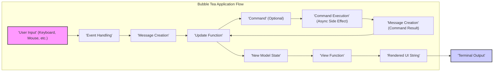
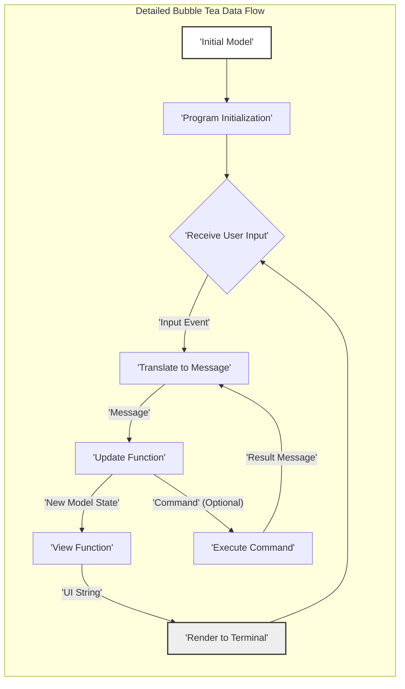

# Project Design Document: Bubble Tea

**Version:** 1.1
**Date:** October 26, 2023
**Author:** AI Software Architect

## 1. Introduction

This document provides an enhanced design overview of the Bubble Tea TUI framework, a Go library for building interactive terminal applications. This detailed design serves as a crucial foundation for subsequent threat modeling activities, clearly outlining the system's architecture, individual components, and the flow of data within the framework. Understanding these aspects is essential for identifying potential vulnerabilities and attack vectors.

## 2. Goals and Objectives

The primary goals of Bubble Tea are to:

* Offer a straightforward and elegant approach to constructing sophisticated terminal user interfaces.
* Abstract the complexities involved in direct terminal manipulation and low-level event handling.
* Facilitate a component-driven architecture, promoting the creation and reuse of UI elements.
* Empower developers to build engaging and interactive command-line tools with relative ease.

## 3. Architecture Overview

Bubble Tea adopts an architecture inspired by the Elm language, focusing on unidirectional data flow and clear separation of concerns. The core concepts are:

* **Model:**  The single source of truth for the application's state.
* **Message:**  Discrete events or actions that signal the need to update the model.
* **Command:**  Representations of side effects or asynchronous operations that need to be performed outside the core update logic.
* **Update:**  A pure function that dictates how the `Model` should be modified in response to a given `Message`, potentially also generating `Commands`.
* **View:**  A pure function responsible for rendering the user interface as a string based on the current `Model`.
* **Program:**  The central orchestrator, managing the application lifecycle, including receiving input, dispatching messages, executing commands, and rendering the view.

The lifecycle of a Bubble Tea application interaction proceeds as follows:

1. The `Program` receives external input, typically from the user interacting with the terminal (e.g., keystrokes, mouse events).
2. This raw input is processed and translated into a specific `Message` that represents the user's action or an external event.
3. The `Program` invokes the `Update` function, passing the current `Model` and the newly created `Message`.
4. The `Update` function, based on the `Message`, returns an updated `Model` reflecting the state change and optionally a `Command` to perform a side effect.
5. If a `Command` is returned, the `Program` executes it. These commands are often asynchronous operations, and their completion typically results in another `Message` being dispatched back to the `Update` function.
6. The `Program` then invokes the `View` function, passing the updated `Model`.
7. The `View` function generates a string representation of the user interface based on the current state.
8. This rendered UI string is then displayed in the terminal, reflecting the changes.

## 4. Component Details

### 4.1. Model

* **Description:** The `Model` is a Go struct defined by the application developer. It encapsulates the entire state of the application at any given time.
* **Responsibilities:**
    * Maintaining the current state of the application's data and UI elements.
    * Providing the necessary data for the `View` function to render the user interface.
    * Being immutably updated by the `Update` function in response to `Messages`.
* **Implementation Details:**  Implemented as a standard Go struct. The structure and data types within the `Model` are entirely determined by the application's requirements. *Potential security concern: Sensitive information stored in the model could be vulnerable if not handled carefully.*

### 4.2. Message

* **Description:** A `Message` is a Go value (often a struct, but can be any type) that represents a specific event or action that has occurred within the application or externally.
* **Responsibilities:**
    * Signaling the `Update` function about events requiring state changes.
    * Carrying relevant data associated with the event, enabling the `Update` function to process it correctly.
* **Implementation Details:** Defined by the application developer. Examples include messages for key presses, timer events, network responses, or internal application events. *Potential security concern: Maliciously crafted messages could potentially trigger unintended state changes or exploit vulnerabilities in the `Update` function.*

### 4.3. Command

* **Description:** A `Command` represents a side effect or an asynchronous operation that needs to be executed outside the pure `Update` function. This could involve network requests, file system operations, or interacting with external systems.
* **Responsibilities:**
    * Performing actions that have effects beyond simply updating the application's internal state.
    * Returning a `Message` upon completion (or failure), allowing the application to react to the outcome of the command.
* **Implementation Details:** Commands are functions that return a `tea.Cmd`. Bubble Tea provides built-in commands for common tasks, and developers can define custom commands. *Significant security concern: Improperly implemented or controlled commands can introduce severe vulnerabilities, such as arbitrary code execution or access to sensitive resources.*

### 4.4. Update Function

* **Description:** The `Update` function is a pure function with the signature `func(msg tea.Msg, model Model) (Model, tea.Cmd)`. It takes the current `Model` and a `Message` as input and returns a new `Model` (representing the updated state) and optionally a `Command`.
* **Responsibilities:**
    * Determining how the application's state should transition based on the received `Message`.
    * Creating and returning a new `Model` reflecting the state change (immutability is encouraged).
    * Optionally generating and returning a `Command` to initiate side effects.
* **Implementation Details:** Implemented by the application developer. It's crucial that this function is deterministic and free of side effects (other than returning a `Command`) to ensure predictable application behavior. *Potential security concern: Logic errors or vulnerabilities within the `Update` function can lead to incorrect state transitions, denial of service, or even allow malicious messages to manipulate the application state in unintended ways.*

### 4.5. View Function

* **Description:** The `View` function is a pure function with the signature `func(model Model) string`. It takes the current `Model` as input and returns a string representation of the user interface to be displayed in the terminal.
* **Responsibilities:**
    * Rendering the user interface based on the current application state held in the `Model`.
    * Formatting the output string for display in the terminal, potentially using libraries like `lipgloss` for styling.
* **Implementation Details:** Implemented by the application developer. This function focuses solely on presentation logic. *Minor security concern: While less critical, vulnerabilities in the view logic could potentially lead to information disclosure if sensitive data is inadvertently included in the rendered output.*

### 4.6. Program

* **Description:** The `Program` is the central runtime environment for a Bubble Tea application. It manages the application lifecycle, event handling, and the core update/view loop.
* **Responsibilities:**
    * Initializing the application with the initial `Model`, `Update`, and `View` functions.
    * Receiving and processing raw input events from the terminal.
    * Translating raw input into `Messages`.
    * Dispatching `Messages` to the `Update` function.
    * Executing `Commands` returned by the `Update` function.
    * Invoking the `View` function to render the UI.
    * Handling terminal resizing and other terminal-related events.
    * Managing the application's shutdown process.
* **Implementation Details:**  Provided by the `tea` package in the Bubble Tea library. Developers typically create an instance of `tea.Program` and run it. *Potential security concern: Vulnerabilities in the `Program`'s input handling or event processing could be exploited to cause crashes or unexpected behavior. Improper signal handling could also lead to issues.*

## 5. Data Flow

The flow of data in a Bubble Tea application is strictly unidirectional, moving from input to state update to view rendering.

* **Initial State:** The application starts with an initial `Model`.
* **User Interaction:** The user interacts with the terminal, generating input events.
* **Event Handling & Message Creation:** The `Program` captures these events and translates them into specific `Messages`.
* **Update Cycle:** The `Program` passes the generated `Message` and the current `Model` to the `Update` function.
* **State Transformation:** The `Update` function processes the `Message` and returns a new, updated `Model`.
* **Command Invocation (Optional):** The `Update` function may also return a `Command` to perform side effects.
* **Asynchronous Operations:** If a `Command` is returned, the `Program` executes it. Upon completion, the command typically generates a new `Message` containing the result.
* **View Rendering:** The `Program` passes the latest `Model` to the `View` function.
* **Output to Terminal:** The `View` function renders the UI as a string, which the `Program` then outputs to the terminal.

## 6. Security Considerations

Bubble Tea applications, while running locally in a terminal, still present several security considerations that developers must address:

* **Input Validation and Sanitization:**  Crucially important within the `Update` function. All user-provided input (translated into `Messages`) must be thoroughly validated and sanitized to prevent injection attacks or unexpected behavior. Failure to do so could lead to application crashes or unintended state manipulation.
* **Command Execution Security:**  Exercising caution when executing external commands via the `Command` mechanism is paramount. Avoid constructing commands directly from user input. Implement robust validation and consider using parameterized commands or safer alternatives where possible to prevent command injection vulnerabilities.
* **Dependency Management:**  As with any Go project, diligently managing dependencies and ensuring they are free from known vulnerabilities is essential. Regularly audit and update dependencies.
* **Sensitive Data Handling:** If the application processes sensitive information, appropriate measures must be taken to protect it. Avoid storing sensitive data directly in the `Model` for extended periods if possible. Consider encryption or secure in-memory handling techniques. Be mindful of potential information leakage through the rendered UI.
* **Terminal Emulation Risks:** While less common, be aware of potential vulnerabilities within the terminal emulator itself. Avoid relying on obscure or non-standard terminal features that might have security implications.
* **State Management Vulnerabilities:** Logic flaws within the `Update` function can lead to inconsistent or exploitable application states. Thorough testing and careful design of state transitions are crucial.
* **Message Handling Vulnerabilities:** Ensure that the application handles all possible message types gracefully and securely. Unexpected or malformed messages should not cause crashes or unexpected behavior.

## 7. Deployment Considerations

Bubble Tea applications are typically deployed as self-contained, statically linked executables. This simplifies deployment as it eliminates the need for external dependencies at runtime. Common deployment methods include:

* **Direct Distribution:** Providing pre-compiled binaries for various platforms.
* **Package Managers:** Distributing through platform-specific package managers (e.g., `brew` for macOS, `apt` for Debian/Ubuntu).
* **Containerization:** Packaging the application within a container image (e.g., Docker) for consistent execution environments.

## 8. Future Considerations

Potential areas for future development and enhancement of Bubble Tea include:

* **Enhanced Accessibility Features:**  Improving support for screen readers and other assistive technologies to make TUI applications more accessible.
* **Advanced Layout Capabilities:**  Expanding beyond basic string-based layout to offer more flexible and sophisticated UI arrangements.
* **Built-in Testing Utilities:**  Providing more integrated tools and patterns for testing Bubble Tea applications, particularly the `Update` function logic.
* **Standardized Component Library:**  Developing a curated library of reusable UI components to accelerate development and promote consistency.

This refined design document provides a more detailed and security-focused overview of the Bubble Tea framework. It should serve as a valuable resource for conducting thorough threat modeling and identifying potential security vulnerabilities within applications built using Bubble Tea.