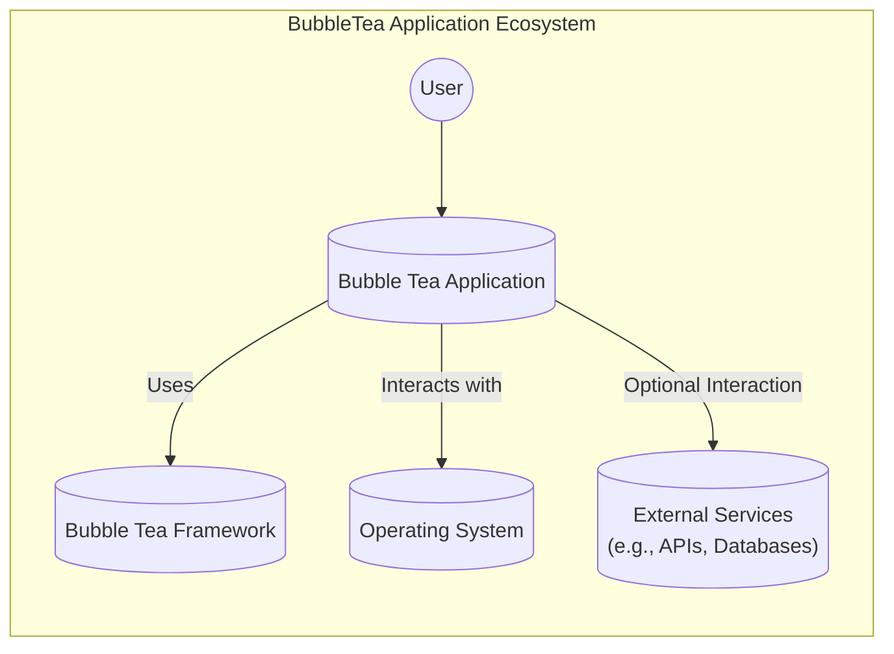
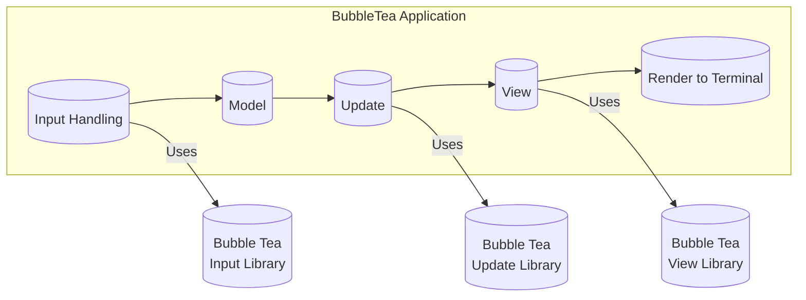
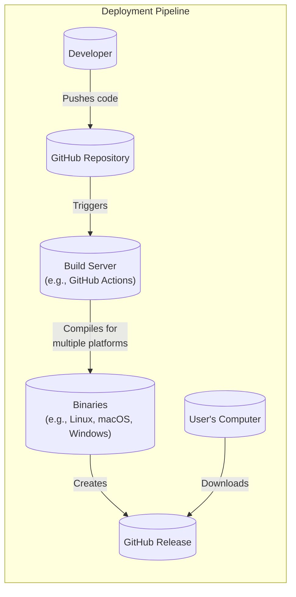
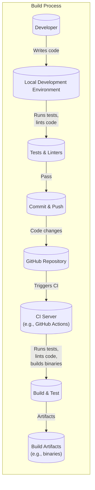

# BUSINESS POSTURE

Bubble Tea is a framework for building terminal-based user interfaces (TUIs). It's not a specific product or service with direct revenue generation, but rather a tool that enables developers to create such applications. Therefore, the business priorities and goals are centered around adoption, community growth, and developer productivity.

Business Priorities and Goals:

*   Increase adoption of the Bubble Tea framework by developers.
*   Foster a vibrant and active community around the framework.
*   Provide a productive and enjoyable developer experience.
*   Maintain a high level of code quality and maintainability.
*   Ensure the framework is performant and reliable.
*   Provide good documentation and examples.

Business Risks:

*   Low adoption rate: If developers don't find the framework useful or easy to use, it won't be adopted, hindering its growth.
*   Lack of community engagement: A weak community can lead to fewer contributions, slower development, and less support for new users.
*   Security vulnerabilities: As a framework for building applications, vulnerabilities in Bubble Tea could be exploited in applications built using it, leading to potential damage to users and reputational harm.
*   Poor performance: Slow or unresponsive TUIs can lead to a poor user experience, discouraging adoption.
*   Lack of maintainability: If the codebase becomes difficult to maintain, it will be harder to add new features and fix bugs, slowing down development.
*   Competition: Other TUI frameworks exist, so Bubble Tea needs to differentiate itself and offer compelling advantages.

# SECURITY POSTURE

The repository itself is a Go library. Security considerations are primarily focused on ensuring the library itself is free of vulnerabilities that could be exploited in applications built using it. The following security controls and accepted risks are identified:

Existing Security Controls:

*   security control: CodeQL: GitHub's CodeQL is used for static analysis to identify potential security vulnerabilities. (Visible in the repository's security settings and workflows).
*   security control: Go Modules: Dependency management using Go Modules helps ensure that known vulnerable dependencies are not used (go.mod and go.sum files).
*   security control: Regular Updates: Dependencies are likely updated regularly, although this is an ongoing process and not a one-time control.
*   security control: Fuzz testing: fuzz testing is used to find potential bugs and vulnerabilities. (Visible in the repository's fuzz directory).

Accepted Risks:

*   accepted risk: Third-party dependencies: While Go Modules helps manage dependencies, there's always a risk associated with relying on third-party code. The project accepts the risk of potential vulnerabilities in well-maintained, widely used dependencies, mitigating this through regular updates and dependency analysis.
*   accepted risk: User Input Handling: Bubble Tea applications inherently handle user input. While the framework likely provides some mechanisms for safe input handling, the ultimate responsibility for preventing injection attacks (e.g., command injection if the TUI interacts with shell commands) lies with the developers using the framework. The project accepts the risk that developers might misuse input handling functions, mitigating this through documentation and examples.
*   accepted risk: Denial of Service (DoS): Maliciously crafted input or excessive input could potentially lead to a denial-of-service condition in a Bubble Tea application. The project accepts some level of DoS risk, focusing on preventing vulnerabilities that could lead to crashes or remote code execution.

Recommended Security Controls:

*   security control: Security Policy: Create a `SECURITY.md` file outlining vulnerability reporting procedures.
*   security control: SAST Integration: Integrate a dedicated Static Application Security Testing (SAST) tool beyond CodeQL for more comprehensive vulnerability scanning. Consider tools specifically designed for Go.
*   security control: Dependency Scanning: Implement automated dependency scanning to identify known vulnerabilities in third-party libraries. Tools like `dependabot` or `snyk` can be used.
*   security control: Fuzzing Enhancements: Expand fuzz testing to cover more of the codebase and different input scenarios.

Security Requirements:

*   Authentication: Not directly applicable to the framework itself. Bubble Tea applications might need to implement authentication, but this is the responsibility of the application developer, not the framework.
*   Authorization: Similar to authentication, authorization is the responsibility of the application developer. Bubble Tea doesn't manage user roles or permissions.
*   Input Validation: The framework should provide utilities and guidance for safely handling user input to prevent injection attacks. This includes:
    *   Clear documentation on how to handle user input safely.
    *   Potentially providing helper functions for sanitizing or escaping input.
    *   Examples demonstrating secure input handling practices.
*   Cryptography: If Bubble Tea applications need to handle sensitive data, they should use appropriate cryptographic libraries. Bubble Tea itself doesn't handle cryptography directly, but it should not interfere with the use of standard cryptographic libraries in Go.

# DESIGN

## C4 CONTEXT

Element Descriptions:

*   Element:
    *   Name: User
    *   Type: Person
    *   Description: A person interacting with the Bubble Tea application through a terminal.
    *   Responsibilities: Provides input to the application, views the application's output.
    *   Security controls: None (external to the system).

*   Element:
    *   Name: Bubble Tea Application
    *   Type: Software System
    *   Description: An application built using the Bubble Tea framework.
    *   Responsibilities: Handles user input, processes data, renders the user interface.
    *   Security controls: Input validation, output encoding, secure coding practices (responsibility of the application developer).

*   Element:
    *   Name: Bubble Tea Framework
    *   Type: Library/Framework
    *   Description: The Bubble Tea library itself, providing the building blocks for creating TUIs.
    *   Responsibilities: Provides components for UI rendering, input handling, and application structure.
    *   Security controls: CodeQL, fuzz testing, dependency management.

*   Element:
    *   Name: Operating System
    *   Type: System
    *   Description: The underlying operating system (e.g., Linux, macOS, Windows) on which the application runs.
    *   Responsibilities: Provides the terminal interface, manages processes, and handles system calls.
    *   Security controls: OS-level security controls (e.g., user permissions, process isolation).

*   Element:
    *   Name: External Services
    *   Type: Software System
    *   Description: Optional external services that the Bubble Tea application might interact with (e.g., APIs, databases).
    *   Responsibilities: Varies depending on the specific service.
    *   Security controls: Authentication, authorization, encryption (responsibility of the external service and the application developer's interaction with it).

## C4 CONTAINER

Element Descriptions:

*   Element:
    *   Name: Input Handling
    *   Type: Component
    *   Description: Handles user input from the terminal.
    *   Responsibilities: Receives key presses and other input events, translates them into messages.
    *   Security controls: Input sanitization (responsibility of the application developer using Bubble Tea's input handling mechanisms).

*   Element:
    *   Name: Model
    *   Type: Component
    *   Description: Represents the application's state.
    *   Responsibilities: Stores data, manages application logic.
    *   Security controls: Secure data handling practices (responsibility of the application developer).

*   Element:
    *   Name: Update
    *   Type: Component
    *   Description: Processes messages and updates the model.
    *   Responsibilities: Handles messages, modifies the model based on application logic.
    *   Security controls: Secure coding practices (responsibility of the application developer).

*   Element:
    *   Name: View
    *   Type: Component
    *   Description: Generates the user interface based on the model.
    *   Responsibilities: Creates a string representation of the UI based on the current model state.
    *   Security controls: Output encoding (to prevent terminal escape sequence injection, responsibility of the application developer and potentially aided by Bubble Tea).

*   Element:
    *   Name: Render to Terminal
    *   Type: Component
    *   Description: Renders the view to the terminal.
    *   Responsibilities: Sends the UI string to the terminal for display.
    *   Security controls: Relies on the terminal's security mechanisms.

*   Element:
    *   Name: BubbleTeaLibInput
    *   Type: Library
    *   Description: Bubble Tea library for input handling.
    *   Responsibilities: Provides functions and types for handling user input.
    *   Security controls: CodeQL, fuzz testing, dependency management.

*   Element:
    *   Name: BubbleTeaLibUpdate
    *   Type: Library
    *   Description: Bubble Tea library for update logic.
    *   Responsibilities: Provides functions and types for update logic.
    *   Security controls: CodeQL, fuzz testing, dependency management.

*   Element:
    *   Name: BubbleTeaLibView
    *   Type: Library
    *   Description: Bubble Tea library for view rendering.
    *   Responsibilities: Provides functions and types for view rendering.
    *   Security controls: CodeQL, fuzz testing, dependency management.

## DEPLOYMENT

Bubble Tea applications are typically deployed as standalone executables. The deployment process involves compiling the Go code into a binary for the target operating system and architecture.

Possible Deployment Solutions:

1.  Manual Compilation and Distribution: The developer compiles the application on their machine and distributes the binary directly to users.
2.  Automated Build and Release Pipeline (e.g., using GitHub Actions, GitLab CI, etc.): A CI/CD pipeline automatically compiles the application for different platforms and creates releases (e.g., on GitHub Releases).
3.  Containerization (e.g., using Docker): The application is packaged into a Docker container, which can then be deployed to any system that supports Docker. This is less common for TUIs but can be useful for specific deployment scenarios.
4.  Package Managers: Distribute via OS package managers like apt, brew, and others.

Chosen Solution (Automated Build and Release Pipeline):

Element Descriptions:

*   Element:
    *   Name: Developer
    *   Type: Person
    *   Description: The developer writing the Bubble Tea application.
    *   Responsibilities: Writes code, pushes changes to the repository.
    *   Security controls: Code review, secure coding practices.

*   Element:
    *   Name: GitHub Repository
    *   Type: Source Code Repository
    *   Description: The repository hosting the application's source code.
    *   Responsibilities: Stores code, tracks changes, triggers builds.
    *   Security controls: Access controls, branch protection rules.

*   Element:
    *   Name: Build Server (e.g., GitHub Actions)
    *   Type: CI/CD System
    *   Description: A service that automatically builds the application.
    *   Responsibilities: Executes build scripts, compiles the code, runs tests.
    *   Security controls: Secure configuration of the build environment, dependency caching (for speed and to avoid pulling dependencies on every build).

*   Element:
    *   Name: Binaries (e.g., Linux, macOS, Windows)
    *   Type: Executable Files
    *   Description: The compiled application binaries for different platforms.
    *   Responsibilities: Run the application on the target platform.
    *   Security controls: Code signing (optional, but recommended for production applications).

*   Element:
    *   Name: GitHub Release
    *   Type: Release Artifact
    *   Description: A release on GitHub, containing the compiled binaries and release notes.
    *   Responsibilities: Provides a download location for users.
    *   Security controls: Access controls, potentially checksums for verifying binary integrity.

*   Element:
    *   Name: User's Computer
    *   Type: Deployment Environment
    *   Description: The computer where the user runs the application.
    *   Responsibilities: Executes the downloaded binary.
    *   Security controls: OS-level security controls.

## BUILD

The build process for Bubble Tea applications typically involves using the Go build toolchain.

Security Controls in the Build Process:

*   security control: Local Development Environment: Developers should follow secure coding practices and use linters (e.g., `golangci-lint`) to identify potential issues early.
*   security control: Version Control (GitHub): Code is stored in a version control system, allowing for tracking changes and collaboration.
*   security control: CI/CD (GitHub Actions): The build process is automated using a CI/CD system. This ensures consistency and repeatability.
*   security control: Testing: Automated tests (unit tests, integration tests) are run as part of the build process to verify code correctness.
*   security control: Static Analysis: Static analysis tools (e.g., CodeQL, linters) are used to identify potential security vulnerabilities and code quality issues.
*   security control: Dependency Management: Go Modules are used to manage dependencies and ensure that known vulnerable versions are not used.
*   security control: Build Artifacts: The build process produces executable binaries, which are the final artifacts deployed to users.

# RISK ASSESSMENT

Critical Business Processes:

*   Developer adoption and community growth: The success of Bubble Tea depends on developers using it and contributing to its development.
*   Application development: Bubble Tea is a tool for building other applications. Its security and reliability directly impact the applications built with it.

Data to Protect:

*   Source Code: The Bubble Tea source code itself is valuable intellectual property. While it's open source, unauthorized modification or distribution could be a concern. Sensitivity: Medium.
*   User Data (Indirectly): Bubble Tea applications may handle user data. The framework itself doesn't directly store or process user data, but vulnerabilities in the framework could be exploited to compromise user data in applications built with it. Sensitivity: Depends on the specific application; potentially high.
*   Build Artifacts: Compiled binaries should be protected from tampering to prevent malicious code from being distributed to users. Sensitivity: High.

# QUESTIONS & ASSUMPTIONS

Questions:

*   Are there any specific compliance requirements (e.g., GDPR, HIPAA) that Bubble Tea applications typically need to adhere to? This would influence guidance provided to developers.
*   What is the expected threat model for typical Bubble Tea applications? Are they primarily used internally within organizations, or are they often exposed to the public internet?
*   What level of support is provided for handling terminal escape sequences securely? Is there a risk of terminal escape sequence injection attacks?
*   Are there plans to create a curated list of recommended security practices or libraries for common tasks (e.g., handling sensitive data, interacting with external services) in Bubble Tea applications?

Assumptions:

*   BUSINESS POSTURE: The primary goal is to grow the Bubble Tea ecosystem, not to generate direct revenue from the framework itself.
*   SECURITY POSTURE: Developers using Bubble Tea are expected to have a basic understanding of security principles and are responsible for the security of their own applications. The framework aims to provide tools and guidance to help them, but it cannot guarantee the security of all applications built with it.
*   DESIGN: The typical deployment model is a standalone executable, built either manually or through a CI/CD pipeline. Containerization is less common but possible. The build process relies on the standard Go toolchain and integrates with common CI/CD systems like GitHub Actions.