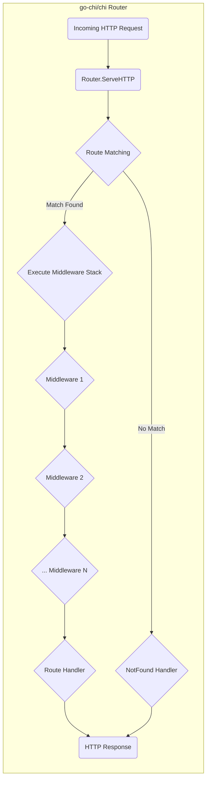

# Project Design Document: go-chi/chi HTTP Router

**Version:** 1.1
**Date:** October 26, 2023
**Author:** AI Software Architect

## 1. Introduction

This document provides an enhanced design overview of the `go-chi/chi` project, a lightweight, idiomatic, and composable HTTP router for building Go web services. This document is intended to serve as a robust foundation for future threat modeling activities. It comprehensively outlines the key architectural components, data flow, and security considerations of the `chi` router.

## 2. Goals

The primary goals of the `go-chi/chi` project are:

*   Provide a fast and efficient HTTP routing mechanism, minimizing overhead in matching incoming requests to appropriate handlers.
*   Offer a clean and idiomatic Go API, leveraging Go's standard library and conventions for ease of use and maintainability.
*   Enable composable middleware, allowing developers to easily chain and reuse middleware functions for request processing.
*   Support URL parameter extraction in a straightforward manner for accessing parameters from matched routes.
*   Facilitate sub-routing to enable the creation of modular and organized routing structures.
*   Maintain a small and focused codebase, avoiding unnecessary features and complexity.
*   Provide a flexible and extensible routing solution that can adapt to various application needs.

## 3. Architectural Overview

`chi`'s architecture is centered around the concept of a `Router` which manages a tree-like structure of routes and middleware. The core components are:

*   **Router:** The central component responsible for receiving `http.Request` objects and dispatching them to the appropriate handler. It maintains a routing tree (likely a radix tree or similar) and manages middleware stacks.
*   **Routes:** Represent specific URL patterns and their associated handlers. Routes can include static paths, parameterized paths, and wildcard paths. Each route is associated with a specific HTTP method (GET, POST, PUT, DELETE, etc.).
*   **Handlers:** Functions that process incoming HTTP requests. In `chi`, handlers conform to the `http.HandlerFunc` signature. They contain the application-specific logic for responding to requests.
*   **Middleware:** Functions that intercept and process HTTP requests before they reach the final handler. Middleware can perform cross-cutting concerns like authentication, logging, request modification, and more. Middleware functions are chained together.
*   **Context:** A mechanism for passing request-scoped values down the middleware and handler chain. `chi` provides its own context implementation (`chi.Context`) that extends the standard `context.Context` and includes functionalities for accessing route parameters.

## 4. Component Details

### 4.1. Router

*   **Functionality:**
    *   Receives `http.Request` objects via its `ServeHTTP` method, implementing the `http.Handler` interface.
    *   Traverses the internal routing tree to find the best matching route based on the request's method and URL path. The matching process typically involves comparing path segments and handling parameterized and wildcard routes.
    *   Executes the middleware stack associated with the matched route in the order they were added.
    *   Invokes the handler function for the matched route after all middleware in the chain have been executed.
    *   Manages sub-routers, allowing for the creation of nested and modular routing structures. Sub-routers inherit middleware from their parent routers.
    *   Provides methods for defining routes for specific HTTP methods (e.g., `Get`, `Post`, `Put`, `Delete`).
    *   Handles "Not Found" scenarios when no matching route is found.
*   **Implementation:** Likely uses a radix tree (prefix tree) or a similar efficient data structure for storing and matching routes. This allows for fast lookups even with a large number of defined routes.
*   **Key Methods:**
    *   `Mount(pattern string, handler http.Handler)`: Mounts another `http.Handler` (often another `chi.Router`) at a specific path.
    *   `Method(method, pattern string, handler http.HandlerFunc)`: Registers a handler for a specific HTTP method and path pattern.
    *   `Group(fn func(r Router))`: Creates a new inline-router group with a fresh middleware stack.
    *   `Use(middlewares ...func(http.Handler) http.Handler)`: Appends new middleware to the router's middleware stack.
    *   `HandleFunc(pattern string, fn http.HandlerFunc)`: Registers a handler for both GET and HEAD methods for a given pattern.
    *   `ServeHTTP(w http.ResponseWriter, r *http.Request)`: Implements the `http.Handler` interface, processing incoming requests.

### 4.2. Routes

*   **Functionality:**
    *   Define the explicit mapping between specific URL patterns and the handler functions that should process requests matching those patterns.
    *   Support different types of path segments, enabling flexible route definitions:
        *   **Static:** Exact string matches (e.g., `/users`).
        *   **Parameterized:** Capture dynamic values from the URL path segments, identified by curly braces (e.g., `/users/{userID}`). The captured values are accessible through the `chi.Context`.
        *   **Wildcard:** Match any remaining path segments after a specific point, denoted by an asterisk (e.g., `/static/*`).
*   **Representation:** Internally, routes are likely stored as nodes within the router's routing tree. Each node contains information about the path segment, associated handler (if it's a terminal node), and any middleware specific to that route or group.
*   **Parameter Extraction:** `chi` provides functions like `chi.URLParam(r *http.Request, key string)` to extract the values of parameterized route segments from the request context.

### 4.3. Handlers

*   **Functionality:**
    *   Implement the core business logic for processing a specific type of HTTP request.
    *   Receive `http.ResponseWriter` and `*http.Request` as arguments, adhering to the `http.HandlerFunc` signature.
    *   Generate and send HTTP responses back to the client, including setting headers and writing the response body.
    *   Can access request-scoped values stored in the `chi.Context`, including route parameters and values set by middleware.
*   **Implementation:** Standard Go functions that take `http.ResponseWriter` and `*http.Request` as input.

### 4.4. Middleware

*   **Functionality:**
    *   Intercept HTTP requests before they reach the designated handler.
    *   Operate on the `http.ResponseWriter` and `*http.Request` objects.
    *   Can perform a wide range of actions, including:
        *   Authentication and authorization checks.
        *   Logging request details and performance metrics.
        *   Modifying the request (e.g., adding headers, setting context values).
        *   Modifying the response (e.g., adding security headers).
        *   Handling errors and panics.
        *   Compression and decompression.
    *   Middleware functions are chained together, forming a pipeline through which the request passes. The order of middleware execution is determined by the order in which they are added to the router or route group.
*   **Implementation:** Functions that adhere to the middleware signature: `func(next http.Handler) http.Handler`. They take the next handler in the chain as input and return a new handler that wraps the next one.
*   **Execution Order:** Middleware is executed sequentially in the order it is attached to the router or a specific route group.

### 4.5. Context

*   **Functionality:**
    *   Provides a mechanism to pass request-scoped values down the middleware and handler chain, beyond the standard `context.Context` capabilities.
    *   Extends the standard `context.Context` with `chi`-specific functionalities, primarily for accessing route parameters extracted during the routing process.
    *   Allows middleware to add request-specific data to the context, making it available to subsequent middleware and the final handler.
*   **Implementation:** The `chi.Context` type embeds the standard `context.Context` and includes methods like `URLParam` to retrieve route parameters.

## 5. Data Flow

The following diagram illustrates the typical data flow of an incoming HTTP request through the `chi` router:

**Detailed Steps:**

1. **Incoming HTTP Request:** The web server receives an HTTP request from a client.
2. **Router.ServeHTTP:** The `chi` router's `ServeHTTP` method is invoked, as it implements the `http.Handler` interface.
3. **Route Matching:** The router uses its internal routing tree to find the best matching route based on the request's HTTP method and URL path. This involves traversing the tree and comparing path segments.
4. **Match Found:**
    *   **Execute Middleware Stack:** If a matching route is found, the router executes the middleware stack associated with that route (and any parent routers) in the order they were added.
    *   **Middleware Execution:** Each middleware function in the chain receives the `http.ResponseWriter` and `*http.Request`. Middleware can process the request, modify it, add information to the context, or short-circuit the request by sending a response directly.
    *   **Route Handler:** After all middleware in the chain have been executed, the route's designated handler function is invoked.
    *   **HTTP Response:** The handler generates an HTTP response by writing to the `http.ResponseWriter`.
5. **No Match:**
    *   **NotFound Handler:** If no matching route is found for the incoming request, the router's configured `NotFound` handler is invoked. By default, this typically returns a 404 Not Found response.
6. **HTTP Response:** The generated HTTP response (either from the route handler or the `NotFound` handler) is sent back to the client.

## 6. Security Considerations

This section outlines potential security considerations related to the `chi` router. These points will be further explored during threat modeling.

*   **Route Hijacking/Conflict:**
    *   **Risk:** Improperly defined or overlapping routes can lead to unintended handlers being invoked for specific requests, potentially exposing sensitive data or functionality. For example, a more general route might inadvertently capture requests intended for a more specific route.
    *   **Mitigation:** Implement careful route definition and thorough testing of routing configurations. `chi`'s routing logic prioritizes more specific routes, but developers must be mindful of potential overlaps. Use explicit route definitions and avoid overly broad wildcard routes where possible.
*   **Middleware Bypass:**
    *   **Risk:** Vulnerabilities in middleware logic or the router's implementation of middleware execution could allow requests to bypass intended security checks (e.g., authentication, authorization). This could occur if middleware is not correctly applied to all relevant routes or if there are logical flaws in the middleware itself.
    *   **Mitigation:** Ensure thorough testing of all middleware components and the router's middleware execution logic. Verify that middleware is correctly applied to the intended routes and that the order of middleware execution is as expected. Regularly review and audit custom middleware for potential vulnerabilities.
*   **Denial of Service (DoS):**
    *   **Risk:** Resource exhaustion due to excessive requests or computationally expensive operations within route matching or middleware. Complex regular expressions in route patterns or inefficient middleware can contribute to this.
    *   **Mitigation:** Implement rate limiting middleware to restrict the number of requests from a single source. Set appropriate request size limits. Carefully consider the complexity of route patterns and the performance implications of middleware. Monitor resource usage and implement safeguards against resource exhaustion.
*   **Information Disclosure through Error Handling:**
    *   **Risk:** Verbose error messages or stack traces exposed in HTTP responses can reveal sensitive information about the application's internal workings, potentially aiding attackers.
    *   **Mitigation:** Implement robust error handling and logging mechanisms that avoid exposing sensitive details to clients. Use generic error messages for client responses and log detailed error information securely on the server-side.
*   **Security Vulnerabilities in Dependencies:**
    *   **Risk:** Vulnerabilities in the underlying Go standard library components or any external dependencies used by the application (though `chi` itself has minimal dependencies) could indirectly impact the security of applications using `chi`.
    *   **Mitigation:** Regularly update Go and all application dependencies to patch known security vulnerabilities. Monitor security advisories for any reported issues in used libraries.
*   **Context Manipulation:**
    *   **Risk:** If the `chi.Context` is not handled securely, malicious actors might potentially inject or modify values within the context, leading to unintended behavior or security breaches. This is less likely with `chi`'s design but should be considered if custom middleware interacts heavily with the context.
    *   **Mitigation:** Ensure that access and modification of context values within handlers and middleware are performed securely. Avoid storing highly sensitive information directly in the context if not absolutely necessary.
*   **Parameter Injection:**
    *   **Risk:** If route parameters extracted by `chi` are not properly sanitized or validated within handler functions, they could be exploited to inject malicious data into backend systems (e.g., SQL injection, command injection).
    *   **Mitigation:** Implement robust input validation and sanitization for all route parameters within handler functions before using them in any operations, especially when interacting with databases or external systems.

## 7. Dependencies

`chi` has minimal external dependencies, primarily relying on the Go standard library, specifically the `net/http` package and the `context` package. This reduces the attack surface and simplifies dependency management.

## 8. Deployment Considerations

`chi` is a library and is integrated directly into Go web applications. Deployment considerations are primarily those of the Go application itself. No specific deployment requirements are imposed by `chi` beyond the standard requirements for running Go applications.

## 9. Future Considerations

Potential future enhancements to `chi` could include:

*   **Improved Route Grouping and Organization:** Further enhancements to the routing API for even better modularity and organization of complex routing structures.
*   **Built-in Support for Common Middleware:** Providing more pre-built and well-tested middleware functions for common tasks like CORS handling, request ID generation, etc.
*   **Enhanced Observability:** Deeper integration with tracing and metrics systems to facilitate monitoring and debugging of request flow.
*   **More Flexible Route Matching Options:** Exploring options for more advanced route matching scenarios beyond basic path segments and parameters.

This document provides a comprehensive and improved design overview of the `go-chi/chi` project, offering a solid foundation for effective threat modeling. The detailed description of the architecture, data flow, and security considerations will enable a thorough analysis of potential vulnerabilities and the development of appropriate mitigation strategies.
