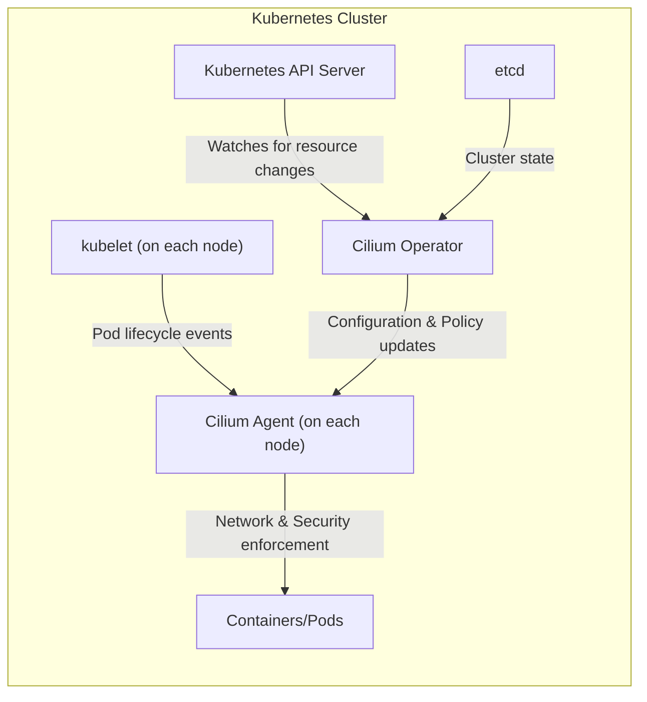

## Project Design Document: Cilium (Improved)

**1. Introduction**

This document provides an enhanced and detailed design overview of Cilium, an open-source project specializing in providing networking, security, and observability for modern cloud-native environments, primarily focusing on Kubernetes. The purpose of this document is to thoroughly describe Cilium's architecture, components, and operational flows, creating a solid foundation for subsequent threat modeling exercises. Understanding these details is crucial for identifying potential vulnerabilities and security risks.

**2. Goals**

* Present a more in-depth and refined architectural overview of Cilium.
* Provide clearer and more detailed descriptions of key components and their interactions.
* Elaborate on the data flow within the Cilium system with greater precision.
* Offer a more comprehensive exploration of security-relevant aspects of the design, including potential threats and mitigations.
* Serve as a robust and informative foundation for future threat modeling exercises, enabling a more thorough analysis.

**3. Non-Goals**

* Provide an exhaustive, line-by-line code-level analysis of the Cilium codebase.
* Detail every single configuration option, flag, or feature available within Cilium.
* Include performance benchmarking data, specific optimization strategies, or scalability testing results.
* Cover the complete historical evolution of Cilium's design decisions and past iterations.

**4. High-Level Architecture**

Cilium functions as a Container Network Interface (CNI) plugin within a container orchestration platform like Kubernetes. Its core strength lies in leveraging eBPF (Extended Berkeley Packet Filter) technology within the Linux kernel. This allows for highly efficient and programmable network control, security policy enforcement, and deep observability directly at the kernel level. The following diagram illustrates the key actors and their relationships within a Kubernetes cluster running Cilium.

**5. Detailed Architecture and Components**

Cilium's architecture is composed of several interconnected components, each with specific responsibilities:

* **Cilium Agent:**
    * Deployed as a DaemonSet, ensuring one instance runs on every node in the Kubernetes cluster.
    * Acts as the primary enforcement point for Cilium's functionalities on its respective node.
    * Receives notifications about pod and container lifecycle events from the kubelet.
    * Programs the eBPF dataplane within the Linux kernel to manage all network traffic entering and leaving the node's managed pods.
    * Enforces network policies (both Kubernetes NetworkPolicies and CiliumNetworkPolicies), provides service load balancing, and manages network connectivity between pods and external networks.
    * Collects detailed metrics, logs, and telemetry data, providing rich observability into network behavior and security events.
    * Manages the security identities assigned to workloads running on the node.
    * Handles the encryption and decryption of network traffic when features like IPsec or WireGuard are enabled.

* **Cilium Operator:**
    * Deployed as a standard Kubernetes Deployment, typically with a single replica for high availability.
    * Functions as a cluster-wide controller, responsible for managing the overall state and configuration of Cilium across the entire cluster.
    * Continuously monitors the Kubernetes API server for changes to relevant Kubernetes objects, such as NetworkPolicy, CiliumNetworkPolicy, Service, and Namespace.
    * Translates these high-level Kubernetes configurations into low-level, Cilium-specific configurations that are then distributed to the Cilium Agents.
    * Manages cluster-wide resources, including IP Address Management (IPAM) and the allocation of security identities.
    * Plays a crucial role in the lifecycle management of Cilium, including handling upgrades and ensuring consistent configuration across the cluster.

* **CNI (Container Network Interface) Plugin:**
    * Implements the standard Kubernetes CNI specification, allowing Cilium to integrate seamlessly with the Kubernetes networking model.
    * Is invoked by the kubelet on each node during pod creation and deletion events.
    * Responsible for configuring the network namespace of each pod, including setting up virtual network interfaces (veth pairs) and configuring routing tables.
    * Delegates the actual network policy enforcement, traffic management, and advanced networking functionalities to the local Cilium Agent.

* **eBPF Dataplane:**
    * Represents the core technological foundation of Cilium, providing high performance and programmability.
    * Consists of eBPF programs that are dynamically loaded into the Linux kernel's networking stack.
    * These programs intercept network packets at various points in the kernel's processing pipeline, allowing for fine-grained control and manipulation.
    * Enables efficient implementation of network policy enforcement, service load balancing, traffic routing, and observability features directly within the kernel, minimizing overhead.

* **Identity Management:**
    * Cilium assigns cryptographic security identities to individual workloads (pods and containers).
    * These identities are independent of IP addresses and are used as the basis for enforcing network policies, providing a more robust and flexible security model.
    * Identities are typically derived from Kubernetes metadata such as namespaces, labels, and service accounts.

* **IP Address Management (IPAM):**
    * Cilium manages the allocation and assignment of IP addresses to pods within the cluster.
    * Supports various IPAM modes, including:
        * **`cluster-pool`:** A central pool of IPs is shared across the cluster.
        * **`host-local`:** Each node manages a local pool of IPs.
        * **`kubernetes`:** Delegates IPAM to the Kubernetes controller manager.
        * **External IPAM:** Integration with external IPAM solutions.

* **Service Mesh Capabilities (Cilium Service Mesh):**
    * Extends Cilium's core functionalities to provide a comprehensive service mesh solution.
    * Offers features like mutual TLS (mTLS) authentication for secure service-to-service communication, sophisticated traffic management (e.g., request routing, retries, timeouts, circuit breaking), and detailed observability for service interactions.
    * Can leverage Envoy proxy as a data plane for advanced traffic management or utilize Cilium's built-in proxy capabilities.

**6. Data Flow**

Understanding the flow of data within the Cilium system is crucial for identifying potential attack vectors. Here are key data flow scenarios:

* **Pod Creation and Network Setup:**
    1. The Kubernetes API Server receives a request to create a new pod.
    2. The kubelet on the designated node is instructed to launch the pod.
    3. The kubelet invokes the Cilium CNI plugin.
    4. The Cilium CNI plugin configures the pod's network namespace, creating virtual interfaces and setting up basic routing.
    5. The Cilium Agent on the node is notified about the new pod, including its metadata (labels, namespace, etc.).
    6. The Cilium Agent assigns a security identity to the pod and programs the eBPF dataplane to handle traffic for this pod, including applying any relevant network policies.

* **Network Policy Enforcement Workflow:**
    1. A user defines a Kubernetes NetworkPolicy or a CiliumNetworkPolicy.
    2. The Kubernetes API Server persists this policy in etcd.
    3. The Cilium Operator watches the Kubernetes API Server for changes to network policy objects.
    4. Upon detecting a change, the Cilium Operator translates the high-level policy definition into a more granular, Cilium-specific representation.
    5. The Cilium Operator distributes these translated policies to the Cilium Agents running on the nodes where the affected workloads reside.
    6. The Cilium Agents program the eBPF dataplane with these policies, instructing the kernel how to filter network traffic based on source and destination identities, ports, protocols, and other criteria.

* **Service Communication Path:**
    1. A pod initiates a network request destined for a Kubernetes Service.
    2. The request is intercepted by the eBPF dataplane on the source node.
    3. Cilium performs service discovery to identify the backend pods associated with the target Service.
    4. Cilium's load balancing mechanism selects a healthy backend pod based on configured algorithms.
    5. The eBPF dataplane forwards the request to the chosen backend pod, enforcing any applicable network policies along the way.
    6. If mTLS is enabled within the Cilium Service Mesh, the connection is authenticated and encrypted using the involved service identities.

* **Observability Data Pipeline:**
    1. eBPF programs within the kernel continuously monitor network traffic and system events.
    2. These programs collect detailed metrics, logs, and tracing information.
    3. The Cilium Agent aggregates and processes this raw data.
    4. The Cilium Agent exports this processed observability data to various configured backends, such as Prometheus for metrics, Grafana for dashboards, and Jaeger or Zipkin for distributed tracing.

**7. Security Considerations (Expanded)**

Cilium incorporates a robust set of security features, but understanding potential vulnerabilities is crucial for threat modeling:

* **Network Policy Enforcement Vulnerabilities:**
    * **Policy Bypass:**  Incorrectly configured or overly permissive policies could allow unauthorized traffic.
    * **Policy Conflicts:**  Conflicting policies might lead to unexpected behavior or security gaps.
    * **Policy Injection:**  In a compromised control plane, malicious actors could inject harmful policies.

* **Workload Identity Spoofing:**
    * If the process of assigning or verifying workload identities is flawed, an attacker might be able to impersonate a legitimate workload.

* **Encryption Weaknesses:**
    * **Downgrade Attacks:**  An attacker might try to force the use of weaker encryption protocols.
    * **Key Management Issues:**  Insecure storage or distribution of encryption keys could compromise confidentiality.

* **Mutual TLS (mTLS) Bypass:**
    * Misconfigurations or vulnerabilities in the mTLS implementation could allow unauthorized access to services.
    * Compromised certificates could be used to impersonate services.

* **eBPF Exploits:**
    * Although eBPF provides strong isolation, potential vulnerabilities in the kernel's eBPF verifier or runtime could be exploited.

* **Control Plane Compromise:**
    * If the Cilium Operator or the Kubernetes API server is compromised, attackers could gain control over the entire Cilium deployment and potentially the entire cluster.

* **Side-Channel Attacks:**
    * While less likely, potential side-channel attacks exploiting timing differences or resource consumption within the eBPF dataplane could exist.

* **Denial of Service (DoS) Attacks:**
    * While Cilium offers some DoS protection, vulnerabilities in the eBPF programs or the Agent could be exploited to overwhelm the system.

* **Supply Chain Security:**
    * Ensuring the integrity and security of Cilium's build and distribution process is critical to prevent the introduction of malicious code.

**8. Deployment Considerations (More Detail)**

* **Installation Methods:**
    * **Helm Charts:** A common and recommended method for deploying Cilium on Kubernetes, providing templating and version management.
    * **Cilium CLI:** A command-line tool specifically designed for installing and managing Cilium.
    * **Manifests:** Direct application of Kubernetes YAML manifests, offering fine-grained control but requiring more manual configuration.

* **CNI Chaining vs. Standalone:**
    * **Standalone:** Cilium acts as the sole CNI plugin, managing all aspects of pod networking.
    * **Chaining:** Cilium works alongside another CNI plugin, delegating certain networking responsibilities. This can add complexity and requires careful configuration.

* **Kernel Compatibility:**
    * Cilium relies heavily on specific Linux kernel features related to eBPF. Ensuring kernel compatibility is crucial for proper functionality. Minimum kernel versions are typically documented.

* **Resource Allocation:**
    * The Cilium Agent and Operator require sufficient CPU and memory resources. Proper resource requests and limits should be configured based on cluster size and workload.

* **Security Contexts and Capabilities:**
    * Carefully configure security contexts for Cilium components to minimize their privileges. Avoid running containers as root unless absolutely necessary. Grant only the required Linux capabilities.

* **Network Infrastructure Requirements:**
    * Consider the underlying network infrastructure and its compatibility with Cilium's networking model (e.g., overlay networks, direct routing).

* **Monitoring and Logging Infrastructure:**
    * Plan for the integration of Cilium's observability data with existing monitoring and logging systems.

**9. Future Considerations (Updated)**

* **Enhanced Integration with Service Mesh Standards (e.g., SMI):**  Continued efforts to align with and support industry-standard service mesh APIs for greater interoperability.
* **Advanced Observability Features:**  Further development of tracing capabilities, richer metrics, and more sophisticated network flow analysis tools.
* **Improved Security Posture:**  Ongoing research and development into new security mechanisms leveraging eBPF, such as advanced intrusion detection and prevention capabilities.
* **Simplified Management and Operations:**  Focus on improving the user experience for managing and configuring Cilium, potentially through more intuitive UIs or automated workflows.
* **Support for Emerging Technologies:**  Adapting Cilium to support new container runtimes, orchestration platforms, and networking paradigms.
* **Edge Computing and IoT Integration:**  Exploring the application of Cilium's technologies in edge computing and Internet of Things (IoT) environments.

This improved design document provides a more comprehensive and detailed understanding of Cilium's architecture and functionalities. It is intended to serve as a valuable and informative resource for conducting thorough and effective threat modeling exercises, enabling a deeper analysis of potential security risks and vulnerabilities.