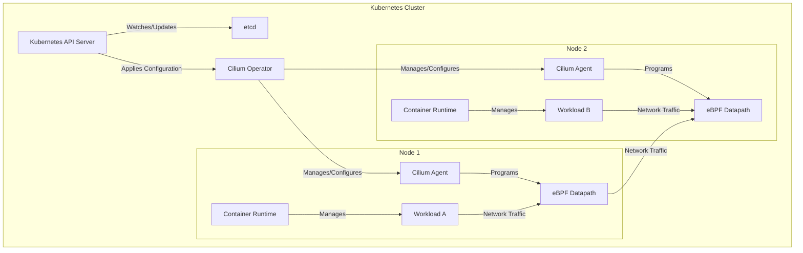

# Project Design Document: Cilium

**Version:** 1.1
**Date:** October 26, 2023
**Author:** AI Cloud & Security Architect

## 1. Introduction

This document provides an enhanced and detailed design overview of Cilium, an open-source project delivering networking, security, and observability for modern cloud-native environments, particularly Kubernetes. This document is specifically crafted to serve as a foundation for a comprehensive threat modeling exercise, providing the necessary architectural insights and component details.

## 2. Goals and Objectives

The fundamental goals of Cilium are:

* To provide efficient and scalable network connectivity between containerized applications.
* To enforce fine-grained, identity-based network security policies, moving beyond traditional IP-based rules.
* To offer deep and actionable observability into network traffic and application behavior without requiring code changes.
* To integrate seamlessly with cloud-native orchestration platforms like Kubernetes, abstracting away underlying network complexities.
* To provide a flexible and extensible platform for advanced networking functionalities and security features.

## 3. High-Level Architecture

Cilium employs a distributed agent model, with an agent running on each node in the cluster. The control plane manages the overall configuration and policy distribution. A key differentiator is Cilium's deep integration with the Linux kernel through Extended Berkeley Packet Filter (eBPF), enabling high-performance and programmable network control and observability.



**Key Components:**

* **Cilium Agent:** A daemon set running on each node. Its core responsibilities include:
    * Monitoring the Kubernetes API server for changes in cluster state (pods, services, namespaces, network policies, etc.).
    * Translating high-level network policies into low-level eBPF instructions.
    * Managing and enforcing workload identities (security identities) based on Kubernetes metadata (e.g., labels, namespaces).
    * Programming the eBPF datapath with network routing, filtering, security policies, and load-balancing rules.
    * Handling IP Address Management (IPAM) for pods, allocating and managing pod IPs.
    * Collecting and exporting detailed network flow logs and metrics to Hubble.
    * Managing encryption keys for network traffic when encryption is enabled (e.g., WireGuard, IPsec).
    * Providing a gRPC API for communication with the Cilium CLI, Hubble, and other internal components.
* **eBPF Datapath:** The core innovation of Cilium, residing within the Linux kernel. It provides:
    * High-performance packet filtering and forwarding at various layers of the network stack.
    * Enforcement of network policies based on container/pod identities, not just IP addresses.
    * Service load balancing, including direct server return (DSR) and Maglev hashing.
    * Network Address Translation (NAT) for outbound traffic and service exposure.
    * Encapsulation capabilities for overlay networking (e.g., VXLAN, Geneve, IP-in-IP).
    * Advanced traffic management features like bandwidth management and traffic shaping.
    * Generation of detailed network observability data, including flow logs, drop reasons, and latency metrics.
* **Cilium Operator:** A cluster-scoped deployment responsible for managing the lifecycle and global configuration of Cilium:
    * Deploying, upgrading, and managing the Cilium agent daemon set across the cluster.
    * Managing cluster-wide resources and configurations, such as encryption keys and node-level settings.
    * Integrating with cloud providers for infrastructure-level networking and security features.
    * Handling the initial setup and bootstrapping of the Cilium environment.
* **Cilium CLI:** A command-line interface for interacting with the Cilium system, enabling users to:
    * Inspect the status and configuration of Cilium agents and the overall system.
    * Manage network policies and identities.
    * Troubleshoot network connectivity and policy enforcement issues.
    * Retrieve observability data from Hubble.
* **CNI (Container Network Interface) Plugin:**  The interface through which Cilium integrates with the container runtime (e.g., containerd, CRI-O) to manage the network namespace of pods:
    * Configuring the network interface of pods when they are created.
    * Assigning IP addresses to pods from the configured IPAM pool.
    * Setting up routes and network connectivity for pods.
* **Hubble:** Cilium's integrated observability layer, providing comprehensive insights into network traffic and application behavior:
    * Collecting real-time network flow logs, including source and destination identities, ports, protocols, and policy decisions.
    * Generating service dependency maps, visualizing the communication patterns between microservices.
    * Providing a query interface (Hubble CLI and UI) for inspecting network flows and events.
    * Integrating with monitoring systems (e.g., Prometheus) for exporting metrics and setting up alerts.
* **Envoy (Optional):** Cilium can optionally integrate with Envoy as a sidecar proxy for advanced Layer 7 functionalities:
    * HTTP-aware routing and load balancing based on headers and other application-level attributes.
    * Mutual TLS (mTLS) authentication for securing service-to-service communication.
    * Advanced traffic management features like circuit breaking, retries, and timeouts.
    * Ingress and egress control for managing traffic entering and leaving the cluster.

## 4. Detailed Design

This section provides a more granular view of the functionality and interactions within key Cilium components.

### 4.1. Cilium Agent (Deep Dive)

* **Core Responsibilities:**
    * **Kubernetes API Interaction:** Establishes a watch on the Kubernetes API server to receive real-time updates on relevant resources.
    * **Policy Translation:** Converts Kubernetes NetworkPolicy objects and CiliumNetworkPolicy custom resources into eBPF bytecode.
    * **Identity Management:** Assigns and manages security identities for workloads based on Kubernetes labels, namespaces, and service accounts.
    * **eBPF Programming:** Uses the `bpf()` system call to load and update eBPF programs and maps in the kernel datapath.
    * **IPAM Implementation:** Manages the allocation and deallocation of IP addresses to pods, ensuring no IP conflicts.
    * **Hubble Data Export:** Collects flow logs and metrics from the eBPF datapath and sends them to the Hubble Relay.
    * **Encryption Key Management:**  Handles the distribution and rotation of encryption keys for features like WireGuard or IPsec.
    * **gRPC Server:** Exposes a gRPC API for communication with other Cilium components and external clients.

* **Internal Components:**
    * **Policy Controller:** Responsible for fetching, processing, and translating network policies.
    * **Identity Allocator:** Manages the allocation and assignment of workload identities.
    * **Endpoint Manager:** Tracks and manages the network endpoints of pods on the node.
    * **IPAM Controller:** Implements the IP address management logic.
    * **BGP Router (Optional):**  For integrating with physical network infrastructure using BGP.

### 4.2. eBPF Datapath (Deep Dive)

* **Key Functionality:**
    * **L3/L4 Filtering:** Performs packet filtering based on IP addresses, ports, and protocols.
    * **Identity-Based Filtering:** Enforces security policies based on workload identities, allowing for namespace-aware or service-aware rules.
    * **Service Load Balancing (kube-proxy replacement):** Implements efficient load balancing for Kubernetes Services, bypassing the traditional `kube-proxy`.
    * **NAT Implementation:** Performs source and destination NAT for various networking scenarios.
    * **Encapsulation/Decapsulation:** Handles the encapsulation and decapsulation of packets for overlay networks.
    * **Traffic Shaping and QoS:** Implements rate limiting and other Quality of Service mechanisms.
    * **Observability Hooks:**  Inserts probes to collect network flow data and metrics.

* **eBPF Program Types:**
    * **XDP (eXpress Data Path):**  For extremely high-performance packet processing at the network interface driver level.
    * **TC (Traffic Control):**  For applying policies and actions at the traffic control layer.
    * **Socket Filters:** For filtering traffic at the socket level.
    * **Tracing:** For collecting detailed network events and debugging.

### 4.3. Cilium Operator (Deep Dive)

* **Responsibilities:**
    * **Agent Deployment and Management:** Deploys and manages the Cilium Agent DaemonSet, ensuring it runs on all relevant nodes.
    * **Cluster-Wide Configuration:** Manages global Cilium configurations, such as default policy settings and encryption options.
    * **Cloud Provider Integration:**  Handles cloud-specific integrations for features like native load balancers and security groups.
    * **Upgrade Orchestration:**  Manages the rolling upgrades of Cilium components across the cluster.
    * **Resource Management:**  Manages custom resources defined by Cilium, such as CiliumNetworkPolicy and CiliumIdentity.

* **Key Interactions:**
    * **Kubernetes API Server:** Uses Kubernetes APIs to create, update, and manage Cilium deployments and custom resources.
    * **Cilium Agents:** Communicates with Cilium Agents (often indirectly) to apply configurations and monitor their status.

### 4.4. Hubble (Deep Dive)

* **Components:**
    * **Hubble Agent:** Runs on each node, collecting flow data and metrics from the local Cilium Agent.
    * **Hubble Relay:** A central component that aggregates data from multiple Hubble Agents and provides a query interface.
    * **Hubble UI:** A web-based user interface for visualizing network flows, service maps, and other observability data.
    * **Hubble CLI:** A command-line tool for querying and filtering Hubble data.

* **Data Flow:**
    * eBPF datapath generates flow records.
    * Cilium Agent collects these records.
    * Hubble Agent retrieves these records from the Cilium Agent.
    * Hubble Agent sends the data to the Hubble Relay.
    * Users query the Hubble Relay via the CLI or UI.

## 5. Key Data Flows (Enhanced)

This section details critical data flows within Cilium, essential for understanding potential attack vectors.

```mermaid
graph LR
    subgraph "Kubernetes Control Plane"
        direction TB
        KAPI["Kubernetes API Server"]
        NetPolicy["Network Policy"]
        PodDef["Pod Definition"]
        CRD["Cilium CRDs"]
    end

    subgraph "Cilium Control Plane"
        direction TB
        COperator["Cilium Operator"]
        CAgent["Cilium Agent"]
    end

    subgraph "Cilium Data Plane (eBPF)"
        direction TB
        eBPFPolicy["eBPF Policy Filters"]
        eBPFRouting["eBPF Routing/Forwarding"]
        eBPFObs["eBPF Observability"]
    end

    subgraph "Network Traffic"
        direction LR
        SrcWorkload["Source Workload"]
        DestWorkload["Destination Workload"]
    end

    KAPI -- "Creates/Updates" --> NetPolicy
    KAPI -- "Creates/Updates" --> PodDef
    KAPI -- "Creates/Updates" --> CRD
    NetPolicy -- "Watches" --> COperator
    CRD -- "Watches" --> COperator
    PodDef -- "Watches" --> CAgent
    COperator -- "Configures" --> CAgent
    CAgent -- "Programs Policies" --> eBPFPolicy
    CAgent -- "Programs Routing" --> eBPFRouting
    CAgent -- "Configures Observability" --> eBPFObs
    SrcWorkload -- "Traffic" --> eBPFPolicy
    eBPFPolicy -- "Forwards/Drops" --> eBPFRouting
    eBPFRouting -- "Traffic" --> DestWorkload
    eBPFObs -- "Generates Data" --> CAgent
    CAgent -- "Sends Data" --> "Hubble Relay"
```

**Key Data Flow Descriptions:**

* **Policy Propagation and Enforcement:**
    * A user defines a NetworkPolicy or CiliumNetworkPolicy.
    * The Kubernetes API Server persists the policy.
    * The Cilium Operator watches for changes to these policy objects.
    * The Cilium Operator instructs the relevant Cilium Agents about the new or updated policy.
    * The Cilium Agent translates the policy into eBPF rules.
    * The Cilium Agent programs the eBPF datapath with these rules, enforcing them at the packet level.

* **Workload Communication Path:**
    * A source workload initiates network traffic.
    * The traffic is intercepted by the eBPF datapath on the source node.
    * The eBPF datapath evaluates the traffic against the configured network policies, using workload identities.
    * If the policy allows the traffic, the eBPF datapath performs routing and forwarding, potentially encapsulating the packet.
    * The traffic reaches the destination node, where the eBPF datapath performs decapsulation (if needed) and applies ingress policies.
    * The traffic is delivered to the destination workload.

* **Observability Data Collection and Export:**
    * The eBPF datapath observes network traffic and generates flow logs and metrics.
    * The Cilium Agent collects this observability data from the eBPF datapath.
    * The Cilium Agent sends the data to the Hubble Relay.
    * Hubble Relay aggregates and stores the data, making it available for querying and visualization through the Hubble CLI and UI.

## 6. Security Considerations (Detailed)

This section expands on the initial security considerations, providing a more structured overview for threat modeling.

* **Authentication and Authorization:**
    * **Cilium Agent to Kubernetes API Server:** Agents authenticate using Kubernetes Service Account tokens. Compromise of a node could lead to API access.
    * **Cilium Operator to Kubernetes API Server:** The Operator also uses a Service Account token with broader cluster-level permissions.
    * **Cilium CLI to Cilium Agent:**  Uses local socket communication or potentially network connections, requiring proper authorization.
    * **Hubble Components:** Authentication mechanisms between Hubble Agent and Relay, and for accessing the Hubble UI/CLI, need scrutiny.

* **Network Policy Enforcement Security:**
    * **eBPF Bypasses:** Potential vulnerabilities in the eBPF datapath or incorrect policy translation could lead to policy bypasses.
    * **Identity Spoofing:**  Can an attacker spoof workload identities to bypass policy restrictions?
    * **Policy Conflicts:** How are conflicting policies resolved, and could this lead to unintended access?

* **Data Confidentiality and Integrity:**
    * **Network Traffic Encryption:** Cilium supports WireGuard and IPsec for encrypting network traffic. Are these implementations secure? How are keys managed and rotated?
    * **Configuration Data:** How is sensitive configuration data (e.g., encryption keys) stored and protected?
    * **Observability Data:**  Flow logs may contain sensitive information. How is access to Hubble data controlled?

* **Control Plane Security:**
    * **Operator Compromise:**  Compromise of the Cilium Operator could have significant impact due to its cluster-wide privileges.
    * **Agent Security:**  Securing access to the Cilium Agent's gRPC API and local resources is crucial.
    * **Supply Chain Security:**  Ensuring the integrity of Cilium container images and binaries is vital.

* **Vulnerability Management:**
    * **Patching Process:** How quickly are vulnerabilities in Cilium components addressed and patched?
    * **Security Audits:** Are regular security audits performed on the Cilium codebase?

* **Denial of Service (DoS) Attacks:**
    * **Control Plane DoS:**  Can an attacker overwhelm the Cilium Operator or Agents with requests?
    * **Data Plane DoS:**  Can malicious traffic be crafted to overload the eBPF datapath?

* **Identity Management Security:**
    * **Identity Provisioning:** How are workload identities initially provisioned and assigned?
    * **Identity Revocation:** How are identities revoked when workloads are deleted or compromised?

* **Integration with Kubernetes Security:**
    * **RBAC:** How does Cilium interact with Kubernetes RBAC? Are there potential privilege escalation issues?
    * **Pod Security Policies/Pod Security Admission:** How does Cilium align with Kubernetes pod security mechanisms?

## 7. Deployment Model (Expanded)

Cilium offers flexible deployment options within Kubernetes:

* **Direct Routing:** Cilium leverages the underlying network infrastructure for routing, offering high performance but requiring network configuration.
* **Overlay Networks (VXLAN, Geneve):** Encapsulates network traffic, simplifying network configuration but potentially adding overhead.
* **AWS ENI, Azure IPAM, GCP Routes:** Integrates with cloud provider networking for optimized performance and scalability in cloud environments.
* **kube-proxy Replacement:** Cilium can directly implement service load balancing, replacing the traditional `kube-proxy` for improved efficiency.

Deployment can be managed using:

* **Helm Charts:**  A popular method for packaging and deploying Kubernetes applications, including Cilium.
* **Kubernetes Manifests (YAML):**  Directly applying Kubernetes YAML files to deploy Cilium components.
* **Cilium CLI:**  The Cilium command-line tool can be used for installation and management.

## 8. Technology Stack

The core technologies powering Cilium include:

* **Linux Kernel:**  Essential for the eBPF datapath functionality.
* **eBPF (Extended Berkeley Packet Filter):** The core technology for programmable networking and observability.
* **Go:** The primary programming language for Cilium components, offering performance and concurrency.
* **Kubernetes:** The container orchestration platform Cilium integrates with.
* **gRPC:** Used for efficient and type-safe inter-process communication.
* **Protocol Buffers:**  Used for defining data structures for gRPC messages.
* **Envoy (Optional):** A high-performance proxy for advanced L7 features.
* **VXLAN/Geneve:** Common network encapsulation protocols for overlay networking.
* **WireGuard/IPsec:**  Protocols used for encrypting network traffic.
* **Prometheus:**  A widely used monitoring system for collecting and storing metrics.
* **Grafana:** A popular data visualization and dashboarding tool.

## 9. Assumptions and Constraints

* This document assumes a working knowledge of Kubernetes and basic networking concepts.
* The focus is on the core networking, security, and observability features of Cilium. Less common or experimental features may not be detailed.
* The architecture and specific functionalities may vary slightly depending on the Cilium version and configuration.

## 10. Future Considerations

* **Enhanced Service Mesh Capabilities:** Further development of Cilium's integrated service mesh functionality, potentially including more advanced traffic management and security features.
* **Integration with External Security Tools:** Deeper integration with security information and event management (SIEM) systems, vulnerability scanners, and other security tools.
* **Advanced Observability Features:**  Adding more sophisticated network telemetry, tracing capabilities, and integration with distributed tracing systems.
* **Support for Emerging Networking Technologies:** Adapting to and supporting new networking protocols and standards.
* **Improved Policy Management Interfaces:**  Developing more user-friendly interfaces for managing complex network policies.
