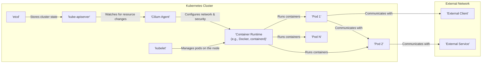

## Project Design Document: Cilium (Improved)

**1. Introduction**

This document provides a detailed architectural design of Cilium, an open-source, cloud-native networking and security solution. Cilium leverages Linux BPF (Berkeley Packet Filter) technology to deliver efficient network connectivity, robust security policy enforcement, and comprehensive observability for containerized workloads and microservices, primarily within Kubernetes environments. This document aims to provide a clear and comprehensive overview of Cilium's architecture, its core components, and the flow of data within the system. It is intended to serve as a foundational resource for subsequent threat modeling activities.

**2. Goals and Objectives**

The primary design goals of Cilium are to:

* **Establish secure network connectivity:** Facilitate secure and reliable communication between containerized applications within a Kubernetes cluster and with external services.
* **Implement identity-based network policies:** Enforce fine-grained network access control based on container identities (e.g., Kubernetes labels, namespaces, service accounts) rather than traditional IP addresses or CIDR blocks.
* **Provide intelligent load balancing:** Distribute network traffic efficiently and intelligently across healthy service endpoints.
* **Enable deep network observability:** Offer granular insights into network traffic patterns, application behavior, and policy enforcement decisions.
* **Achieve seamless Kubernetes integration:** Integrate deeply with Kubernetes APIs and concepts for simplified configuration, management, and operation.
* **Deliver high performance and efficiency:** Utilize eBPF for in-kernel packet processing, minimizing overhead and maximizing performance.

**3. High-Level Architecture**

Cilium operates as a distributed system, deploying agents on each node within a Kubernetes cluster. These agents work in concert with the Kubernetes control plane to understand the state of applications, services, and network policies.



**4. Key Components**

* **Cilium Agent:**
    * Deployed as a DaemonSet on every Kubernetes node.
    * The core component responsible for configuring the local networking stack and enforcing network security policies.
    * Continuously monitors the Kubernetes API server for changes related to pods, services, and network policies.
    * Programs eBPF filters and data structures directly into the Linux kernel for efficient packet processing.
    * Manages the lifecycle and state of local endpoints (representing pods and other network entities).
    * Responsible for local service load balancing and health checking.
    * Collects network telemetry data for observability.

* **Cilium Operator:**
    * Deployed as a Deployment within the Kubernetes cluster.
    * Manages the overall lifecycle of Cilium components within the cluster.
    * Handles cluster-wide configurations, upgrades, and initial setup.
    * Creates and manages Custom Resource Definitions (CRDs) that extend the Kubernetes API for Cilium-specific configurations.
    * Ensures the desired state of Cilium is maintained across the cluster.

* **Cilium CLI (Command Line Interface):**
    * A command-line tool used to interact with and manage the Cilium system.
    * Provides functionalities for inspecting the status of Cilium, endpoints, policies, and network flows.
    * Facilitates debugging and troubleshooting network connectivity and policy enforcement issues.

* **Cilium eBPF Data Plane:**
    * The fundamental technology underpinning Cilium's functionality.
    * Consists of eBPF programs loaded into the Linux kernel's networking subsystem.
    * Performs critical functions such as packet filtering, forwarding, network address translation (NAT), load balancing, and security policy enforcement directly within the kernel.
    * Offers significant performance advantages due to its in-kernel execution.

* **Cilium Control Plane:**
    * A distributed control plane spanning the Cilium Agents and the Cilium Operator.
    * Responsible for managing security identities, distributing network policies, and facilitating service discovery.
    * Utilizes a distributed key-value store (often leveraging Kubernetes' etcd indirectly) for sharing and synchronizing state across the cluster.

* **Identity Management:**
    * Cilium assigns cryptographic security identities to pods and other network endpoints based on their Kubernetes attributes (labels, namespaces, service accounts).
    * These identities are used as the basis for network policy enforcement, replacing traditional IP-based rules and enabling more dynamic and context-aware security.
    * Identity information is managed and distributed by the Cilium Agents.

* **Network Policy Engine:**
    * Interprets Kubernetes NetworkPolicy objects and Cilium-specific policy CRDs (e.g., CiliumNetworkPolicy, CiliumClusterwideNetworkPolicy).
    * Translates these high-level policies into low-level eBPF rules that are enforced in the data plane.

* **Service Discovery and Load Balancing:**
    * Integrates with Kubernetes Services to dynamically discover and manage the endpoints of services.
    * Provides efficient load balancing across service endpoints, often employing techniques like Maglev hashing or consistent hashing for optimal distribution.

* **Hubble (Observability Platform):**
    * An integrated observability platform within Cilium, providing deep visibility into network traffic and application behavior.
    * Collects detailed flow logs, metrics, and security events directly from the eBPF data plane.
    * Offers a CLI (`hubble`) and a graphical user interface (Hubble UI) for querying, visualizing, and analyzing network activity.

**5. Data Flows**

* **Pod-to-Pod Communication (Same Node):**
    * Network traffic originates from a container within a pod.
    * The traffic is intercepted by eBPF programs attached to the container's virtual network interface (veth pair).
    * Cilium's eBPF programs perform policy enforcement by checking the security identities of the source and destination pods against configured policies.
    * If the traffic is allowed by the policies, it is forwarded directly to the destination container on the same node, often bypassing the traditional network stack for efficiency.

* **Pod-to-Pod Communication (Different Nodes):**
    ```mermaid
    graph LR
        subgraph "Node A"
            A["'Pod A'"]
            B["'Cilium Agent A'"]
            C["'eBPF Data Plane A'"]
        end

        subgraph "Node B"
            D["'Pod B'"]
            E["'Cilium Agent B'"]
            F["'eBPF Data Plane B'"]
        end

        G["'Network Fabric'"]

        A -- "Traffic" --> C
        C -- "Encapsulation\n(e.g., VXLAN, Geneve,\nIPsec, WireGuard)" --> G
        G -- "Decapsulation" --> F
        F -- "Traffic" --> D
    ```
    * Network traffic originates from a container within a pod on Node A.
    * eBPF programs on Node A encapsulate the traffic with appropriate headers (e.g., VXLAN, Geneve) or encrypt it (e.g., IPsec, WireGuard), depending on the configured tunneling mode and security policies.
    * The encapsulated or encrypted traffic is routed through the underlying network fabric to Node B.
    * eBPF programs on Node B decapsulate or decrypt the traffic.
    * Policy enforcement is performed on Node B before delivering the traffic to the destination pod.

* **Pod-to-External Service Communication:**
    * Network traffic originates from a container within a pod.
    * eBPF programs intercept the traffic.
    * Policy enforcement is applied to ensure the pod is authorized to access the external service.
    * The traffic is routed out of the Kubernetes cluster, typically through a Network Address Translation (NAT) gateway managed by Cilium or the underlying infrastructure.

* **External Client to Pod Communication (Ingress):**
    ```mermaid
    graph LR
        A["'External Client'"]
        B["'Ingress Controller\n(e.g., Envoy)'"]
        C["'Cilium Agent'"]
        D["'eBPF Data Plane'"]
        E["'Pod'"]

        A -- "Request" --> B
        B -- "Forwards to Service" --> C
        C -- "Policy Enforcement &\nLoad Balancing" --> D
        D -- "Forwards to Pod" --> E
    ```
    * An external client sends a request to the Kubernetes cluster.
    * An Ingress Controller (often Envoy, integrated with Cilium or running alongside) receives the request.
    * The Ingress Controller forwards the traffic to a Kubernetes Service.
    * Cilium's eBPF data plane intercepts the traffic destined for the service endpoints.
    * Policy enforcement is applied based on the destination service identity and potentially source information.
    * Load balancing is performed by Cilium to select a healthy backend pod.
    * The traffic is forwarded to the selected pod.

* **Policy Updates:**
    ```mermaid
    graph LR
        A["'kube-apiserver'"]
        B["'Cilium Operator'"]
        C["'Cilium Agent'"]
        D["'eBPF Data Plane'"]

        A -- "NetworkPolicy/\nCiliumPolicy\nCreation/Update" --> B
        B -- "Distributes Policy" --> C
        C -- "Programs eBPF" --> D
    ```
    * A Kubernetes NetworkPolicy or a Cilium-specific policy (e.g., CiliumNetworkPolicy) is created or updated via the `kube-apiserver`.
    * The Cilium Operator watches for these changes and distributes the policy definitions to the relevant Cilium Agents.
    * Each Cilium Agent translates the policy into eBPF rules and programs them into the local kernel's data plane, ensuring immediate and efficient enforcement.

**6. Security Considerations**

* **Secure Bootstrapping and Component Integrity:** Ensuring the authenticity and integrity of Cilium components during startup is paramount. This involves using signed container images, verifying checksums, and potentially leveraging secure boot mechanisms.
* **Authentication and Authorization of Cilium Components:** Secure communication and authentication between Cilium components (Agents, Operator) are crucial to prevent unauthorized control or data manipulation. This often involves TLS encryption and mutual authentication.
* **Kubernetes RBAC Integration:** Cilium leverages Kubernetes Role-Based Access Control (RBAC) to control access to its APIs and resources. Properly configured RBAC policies are essential to restrict who can manage Cilium configurations and policies.
* **Identity-Based Network Policy Enforcement:** Cilium's core security feature relies on strong identity management and policy enforcement. Carefully designed and regularly reviewed network policies are critical to prevent unauthorized network access.
* **Encryption in Transit:** Cilium supports encryption of inter-node traffic using technologies like IPsec or WireGuard, protecting the confidentiality of network communication between nodes. The choice of encryption protocol and key management practices are important security considerations.
* **Vulnerability Management and Patching:** Regularly updating Cilium components to address known security vulnerabilities is essential. A robust vulnerability management process should be in place.
* **Secure Defaults and Configuration Hardening:** Configuring Cilium with secure default settings and applying hardening guidelines minimizes the attack surface. This includes disabling unnecessary features and restricting access to sensitive functionalities.
* **Auditing and Logging:** Cilium and Hubble provide comprehensive logging and auditing capabilities, enabling security monitoring, incident response, and forensic analysis. Proper configuration and secure storage of logs are important.
* **Control Plane Security:** Securing the Cilium control plane, including communication channels and data storage, is vital to prevent tampering with policies or the overall system state.
* **Data Plane Security:** The eBPF data plane itself needs to be robust and free from vulnerabilities that could be exploited to bypass security controls or cause denial-of-service. Regular security audits and code reviews are important.
* **Network Segmentation:** Cilium facilitates network segmentation based on Kubernetes namespaces and other attributes, limiting the blast radius of potential security breaches.
* **Denial of Service (DoS) Protection:**  Considerations for how Cilium can mitigate or prevent DoS attacks at the network level.

**7. Deployment Considerations**

* **Installation Methods:** Cilium can be installed using various methods, including Helm charts, Kubernetes manifests, and the Cilium CLI. The chosen method can impact the ease of installation and management.
* **CNI Plugin Implementation:** Cilium functions as a Container Network Interface (CNI) plugin for Kubernetes, responsible for configuring the network for pods. The CNI implementation details can affect network performance and compatibility.
* **Datapath Mode Selection:** Cilium offers different datapath modes (e.g., native eBPF, VXLAN, Geneve, IPsec, WireGuard) with varying performance characteristics, feature sets, and security implications. The choice of datapath mode is a critical deployment decision.
* **Resource Requirements and Scaling:** Cilium Agents require resources (CPU, memory) on each node. Proper resource allocation and understanding scaling implications are necessary for stable operation.
* **Integration with Existing Infrastructure:** Considerations for integrating Cilium with existing network infrastructure, firewalls, and load balancers.
* **Monitoring and Alerting:** Setting up appropriate monitoring and alerting for Cilium components and network traffic is crucial for operational awareness and timely issue detection.

**8. Future Considerations**

* **Enhanced Service Mesh Integration:** Deeper integration with service mesh technologies like Istio to provide a unified networking and security layer.
* **Advanced Observability Features:** Expanding Hubble's capabilities for more granular network and application insights, including distributed tracing and advanced analytics.
* **Next-Generation Security Features:** Exploring new security features leveraging the power of eBPF, such as intrusion detection/prevention systems (IDS/IPS) and advanced threat mitigation.
* **Multi-Cluster Networking and Global Policies:** Enhancing support for connecting and securing workloads across multiple Kubernetes clusters with consistent policy enforcement.
* **Simplified Management and Automation:** Continuously improving the ease of management and automation of Cilium deployments and configurations.

This improved document provides a more detailed and refined overview of Cilium's architecture, components, and data flows. It emphasizes security considerations and aims to be a valuable resource for understanding the system's design and facilitating thorough threat modeling activities.