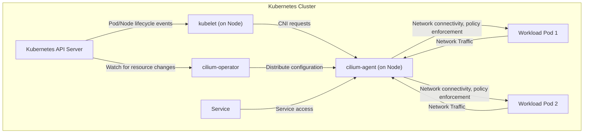

# Project Design Document: Cilium

**Version:** 1.1
**Date:** October 26, 2023
**Author:** AI Cloud & Security Architect

## 1. Project Overview

This document details the design of Cilium, an open-source, cloud-native connectivity, security, and observability solution. Cilium leverages the power of eBPF (Extended Berkeley Packet Filter) within the Linux kernel to provide efficient and performant networking and security policy enforcement for containerized workloads, primarily within Kubernetes environments. This design document aims to provide a comprehensive understanding of Cilium's architecture, key components, and operational flows, serving as a foundation for subsequent threat modeling and security analysis.

## 2. Goals and Objectives

*   Establish secure and performant network connectivity between application containers within a Kubernetes cluster and beyond.
*   Implement fine-grained, identity-aware network policies based on Kubernetes service accounts, labels, namespaces, and other metadata, rather than solely relying on IP addresses.
*   Enable advanced service discovery and intelligent load balancing across containerized applications, optimizing resource utilization and application resilience.
*   Provide deep network observability and monitoring capabilities, offering insights into network traffic, policy enforcement, and potential security events.
*   Enhance network performance and resource efficiency compared to traditional overlay network solutions by operating directly within the kernel.
*   Achieve seamless integration with Kubernetes and other cloud-native platforms and tools.
*   Offer advanced networking functionalities such as multi-cluster connectivity, egress gateway capabilities, and comprehensive network policy logging for auditing and compliance.

## 3. Target Audience

This document is intended for individuals and teams involved in the design, development, deployment, and security of systems utilizing Cilium. This includes:

*   Security Engineers: Responsible for threat modeling, security assessments, and implementing security controls.
*   Software Architects: Designing application architectures and infrastructure leveraging Cilium's capabilities.
*   Development Teams: Deploying and managing containerized applications on platforms utilizing Cilium.
*   Operations Teams: Responsible for the infrastructure supporting Cilium and ensuring its operational stability.
*   Compliance Officers: Assessing the security posture and compliance of systems using Cilium.

## 4. High-Level Architecture

Cilium operates primarily at the Linux kernel level, utilizing eBPF to intercept, process, and manage network traffic. It integrates tightly with the container runtime (typically containerd or CRI-O) and the Kubernetes orchestration platform.



*   **"Kubernetes API Server":** The central control plane of Kubernetes, managing the cluster's state and configurations. Cilium monitors the API server for changes in pods, services, network policies, and other relevant resources.
*   **"kubelet (on Node)":** The agent running on each Kubernetes node, responsible for managing pods and containers on that node. It interacts with Cilium (via the CNI plugin) to configure networking for newly created pods.
*   **"cilium-operator":** A cluster-scoped deployment responsible for managing cluster-wide Cilium resources and configurations. Its responsibilities include IP address management (IPAM), ensuring `cilium-agent` instances are running correctly on all nodes, and managing cluster-level custom resources.
*   **"cilium-agent (on Node)":** A daemon set running on each node in the Kubernetes cluster. This is the core component responsible for:
    *   Programming the eBPF datapath in the kernel with networking and security rules.
    *   Enforcing network policies based on pod identities and other criteria.
    *   Handling service discovery and load balancing for Kubernetes Services.
    *   Collecting network telemetry, metrics, and security event logs.
*   **"Workload Pod 1", "Workload Pod 2":** The containers running application workloads within the Kubernetes cluster. Cilium provides network connectivity and security for these pods.
*   **"Service":** A Kubernetes abstraction representing a logical set of pods providing a particular functionality. Cilium handles load balancing and service discovery for accessing these services.

## 5. Key Components

This section provides a more detailed description of Cilium's major components and their functionalities.

*   **cilium-agent:**
    *   Runs as a privileged daemon on each Kubernetes node.
    *   Subscribes to Kubernetes API events to monitor changes in pods, services, network policies, and namespaces.
    *   Translates high-level Kubernetes network policies into low-level eBPF programs that are loaded into the kernel.
    *   Manages the local eBPF datapath for networking, security policy enforcement, and observability.
    *   Performs service discovery by monitoring Kubernetes Services and endpoints, enabling efficient load balancing.
    *   Collects network metrics, flow logs, and security events, which can be exported to monitoring and logging systems.
    *   Manages IP address allocation for pods on the node, depending on the configured IPAM mode.
    *   Interacts with the container runtime through the Container Network Interface (CNI) plugin to configure pod network namespaces.

*   **cilium-operator:**
    *   Runs as a cluster-wide deployment, typically as a single replica or a highly available deployment.
    *   Manages cluster-level Cilium custom resources, such as `CiliumNetworkPolicy`, `CiliumClusterwideNetworkPolicy`, and `CiliumIdentity`.
    *   Performs IP Address Management (IPAM) across the cluster, allocating CIDRs to nodes and IP addresses to pods. Supports various IPAM modes, including host-local, cluster-pool, and AWS VPC CNI.
    *   Ensures that the `cilium-agent` is running and healthy on all Kubernetes nodes.
    *   Handles upgrades and lifecycle management of Cilium components within the cluster.
    *   Manages cluster-wide security identities for pods and namespaces.

*   **eBPF Datapath:**
    *   The core of Cilium's networking and security implementation, operating directly within the Linux kernel.
    *   Consists of eBPF programs and maps that are dynamically loaded and updated by the `cilium-agent`.
    *   Handles:
        *   High-performance packet forwarding and routing between pods and external networks.
        *   Enforcement of network policies at layers 3, 4, and 7, including filtering based on pod identities, ports, and application protocols (using Envoy as a proxy).
        *   Implementation of service load balancing, distributing traffic across healthy backend pods.
        *   Network Address Translation (NAT) for outbound traffic and service access.
        *   Transparent encryption of inter-node traffic using IPsec or WireGuard.
        *   Detailed network observability and tracing, capturing packet metadata and policy decisions.

*   **CNI (Container Network Interface) Plugin:**
    *   Implements the Kubernetes CNI specification, allowing Cilium to integrate with the Kubernetes networking model.
    *   Responsible for configuring the network namespace of pods when they are created, including setting up virtual Ethernet interfaces (veth pairs), assigning IP addresses, and configuring routing.
    *   Invoked by the kubelet during pod creation and deletion.

*   **Hubble:**
    *   A purpose-built observability platform tightly integrated with Cilium.
    *   Provides real-time visibility into network traffic flow, service dependencies, and security policy enforcement decisions.
    *   Collects detailed flow logs and metrics directly from the eBPF datapath, minimizing overhead.
    *   Offers a command-line interface (`hubble`) and a graphical user interface (Hubble UI) for querying and visualizing network activity.

*   **Cilium CLI:**
    *   A command-line interface (`cilium`) for interacting with and managing Cilium.
    *   Used for inspecting the status of Cilium components, managing network policies, troubleshooting network connectivity issues, and viewing network statistics.

## 6. Data Flow

This section illustrates the typical data flow for network traffic between pods and services within a Cilium-managed Kubernetes cluster.

*   **Pod-to-Pod Communication:**

    ```mermaid
    graph LR
        A["Source Pod"] --> B("cilium-agent (Source Node)")
        B -- "eBPF: Outgoing Policy Check, Routing" --> C("Network Fabric")
        C --> D("cilium-agent (Destination Node)")
        D -- "eBPF: Incoming Policy Check, NAT (if needed)" --> E["Destination Pod"]
    ```

    *   **"Source Pod":** Initiates network traffic destined for another pod.
    *   **"cilium-agent (Source Node)":**
        *   Intercepts the outgoing traffic at the pod's network namespace.
        *   The eBPF datapath within the `cilium-agent` performs network policy checks based on the source and destination pod identities and configured policies.
        *   Determines the routing path for the packet based on the destination IP address.
    *   **"Network Fabric":** The underlying network infrastructure connecting the Kubernetes nodes.
    *   **"cilium-agent (Destination Node)":**
        *   Receives the incoming traffic.
        *   The eBPF datapath performs ingress network policy checks to ensure the traffic is allowed.
        *   May perform Network Address Translation (NAT) if the destination pod is on a different network segment.
        *   Forwards the traffic to the destination pod's network namespace.
    *   **"Destination Pod":** Receives the network traffic.

*   **Service Access:**

    ```mermaid
    graph LR
        A["Client Pod"] --> B("cilium-agent (Client Node)")
        B -- "eBPF: Service Discovery, Load Balancing, Policy Check" --> C("Network Fabric")
        C --> D("cilium-agent (Backend Node)")
        D -- "eBPF: Policy Check" --> E["Backend Pod"]
    ```

    *   **"Client Pod":** Attempts to access a Kubernetes Service using its ClusterIP or DNS name.
    *   **"cilium-agent (Client Node)":**
        *   Intercepts the traffic destined for the Service IP.
        *   The eBPF datapath performs service discovery to identify the healthy backend pods for the service.
        *   Selects a backend pod based on the configured load balancing algorithm.
        *   Performs network policy checks to ensure the client pod is allowed to access the service.
        *   Forwards the traffic to the chosen backend node.
    *   **"Network Fabric":** The underlying network infrastructure.
    *   **"cilium-agent (Backend Node)":**
        *   Receives the traffic.
        *   The eBPF datapath performs policy checks to ensure the traffic is allowed to reach the backend pod.
        *   Forwards the traffic to the backend pod.
    *   **"Backend Pod":** One of the pods backing the Kubernetes Service, receives the request.

## 7. Security Considerations

This section outlines key security considerations related to Cilium, crucial for threat modeling and risk assessment.

*   **Granular Network Policy Enforcement:**
    *   Cilium enforces network policies at the kernel level using eBPF, providing strong isolation and preventing unauthorized network access between pods.
    *   Policies can be defined based on Kubernetes pod identities (labels, namespaces, service accounts), enabling fine-grained control beyond traditional IP-based rules.
    *   Supports both L3/L4 (IP addresses, ports, protocols) and L7 (application protocol awareness, e.g., HTTP, gRPC) policy enforcement, often leveraging Envoy as a proxy for L7.
    *   Policy enforcement occurs before packets reach the application container, preventing malicious traffic from reaching the workload.

*   **Identity-Based Security:**
    *   Cilium's security model is centered around Kubernetes identities, allowing for dynamic and context-aware policy enforcement.
    *   This approach simplifies security management in dynamic, containerized environments compared to managing static IP address-based rules.

*   **Transparent Encryption:**
    *   Cilium supports transparent encryption of inter-node pod traffic using IPsec or WireGuard, protecting against eavesdropping and man-in-the-middle attacks.
    *   Encryption can be enabled cluster-wide or selectively based on policy requirements.
    *   Key management is typically handled through integration with Kubernetes secrets.

*   **Secrets Management:**
    *   Cilium relies on Kubernetes secrets for storing and managing sensitive information, such as encryption keys.
    *   Secure storage and rotation of these secrets are critical security considerations.

*   **API Security:**
    *   Access to the Cilium API (via the `cilium` CLI or direct API calls) should be strictly controlled using Kubernetes RBAC (Role-Based Access Control) to prevent unauthorized configuration changes.
    *   Authentication and authorization mechanisms should be in place to secure access to Cilium's management interfaces.

*   **Node Security:**
    *   The security of the underlying Kubernetes nodes is paramount, as Cilium operates within the kernel.
    *   Compromised nodes could potentially bypass Cilium's security mechanisms. Regular patching, hardening, and monitoring of nodes are essential.

*   **Supply Chain Security:**
    *   Verifying the integrity and authenticity of Cilium container images and binaries is crucial to prevent the introduction of malicious components.
    *   Utilizing trusted container registries and verifying image signatures are recommended practices.

*   **Auditing and Logging:**
    *   Cilium provides comprehensive auditing and logging capabilities through Hubble and integration with standard logging systems.
    *   Logs capture network flows, policy enforcement decisions, and security events, providing valuable data for security monitoring, incident response, and compliance auditing.
    *   Proper configuration and monitoring of these logs are essential for detecting and responding to security incidents.

*   **Denial of Service (DoS) Protection:**
    *   While Cilium provides network policy enforcement, additional mechanisms might be needed to mitigate sophisticated DoS attacks.
    *   Consider integrating with rate limiting and traffic shaping tools.

## 8. Deployment Considerations

*   Cilium is typically deployed as a DaemonSet on Kubernetes to ensure an instance of `cilium-agent` runs on each node. The `cilium-operator` is deployed as a standard Kubernetes deployment.
*   Requires specific kernel configurations and headers to support eBPF functionality.
*   Different deployment models exist, including options for replacing kube-proxy for service load balancing.
*   Network planning is crucial, including considerations for IP address ranges, pod CIDRs, and network overlay vs. direct routing.
*   Integration with external services like load balancers, ingress controllers, and service meshes should be considered.

## 9. Future Considerations

*   Enhanced L7 policy capabilities and deeper integration with service mesh technologies.
*   Improved multi-cluster networking and security management for federated Kubernetes environments.
*   Further integration with observability and security information and event management (SIEM) platforms.
*   Continued performance optimization and scalability improvements to handle large-scale deployments.
*   Exploration and adoption of new eBPF features and capabilities to enhance functionality and security.

This improved design document provides a more detailed and comprehensive overview of Cilium, offering a stronger foundation for subsequent threat modeling and security analysis. The enhanced explanations, diagrams, and security considerations aim to provide a clearer understanding of Cilium's architecture and its role in securing cloud-native environments.