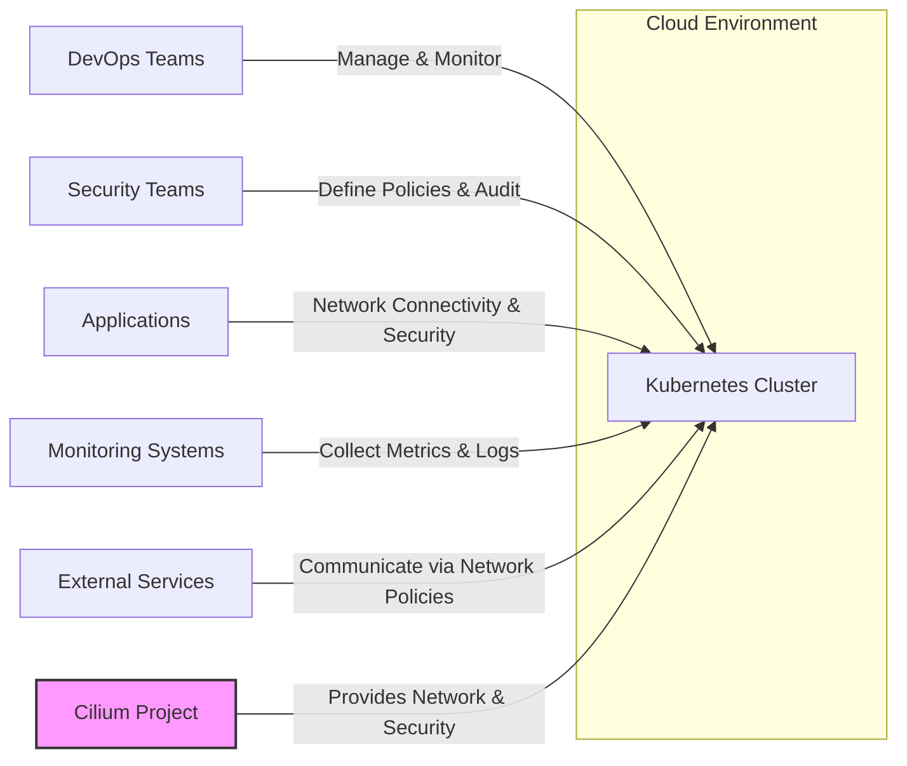
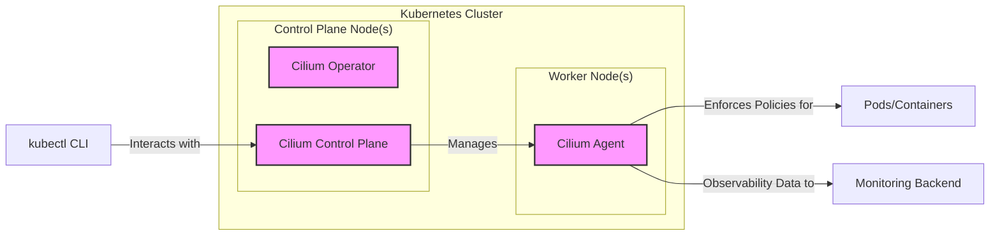
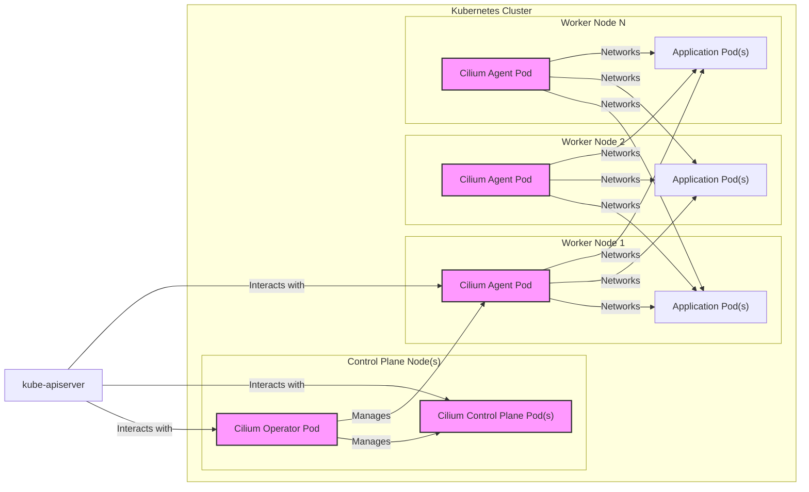

# BUSINESS POSTURE

- Business Priorities and Goals:
  - Cilium aims to provide secure network connectivity, observability, and control for cloud-native applications, particularly in Kubernetes environments.
  - The project prioritizes high performance, scalability, and security for modern, dynamic workloads.
  - A key goal is to simplify and automate network management and security in complex cloud-native deployments.
  - Cilium seeks to be a leading open-source solution for cloud-native networking, fostering a strong community and ecosystem.
- Business Risks:
  - Security vulnerabilities in Cilium could lead to significant breaches in user environments, impacting application availability and data confidentiality.
  - Performance issues or instability in Cilium could disrupt critical business applications relying on network connectivity.
  - Lack of adoption or community support could hinder the long-term viability and development of Cilium, impacting users who depend on it.
  - Compliance violations due to insecure network configurations or lack of auditability could result in legal and financial repercussions for users.

# SECURITY POSTURE

- Security Controls:
  - security control: Code reviews are conducted for all code changes. (Implemented via GitHub Pull Requests and community review process, described in project's contribution guidelines.)
  - security control: Static code analysis is likely used as part of the development process. (Inferred from common open-source development practices and CI/CD pipelines, details might be in repository's configuration files.)
  - security control: Unit and integration tests are implemented to ensure code quality and functionality. (Evident from the repository's test directory and CI/CD configurations.)
  - security control: Vulnerability scanning of dependencies is likely performed. (Inferred from standard software supply chain security practices, might be integrated into CI/CD.)
  - security control: Container image signing and verification are likely employed for release artifacts. (Inferred from best practices for container image distribution and security, details might be in release documentation.)
  - security control: Role-Based Access Control (RBAC) within Kubernetes is leveraged for authorization. (Described in Cilium documentation regarding Kubernetes integration and security policies.)
  - security control: Network policies are enforced by Cilium to control traffic flow between pods and services. (Core functionality of Cilium, documented extensively.)
  - security control: Encryption of network traffic using technologies like WireGuard or IPsec can be configured. (Feature of Cilium, documented in security and encryption sections.)
- Accepted Risks:
  - accepted risk: As an open-source project, the speed of response to newly discovered vulnerabilities might be influenced by community availability and the severity of the issue.
  - accepted risk: Complex configurations might introduce misconfigurations leading to security gaps if not properly managed.
  - accepted risk: Third-party dependencies could introduce vulnerabilities that are not immediately identified or patched by the Cilium project.
- Recommended Security Controls:
  - security control: Implement automated security scanning (SAST/DAST) in the CI/CD pipeline to proactively identify vulnerabilities in code changes.
  - security control: Establish a formal Security Response Team and a documented vulnerability disclosure process to handle security issues effectively.
  - security control: Conduct regular penetration testing and security audits to identify and address potential weaknesses in Cilium's design and implementation.
  - security control: Enhance supply chain security by using signed commits, Software Bill of Materials (SBOM), and verifying dependencies' integrity.
  - security control: Provide security hardening guides and best practices for deploying and configuring Cilium in various environments.
- Security Requirements:
  - Authentication:
    - Cilium relies on Kubernetes authentication mechanisms (e.g., kubeconfig, service accounts) for API access and control plane interactions.
    - Mutual TLS (mTLS) is used for securing communication between Cilium components and for service mesh functionalities.
  - Authorization:
    - Kubernetes RBAC is used to control access to Cilium APIs and resources.
    - Cilium Network Policies provide fine-grained authorization for network traffic based on identities and labels.
    - Policy enforcement should be least-privilege based, ensuring only necessary permissions are granted.
  - Input Validation:
    - All inputs to Cilium APIs, including network policy definitions and configuration parameters, must be rigorously validated to prevent injection attacks and misconfigurations.
    - Input validation should be performed on both the control plane and data plane components.
  - Cryptography:
    - Cryptographic protocols like TLS and WireGuard/IPsec must be used to protect sensitive data in transit.
    - Strong cryptographic algorithms and key management practices should be employed.
    - Secrets management for cryptographic keys and sensitive configuration data should be secure and robust, ideally leveraging Kubernetes Secrets or dedicated secrets management solutions.

# DESIGN

## C4 CONTEXT



- Context Diagram Elements:
  - - Name: Cilium Project
    - Type: Software System
    - Description: Provides network connectivity, security, and observability for cloud-native applications running in Kubernetes environments. It acts as a Container Network Interface (CNI), network policy engine, and service mesh.
    - Responsibilities:
      - Network connectivity between pods and services within the Kubernetes cluster and to external networks.
      - Enforcement of network security policies to control traffic flow.
      - Service mesh functionalities like load balancing, service discovery, and mTLS.
      - Network observability and monitoring through metrics, logs, and tracing.
    - Security controls:
      - Network policy enforcement.
      - Encryption of network traffic (optional).
      - Integration with Kubernetes RBAC for API access control.
  - - Name: Kubernetes Cluster
    - Type: Container Orchestration Platform
    - Description: The underlying platform where Cilium is deployed and manages networking for containerized applications. Provides the runtime environment and API for Cilium to operate.
    - Responsibilities:
      - Orchestrating container workloads.
      - Providing API for managing cluster resources and configurations.
      - Running Cilium control plane and agent components.
    - Security controls:
      - Kubernetes RBAC for cluster access control.
      - Network policies (can be enforced by Cilium).
      - Audit logging of API server activities.
  - - Name: DevOps Teams
    - Type: User
    - Description: Teams responsible for deploying, managing, and monitoring applications running on Kubernetes and using Cilium.
    - Responsibilities:
      - Deploying and configuring applications.
      - Managing Kubernetes cluster and Cilium deployments.
      - Monitoring application and network performance.
      - Responding to incidents and troubleshooting issues.
    - Security controls:
      - Authentication and authorization to access Kubernetes and Cilium APIs.
      - Following secure configuration practices for applications and infrastructure.
  - - Name: Security Teams
    - Type: User
    - Description: Teams responsible for defining and enforcing security policies for the Kubernetes environment and applications, including network security policies managed by Cilium.
    - Responsibilities:
      - Defining network security policies using Cilium Network Policies.
      - Auditing network configurations and security posture.
      - Monitoring for security threats and vulnerabilities.
      - Ensuring compliance with security standards and regulations.
    - Security controls:
      - Access control to security policy management tools and Cilium configurations.
      - Security policy review and approval processes.
      - Security monitoring and incident response procedures.
  - - Name: Applications
    - Type: Software System
    - Description: Containerized applications running within the Kubernetes cluster that rely on Cilium for network connectivity and security.
    - Responsibilities:
      - Providing business functionality.
      - Communicating with other applications and services.
      - Adhering to network security policies enforced by Cilium.
    - Security controls:
      - Application-level authentication and authorization.
      - Input validation and output encoding.
      - Secure coding practices.
  - - Name: Monitoring Systems
    - Type: External System
    - Description: External systems used for collecting and analyzing metrics, logs, and traces from Cilium and the Kubernetes environment to monitor performance and identify issues. Examples include Prometheus, Grafana, Elasticsearch, Kibana.
    - Responsibilities:
      - Collecting metrics, logs, and traces from Cilium components and Kubernetes.
      - Providing dashboards and visualizations for monitoring network and application performance.
      - Alerting on anomalies and potential issues.
    - Security controls:
      - Secure access to monitoring data and dashboards.
      - Data encryption in transit and at rest (depending on the monitoring system).
      - Access control to monitoring system configurations.
  - - Name: External Services
    - Type: External System
    - Description: Services running outside the Kubernetes cluster that applications within the cluster may need to communicate with. Access is controlled by Cilium Network Policies.
    - Responsibilities:
      - Providing external functionalities and data.
      - Communicating with applications inside the Kubernetes cluster according to defined network policies.
    - Security controls:
      - Network firewalls and intrusion detection systems.
      - Service-level authentication and authorization.
      - Secure API design and implementation.

## C4 CONTAINER



- Container Diagram Elements:
  - - Name: Cilium Operator
    - Type: Container
    - Description: Kubernetes Operator responsible for managing the lifecycle of Cilium deployments within the cluster. It automates tasks like deployment, upgrades, and configuration management.
    - Responsibilities:
      - Deploying and upgrading Cilium components.
      - Configuring Cilium based on Kubernetes Custom Resource Definitions (CRDs).
      - Monitoring the health and status of Cilium deployments.
    - Security controls:
      - Kubernetes RBAC to control access to Operator functionalities.
      - Secure handling of Kubernetes API credentials.
      - Input validation for CRD configurations.
  - - Name: Cilium Control Plane
    - Type: Container
    - Description: Core control plane component of Cilium, responsible for managing network policies, service mesh configurations, and overall Cilium state. It interacts with the Kubernetes API and agents on each node.
    - Responsibilities:
      - Processing network policy definitions and distributing them to agents.
      - Managing service mesh configurations and service discovery.
      - Maintaining the overall state of the Cilium network.
      - Exposing APIs for management and monitoring (e.g., via `cilium` CLI and Kubernetes API).
    - Security controls:
      - Authentication and authorization for API access (Kubernetes RBAC).
      - Input validation for API requests and policy definitions.
      - Secure storage of configuration data.
      - Mutual TLS (mTLS) for communication with agents.
  - - Name: Cilium Agent
    - Type: Container
    - Description: Agent running on each Kubernetes node, responsible for enforcing network policies, providing network connectivity, and collecting observability data. It uses eBPF for high-performance networking and security enforcement.
    - Responsibilities:
      - Enforcing network policies at the pod level using eBPF.
      - Providing network connectivity for pods on the node.
      - Implementing service mesh functionalities on the node.
      - Collecting network metrics, logs, and traces.
      - Communicating with the Cilium Control Plane to receive policies and configurations.
    - Security controls:
      - Kernel-level security provided by eBPF (sandboxing, verification).
      - Secure communication with the Control Plane (mTLS).
      - Least privilege principles for agent processes.
      - Input validation for configurations received from the Control Plane.
  - - Name: kubectl CLI
    - Type: Client Application
    - Description: Kubernetes command-line interface used by administrators and developers to interact with the Kubernetes cluster and Cilium.
    - Responsibilities:
      - Managing Kubernetes resources, including Cilium CRDs.
      - Interacting with Cilium APIs via Kubernetes API server.
      - Deploying and configuring applications and network policies.
    - Security controls:
      - Authentication and authorization to Kubernetes API server (kubeconfig).
      - Secure handling of credentials.
      - Audit logging of kubectl commands.
  - - Name: Pods/Containers
    - Type: Container
    - Description: Application containers managed by Kubernetes and networked by Cilium.
    - Responsibilities:
      - Running application workloads.
      - Communicating with other pods and services via the network.
    - Security controls:
      - Application-level security controls.
      - Network policies enforced by Cilium.
  - - Name: Monitoring Backend
    - Type: External System
    - Description: External monitoring system (e.g., Prometheus, Grafana) that collects and visualizes metrics and logs from Cilium Agents and Control Plane.
    - Responsibilities:
      - Storing and processing monitoring data.
      - Providing dashboards and alerts.
    - Security controls:
      - Secure API access.
      - Data encryption at rest and in transit.
      - Access control to monitoring data and dashboards.

## DEPLOYMENT

- Deployment Architecture:
  - Cilium is primarily deployed within Kubernetes clusters. The recommended deployment model is using DaemonSets for the Cilium Agent and Deployments for the Cilium Operator and Control Plane.



- Deployment Diagram Elements:
  - - Name: Cilium Operator Pod
    - Type: Pod (Kubernetes)
    - Description: Kubernetes Pod running the Cilium Operator container. Deployed as a Deployment, typically with a single replica for HA considerations.
    - Responsibilities:
      - Managing Cilium Control Plane and Agent Pods.
      - Handling Cilium upgrades and configurations.
    - Security controls:
      - Kubernetes RBAC for access to Kubernetes API.
      - Pod Security Policies/Pod Security Admission to restrict pod capabilities.
      - Secure container image.
  - - Name: Cilium Control Plane Pod(s)
    - Type: Pod (Kubernetes)
    - Description: Kubernetes Pods running the Cilium Control Plane containers. Deployed as a Deployment, often with multiple replicas for high availability.
    - Responsibilities:
      - Central control and management of Cilium network and security policies.
      - API endpoint for Cilium management.
    - Security controls:
      - Kubernetes RBAC for API access.
      - Network policies to restrict access to Control Plane Pods.
      - Pod Security Policies/Pod Security Admission.
      - Secure container image.
  - - Name: Cilium Agent Pod
    - Type: Pod (Kubernetes)
    - Description: Kubernetes Pod running the Cilium Agent container. Deployed as a DaemonSet to ensure one Agent Pod runs on each worker node.
    - Responsibilities:
      - Enforcing network policies on the node.
      - Providing network connectivity for pods on the node.
      - Collecting telemetry data.
    - Security controls:
      - Running as privileged container (required for eBPF and network operations, should be minimized).
      - HostPath mounts for eBPF maps (minimize access).
      - Pod Security Policies/Pod Security Admission to restrict capabilities.
      - Secure container image.
  - - Name: Application Pod(s)
    - Type: Pod (Kubernetes)
    - Description: Kubernetes Pods running user applications.
    - Responsibilities:
      - Running application workloads.
      - Utilizing network provided by Cilium.
    - Security controls:
      - Application-level security controls.
      - Network policies enforced by Cilium.
      - Pod Security Policies/Pod Security Admission.
  - - Name: kube-apiserver
    - Type: Kubernetes Component
    - Description: Kubernetes API server, the central control plane component that exposes the Kubernetes API.
    - Responsibilities:
      - Serving the Kubernetes API.
      - Authentication and authorization of API requests.
    - Security controls:
      - Authentication and authorization mechanisms (e.g., RBAC, ABAC).
      - Audit logging.
      - Secure configuration and hardening.

## BUILD

```mermaid
graph LR
    A["Developer"] -- "Code Changes" --> B[GitHub Repository]
    B -- "Pull Request" --> C[Code Review]
    C -- "Merge" --> B
    B -- "Webhook Trigger" --> D[CI/CD Pipeline (GitHub Actions)]
    D -- "Build & Test" --> E[Build Artifacts (Container Images)]
    E -- "Vulnerability Scan" --> F[Image Registry]
    F -- "Image Signing" --> F
    style D fill:#f9f,stroke:#333,stroke-width:2px
```

- Build Process:
  - Developer commits code changes to the GitHub repository.
  - Code changes are submitted as Pull Requests for review and collaboration.
  - After successful code review and merging, a webhook triggers the CI/CD pipeline, likely implemented using GitHub Actions.
  - The CI/CD pipeline performs the following steps:
    - Build: Compiles code, builds binaries, and creates container images.
    - Test: Runs unit tests, integration tests, and potentially security tests (SAST/DAST).
    - Vulnerability Scan: Scans container images for known vulnerabilities.
    - Image Signing: Signs container images to ensure authenticity and integrity.
    - Publish: Pushes signed container images to a container registry (e.g., Docker Hub, Quay.io).
- Build Security Controls:
  - security control: Code Review: Mandatory code reviews for all code changes before merging to the main branch.
  - security control: Static Application Security Testing (SAST): Integrate SAST tools into the CI/CD pipeline to automatically scan code for vulnerabilities.
  - security control: Dependency Scanning: Automated scanning of dependencies for known vulnerabilities as part of the build process.
  - security control: Container Image Scanning: Automated vulnerability scanning of container images built by the CI/CD pipeline.
  - security control: Image Signing: Signing of container images using a private key to ensure image authenticity and integrity.
  - security control: CI/CD Pipeline Security: Secure configuration of the CI/CD pipeline, including access control, secret management, and audit logging.
  - security control: Build Environment Security: Use of secure build environments and hardened build agents.
  - security control: Software Bill of Materials (SBOM) generation: Generate SBOM for build artifacts to track components and dependencies.

# RISK ASSESSMENT

- Critical Business Processes:
  - Ensuring network connectivity and availability for applications.
  - Enforcing security policies to protect applications and data.
  - Providing observability for network traffic and application behavior.
  - Facilitating service discovery and load balancing for microservices.
- Data Sensitivity:
  - Network Traffic Data: Potentially sensitive, depending on the applications and data being transmitted. Could include personal data, confidential business information, or proprietary algorithms. Sensitivity level: Medium to High.
  - Security Policies: Sensitive, as they define the security posture of the environment. Improperly configured or compromised policies could lead to security breaches. Sensitivity level: High.
  - Logs and Metrics: Can contain information about application behavior, network traffic patterns, and potential security incidents. Sensitivity level: Medium.
  - Configuration Data: Sensitive, as it defines the behavior of the network and security system. Sensitivity level: Medium to High.

# QUESTIONS & ASSUMPTIONS

- Questions:
  - What specific SAST/DAST tools are used in the CI/CD pipeline?
  - What is the process for vulnerability disclosure and incident response for Cilium?
  - Are there specific security hardening guidelines available for deploying Cilium in production environments?
  - What key management system is used for signing container images and managing cryptographic keys?
  - What is the process for managing and rotating secrets used by Cilium components?
- Assumptions:
  - BUSINESS POSTURE: The primary business goal is to provide a secure and reliable networking solution for cloud-native applications, with a strong emphasis on security and performance.
  - SECURITY POSTURE: The project follows secure software development lifecycle practices, including code reviews, testing, and vulnerability scanning. Container images are signed and verified. Kubernetes RBAC is used for access control.
  - DESIGN: Cilium is designed to be deployed in Kubernetes environments, leveraging Kubernetes APIs and functionalities. It uses a distributed architecture with control plane and agent components. eBPF is a core technology for data plane operations.