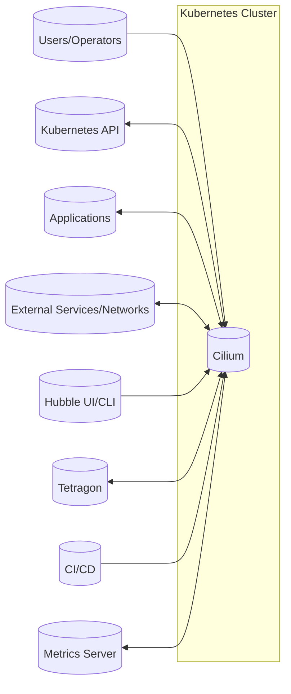
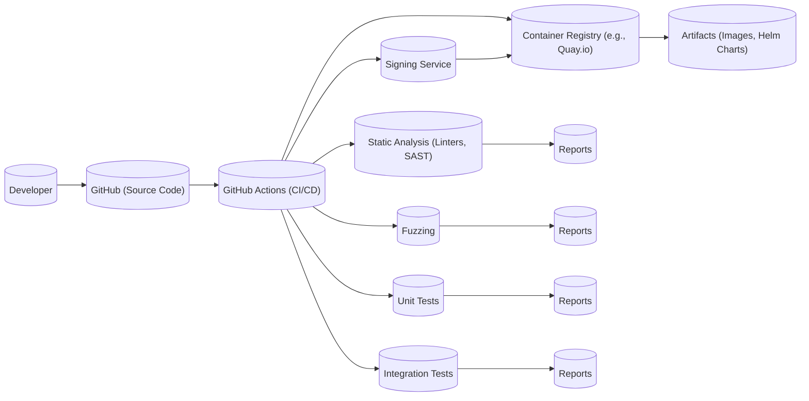

# BUSINESS POSTURE

Cilium is a large, established open-source project that is critical to the cloud-native ecosystem. It's used by major organizations and has a significant impact on the security and networking of Kubernetes deployments. Therefore, the business posture emphasizes stability, security, and broad compatibility. The project must balance innovation with the need for a reliable and well-tested product.

Business Priorities:

*   Provide robust and secure networking, observability, and security for cloud-native applications.
*   Maintain compatibility with a wide range of Kubernetes distributions and cloud providers.
*   Ensure high performance and scalability to meet the demands of large-scale deployments.
*   Foster a strong community and ecosystem around the project.
*   Enable adoption by organizations of all sizes, from startups to large enterprises.
*   Support a variety of deployment models, including self-managed and managed (e.g., Cilium-based CNI offerings from cloud providers).

Business Goals:

*   Be the leading CNI and security solution for Kubernetes.
*   Provide a platform for innovation in cloud-native networking and security.
*   Attract and retain a diverse community of contributors and users.
*   Maintain a high level of trust and confidence in the project's security and reliability.

Most Important Business Risks:

*   Security vulnerabilities in Cilium could compromise the security of a large number of Kubernetes deployments.
*   Performance or stability issues could disrupt critical applications and services.
*   Lack of compatibility with new Kubernetes versions or cloud provider features could limit adoption.
*   Failure to keep up with the evolving threat landscape could render Cilium ineffective.
*   A decline in community engagement could slow down development and innovation.
*   Competition from other CNI and security solutions could erode Cilium's market share.

# SECURITY POSTURE

Existing Security Controls:

*   security control: Secure Software Development Lifecycle (SSDLC): Cilium follows a secure development lifecycle, including code reviews, static analysis, and fuzzing. This is evident in their contribution guidelines, CI/CD pipelines, and security documentation.
*   security control: Regular Security Audits: Cilium undergoes regular security audits by third-party firms. Audit reports are publicly available.
*   security control: Vulnerability Management Process: Cilium has a documented vulnerability management process, including a security mailing list and a bug bounty program.
*   security control: Network Policies: Cilium enforces Kubernetes Network Policies and provides extended network policy capabilities (e.g., L7 policies, FQDN policies). Implemented within Cilium's core functionality.
*   security control: Encryption: Cilium supports encryption of network traffic using IPsec or WireGuard. Described in Cilium's documentation and configurable via Cilium CLI and Kubernetes manifests.
*   security control: Observability: Cilium provides deep observability into network traffic and security events through Hubble. Hubble UI, CLI, and API provide visibility.
*   security control: eBPF: Cilium leverages eBPF for efficient and secure packet processing and policy enforcement. This is fundamental to Cilium's architecture.
*   security control: Least Privilege: Cilium operates on the principle of least privilege, minimizing the permissions required for its components. Reflected in the RBAC configurations and deployment manifests.
*   security control: Runtime Security: Cilium integrates with Tetragon for runtime security enforcement and observability.
*   security control: Image signing: Cilium signs released container images.

Accepted Risks:

*   accepted risk: Complexity of eBPF: While eBPF provides significant benefits, it also introduces complexity and potential security risks if not carefully managed. Cilium mitigates this through rigorous testing and code review.
*   accepted risk: Reliance on the Linux Kernel: Cilium's functionality depends on the security and stability of the underlying Linux kernel. Cilium tracks kernel vulnerabilities and recommends specific kernel versions.
*   accepted risk: Potential for Misconfiguration: Like any powerful tool, Cilium can be misconfigured, leading to security vulnerabilities. Cilium provides documentation and best practices to minimize this risk.

Recommended Security Controls:

*   high priority: Implement a comprehensive supply chain security solution, including software bill of materials (SBOM) generation and vulnerability scanning of all dependencies.
*   high priority: Enhance fuzzing efforts to cover a wider range of Cilium's components and features.
*   high priority: Develop and publish a detailed threat model for Cilium.

Security Requirements:

*   Authentication:
    *   Cilium components must authenticate with each other using strong authentication mechanisms (e.g., mutual TLS).
    *   Integration with Kubernetes service accounts for pod-level authentication.
    *   Support for external authentication providers (e.g., SPIFFE/SPIRE) for workload identity.

*   Authorization:
    *   Fine-grained authorization controls for accessing Cilium API and Hubble.
    *   Integration with Kubernetes RBAC for managing access to Cilium resources.
    *   Least privilege principle for all Cilium components and agents.

*   Input Validation:
    *   Strict validation of all inputs to Cilium API and CLI.
    *   Validation of network policy configurations to prevent misconfigurations.
    *   Sanitization of data received from external sources.

*   Cryptography:
    *   Use of strong cryptographic algorithms and protocols for encryption (e.g., AES-GCM, WireGuard).
    *   Secure key management practices for storing and managing encryption keys.
    *   Regular review of cryptographic implementations to ensure they are up-to-date with industry best practices.

# DESIGN

## C4 CONTEXT



C4 Context Element Descriptions:

*   Element:
    *   Name: Users/Operators
    *   Type: Person
    *   Description: Individuals who interact with Cilium to configure network policies, observe network traffic, and manage the overall system.
    *   Responsibilities: Configure Cilium, monitor network traffic, troubleshoot issues.
    *   Security controls: RBAC, authentication to Kubernetes API and Cilium CLI.

*   Element:
    *   Name: Cilium
    *   Type: Software System
    *   Description: The core Cilium system, responsible for networking, observability, and security.
    *   Responsibilities: Enforce network policies, provide network connectivity, collect observability data, provide security features.
    *   Security controls: Network policies, encryption, eBPF-based security, least privilege, regular security audits.

*   Element:
    *   Name: Kubernetes API
    *   Type: Software System
    *   Description: The Kubernetes API server, used by Cilium to interact with the Kubernetes control plane.
    *   Responsibilities: Manage Kubernetes resources, provide API for interacting with the cluster.
    *   Security controls: Kubernetes RBAC, TLS encryption, authentication.

*   Element:
    *   Name: Applications
    *   Type: Software System
    *   Description: Applications running within the Kubernetes cluster that rely on Cilium for networking and security.
    *   Responsibilities: Perform application-specific tasks.
    *   Security controls: Network policies enforced by Cilium, application-level security measures.

*   Element:
    *   Name: External Services/Networks
    *   Type: Software System
    *   Description: Services and networks outside the Kubernetes cluster that applications may need to access.
    *   Responsibilities: Provide external services (e.g., databases, APIs).
    *   Security controls: Network policies enforced by Cilium, external security measures.

*   Element:
    *   Name: Hubble UI/CLI
    *   Type: Software System
    *   Description: Tools for observing network traffic and security events collected by Cilium.
    *   Responsibilities: Provide visibility into network flows and security events.
    *   Security controls: Authentication, authorization, TLS encryption.

*   Element:
    *   Name: Tetragon
    *   Type: Software System
    *   Description: Runtime security enforcement and observability tool integrated with Cilium.
    *   Responsibilities: Provide runtime security features, collect security-relevant events.
    *   Security controls: eBPF-based security, least privilege.

*   Element:
    *   Name: CI/CD
    *   Type: Software System
    *   Description: Continuous Integration and Continuous Delivery system used to build, test, and deploy Cilium.
    *   Responsibilities: Automate the build, test, and deployment process.
    *   Security controls: Secure build environment, code signing, vulnerability scanning.

*   Element:
    *   Name: Metrics Server
    *   Type: Software System
    *   Description: System that collects and exposes metrics from Cilium and Hubble.
    *   Responsibilities: Provide metrics for monitoring and alerting.
    *   Security controls: Authentication, authorization, TLS encryption.

## C4 CONTAINER

```mermaid
graph LR
    subgraph Kubernetes Cluster
        subgraph Cilium Agent Node[("Cilium Agent (DaemonSet)")]
            CA[("Cilium API")]
            CB[("eBPF Datapath")]
            CC[("Policy Engine")]
            CD[("Proxy (Envoy)")]
        end
        subgraph Cilium Operator Node[("Cilium Operator (Deployment)")]
            CO[("Operator Logic")]
        end
        subgraph Hubble Node[("Hubble Relay (DaemonSet)")]
            HR[("Hubble Relay")]
        end
        subgraph Hubble Server Node[("Hubble Server (Deployment)")]
            HS[("Hubble Server")]
        end
        subgraph Tetragon Agent Node[("Tetragon Agent (DaemonSet)")]
            TA[("Tetragon API")]
            TB[("eBPF Runtime")]
        end
        CiliumAgentNode --> K[(Kubernetes API)]
        CiliumOperatorNode --> K[(Kubernetes API)]
        HubbleRelayNode --> K[(Kubernetes API)]
        HubbleServerNode --> K[(Kubernetes API)]
        TetragonAgentNode --> K[(Kubernetes API)]
        CA <--> CB
        CA <--> CC
        CB <--> CC
        CC <--> CD
        CB <--> A[("Applications")]
        CB <--> E[("External Services/Networks")]
        HR <--> CB
        HS <--> HR
        TA <--> TB
        TB <--> A
    end
    U[("Users/Operators")] --> CA
    U --> HS
    U --> TA
    CI[("CI/CD")] --> CiliumOperatorNode
    CI --> CiliumAgentNode
    M[("Metrics Server")] --> CA
    M --> HS
```

C4 Container Element Descriptions:

*   Element:
    *   Name: Cilium Agent
    *   Type: Container
    *   Description: The main Cilium agent, running on each Kubernetes node.
    *   Responsibilities: Enforce network policies, manage eBPF programs, provide network connectivity.
    *   Security controls: Least privilege, eBPF-based security, network policies, encryption.

*   Element:
    *   Name: Cilium API
    *   Type: Component
    *   Description: API for interacting with the Cilium agent.
    *   Responsibilities: Provide access to Cilium's functionality.
    *   Security controls: Authentication, authorization, TLS encryption.

*   Element:
    *   Name: eBPF Datapath
    *   Type: Component
    *   Description: The core of Cilium's networking functionality, implemented using eBPF.
    *   Responsibilities: Packet processing, policy enforcement, network connectivity.
    *   Security controls: eBPF-based security, regular security audits.

*   Element:
    *   Name: Policy Engine
    *   Type: Component
    *   Description: Component responsible for evaluating and enforcing network policies.
    *   Responsibilities: Determine which network traffic is allowed or denied.
    *   Security controls: Network policy validation, least privilege.

*   Element:
    *   Name: Proxy (Envoy)
    *   Type: Component
    *   Description: An optional proxy (Envoy) used for L7 policy enforcement and observability.
    *   Responsibilities: Handle L7 traffic, enforce L7 policies.
    *   Security controls: Envoy's security features, integration with Cilium's policy engine.

*   Element:
    *   Name: Cilium Operator
    *   Type: Container
    *   Description: Kubernetes operator responsible for managing Cilium's lifecycle.
    *   Responsibilities: Install, upgrade, and manage Cilium components.
    *   Security controls: Least privilege, Kubernetes RBAC.

*   Element:
    *   Name: Operator Logic
    *   Type: Component
    *   Description: The core logic of the Cilium operator.
    *   Responsibilities: Manage Cilium resources, handle Kubernetes events.
    *   Security controls: Least privilege, Kubernetes RBAC.

*   Element:
    *   Name: Hubble Relay
    *   Type: Container
    *   Description: Component that collects Hubble data from Cilium agents.
    *   Responsibilities: Gather and forward Hubble data.
    *   Security controls: Authentication, TLS encryption.

*   Element:
    *   Name: Hubble Server
    *   Type: Container
    *   Description: Component that provides the Hubble API and UI.
    *   Responsibilities: Provide access to Hubble data, serve the Hubble UI.
    *   Security controls: Authentication, authorization, TLS encryption.

*   Element:
    *   Name: Tetragon Agent
    *   Type: Container
    *   Description: The Tetragon agent, running on each Kubernetes node.
    *   Responsibilities: Enforce runtime security policies, collect security-relevant events.
    *   Security controls: Least privilege, eBPF-based security.

*   Element:
    *   Name: Tetragon API
    *   Type: Component
    *   Description: API for interacting with the Tetragon agent.
    *   Responsibilities: Provide access to Tetragon's functionality.
    *   Security controls: Authentication, authorization, TLS encryption.

*   Element:
    *   Name: eBPF Runtime
    *   Type: Component
    *   Description: The core of Tetragon's runtime security functionality, implemented using eBPF.
    *   Responsibilities: Monitor system calls, enforce security policies.
    *   Security controls: eBPF-based security, regular security audits.

## DEPLOYMENT

Possible Deployment Solutions:

1.  Self-managed Kubernetes: Cilium can be deployed manually using Kubernetes manifests (DaemonSet, Deployment, etc.).
2.  Managed Kubernetes (e.g., GKE, EKS, AKS): Cilium can be installed as a CNI plugin, often with specific instructions for each provider.
3.  Cilium-based CNI offerings: Some cloud providers offer managed Kubernetes services with Cilium pre-integrated.
4.  Kind/Minikube: For local development and testing.

Chosen Solution (for detailed description): Managed Kubernetes (e.g., GKE)

```mermaid
graph LR
    subgraph Google Cloud Platform
        subgraph GKE Cluster [("GKE Cluster")]
            subgraph Control Plane
                K[(Kubernetes API Server)]
            end
            subgraph Node Pool 1
                N1[("Node 1")]
                N2[("Node 2")]
            end
            subgraph Node Pool 2
                N3[("Node 3")]
            end
        end
        subgraph Cilium Components
          CA[("Cilium Agent (DaemonSet)")]
          CO[("Cilium Operator (Deployment)")]
          HR[("Hubble Relay (DaemonSet)")]
          HS[("Hubble Server (Deployment)")]
          TA[("Tetragon Agent (DaemonSet)")]
        end
    end
    CA -- Runs on --> N1
    CA -- Runs on --> N2
    CA -- Runs on --> N3
    CO -- Runs on --> Node Pool 1
    HR -- Runs on --> N1
    HR -- Runs on --> N2
    HR -- Runs on --> N3
    HS -- Runs on --> Node Pool 1
    TA -- Runs on --> N1
    TA -- Runs on --> N2
    TA -- Runs on --> N3
    N1 <--> K
    N2 <--> K
    N3 <--> K
```

Deployment Element Descriptions:

*   Element:
    *   Name: Google Cloud Platform
    *   Type: Cloud Provider
    *   Description: The cloud environment where the GKE cluster is deployed.
    *   Responsibilities: Provide infrastructure and services for running the cluster.
    *   Security controls: GCP's security features, IAM, VPC networking.

*   Element:
    *   Name: GKE Cluster
    *   Type: Kubernetes Cluster
    *   Description: The managed Kubernetes cluster provided by GKE.
    *   Responsibilities: Run Kubernetes workloads.
    *   Security controls: GKE's security features, network policies, RBAC.

*   Element:
    *   Name: Control Plane
    *   Type: Node
    *   Description: The Kubernetes control plane, managed by GKE.
    *   Responsibilities: Manage the Kubernetes cluster.
    *   Security controls: GKE's control plane security.

*   Element:
    *   Name: Kubernetes API Server
    *   Type: Component
    *   Description: The API server for interacting with the Kubernetes cluster.
    *   Responsibilities: Provide API for managing Kubernetes resources.
    *   Security controls: Kubernetes RBAC, TLS encryption, authentication.

*   Element:
    *   Name: Node Pool 1, Node Pool 2
    *   Type: Node Group
    *   Description: Groups of worker nodes in the GKE cluster.
    *   Responsibilities: Run Kubernetes pods.
    *   Security controls: GKE node security, network policies.

*   Element:
    *   Name: Node 1, Node 2, Node 3
    *   Type: Node
    *   Description: Individual worker nodes in the GKE cluster.
    *   Responsibilities: Run Kubernetes pods.
    *   Security controls: GKE node security, network policies.

*   Element:
    *   Name: Cilium Agent (DaemonSet)
    *   Type: Container
    *   Description: The Cilium agent, deployed as a DaemonSet to run on each node.
    *   Responsibilities: Enforce network policies, manage eBPF programs.
    *   Security controls: Least privilege, eBPF-based security, network policies, encryption.

*   Element:
    *   Name: Cilium Operator (Deployment)
    *   Type: Container
    *   Description: The Cilium operator, deployed as a Deployment.
    *   Responsibilities: Manage Cilium's lifecycle.
    *   Security controls: Least privilege, Kubernetes RBAC.

*   Element:
    *   Name: Hubble Relay (DaemonSet)
    *   Type: Container
    *   Description: Hubble Relay, deployed as a DaemonSet.
    *   Responsibilities: Collect Hubble data from Cilium agents.
    *   Security controls: Authentication, TLS encryption.

*   Element:
    *   Name: Hubble Server (Deployment)
    *   Type: Container
    *   Description: Hubble Server, deployed as a Deployment.
    *   Responsibilities: Provide the Hubble API and UI.
    *   Security controls: Authentication, authorization, TLS encryption.

*   Element:
    *   Name: Tetragon Agent (DaemonSet)
    *   Type: Container
    *   Description: The Tetragon agent, deployed as a DaemonSet to run on each node.
    *   Responsibilities: Enforce runtime security policies, collect security-relevant events.
    *   Security controls: Least privilege, eBPF-based security.

## BUILD



Build Process Description:

1.  Developers commit code to the Cilium GitHub repository.
2.  GitHub Actions triggers a CI/CD workflow.
3.  Static analysis tools (linters, SAST scanners) are run to identify potential code quality and security issues.
4.  Fuzzing is performed to test Cilium's components with unexpected inputs.
5.  Unit tests and integration tests are executed to verify the functionality of Cilium's code.
6.  Container images are built and pushed to a container registry (e.g., Quay.io).
7.  Images are signed using a signing service (e.g., Cosign).
8.  Build artifacts (images, Helm charts) are made available for deployment.
9.  Reports from static analysis, fuzzing, and testing are generated.

Security Controls:

*   security control: GitHub Actions: Uses a secure CI/CD platform.
*   security control: Static Analysis: Identifies potential code quality and security issues early in the development process.
*   security control: Fuzzing: Tests Cilium's components with unexpected inputs to discover vulnerabilities.
*   security control: Unit and Integration Tests: Verify the functionality of Cilium's code.
*   security control: Container Registry: Stores container images securely.
*   security control: Image Signing: Ensures the integrity and authenticity of Cilium's container images.
*   security control: Dependency Scanning: Scans dependencies for known vulnerabilities (though not explicitly shown in the diagram, it's a crucial part of the build process).
*   security control: SBOM Generation: Generates a software bill of materials (SBOM) to track all components and dependencies (recommended, not explicitly shown).

# RISK ASSESSMENT

Critical Business Processes to Protect:

*   Network connectivity for cloud-native applications: Cilium is responsible for providing network connectivity between pods and services within a Kubernetes cluster. Disruptions to this connectivity can impact application availability and functionality.
*   Security enforcement for cloud-native applications: Cilium enforces network policies and provides security features to protect applications from unauthorized access and attacks. Compromises to Cilium's security could lead to breaches and data loss.
*   Observability of network traffic and security events: Cilium provides visibility into network traffic and security events, enabling monitoring, troubleshooting, and incident response. Loss of this observability could hinder the ability to detect and respond to security incidents.

Data to Protect and Sensitivity:

*   Network traffic data: Cilium processes network traffic, which may contain sensitive data depending on the applications using the network. Sensitivity: Potentially high, depending on the application.
*   Network policy configurations: Cilium stores network policy configurations, which define the allowed network communication within the cluster. Sensitivity: High, as misconfigurations could lead to security vulnerabilities.
*   Observability data (Hubble): Hubble collects data about network flows and security events. Sensitivity: Potentially high, as it may contain information about application behavior and security incidents.
*   Cilium API access credentials: Credentials used to access the Cilium API. Sensitivity: High, as they could be used to modify Cilium's configuration and compromise the cluster.
*   eBPF program code: Cilium uses eBPF programs for its core functionality. Sensitivity: High, as vulnerabilities in eBPF programs could be exploited to compromise the entire system.
*   Kubernetes API access credentials: Credentials used by Cilium to access the Kubernetes API. Sensitivity: High.

# QUESTIONS & ASSUMPTIONS

Questions:

*   What specific compliance requirements (e.g., PCI DSS, HIPAA) must Cilium deployments adhere to? This will influence the necessary security controls and configurations.
*   What are the specific performance requirements for Cilium in different deployment scenarios? This will help determine the appropriate resource allocation and configuration.
*   What are the existing security tools and processes used by organizations deploying Cilium? This will help identify potential integrations and gaps.
*   What level of detail is required for the threat model? A high-level threat model may be sufficient for initial planning, but a more detailed model will be needed for thorough security analysis.
*   Are there any specific cloud provider configurations or limitations that need to be considered?
*   What is the process for handling security vulnerabilities discovered in Cilium's dependencies?
*   What are the specific requirements for logging and auditing Cilium's activities?

Assumptions:

*   BUSINESS POSTURE: The primary business goal is to provide a secure, reliable, and performant networking solution for Kubernetes.
*   BUSINESS POSTURE: The organization deploying Cilium has a moderate to low risk appetite, prioritizing security and stability over rapid feature development.
*   SECURITY POSTURE: Cilium is deployed in a Kubernetes environment with basic security measures in place (e.g., RBAC, network policies).
*   SECURITY POSTURE: The organization has a security team or personnel responsible for managing the security of the Kubernetes cluster and Cilium.
*   SECURITY POSTURE: Regular security audits and vulnerability assessments are conducted.
*   DESIGN: Cilium is deployed as a CNI plugin in a managed Kubernetes environment (e.g., GKE, EKS, AKS).
*   DESIGN: The default Cilium configuration is used, with modifications made as needed to meet specific security and performance requirements.
*   DESIGN: Hubble is deployed for observability.
*   DESIGN: Tetragon is deployed for runtime security.
*   DESIGN: The build process utilizes GitHub Actions and includes security checks like SAST and fuzzing.