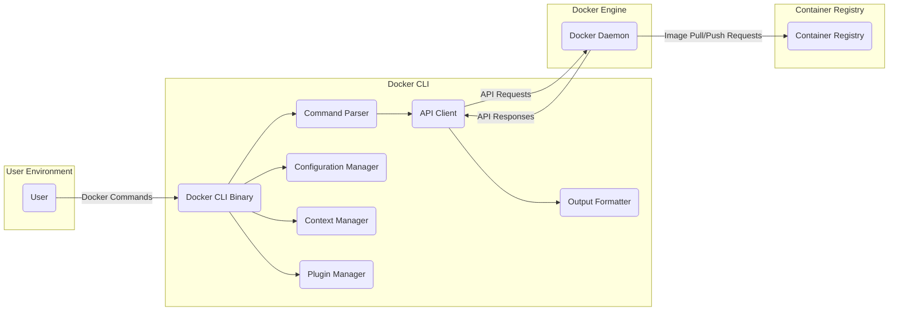
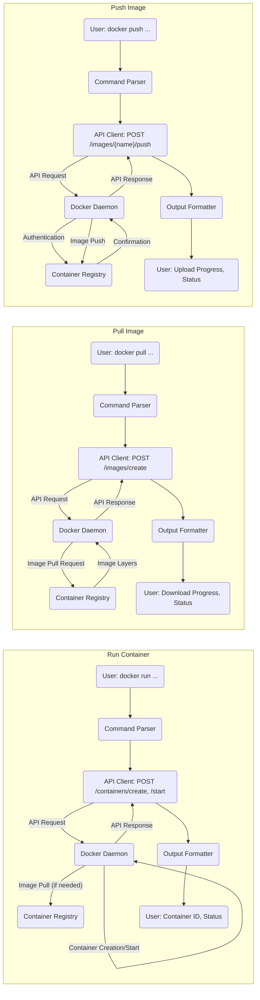

## Project Design Document: Docker CLI

**Document Version:** 1.1
**Date:** October 26, 2023
**Prepared By:** Gemini (AI Language Model)

### 1. Introduction

This document provides a refined high-level architectural design of the Docker Command Line Interface (CLI) project, based on the codebase at [https://github.com/docker/cli](https://github.com/docker/cli). This revised document aims to enhance the clarity and detail of the system's components, their interactions, and data flow, further strengthening its utility as a foundation for subsequent threat modeling activities.

### 2. Goals and Scope

The primary goal of this document remains to outline the architecture of the Docker CLI to facilitate threat identification and risk assessment. The scope of this document includes:

*   Clearly identifying the major components of the Docker CLI and their responsibilities.
*   Detailing the interactions between these components with a focus on data exchange.
*   Illustrating the data flow within the system for common user operations with greater precision.
*   Highlighting key security-relevant aspects of the design with specific examples.

This document continues to focus on the client-side architecture and its interaction with the Docker daemon, without delving into the internal workings of the Docker daemon itself.

### 3. Target Audience

This document is intended for:

*   Security engineers and architects responsible for threat modeling the Docker CLI.
*   Developers contributing to or integrating with the Docker CLI.
*   Technical stakeholders seeking a comprehensive understanding of the Docker CLI architecture for security analysis.

### 4. System Overview

The Docker CLI serves as the primary command-line interface for users to manage and interact with the Docker ecosystem. It translates user commands into API calls to the Docker daemon, enabling the management of images, containers, volumes, networks, and other Docker resources. The CLI acts as a client application, orchestrating interactions with the Docker daemon to fulfill user requests.

### 5. Architectural Design

The Docker CLI architecture comprises the following key components and their interactions:

*   **User:** The entity (human or system) initiating Docker CLI commands through a terminal or script.
*   **Docker CLI Binary (`docker`):** The compiled executable responsible for parsing user commands, managing configuration, and communicating with the Docker daemon.
*   **Command Parser:**  The module within the CLI binary that interprets the user's command-line input, identifying the specific command and its associated flags and arguments. This involves lexical analysis and syntactic validation of the input.
*   **API Client:** This component handles the establishment and management of communication channels with the Docker daemon's API. It constructs and sends HTTP requests (typically over a local Unix socket or a TCP connection with TLS) and processes the responses.
*   **Configuration Manager:**  Responsible for loading, parsing, and managing configuration files such as `config.json` (for user preferences and server addresses) and `credentials.json` (for authentication details for container registries). It also handles interactions with credential helper programs.
*   **Context Manager:**  Enables users to define and switch between different Docker environments or "contexts." Each context can point to a different Docker daemon (local or remote) with its own configuration and credentials.
*   **Plugin Manager:**  Facilitates the extension of the CLI's functionality through external plugins. It discovers, loads, and manages these plugins, allowing them to register new commands or modify existing behavior.
*   **Output Formatter:**  Transforms the raw data received from the Docker daemon's API into a user-friendly output format. This can include plain text, JSON, or other formats, depending on user preferences or command options.
*   **Docker Daemon (`dockerd`):** The background service that constitutes the core of the Docker engine. It listens for API requests from clients like the CLI and manages containers, images, networks, and volumes.
*   **Container Registry:** A service (e.g., Docker Hub, a private registry) that stores and distributes Docker images. The CLI interacts with registries for pulling and pushing images.

### 6. Data Flow

The following details the data flow for common Docker CLI operations:

*   **Running a Container:**
    *   The 'User' executes a `docker run` command with specified image, options, and arguments.
    *   The 'Command Parser' interprets the command, extracting the image name, container name, port mappings, volume mounts, and other configurations.
    *   The 'API Client' constructs and sends API requests to the 'Docker Daemon' (e.g., a `POST` request to `/containers/create` with container configuration, followed by a `POST` request to `/containers/{id}/start`).
    *   The 'Docker Daemon', if the image is not present locally, initiates an image pull from the specified or default 'Container Registry'.
    *   The 'Docker Daemon' creates and starts the container based on the provided configuration.
    *   The 'Docker Daemon' sends API responses back to the 'API Client', including the container ID and status.
    *   The 'Output Formatter' processes the API response and presents relevant information (e.g., container ID, status messages) to the 'User'.

*   **Pulling an Image:**
    *   The 'User' executes a `docker pull` command specifying the image name and tag.
    *   The 'Command Parser' parses the command and extracts the image name and tag.
    *   The 'API Client' sends a request to the 'Docker Daemon's' API (e.g., a `POST` request to `/images/create?fromImage={imageName}&tag={tag}`).
    *   The 'Docker Daemon' contacts the specified 'Container Registry' (or the default registry if none is specified).
    *   The 'Container Registry' streams the image layers to the 'Docker Daemon'. Authentication with the registry might occur using credentials managed by the 'Configuration Manager'.
    *   The 'Docker Daemon' stores the downloaded image layers locally.
    *   The 'Docker Daemon' sends progress updates and a final response back to the 'API Client'.
    *   The 'Output Formatter' displays the download progress and completion status to the 'User'.

*   **Pushing an Image:**
    *   The 'User' executes a `docker push` command specifying the image name and tag.
    *   The 'Command Parser' interprets the command and extracts the image name and tag.
    *   The 'API Client' sends a request to the 'Docker Daemon's' API (e.g., a `POST` request to `/images/{name}/push`).
    *   The 'Docker Daemon' authenticates with the specified 'Container Registry' using credentials retrieved by the 'Configuration Manager'.
    *   The 'Docker Daemon' streams the image layers to the 'Container Registry'.
    *   The 'Container Registry' stores the uploaded image layers.
    *   The 'Docker Daemon' receives confirmation from the 'Container Registry' and sends a response back to the 'API Client'.
    *   The 'Output Formatter' presents the upload progress and completion status to the 'User'.

### 7. Security Considerations

The Docker CLI's design incorporates several security considerations, but also presents potential areas of vulnerability:

*   **Authentication and Authorization for Registries:** The CLI relies on credentials stored in `config.json` and `credentials.json` to authenticate with container registries.
    *   List item: **Threat:** Stored credentials could be compromised if the user's machine is compromised, allowing unauthorized image pushes or pulls.
    *   List item: **Mitigation:** Utilizing credential helper programs for more secure storage (e.g., OS keychain integration).
    *   List item: **Threat:** Weak or default credentials could be used, making accounts susceptible to brute-force attacks.
*   **Secure Communication with the Docker Daemon:** Communication between the CLI and the Docker Daemon can occur over a local Unix socket (unencrypted) or a TCP connection (potentially with TLS).
    *   List item: **Threat:** Unencrypted communication over TCP could expose sensitive data (e.g., image contents, container configurations) to eavesdropping.
    *   List item: **Mitigation:** Enforcing TLS for remote daemon connections and restricting access to the local Docker socket.
    *   List item: **Threat:** Man-in-the-middle attacks if TLS is not properly configured or if certificates are not validated.
*   **Input Validation and Command Injection:** The CLI must carefully validate user input to prevent malicious commands from being executed on the Docker Daemon.
    *   List item: **Threat:** Improperly sanitized input could lead to command injection vulnerabilities, allowing attackers to execute arbitrary commands on the Docker Daemon's host.
    *   List item: **Mitigation:** Implementing robust input validation and sanitization techniques within the 'Command Parser'.
*   **Secrets Management:** Handling secrets passed to containers through the CLI requires careful consideration to avoid exposure.
    *   List item: **Threat:** Secrets passed as environment variables in `docker run` commands might be visible in process listings or container metadata.
    *   List item: **Mitigation:** Utilizing Docker Secrets for more secure secret management.
*   **Plugin Security:** The plugin architecture introduces potential risks if malicious or compromised plugins are loaded.
    *   List item: **Threat:** Malicious plugins could execute arbitrary code with the privileges of the CLI user or intercept sensitive information.
    *   List item: **Mitigation:** Implementing mechanisms for verifying the authenticity and integrity of plugins.
    *   List item: **Threat:**  Plugins might introduce new vulnerabilities if they are not developed securely.
*   **Context Security:** Switching between different Docker contexts might involve different authentication credentials and access levels, requiring careful management.
    *   List item: **Threat:** Misconfigured contexts or compromised context configurations could lead to unintended access to different Docker environments.
*   **Dependency Vulnerabilities:** The CLI relies on various external libraries, which could contain security vulnerabilities.
    *   List item: **Threat:** Vulnerabilities in dependencies could be exploited to compromise the CLI.
    *   List item: **Mitigation:** Regularly updating dependencies and performing vulnerability scanning.

### 8. Dependencies

The Docker CLI relies on the following categories of external dependencies:

*   **Docker Daemon API:** The primary dependency is the Docker Daemon itself, with which the CLI communicates via its API.
*   **Container Registries:** Interaction with various container registries (public and private) is a core function.
*   **Operating System Libraries:** The CLI utilizes OS-specific libraries for functionalities like networking, file system access, and process management.
*   **Go Standard Library:**  Extensive use of the Go standard library for core functionalities.
*   **Third-Party Go Libraries:**
    *   List item: **Networking:** Libraries for making HTTP requests (e.g., `net/http`).
    *   List item: **JSON Handling:** Libraries for parsing and generating JSON (e.g., `encoding/json`).
    *   List item: **Command-Line Parsing:** Libraries for parsing command-line arguments and options (e.g., `github.com/spf13/cobra`).
    *   List item: **Configuration Management:** Libraries for handling configuration files.
    *   List item: **Logging:** Libraries for logging and debugging.
    *   List item: **Plugin Management:** Libraries for managing and loading plugins.

### 9. Deployment

The Docker CLI is typically deployed as a statically linked executable, making deployment relatively straightforward. Common deployment scenarios include:

*   Installation on developer workstations for local Docker management.
*   Integration into CI/CD pipelines for automated image building and deployment.
*   Deployment within containerized environments for managing other containers.

### 10. Future Considerations

Potential future enhancements and changes that could impact the architecture and security include:

*   **Enhanced Plugin Security Mechanisms:** Implementing more robust mechanisms for verifying and sandboxing plugins.
*   **Improved Credential Management Integrations:**  Deeper integration with secure credential management systems and hardware security modules.
*   **Standardized API for CLI Extensions:**  Developing a more formal and stable API for extending CLI functionality, potentially improving security and maintainability.
*   **Support for New Authentication Protocols:** Adapting to evolving authentication standards for container registries.

This revised document provides a more detailed and nuanced understanding of the Docker CLI architecture, specifically tailored for threat modeling activities. Continuous review and updates will be necessary to reflect changes in the project.
