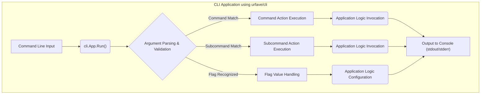
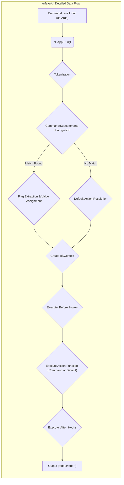

# Project Design Document: urfave/cli Library

**Version:** 1.1
**Date:** October 26, 2023
**Author:** AI Software Architect

## 1. Introduction

This document provides an enhanced design overview of the `urfave/cli` library, a popular Go package for building command-line interface (CLI) applications. This document aims to provide a more detailed and refined understanding of the library's architecture, components, and data flow, specifically tailored for effective threat modeling activities. The focus is on the library itself and its internal workings, rather than the applications built using it.

## 2. Goals

*   Provide a clear and detailed description of the `urfave/cli` library's architecture and its constituent components.
*   Elaborate on the data flow within the library, tracing the journey of command-line input through parsing and action execution.
*   Clearly identify the key interfaces and interaction points of the library.
*   Offer sufficient technical depth and clarity to facilitate comprehensive threat modeling.

## 3. Target Audience

This document is intended for:

*   Security engineers tasked with performing threat modeling on applications utilizing the `urfave/cli` library.
*   Developers involved in the development, maintenance, or extension of the `urfave/cli` library itself.
*   Individuals seeking an in-depth understanding of the internal mechanisms of the `urfave/cli` library.

## 4. System Overview

The `urfave/cli` library offers a robust and structured framework for developing command-line interface (CLI) applications in Go. It streamlines the process of defining and managing command-line arguments, options (flags), and subcommands. The library's core function is to interpret the command-line string provided by the user and map it to the appropriate application logic defined by the developer.

## 5. Architectural Design

The `urfave/cli` library's architecture revolves around the concept of an `App` which serves as the central configuration point. Developers define the application's structure by configuring commands, flags, and their associated actions within this `App`. Upon execution, the library parses the command-line input and orchestrates the execution of the corresponding action.

## 6. Component Description

*   **`cli.App`**: The foundational structure representing the entire CLI application. Key attributes include:
    *   `Name`: The name of the application, used in help messages.
    *   `Usage`: A concise description of the application's purpose.
    *   `Version`: The application's version string.
    *   `Flags`: A slice of global `cli.Flag` definitions applicable to all commands.
    *   `Commands`: A slice of `cli.Command` definitions, representing the available commands.
    *   `Authors`: Information about the application's developers.
    *   `Action`: A default function to execute if no specific command is provided.
    *   `Before`, `After`: Hook functions executed before and after command or main action execution.
    *   `Metadata`: A map for storing arbitrary application-level data.

*   **`cli.Command`**: Represents a specific command within the application's functionality. Key attributes include:
    *   `Name`: The name of the command as invoked by the user.
    *   `Aliases`: Alternative names for the command.
    *   `Usage`: A description of the command's specific function.
    *   `Flags`: A slice of `cli.Flag` definitions specific to this command.
    *   `Subcommands`: A slice of nested `cli.Command` definitions for hierarchical command structures.
    *   `Action`: The function to execute when this command is invoked.
    *   `Before`, `After`: Hook functions executed before and after this command's action.

*   **`cli.Flag` (Interface)**: Defines the interface for command-line flags (options). Concrete implementations handle different data types:
    *   `cli.StringFlag`: Represents a flag that accepts a string value.
    *   `cli.BoolFlag`: Represents a boolean flag (present or absent).
    *   `cli.IntFlag`: Represents a flag that accepts an integer value.
    *   `cli.Float64Flag`: Represents a flag that accepts a 64-bit floating-point number.
    *   `cli.StringSliceFlag`: Represents a flag that can be specified multiple times to collect a slice of strings.
    *   Other flag types exist for various data types and custom parsing logic. Each flag typically has:
        *   `Name`: The primary name of the flag (e.g., "config").
        *   `Aliases`: Shortened versions of the flag name (e.g., "c").
        *   `Usage`: A description of the flag's purpose.
        *   `Value`: The default value for the flag.
        *   `Destination`: A pointer to a variable where the parsed flag value will be stored.

*   **`cli.Context`**: An object passed to the `Action` functions, providing access to the parsed command-line input and application state. Key methods and attributes include:
    *   `Args()`: Returns the non-flag arguments as a slice of strings.
    *   `String(name string)`: Retrieves the string value of a flag.
    *   `Bool(name string)`: Retrieves the boolean value of a flag.
    *   `Int(name string)`: Retrieves the integer value of a flag.
    *   Methods for retrieving other flag types.
    *   `App`: A reference to the `cli.App` instance.
    *   `Command`: A reference to the currently executing `cli.Command`.

*   **Argument Parser**: The internal logic responsible for dissecting the command-line string. This involves:
    *   Tokenization: Splitting the input string into individual words or tokens.
    *   Command Recognition: Identifying the command or subcommand being invoked.
    *   Flag Extraction: Identifying flags based on prefixes (e.g., `-`, `--`) and extracting their associated values.
    *   Argument Separation: Distinguishing between flags and positional arguments.
    *   Validation: Basic validation of flag values based on their defined types.

*   **Action Functions**: Go functions defined by the application developer that contain the core logic to be executed for specific commands or the default application action. These functions receive a `cli.Context` object as input.

## 7. Data Flow

The flow of data within an application utilizing `urfave/cli` begins with user input and culminates in the execution of application logic and output.

1. **Command Line Input**: The user provides input to the application via the command line (e.g., `myapp command --flag value argument`).
2. **`cli.App.Run()` Invocation**: The application's `main` function calls `cli.App.Run(os.Args)`, passing the command-line arguments.
3. **Argument Parsing and Validation**: The `Run()` method initiates the argument parsing process:
    *   The input string is tokenized.
    *   The parser attempts to match the first tokens to defined commands and subcommands.
    *   Flags are identified and their values are extracted.
    *   Basic validation is performed based on the flag types (e.g., ensuring an integer flag receives a valid integer).
4. **Flag Value Handling**: Parsed flag values are stored and made accessible through the `cli.Context`. Default values are applied if flags are not provided.
5. **Command/Action Resolution**: Based on the parsed input, the appropriate `Action` function is determined (either the default `App.Action` or the `Action` of a specific `cli.Command`).
6. **`cli.Context` Creation**: A `cli.Context` object is created, encapsulating the parsed arguments, flag values, and references to the `cli.App` and `cli.Command`.
7. **`Before` Hook Execution**: If defined, the `Before` functions associated with the `App` or the specific `Command` are executed, receiving the `cli.Context`.
8. **`Action` Function Execution**: The resolved `Action` function is invoked, with the `cli.Context` passed as an argument. This is where the core application logic resides and interacts with the parsed input.
9. **`After` Hook Execution**: If defined, the `After` functions associated with the `App` or the specific `Command` are executed, again receiving the `cli.Context`.
10. **Output Generation**: The `Action` function typically interacts with other parts of the application and generates output, which is then presented to the user (usually via standard output or standard error).

## 8. Key Interfaces

*   **Command Line Interface (User Interaction)**: The primary interface through which users interact with applications built using `urfave/cli`. This involves typing commands and arguments into a terminal or command prompt.
*   **Go API (Developer Interface)**: The set of Go language constructs (functions, types, methods) provided by the `urfave/cli` library for application developers. This includes:
    *   `cli.NewApp()`: Function to instantiate a new `cli.App`.
    *   `cli.App.Run()`: Method to initiate the CLI application execution.
    *   `cli.Command{}`: Struct definition for configuring commands.
    *   `cli.Flag` interface and concrete implementations (e.g., `cli.StringFlag`).
    *   `cli.Context`: Struct providing access to parsed input.
    *   Callback function signatures for `Action`, `Before`, and `After` hooks.
*   **Operating System Interface**: The underlying operating system provides the command-line arguments to the application through the `os.Args` slice.

## 9. Security Considerations (Pre-Threat Modeling)

This section outlines potential security considerations relevant to the `urfave/cli` library, serving as a precursor to formal threat modeling:

*   **Input Validation Vulnerabilities**:
    *   Insufficient validation of flag values could lead to unexpected behavior or vulnerabilities in the application logic. For example, a missing integer validation could lead to a panic if a non-numeric value is provided.
    *   Lack of sanitization of string inputs could expose applications to injection attacks if these values are used in shell commands or database queries.
*   **Default Value Security**:
    *   Insecure default values for flags could lead to unintended or insecure application behavior if users are not explicitly setting these flags.
*   **Error Handling and Information Disclosure**:
    *   Verbose error messages generated by the library or the application logic could inadvertently reveal sensitive information about the application's internal workings or environment.
*   **Command Injection via Arguments**:
    *   If the application logic directly uses command-line arguments provided by the user in system calls or shell commands without proper sanitization, it could be vulnerable to command injection attacks. While `urfave/cli` parses the arguments, it's the application's responsibility to handle them securely.
*   **Denial of Service (DoS)**:
    *   Carefully crafted command-line input with a large number of arguments or excessively long strings could potentially consume excessive resources, leading to a denial of service.
*   **Security of `Before` and `After` Hooks**:
    *   If `Before` or `After` hooks perform actions based on user-controlled input without proper validation, they could introduce vulnerabilities.
*   **Dependency Chain Security**:
    *   The security of `urfave/cli` depends on its own dependencies. Vulnerabilities in these dependencies could indirectly affect applications using `urfave/cli`.

## 10. Future Considerations

*   Detailed analysis of the argument parsing logic to identify potential edge cases or vulnerabilities.
*   Examination of the security implications of custom flag types and parsing logic.
*   Assessment of the library's resilience against malformed or malicious command-line input.
*   Exploration of potential security enhancements within the library itself, such as built-in input validation mechanisms.

This enhanced design document provides a more comprehensive and detailed understanding of the `urfave/cli` library, specifically tailored to support thorough and effective threat modeling activities. The added details and refined diagrams aim to provide security engineers with the necessary information to identify and mitigate potential security risks in applications utilizing this library.