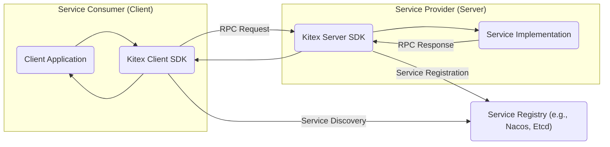
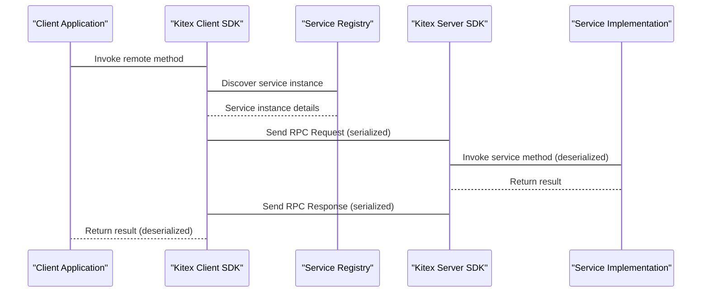

# Project Design Document: Kitex RPC Framework

**Version:** 1.1
**Date:** October 26, 2023
**Prepared By:** AI Software Architect

## 1. Introduction

This document provides a detailed architectural design overview of the Kitex RPC framework, an open-source, high-performance, and strong-extensibility RPC framework developed by CloudWeGo. This document is specifically tailored to facilitate subsequent threat modeling activities by clearly outlining the system's components, interactions, and data flows.

## 2. Goals and Objectives

The primary goals of Kitex are:

* High Performance: Achieve low latency and high throughput for inter-service communication.
* Extensibility: Provide a flexible architecture that allows users to customize and extend its functionalities.
* Multi-Protocol Support: Support various transport protocols (e.g., TCP, gRPC) and serialization protocols (e.g., Thrift, Protobuf).
* Cloud Native Integration: Designed for seamless integration with cloud-native environments and technologies.
* Ease of Use: Offer a user-friendly API for developers to build and consume services.

## 3. Architecture Overview

Kitex follows a typical client-server architecture with the addition of a service registry for dynamic service discovery.

**Key Components:**

* Client Application: The application that initiates RPC calls to remote services.
* Kitex Client SDK:  Provides the necessary libraries and APIs for client applications to interact with Kitex servers. This includes:
    * Stub Generation: Generates client-side code based on service definitions (IDL).
    * Connection Management: Handles connection pooling and management to remote servers.
    * Serialization/Deserialization: Encodes and decodes request and response payloads.
    * Transport Layer: Manages the underlying network communication.
    * Middleware/Interceptors: Allows for adding custom logic before and after RPC calls (e.g., logging, tracing, authentication).
    * Service Discovery Client: Interacts with the service registry to locate available service instances.
* Kitex Server SDK: Provides the libraries and APIs for building and running Kitex servers. This includes:
    * Service Registration: Registers the service instance with the service registry.
    * Request Handling: Receives and dispatches incoming RPC requests to the service implementation.
    * Serialization/Deserialization: Encodes and decodes request and response payloads.
    * Transport Layer: Manages the underlying network communication.
    * Middleware/Interceptors: Allows for adding custom logic before and after processing RPC calls (e.g., logging, tracing, authentication).
* Service Implementation: The actual business logic of the service being provided.
* Service Registry: A central repository that stores information about available service instances and their network locations. Clients query the registry to discover service endpoints. Examples include Nacos, Etcd, Consul.

## 4. Component Details

This section provides a more detailed look at the key components and their functionalities.

### 4.1. Kitex Client SDK

* Stub Generation:
    * Takes service definitions (IDL files, e.g., Thrift, Protobuf) as input.
    * Generates client-side code (stubs or proxies) that provide a type-safe interface for making RPC calls.
    * Simplifies the process of invoking remote methods.
* Connection Management:
    * Establishes and manages connections to remote servers.
    * Implements connection pooling to optimize resource utilization and reduce latency.
    * Handles connection failures and retries.
* Serialization/Deserialization:
    * Responsible for converting data structures into a byte stream for transmission over the network (serialization).
    * Converts the received byte stream back into data structures (deserialization).
    * Supports various serialization protocols like Thrift and Protobuf.
* Transport Layer:
    * Handles the actual network communication.
    * Supports different transport protocols like TCP and potentially others (e.g., gRPC).
    * Manages socket operations, data framing, and error handling at the network level.
* Middleware/Interceptors:
    * Provides a mechanism to intercept and modify RPC requests and responses.
    * Allows for implementing cross-cutting concerns like:
        * Logging
        * Monitoring and Tracing
        * Authentication and Authorization
        * Rate Limiting
        * Error Handling
* Service Discovery Client:
    * Interacts with the configured service registry.
    * Queries the registry to find available instances of the target service.
    * May implement caching of service instance information for performance.
    * Handles updates to service instance lists from the registry.
    * May implement load balancing strategies to distribute requests across multiple service instances.

### 4.2. Kitex Server SDK

* Service Registration:
    * Registers the service instance with the configured service registry.
    * Provides information about the service name, version, and network address.
    * May include health check endpoints for the registry to monitor service availability.
* Request Handling:
    * Listens for incoming network connections on a specified port.
    * Accepts incoming RPC requests.
    * Deserializes the request payload.
    * Dispatches the request to the appropriate service implementation method.
* Serialization/Deserialization:
    * Similar to the client SDK, handles the conversion of data structures to and from byte streams.
    * Ensures compatibility with the client's serialization protocol.
* Transport Layer:
    * Manages the underlying network communication for the server.
    * Handles accepting new connections and managing existing connections.
    * Responsible for sending response data back to the client.
* Middleware/Interceptors:
    * Provides a mechanism to intercept and modify RPC requests and responses on the server-side.
    * Allows for implementing server-side logic like:
        * Logging
        * Monitoring and Tracing
        * Authentication and Authorization
        * Input Validation
        * Error Handling

### 4.3. Service Registry

* Data Storage: Stores information about registered services and their instances.
* Service Discovery: Allows clients to query for available instances of a service.
* Health Checks: Monitors the health status of registered service instances.
* Dynamic Updates: Reflects changes in service availability (e.g., instances starting or stopping).
* Consistency Mechanisms: Ensures data consistency across the registry cluster.

## 5. Data Flow

The typical data flow for an RPC call using Kitex is as follows:

**Detailed Steps:**

* Client Application Invokes Remote Method: The client application calls a method on the generated client stub.
* Service Discovery: The Kitex Client SDK queries the Service Registry to find the network address of an available instance of the target service.
* Service Registry Responds: The Service Registry returns the network address (IP and port) of a suitable service instance.
* RPC Request Transmission: The Kitex Client SDK serializes the method parameters and constructs an RPC request. This request is then sent over the network to the Kitex Server SDK of the chosen service instance using the configured transport protocol.
* Request Handling on Server: The Kitex Server SDK receives the incoming request, deserializes the payload, and identifies the target service and method.
* Service Implementation Invocation: The Kitex Server SDK invokes the corresponding method in the Service Implementation with the deserialized parameters.
* Service Logic Execution: The Service Implementation executes its business logic and produces a result.
* RPC Response Transmission: The Kitex Server SDK serializes the result and constructs an RPC response. This response is sent back to the Kitex Client SDK.
* Response Handling on Client: The Kitex Client SDK receives the response, deserializes the payload, and returns the result to the Client Application.

## 6. Security Considerations (Pre-Threat Modeling)

This section outlines potential security considerations that should be further explored during threat modeling.

* Authentication and Authorization:
    * How are clients authenticated when making RPC calls?
    * How is access to specific service methods authorized?
    * Are there mechanisms to prevent unauthorized access?
* Data Confidentiality and Integrity:
    * Is sensitive data encrypted during transmission?
    * Are there mechanisms to ensure the integrity of data exchanged between client and server?
    * How are secrets (e.g., API keys, passwords) managed and protected?
* Transport Security:
    * Is the communication channel secured using protocols like TLS/SSL?
    * How are certificates managed and validated?
* Input Validation:
    * Are inputs validated on both the client and server sides to prevent injection attacks (e.g., SQL injection, command injection)?
    * How are malformed or unexpected inputs handled?
* Denial of Service (DoS) Attacks:
    * Are there mechanisms to prevent or mitigate DoS attacks at the transport or application layer?
    * Are there rate limiting or throttling mechanisms in place?
* Service Registry Security:
    * How is access to the Service Registry controlled?
    * How is the integrity of the service registration data ensured?
* Dependency Vulnerabilities:
    * Are the dependencies used by Kitex and the application regularly scanned for vulnerabilities?
    * Is there a process for patching or updating vulnerable dependencies?
* Serialization/Deserialization Vulnerabilities:
    * Are there known vulnerabilities in the chosen serialization libraries (e.g., insecure deserialization)?
    * Are best practices followed to mitigate these risks?
* Middleware Security:
    * Are custom middleware components developed securely?
    * Could vulnerabilities in middleware introduce security risks?
* Logging and Monitoring:
    * Are security-related events logged appropriately?
    * Are there monitoring systems in place to detect suspicious activity?

## 7. Out of Scope

The following aspects are considered out of scope for this design document:

* Specific deployment environments or infrastructure details.
* Detailed implementation specifics of individual components within the Kitex SDK.
* Performance benchmarking and optimization strategies.
* Specific details of the chosen service registry implementation.
* Detailed code examples or configuration files.

## 8. Conclusion

This document provides a comprehensive architectural overview of the Kitex RPC framework, focusing on aspects relevant to security. It outlines the key components, their interactions, and the data flow within the system. This information serves as a foundation for conducting a thorough threat modeling exercise to identify potential vulnerabilities and design appropriate security controls.
