# Project Design Document: CloudWeGo Kitex

**Version:** 1.1
**Date:** October 26, 2023
**Author:** AI Software Architect

## 1. Introduction

This document provides an enhanced and more detailed architectural design of the CloudWeGo Kitex project. It aims to offer a comprehensive understanding of the system's components, interactions, and data flow, specifically tailored for effective threat modeling. This document builds upon the previous version to provide greater clarity and depth, facilitating the identification and mitigation of potential security vulnerabilities.

### 1.1. Purpose

The primary purpose of this document is to describe the architecture of Kitex with sufficient granularity to enable thorough and effective threat modeling. It meticulously outlines the key components, their relationships, the data they process, and the security mechanisms (or lack thereof) at each stage. This in-depth understanding is crucial for identifying potential attack surfaces, vulnerabilities, and the impact of potential compromises.

### 1.2. Scope

This document covers the core architectural components of the Kitex framework, including the client, server, code generation process, and service registry integration. It delves deeper into the logical and physical architecture, with a particular focus on data transformation, communication protocols, and extension points relevant to security. While not exhaustively detailing every possible configuration or extension, it provides a solid foundation for understanding the security implications of common usage patterns.

### 1.3. Target Audience

This document is intended for:

* Security engineers and architects responsible for conducting threat modeling, security assessments, and penetration testing of systems utilizing Kitex.
* Developers working with Kitex who require a profound understanding of its architecture to build secure applications.
* Operations and DevOps teams responsible for the secure deployment, configuration, and management of applications built with Kitex.

## 2. Overview of Kitex

Kitex is a high-performance and highly extensible Go RPC framework designed for building microservices. Its architecture prioritizes low latency and high throughput while offering significant flexibility through its middleware and transport layer abstractions.

### 2.1. Key Features

* **Exceptional Performance:** Optimized for minimal overhead and efficient resource utilization, leading to low latency and high throughput.
* **Deep Extensibility:**  Supports custom middleware implementations for request/response processing, pluggable transport protocols, and adaptable serialization formats. This extensibility, while powerful, also introduces potential security considerations.
* **Versatile Protocol Support:**  Offers built-in support for popular protocols like Thrift (binary, compact), gRPC (via integration), and Kitex's optimized Fast-Thrift protocol. The choice of protocol impacts security characteristics.
* **Automated Code Generation:**  Leverages IDL files (e.g., Thrift, Protobuf) to automatically generate Go code for service interfaces, data transfer objects, and client/server stubs, reducing boilerplate and potential for manual errors, but also introduces a dependency on the code generation process itself.
* **Flexible Service Discovery Integration:** Seamlessly integrates with various service registries (e.g., Nacos, etcd, Consul) for dynamic service instance discovery and management, crucial for microservice architectures but also a potential point of failure or attack.
* **Comprehensive Middleware Ecosystem:** Provides a robust mechanism for intercepting and processing requests and responses at various stages of the RPC lifecycle, enabling cross-cutting concerns like logging, metrics, authentication, authorization, and tracing to be implemented in a modular way.

## 3. Architectural Design

The Kitex architecture is modular and designed for extensibility. Understanding the interactions between these components is crucial for identifying potential security vulnerabilities.

### 3.1. Components

* **Kitex Client:**
    * **Purpose:** Initiates RPC calls to remote Kitex services.
    * **Functionality:**
        * Performs service discovery to locate target service instances based on the configured registry.
        * Establishes and manages connections to server instances, potentially utilizing connection pooling.
        * Executes a chain of client-side middleware to process the outgoing request.
        * Serializes the request data into a byte stream according to the selected protocol.
        * Transmits the serialized request over the network using the chosen transport protocol.
        * Receives the response from the server.
        * Deserializes the response data.
        * Executes a chain of client-side middleware to process the incoming response.
    * **Security Relevance:** Client-side vulnerabilities can lead to information leakage or the execution of malicious code on the client. Improper handling of server responses can also be a risk.
* **Kitex Server:**
    * **Purpose:** Listens for and processes incoming RPC requests from clients.
    * **Functionality:**
        * Listens on a specified network address and port for incoming connections.
        * Accepts new client connections.
        * Receives incoming request byte streams.
        * Deserializes the request data.
        * Executes a chain of server-side middleware to process the request.
        * Dispatches the deserialized request to the appropriate service handler implementation.
        * Receives the response from the service handler.
        * Executes a chain of server-side middleware to process the outgoing response.
        * Serializes the response data.
        * Transmits the serialized response back to the client.
    * **Security Relevance:** The server is a primary target for attacks. Vulnerabilities here can lead to data breaches, service disruption, or unauthorized access.
* **Code Generator (Kitex Tool):**
    * **Purpose:** Automates the generation of Go code from IDL files.
    * **Functionality:**
        * Parses IDL files (e.g., `.thrift`, `.proto`) defining service interfaces and data structures.
        * Generates Go source code for:
            * Service interfaces and method signatures.
            * Data transfer objects (structs and enums).
            * Client and server stub implementations.
            * Boilerplate code for serialization and deserialization.
    * **Security Relevance:** If the code generator itself is compromised or if malicious IDL files are used, it can lead to the generation of vulnerable code.
* **Service Registry:**
    * **Purpose:** Provides a dynamic directory of available service instances.
    * **Functionality:**
        * Allows service instances to register their network location (address and port).
        * Provides an API for clients to query for available instances of a specific service.
        * May offer features like health checks and load balancing information.
    * **Security Relevance:** The service registry is a critical infrastructure component. Its compromise can lead to service disruption, redirection of traffic to malicious endpoints, or exposure of sensitive information.
* **Middleware/Interceptors:**
    * **Purpose:** Provides a mechanism to intercept and process requests and responses.
    * **Functionality:**
        * Allows developers to implement cross-cutting concerns in a modular and reusable way.
        * Executed in a defined order on both the client and server sides.
        * Can perform actions like logging, authentication, authorization, request validation, metrics collection, tracing, and error handling.
    * **Security Relevance:** Middleware plays a crucial role in implementing security controls. Vulnerabilities in middleware or misconfigurations can create significant security risks.
* **Transport Layer:**
    * **Purpose:** Handles the underlying network communication between clients and servers.
    * **Functionality:**
        * Establishes and manages network connections (e.g., TCP connections).
        * Handles the transmission and reception of byte streams.
        * May implement features like connection pooling, multiplexing, and keep-alive.
        * Can support different protocols (e.g., raw TCP, gRPC over HTTP/2).
    * **Security Relevance:** The transport layer is responsible for the secure and reliable delivery of data. Encryption (e.g., TLS) is crucial here.
* **Serialization/Deserialization Layer:**
    * **Purpose:** Converts data structures to and from a byte stream for network transmission.
    * **Functionality:**
        * Implements encoding and decoding logic for the chosen protocol (e.g., Thrift binary, Protobuf).
        * Ensures data can be reliably transmitted and reconstructed on the receiving end.
    * **Security Relevance:** Vulnerabilities in serialization/deserialization libraries can lead to remote code execution or denial-of-service attacks (e.g., deserialization of untrusted data).

### 3.2. Interactions and Data Flow

The following diagram provides a more detailed illustration of the interaction flow during an RPC call, highlighting key stages relevant to security:

```mermaid
graph LR
    subgraph Client Process
        A("Client Application") --> B("Kitex Client Stub: Method Call");
        B --> C("Client-Side Middleware (Pre-Serialization)");
        C --> D("Serializer: Encode Request");
        D --> E("Transport Layer (Client): Send Request");
    end

    subgraph Network
        E -- "RPC Request (Serialized)" --> F("Transport Layer (Server): Receive Request");
        F -- "RPC Response (Serialized)" --> E;
    end

    subgraph Server Process
        F --> G("Deserializer: Decode Request");
        G --> H("Server-Side Middleware (Pre-Dispatch)");
        H --> I("Service Handler: Process Request");
        I --> J("Server-Side Middleware (Post-Dispatch)");
        J --> K("Serializer: Encode Response");
        K --> L("Transport Layer (Server): Send Response");
    end

    subgraph Service Registry
        M("Kitex Client Stub") -- "Discover Service Instance" --> N("Service Registry");
        style M fill:#eee,stroke:#333,stroke-width:1px
        style N fill:#eee,stroke:#333,stroke-width:1px
    end

    style A fill:#f9f,stroke:#333,stroke-width:2px
    style I fill:#ccf,stroke:#333,stroke-width:2px
    style B fill:#e0e0ff,stroke:#333,stroke-width:1px
    style C fill:#e0e0ff,stroke:#333,stroke-width:1px
    style D fill:#e0e0ff,stroke:#333,stroke-width:1px
    style E fill:#e0e0ff,stroke:#333,stroke-width:1px
    style F fill:#ffe0e0,stroke:#333,stroke-width:1px
    style G fill:#ffe0e0,stroke:#333,stroke-width:1px
    style H fill:#ffe0e0,stroke:#333,stroke-width:1px
    style J fill:#ffe0e0,stroke:#333,stroke-width:1px
    style K fill:#ffe0e0,stroke:#333,stroke-width:1px
    style L fill:#ffe0e0,stroke:#333,stroke-width:1px
```

**Detailed Data Flow with Security Focus:**

1. **Client Initiates Request:** The client application invokes a method on the generated Kitex client stub.
2. **Client-Side Middleware (Pre-Serialization):**  Client-side middleware intercepts the request. This is a point where actions like adding authentication tokens or performing request validation can occur.
3. **Serialization:** The request data is serialized into a byte stream using the configured protocol. Vulnerabilities in the serialization library or the chosen protocol can be exploited here.
4. **Transport Layer (Client): Send Request:** The serialized request is transmitted over the network. **Crucially, the security of this transmission depends on the chosen transport protocol (e.g., TLS for encryption and integrity).** The client may first need to discover the server's address from the Service Registry, and the security of this discovery process is also important.
5. **Transport Layer (Server): Receive Request:** The server receives the incoming byte stream.
6. **Deserializer:** The received byte stream is deserialized back into the request data structure. **Deserialization of untrusted data is a significant security risk.**
7. **Server-Side Middleware (Pre-Dispatch):** Server-side middleware intercepts the request *before* it reaches the service handler. This is a critical point for implementing authentication, authorization, input validation, and other security checks.
8. **Service Handler:** The deserialized request is dispatched to the appropriate service handler implementation. Business logic vulnerabilities within the handler can be exploited here.
9. **Server-Side Middleware (Post-Dispatch):** Server-side middleware intercepts the response *after* it has been processed by the handler. This can be used for logging, adding response headers, or sanitizing output.
10. **Serialization:** The response data is serialized. Similar serialization vulnerabilities apply here.
11. **Transport Layer (Server): Send Response:** The serialized response is transmitted back to the client, again relying on the security of the transport protocol.
12. **Transport Layer (Client): Receive Response:** The client receives the response.
13. **Deserializer:** The response is deserialized.
14. **Client-Side Middleware (Post-Serialization):** Client-side middleware processes the received response. This could involve verifying signatures or handling errors.
15. **Client Receives Response:** The client application receives the processed response.

## 4. Security Considerations (Detailed)

This section expands on the initial security considerations, providing more specific examples and potential attack vectors.

* **Authentication and Authorization:**
    * **Considerations:** How are clients authenticated (verifying their identity) and authorized (verifying their permissions) to access specific services and methods? Are standard mechanisms like API keys, OAuth 2.0, or JWTs used? Are custom authentication/authorization schemes implemented?
    * **Threats:**  Bypass authentication, privilege escalation, unauthorized access to sensitive data or functionality.
    * **Mitigation:** Implement robust authentication and authorization mechanisms using well-vetted libraries and protocols. Securely store and manage credentials. Enforce the principle of least privilege.
* **Transport Security (TLS/mTLS):**
    * **Considerations:** Is communication between clients and servers encrypted using TLS? Is mutual TLS (mTLS) used for stronger authentication of both client and server? Are secure cipher suites configured?
    * **Threats:** Man-in-the-middle attacks, eavesdropping, data interception, tampering.
    * **Mitigation:** Enforce TLS for all communication. Consider mTLS for enhanced security. Regularly update TLS libraries and configurations.
* **Input Validation:**
    * **Considerations:** How are incoming requests validated on both the client and server sides to prevent injection attacks and other malicious inputs? Is data type, format, and range validation performed? Are business logic constraints enforced?
    * **Threats:** SQL injection, command injection, cross-site scripting (if applicable), denial of service through malformed input.
    * **Mitigation:** Implement strict input validation at multiple layers (client-side, server-side middleware, service handlers). Use parameterized queries or prepared statements. Sanitize user-provided input.
* **Serialization/Deserialization Vulnerabilities:**
    * **Considerations:** Are there known vulnerabilities in the chosen serialization protocols (e.g., insecure deserialization in older Thrift versions)? Is deserialization of untrusted data avoided?
    * **Threats:** Remote code execution, denial of service.
    * **Mitigation:** Use secure and up-to-date serialization libraries. Avoid deserializing data from untrusted sources. Implement safeguards against deserialization attacks. Consider using safer serialization formats.
* **Service Registry Security:**
    * **Considerations:** How is access to the service registry controlled? Are authentication and authorization enforced for registry operations? Is the registry itself secured against compromise?
    * **Threats:** Service disruption, redirection of traffic to malicious endpoints, information disclosure.
    * **Mitigation:** Secure the service registry with appropriate access controls and authentication. Use secure communication channels to interact with the registry. Monitor registry activity for suspicious behavior.
* **Middleware Security:**
    * **Considerations:** Are there vulnerabilities in custom or third-party middleware used within the application? Are middleware configurations secure?
    * **Threats:** Vulnerabilities in middleware can introduce a wide range of security risks depending on the middleware's functionality.
    * **Mitigation:** Thoroughly vet and regularly update all middleware dependencies. Follow secure coding practices when developing custom middleware. Securely configure middleware components.
* **Code Generation Security:**
    * **Considerations:** Can vulnerabilities be introduced during the code generation process if the IDL files are maliciously crafted or if the code generator itself has flaws?
    * **Threats:** Generation of vulnerable code that can be exploited.
    * **Mitigation:** Use trusted and up-to-date versions of the Kitex code generator. Sanitize or validate IDL files from untrusted sources.
* **Dependency Management:**
    * **Considerations:** Are the dependencies of Kitex and the applications built on it managed securely to prevent the introduction of known vulnerabilities?
    * **Threats:** Introduction of known vulnerabilities through vulnerable dependencies.
    * **Mitigation:** Use dependency management tools to track and update dependencies. Regularly scan dependencies for known vulnerabilities.
* **Rate Limiting and Denial of Service (DoS) Protection:**
    * **Considerations:** Are there mechanisms in place to prevent clients from overwhelming the server with requests?
    * **Threats:** Service disruption, resource exhaustion.
    * **Mitigation:** Implement rate limiting at the application or infrastructure level. Use techniques like request queuing and circuit breakers.
* **Logging and Auditing:**
    * **Considerations:** Are security-relevant events logged and auditable? Are logs securely stored and protected from unauthorized access?
    * **Threats:** Difficulty in detecting and responding to security incidents, lack of forensic evidence.
    * **Mitigation:** Implement comprehensive logging of security-relevant events. Securely store and manage logs. Regularly review logs for suspicious activity.
* **Error Handling:**
    * **Considerations:** Does the error handling logic leak sensitive information or provide attackers with valuable insights into the system's internals?
    * **Threats:** Information disclosure, aiding attackers in exploiting vulnerabilities.
    * **Mitigation:** Implement secure error handling practices. Avoid exposing sensitive information in error messages. Provide generic error messages to clients while logging detailed error information securely.

## 5. Deployment Considerations

Secure deployment practices are crucial for mitigating risks associated with Kitex applications.

### 5.1. Typical Deployment Scenario

* **Containerized Microservices:** Deploying Kitex services within containers (e.g., Docker) provides isolation and simplifies management. Ensure container images are built securely and scanned for vulnerabilities.
* **Service Mesh Integration:** Integrating with a service mesh (e.g., Istio, Linkerd) can provide enhanced security features like mutual TLS, traffic management, and observability.
* **Secure Service Registry:** Deploy the service registry in a secure environment with proper access controls and authentication.
* **Network Segmentation:** Segment the network to isolate Kitex services and limit the impact of potential breaches.
* **API Gateway with Security Features:** If an API gateway is used, leverage its security features like authentication, authorization, rate limiting, and threat detection.

## 6. Dependencies

Maintaining up-to-date and secure dependencies is crucial for the overall security of Kitex applications.

* **Go Programming Language:** Ensure the Go toolchain is up-to-date with the latest security patches.
* **Thrift or Protobuf Libraries:** Use the latest stable versions of Thrift or Protobuf libraries, addressing any known vulnerabilities.
* **Service Registry Clients:** Keep service registry client libraries updated.
* **Network Libraries:**  Be aware of potential vulnerabilities in underlying network libraries.
* **Logging and Metrics Libraries:** Ensure these libraries are also kept up-to-date.

## 7. Future Considerations

Ongoing efforts to enhance the security of Kitex and related ecosystems are important.

* **Enhanced Security Features:** Continuously evaluate and integrate new security features into Kitex, such as built-in support for more advanced authentication or authorization mechanisms.
* **Standardized Security Middleware:** Develop and promote best practices and reusable components for common security middleware implementations.
* **Security Auditing Tools and Best Practices:** Provide guidance and tools to assist developers in building and auditing the security of Kitex-based applications.

## 8. Glossary

* **RPC:** Remote Procedure Call
* **IDL:** Interface Definition Language
* **Thrift:** A software framework for scalable cross-language services development.
* **Protobuf:** Protocol Buffers, a language-neutral, platform-neutral extensible mechanism for serializing structured data.
* **gRPC:** A modern open source high performance Remote Procedure Call (RPC) framework.
* **Middleware:** Software that provides common services and capabilities to applications.
* **Service Registry:** A database of available network services, their locations, and status.
* **mTLS:** Mutual Transport Layer Security, a method for two parties to authenticate each other by verifying digital certificates.
* **JWT:** JSON Web Token, a standard for creating access tokens.
* **OAuth 2.0:** An authorization framework that enables applications to obtain limited access to user accounts.
