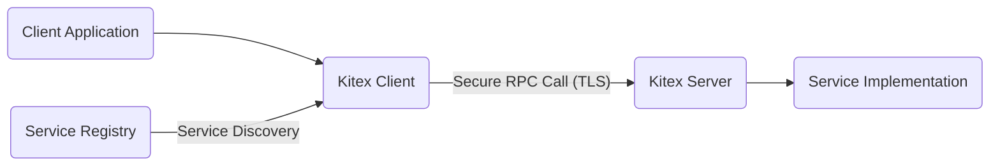

# Project Design Document: Kitex RPC Framework for Threat Modeling (Improved)

**Version:** 2.0
**Date:** October 26, 2023
**Author:** AI Software Architect

## 1. Introduction

This document provides an enhanced design overview of the Kitex RPC framework, an open-source project by CloudWeGo. Its primary purpose is to serve as a robust foundation for threat modeling activities. This version expands on the initial design, providing more granular details about components, data flows, and security considerations to facilitate a comprehensive security analysis. Understanding these details is crucial for identifying potential vulnerabilities and designing effective mitigation strategies.

## 2. System Overview

Kitex is a high-performance and strongly-consistent RPC framework tailored for building microservices, primarily within the Go ecosystem. It emphasizes high throughput, low latency, and offers a rich set of extensions for service governance, observability, and security. Kitex simplifies inter-service communication by abstracting away the complexities of network interactions. A client service initiates requests to a server service, with Kitex managing serialization, transmission, deserialization, and error handling.

## 3. Component Architecture (Detailed)

The Kitex framework is built upon several interconnected components, each playing a vital role in the RPC communication process. Understanding their specific functions is crucial for identifying potential attack surfaces.

*   **Client:**  The initiator of RPC calls to remote services.
    *   Manages a pool of connections to optimize performance and resource utilization.
    *   Implements load balancing strategies to distribute requests across multiple server instances.
    *   Handles the serialization of outgoing requests and deserialization of incoming responses.
    *   Provides a user-friendly API for invoking remote methods, abstracting away low-level networking details.
    *   Can incorporate client-side middleware for tasks like authentication token injection or request tracing.
*   **Server:**  The listener and processor of incoming RPC requests.
    *   Registers service implementations and their associated methods, making them available for remote invocation.
    *   Manages concurrency to handle multiple requests simultaneously.
    *   Dispatches incoming requests to the appropriate service implementation.
    *   Handles the deserialization of incoming requests and serialization of outgoing responses.
    *   Can incorporate server-side middleware for tasks like authentication, authorization, and request logging.
*   **Codec (Serialization/Deserialization):**  The translator between data structures and byte streams for network transmission.
    *   Supports multiple protocols, including Thrift (the default), gRPC (via extension), and Protobuf, offering flexibility and interoperability.
    *   Ensures data integrity during transmission and compatibility between client and server data representations.
    *   Potential vulnerability point if not implemented securely, leading to deserialization attacks.
*   **Transport:**  The underlying mechanism for network communication.
    *   Manages the establishment and maintenance of network connections (e.g., TCP, Unix sockets).
    *   Implements network protocols and handles low-level details of data transmission.
    *   Responsible for handling network errors, timeouts, and connection management.
    *   Security considerations include the use of TLS for encryption and authentication.
*   **Registry (Service Discovery):**  The central directory of available services and their network locations.
    *   Allows clients to dynamically discover the addresses of server instances, enabling loose coupling and scalability.
    *   Supports various implementations like Etcd, Nacos, and Consul.
    *   A critical component for availability and a potential target for malicious manipulation to redirect traffic.
*   **Middleware/Interceptors:**  Pluggable components that intercept and process RPC requests and responses at various stages of the communication lifecycle.
    *   Enable the implementation of cross-cutting concerns without modifying core service logic.
    *   Crucial for implementing security features like authentication, authorization, logging, and rate limiting.
    *   Can be applied globally or selectively to specific methods or services.
    *   Potential vulnerability if middleware itself contains security flaws.
*   **Generator (Code Generation):**  The tool that automates the creation of boilerplate code for clients and servers based on service definitions (IDL files).
    *   Reduces development effort and ensures consistency between client and server interfaces.
    *   Security considerations involve ensuring the generator itself is secure and doesn't introduce vulnerabilities into the generated code.
*   **IDL (Interface Definition Language):**  The contract defining the structure of services, methods, and data types exchanged between client and server.
    *   Provides a clear and language-agnostic way to define service interfaces.
    *   Common examples include Thrift IDL and Protobuf definitions.
    *   Careful design of IDL is important to prevent unintended data exposure or manipulation.

## 4. Data Flow (Detailed)

A typical RPC call in Kitex involves a series of steps, each representing a potential point of interaction and thus a potential area for security consideration.

*   **Client Application Initiates Request:** The client application calls a method on the generated client stub, initiating the RPC process.
*   **Client-Side Request Interception (Middleware):** Configured client-side middleware intercepts the request. This can include:
    *   Authentication middleware adding tokens or credentials.
    *   Tracing middleware adding request IDs for distributed tracing.
    *   Logging middleware recording request details.
*   **Request Serialization (Client Codec):** The client-side codec serializes the request parameters into a byte stream according to the defined IDL and chosen protocol (e.g., Thrift).
*   **Service Discovery (Registry Interaction):** The client queries the configured service registry to locate an available instance of the target service. This may involve:
    *   Looking up service names and retrieving network addresses.
    *   Load balancing decisions to select a specific server instance.
*   **Secure Channel Establishment (Transport):** The client-side transport establishes a secure connection with the selected server instance, potentially using TLS. This involves:
    *   Handshake process for encryption and authentication.
    *   Ensuring the server's identity is verified.
*   **Request Transmission (Client Transport):** The serialized request is transmitted over the established network connection to the server.
*   **Network Reception (Server Transport):** The server-side transport receives the incoming byte stream.
*   **Request Deserialization (Server Codec):** The server-side codec deserializes the byte stream back into request parameters, reconstructing the original data structures.
*   **Server-Side Request Interception (Middleware):** Configured server-side middleware intercepts the request for processing. This can include:
    *   Authentication middleware verifying client credentials.
    *   Authorization middleware enforcing access control policies.
    *   Logging middleware recording request details and security events.
    *   Rate limiting middleware to prevent abuse.
*   **Service Invocation:** The server dispatches the deserialized request to the appropriate service implementation method based on the requested method and service.
*   **Response Generation:** The service implementation executes the business logic and generates a response.
*   **Server-Side Response Interception (Middleware):** Configured server-side middleware intercepts the response. This can include:
    *   Logging middleware recording response details.
    *   Modifying the response headers or body.
*   **Response Serialization (Server Codec):** The server-side codec serializes the response data into a byte stream.
*   **Response Transmission (Server Transport):** The serialized response is transmitted back to the client over the established network connection.
*   **Network Reception (Client Transport):** The client-side transport receives the response byte stream.
*   **Response Deserialization (Client Codec):** The client-side codec deserializes the byte stream back into response data.
*   **Client-Side Response Interception (Middleware):** Configured client-side middleware intercepts the response.
*   **Client Application Receives Response:** The client application receives the deserialized response data.

```mermaid
graph LR
    subgraph "Client Process"
        A["Client Application"] -- "Method Call" --> B("Client Stub (Generated)");
        B -- "Request" --> C("Client Middleware");
        C -- "Serialize Request" --> D("Client Codec");
        D -- "Send Request" --> E("Client Transport");
    end

    subgraph "Network"
        F("Network");
    end

    subgraph "Server Process"
        G("Server Transport") -- "Receive Request" --> H("Server Codec");
        H -- "Deserialize Request" --> I("Server Middleware");
        I -- "Process Request" --> J("Service Implementation");
        J -- "Generate Response" --> K("Server Middleware (Response)");
        K -- "Serialize Response" --> L("Server Codec");
        L -- "Send Response" --> G;
    end

    subgraph "Registry Service"
        M["Service Registry"];
    end

    E -- "RPC Request (Serialized)" --> F;
    E -- "Service Discovery Request" --> M;
    M -- "Service Address" --> E;
    F -- "RPC Response (Serialized)" --> G;
```

## 5. Deployment Model and Security Implications

The way Kitex applications are deployed significantly impacts the security landscape.

*   **Containerized Environments (e.g., Docker, Kubernetes):**
    *   **Pros:** Isolation through containers, network policies for segmentation, secrets management, resource limits.
    *   **Cons:** Vulnerabilities in container images, misconfigured network policies, insecure secrets storage if not managed properly, potential for container escape.
*   **Virtual Machines (VMs):**
    *   **Pros:** Strong isolation between services, traditional security controls (firewalls, intrusion detection).
    *   **Cons:** Higher resource overhead, potentially slower deployment cycles, management of OS-level security.
*   **Bare Metal Servers:**
    *   **Pros:** Direct access to hardware resources, potentially higher performance.
    *   **Cons:** Increased attack surface, complex security configuration, lack of inherent isolation.

Security considerations for each deployment model include:

*   **Network Segmentation:** Isolating services and restricting communication paths.
*   **Access Control:** Limiting access to resources based on roles and permissions.
*   **Secrets Management:** Securely storing and managing sensitive information like API keys and database credentials.
*   **Image Security (Containers):** Regularly scanning and updating container images to address vulnerabilities.
*   **Host Hardening:** Securing the underlying operating system and infrastructure.

## 6. Security Considerations (Specific to Kitex)

This section details security considerations directly relevant to the Kitex framework and its features.

*   **Authentication:** Kitex supports various authentication mechanisms, often implemented through middleware.
    *   **Token-Based Authentication (e.g., JWT):** Clients present a token in the request headers, which is validated by server-side middleware.
    *   **Mutual TLS (mTLS):** Both client and server present certificates for authentication, providing strong identity verification and encrypted communication.
    *   **Custom Authentication Middleware:** Kitex allows developers to implement custom authentication logic.
    *   **Threats:** Weak or missing authentication, insecure storage of credentials, bypass vulnerabilities in custom middleware.
*   **Authorization:** Controlling access to specific services and methods based on the authenticated identity.
    *   **Role-Based Access Control (RBAC):** Assigning roles to users or services and defining permissions for each role.
    *   **Attribute-Based Access Control (ABAC):** Defining access policies based on attributes of the user, resource, and environment.
    *   **Implemented via Server-Side Middleware:** Interceptors evaluate authorization policies before invoking the service logic.
    *   **Threats:** Missing or improperly configured authorization, privilege escalation vulnerabilities.
*   **Transport Layer Security (TLS):** Encrypting communication between clients and servers to protect data in transit.
    *   **Configuration Options:** Kitex allows configuration of TLS certificates and settings.
    *   **Importance of Strong Ciphers:** Using strong cryptographic algorithms to prevent eavesdropping.
    *   **Threats:** Man-in-the-middle attacks, eavesdropping, downgrade attacks if weak ciphers are used.
*   **Input Validation:** Crucial for preventing injection attacks and ensuring data integrity.
    *   **Server-Side Validation:**  Verifying the format and content of incoming requests.
    *   **Consideration for IDL Definitions:** Defining data types and constraints in the IDL can aid in validation.
    *   **Threats:** SQL injection, command injection, cross-site scripting (if responses are rendered in web contexts), buffer overflows.
*   **Rate Limiting and DoS Protection:** Protecting services from being overwhelmed by excessive requests.
    *   **Middleware Implementation:** Kitex middleware can be used to implement rate limiting based on various criteria (e.g., IP address, client ID).
    *   **Connection Limits:** Restricting the number of concurrent connections.
    *   **Threats:** Denial of service attacks, resource exhaustion.
*   **Logging and Auditing:** Recording security-relevant events for monitoring and incident response.
    *   **Middleware for Logging:** Interceptors can log authentication attempts, authorization decisions, and other security events.
    *   **Importance of Secure Logging Practices:** Protecting log data from unauthorized access and tampering.
    *   **Threats:** Lack of visibility into security incidents, inability to perform forensic analysis.
*   **Dependency Management:** Ensuring that third-party libraries used by Kitex and its applications are secure.
    *   **Regularly Scanning Dependencies:** Using tools to identify known vulnerabilities.
    *   **Keeping Dependencies Up-to-Date:** Applying security patches promptly.
    *   **Threats:** Exploitation of vulnerabilities in third-party libraries.
*   **Codec Security:** Potential vulnerabilities related to the serialization and deserialization process.
    *   **Deserialization Attacks:** Maliciously crafted payloads that can exploit vulnerabilities in the deserialization logic.
    *   **Choosing Secure Protocols:**  Being aware of the security implications of different serialization protocols.
    *   **Threats:** Remote code execution, denial of service.

## 7. Diagrams

### 7.1 High-Level Architecture

### 7.2 Detailed Data Flow with Security Emphasis

```mermaid
graph LR
    subgraph "Client Process"
        A["Client Application"] -- "Method Call" --> B("Client Stub");
        B -- "Client Authentication Middleware" --> C("Authentication Token");
        C -- "Serialize Request" --> D("Client Codec");
        D -- "Establish TLS Connection" --> E("Client Transport");
        E -- "Send Encrypted Request" --> F("Network");
    end

    subgraph "Network"
        F("Network");
    end

    subgraph "Server Process"
        G("Server Transport") -- "Receive Encrypted Request" --> H("Establish TLS Connection");
        H -- "Server Authentication Middleware" --> I("Authentication Check");
        I -- "Deserialize Request" --> J("Server Codec");
        J -- "Server Authorization Middleware" --> K("Authorization Check");
        K -- "Process Request" --> L("Service Logic");
        L -- "Generate Response" --> M("Server Codec");
        M -- "Send Encrypted Response" --> G;
    end

    subgraph "Registry Service"
        N["Service Registry"];
    end

    E -- "Encrypted RPC Request" --> F;
    E -- "Service Discovery Request" --> N;
    N -- "Service Address" --> E;
    F -- "Encrypted RPC Response" --> G;
```

## 8. Conclusion

This improved design document provides a more detailed and security-focused overview of the Kitex RPC framework. By elaborating on the components, data flows, deployment considerations, and specific security features, it offers a solid foundation for conducting thorough threat modeling. This document will enable security professionals to identify potential vulnerabilities, assess risks, and design appropriate security controls to protect Kitex-based microservices. The next step is to leverage this document in a structured threat modeling exercise, such as using the STRIDE methodology, to systematically analyze potential threats and develop mitigation strategies.