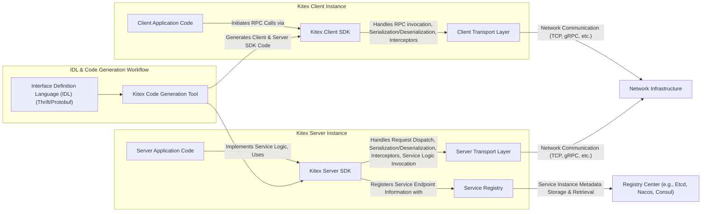
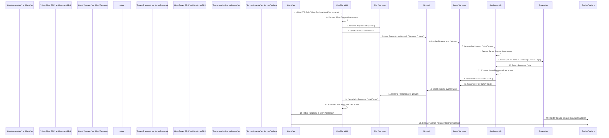

# Project Design Document: Kitex RPC Framework

**Project Name:** Kitex RPC Framework

**Project Repository:** [https://github.com/cloudwego/kitex](https://github.com/cloudwego/kitex)

**Document Version:** 1.1
**Date:** 2023-10-27
**Author:** AI Cloud & Security Expert

## 1. Introduction

This document provides a detailed design overview of the Kitex RPC framework, an open-source, high-performance, and highly extensible Remote Procedure Call (RPC) framework written in Go. Developed by CloudWeGo, Kitex is engineered to simplify the development of robust and scalable microservices. This document serves as a foundational resource for subsequent threat modeling activities and aims to provide a comprehensive understanding of Kitex's architecture, core components, and data flow mechanisms. It is intended for developers, security engineers, and anyone involved in building or securing applications using Kitex.

## 2. Project Overview

Kitex is a Go-centric RPC framework prioritizing exceptional performance and extensive customizability. It is specifically designed for microservice architectures, facilitating efficient and reliable inter-service communication.  Key features that define Kitex include:

*   **Exceptional Performance:** Optimized for minimal latency and maximized throughput, crucial for high-demand services.
*   **Extensive Extensibility:** Offers numerous extension points allowing deep customization and seamless integration. These include middleware, codecs, transports, resolvers, and service discovery mechanisms.
*   **Automated Code Generation:**  Leverages Interface Definition Language (IDL) files (Thrift and Protobuf) to automatically generate boilerplate code, significantly streamlining service development and reducing manual coding efforts.
*   **Comprehensive Service Governance:** Integrates robust service governance features such as load balancing, circuit breaking, fault injection, retry mechanisms, and service discovery, enhancing service reliability and resilience.
*   **Versatile Protocol Support:** Supports a wide range of RPC protocols including Thrift (binary, compact), gRPC, and allows for the implementation of custom protocols, providing flexibility in choosing the optimal protocol for different use cases.
*   **Flexible Middleware Support:** Enables developers to inject custom logic into the request/response processing pipeline through middleware, facilitating cross-cutting concerns like logging, authentication, authorization, and tracing.
*   **Pluggable Service Discovery:** Supports various service discovery solutions like Etcd, Nacos, Consul, and Kubernetes DNS, allowing integration with existing infrastructure and providing flexibility in service deployment and management.

## 3. System Architecture

The following diagram illustrates the high-level architecture of a system built using the Kitex framework. It depicts the key components and their interactions in a typical microservice setup.

### 3.1. Component Description

*   **A. Client Application Code:** This represents the application logic within a client service that needs to invoke operations on a remote service. It utilizes the generated Kitex Client SDK to make RPC calls.
*   **B. Kitex Client SDK:** This SDK is automatically generated by the Kitex Code Generator from the IDL definition. It encapsulates client-side functionalities including:
    *   **Stub Generation:** Provides client-side stubs (interfaces and methods) mirroring the service definition in the IDL.
    *   **Serialization/Deserialization:** Handles the conversion of request and response data between Go objects and byte streams using the configured codec.
    *   **Interceptors (Client Middleware):** Executes client-side middleware for cross-cutting concerns like logging, tracing, metrics collection, and custom request modification.
    *   **Transport Abstraction:**  Manages the underlying transport layer for sending requests and receiving responses.
*   **C. Client Transport Layer:** This layer is responsible for the actual network communication on the client side. It handles:
    *   **Connection Management:** Establishes and manages connections to the server.
    *   **Request Transmission:** Sends serialized RPC requests over the network using the selected transport protocol (e.g., TCP, gRPC).
    *   **Response Reception:** Receives RPC responses from the server.
    *   **Protocol Handling:** Implements protocol-specific details for network communication.
*   **D. Server Application Code:** This is the application logic within a server service that implements the business functionality defined in the IDL. It utilizes the Kitex Server SDK.
*   **E. Kitex Server SDK:** This SDK, generated from the IDL, provides the server-side framework and functionalities:
    *   **Skeleton Generation:** Generates server-side skeletons (interfaces and abstract classes) for implementing the service logic.
    *   **Deserialization/Serialization:** Handles the conversion of incoming request byte streams to Go objects and outgoing response objects to byte streams.
    *   **Request Dispatching:** Routes incoming requests to the appropriate service handler function based on the method name.
    *   **Interceptors (Server Middleware):** Executes server-side middleware for tasks like authentication, authorization, logging, tracing, metrics, and request/response modification.
    *   **Service Registration:**  Provides mechanisms to register the service instance with the Service Registry.
*   **F. Server Transport Layer:**  This layer manages network communication on the server side, mirroring the client transport layer functionalities:
    *   **Connection Handling:** Accepts and manages incoming client connections.
    *   **Request Reception:** Receives RPC requests from clients.
    *   **Response Transmission:** Sends serialized RPC responses back to clients.
    *   **Protocol Handling:** Implements protocol-specific details for network communication on the server side.
*   **G. Service Registry:** An abstraction representing the mechanism for service discovery and registration. Kitex servers register their network location (address, port) with the Service Registry, and clients query this registry to find available service instances.
*   **H. Interface Definition Language (IDL) (Thrift/Protobuf):**  IDL files define the service contract, including service interfaces, methods, request/response data structures, and data types. Kitex supports Thrift and Protobuf IDLs.
*   **I. Kitex Code Generation Tool:** A command-line tool provided by Kitex that parses IDL files and automatically generates Go code for both client and server SDKs. This significantly reduces boilerplate code and ensures consistency between client and server implementations.
*   **J. Network Infrastructure:** Represents the underlying network infrastructure facilitating communication between client and server instances. This could be a TCP/IP network, a gRPC channel over HTTP/2, or other network transport mechanisms.
*   **K. Registry Center:**  The concrete implementation of the Service Registry. Examples include Etcd, Nacos, Consul, ZooKeeper, or cloud-native service discovery solutions like Kubernetes DNS.

## 4. Data Flow

The following sequence diagram details the data flow for a typical synchronous RPC call using Kitex, illustrating the interactions between different components during request and response processing.

**Detailed Data Flow Steps:**

1.  **Initiate RPC Call:** The Client Application initiates an RPC call by invoking a method on the generated Kitex Client SDK, passing context and request parameters.
2.  **Execute Client Request Interceptors:** The Client SDK executes the configured chain of client-side request interceptors (middleware). These interceptors can perform actions before the request is sent, such as logging, adding headers, or modifying the request.
3.  **Serialize Request Data:** The Client SDK serializes the request data into a byte stream using the configured codec (e.g., Thrift binary, Protobuf). The codec is determined by the IDL and configuration.
4.  **Construct RPC Frame/Packet:** The Client SDK constructs an RPC frame or packet according to the chosen transport protocol. This includes adding metadata like request ID, method name, and the serialized request payload.
5.  **Send Request over Network:** The Client Transport Layer sends the constructed RPC frame over the network using the configured transport protocol (e.g., TCP connection, gRPC channel).
6.  **Receive Request over Network:** The Server Transport Layer receives the RPC frame from the network.
7.  **De-serialize Request Data:** The Server Transport Layer passes the received frame to the Server SDK, which de-serializes the request data from the byte stream back into Go objects using the same codec used for serialization.
8.  **Execute Server Request Interceptors:** The Server SDK executes the configured chain of server-side request interceptors. These interceptors can perform actions like authentication, authorization, logging, tracing, and request validation before the request reaches the service logic.
9.  **Invoke Service Handler Function:** The Server SDK dispatches the de-serialized request to the appropriate service handler function implemented in the Server Application code. This function contains the core business logic for the service method.
10. **Return Response Data:** The Server Application executes the business logic and returns the response data to the Server SDK.
11. **Execute Server Response Interceptors:** The Server SDK executes the configured chain of server-side response interceptors. These interceptors can modify the response, log response details, or perform other post-processing tasks.
12. **Serialize Response Data:** The Server SDK serializes the response data into a byte stream using the configured codec.
13.  **Construct RPC Frame/Packet:** The Server SDK constructs an RPC frame or packet for the response, including metadata and the serialized response payload.
14. **Send Response over Network:** The Server Transport Layer sends the response frame over the network back to the client.
15. **Receive Response over Network:** The Client Transport Layer receives the response frame.
16. **De-serialize Response Data:** The Client Transport Layer passes the frame to the Client SDK, which de-serializes the response data from the byte stream back into Go objects.
17. **Execute Client Response Interceptors:** The Client SDK executes the configured chain of client-side response interceptors. These interceptors can process the response, log details, or handle errors.
18. **Return Response to Client Application:** The Client SDK returns the de-serialized response data to the Client Application, completing the RPC call.
19. **Register Service Instance:** (Server-side, typically on startup and periodically via heartbeat mechanisms) The Server Application, through the Server SDK, registers its service instance information (address, port, health status, metadata) with the Service Registry. This makes the service discoverable by clients.
20. **Discover Service Instance:** (Client-side, optional, often cached for performance) The Client Application or Client SDK may query the Service Registry to discover available instances of the target service. The results are often cached to reduce latency and registry load.

## 5. Key Technologies and Components

*   **Primary Programming Language:** Go (Golang)
*   **Interface Definition Languages (IDLs):** Thrift (.thrift files), Protobuf (.proto files)
*   **Supported RPC Protocols:** Thrift (Binary, Compact), gRPC, Custom Protocols (extensible)
*   **Supported Transport Protocols:** TCP, gRPC (HTTP/2 based), UDS (Unix Domain Socket), In-memory transport (for testing)
*   **Codecs (Serialization/Deserialization):** Thrift Binary, Thrift Compact, Protobuf, gRPC-Protobuf, Custom Codec implementations
*   **Service Registry Integrations:** Etcd, Nacos, Consul, ZooKeeper, Kubernetes DNS, ServiceComb, Custom Registry implementations
*   **Middleware (Interceptors):** Client-side and Server-side interceptors for request/response processing. Support for unary and streaming interceptors.
*   **Load Balancing Strategies:** Round Robin, Random, Weighted Round Robin, Consistent Hashing, Least Connections, Custom Load Balancers (pluggable)
*   **Fault Tolerance & Resilience:** Circuit Breaking, Retry mechanisms (with configurable policies), Timeout settings, Deadline propagation
*   **Rate Limiting & Traffic Control:** Request rate limiting, Concurrency control, Adaptive throttling
*   **Observability & Monitoring:** Integration with tracing systems (OpenTelemetry, Jaeger, Zipkin), Metrics collection (Prometheus), Logging frameworks (e.g., kitex-contrib/obs-opentelemetry)
*   **Code Generation Tooling:** `kitex` command-line tool for IDL compilation and code generation, Plugins for extending code generation capabilities.

## 6. Deployment Model

Kitex services are designed for deployment in modern microservices architectures. Typical deployment models include:

*   **Containerized Deployment (Docker):** Kitex services are commonly packaged as Docker containers to ensure consistent environments, simplify deployment, and enhance portability across different infrastructures.
*   **Orchestration Platforms (Kubernetes):** Kubernetes is a prevalent platform for orchestrating and managing Kitex service deployments. It provides essential features like automated service discovery, load balancing, scaling (horizontal and vertical), health checks, rolling updates, and self-healing capabilities.
*   **Cloud Environments (AWS, GCP, Azure):** Kitex services can be seamlessly deployed on major cloud platforms, leveraging cloud-native services for infrastructure provisioning, networking, managed Kubernetes offerings (EKS, GKE, AKS), and integrated service management tools.
*   **On-Premise Datacenters & Virtualized Environments:** Kitex is also deployable in traditional on-premise datacenter environments or virtualized infrastructures, providing flexibility for organizations with specific infrastructure requirements.
*   **Serverless Deployments (Function-as-a-Service - FaaS):** While less common, Kitex services *can* be adapted for serverless environments, although the framework is primarily designed for long-running service instances. Adaptations might be needed to optimize for serverless execution models.

## 7. Security Considerations (Detailed)

Security is a critical aspect of any RPC framework. Kitex provides several mechanisms and considerations for building secure microservices. Key security considerations for Kitex-based systems include:

*   **Transport Layer Security (TLS/mTLS):**
    *   **Encryption in Transit:** Enforce TLS encryption for all network communication between clients and servers to protect sensitive data from eavesdropping and man-in-the-middle attacks. Kitex supports TLS configuration for TCP and gRPC transports.
    *   **Mutual TLS (mTLS):** For enhanced security, implement mTLS to mutually authenticate both the client and the server using X.509 certificates. This ensures that both parties are who they claim to be, preventing unauthorized clients from accessing services and mitigating server impersonation risks.
*   **Authentication:**
    *   **Middleware-Based Authentication:** Implement authentication mechanisms using server-side middleware. Common approaches include:
        *   **Token-Based Authentication (JWT, API Keys):** Verify tokens or API keys included in request headers using middleware.
        *   **Certificate-Based Authentication (mTLS):** Leverage mTLS for client authentication, extracting client identities from certificates.
    *   **Authentication Protocols:** Integrate with standard authentication protocols like OAuth 2.0 or OpenID Connect using middleware for more complex authentication scenarios.
*   **Authorization:**
    *   **Role-Based Access Control (RBAC):** Implement authorization logic in server-side middleware to control access to specific services and methods based on the authenticated user's roles or permissions.
    *   **Policy-Based Authorization:** Utilize policy engines (e.g., Open Policy Agent - OPA) within middleware to enforce fine-grained authorization policies based on request context, user attributes, and resource attributes.
*   **Input Validation & Sanitization:**
    *   **Server-Side Validation:** Implement robust input validation on the server side within service handler functions or middleware to prevent injection attacks (e.g., SQL injection, command injection, cross-site scripting if applicable). Validate data types, formats, ranges, and business logic constraints.
    *   **Client-Side Validation (Optional):** While server-side validation is crucial, client-side validation can provide early feedback to users and reduce unnecessary network traffic. However, it should not be relied upon as the primary security measure.
*   **Dependency Management & Vulnerability Scanning:**
    *   **Secure Dependency Management:** Use dependency management tools (e.g., Go modules) to track and manage project dependencies. Regularly update dependencies to patch known vulnerabilities.
    *   **Vulnerability Scanning:** Integrate vulnerability scanning tools into the development and CI/CD pipeline to automatically detect and report vulnerabilities in project dependencies and the application code itself.
*   **Rate Limiting & Denial-of-Service (DoS) Protection:**
    *   **Request Rate Limiting:** Implement rate limiting middleware on the server side to restrict the number of requests from a single client or source within a given time window. This helps protect against brute-force attacks and resource exhaustion.
    *   **Concurrency Limits:** Configure concurrency limits on the server to prevent overload and ensure service stability under high load.
    *   **DDoS Mitigation:** Employ network-level DDoS mitigation techniques (e.g., firewalls, intrusion detection/prevention systems, cloud-based DDoS protection services) in conjunction with application-level rate limiting.
*   **Service Discovery Security:**
    *   **Access Control for Registry:** Secure access to the Service Registry (Registry Center) to prevent unauthorized service registration, modification, or deletion. Implement authentication and authorization for registry access.
    *   **Data Integrity in Registry:** Ensure the integrity of service instance information stored in the registry to prevent malicious actors from manipulating service discovery data.
*   **Logging & Auditing:**
    *   **Comprehensive Logging:** Implement detailed logging on both client and server sides, capturing relevant events such as requests, responses, errors, security events (authentication failures, authorization denials), and access attempts.
    *   **Security Auditing:**  Establish security auditing mechanisms to track security-related events and activities for incident detection, investigation, and compliance purposes.
    *   **Secure Log Storage:** Store logs securely and protect them from unauthorized access and tampering.
*   **Code Generation Security:**
    *   **IDL Security:** Carefully review and secure IDL definitions to prevent vulnerabilities that could be introduced during code generation. Avoid including sensitive information directly in IDLs.
    *   **Code Generation Tool Security:** Ensure the Kitex code generation tool and its dependencies are secure and obtained from trusted sources.
*   **Error Handling & Information Disclosure:**
    *   **Secure Error Handling:** Implement secure error handling practices to prevent sensitive information from being leaked in error messages or stack traces. Provide generic error responses to clients and log detailed error information securely on the server side for debugging.

## 8. Scope for Threat Modeling

This design document provides a solid foundation for conducting a comprehensive threat model for systems built using the Kitex RPC framework. The threat modeling exercise should systematically analyze the architecture and data flow to identify potential security vulnerabilities and design appropriate mitigations. The threat modeling scope should specifically focus on:

*   **RPC Communication Channels:**
    *   **Transport Layer Attacks:** Analyze threats targeting the transport layer, such as eavesdropping, man-in-the-middle attacks, and replay attacks. Evaluate the effectiveness of TLS/mTLS in mitigating these threats.
    *   **Protocol-Specific Vulnerabilities:** Assess potential vulnerabilities specific to the chosen RPC and transport protocols (e.g., HTTP/2 vulnerabilities in gRPC).
    *   **Message Injection/Manipulation:** Consider threats related to injecting malicious messages or manipulating existing messages in transit.
*   **Code Generation Process & Generated Code:**
    *   **IDL Vulnerabilities:** Analyze potential vulnerabilities in IDL definitions that could lead to insecure code generation or vulnerabilities in generated code.
    *   **Code Generation Toolchain Security:** Evaluate the security of the Kitex code generation toolchain and dependencies.
    *   **Generated Code Weaknesses:** Identify potential security weaknesses in the automatically generated code, such as insecure default configurations or lack of input validation in generated stubs/skeletons.
*   **Middleware Pipeline Security:**
    *   **Middleware Vulnerabilities:** Assess the security of custom middleware implementations, including potential vulnerabilities in authentication, authorization, logging, or other middleware components.
    *   **Middleware Bypass:** Consider scenarios where middleware could be bypassed or circumvented, leading to security breaches.
    *   **Middleware Interaction Issues:** Analyze potential security issues arising from interactions between different middleware components in the pipeline.
*   **Service Registry Interactions Security:**
    *   **Registry Access Control Vulnerabilities:** Evaluate vulnerabilities related to unauthorized access to the Service Registry, including unauthorized service registration, modification, or deletion.
    *   **Registry Data Integrity Threats:** Analyze threats to the integrity of service instance information stored in the registry, such as data manipulation or poisoning.
    *   **Service Discovery Spoofing:** Consider threats related to service discovery spoofing or redirection attacks.
*   **Dependency Vulnerabilities & Supply Chain Security:**
    *   **Third-Party Dependency Vulnerabilities:** Identify and assess potential vulnerabilities in Kitex's dependencies and the dependencies of services built with Kitex.
    *   **Supply Chain Attacks:** Consider threats related to compromised dependencies or malicious components introduced through the software supply chain.
*   **Deployment Environment Security:**
    *   **Container Security:** Analyze security considerations for containerized deployments, including container image vulnerabilities, container runtime security, and container orchestration security.
    *   **Network Security:** Evaluate network security controls in the deployment environment, such as firewalls, network segmentation, and intrusion detection/prevention systems.
    *   **Orchestration Platform Security (Kubernetes):** Assess security configurations and vulnerabilities in the orchestration platform (e.g., Kubernetes), including RBAC, network policies, and secrets management.
*   **Operational Security:**
    *   **Logging & Monitoring Gaps:** Identify gaps in logging and monitoring capabilities that could hinder security incident detection and response.
    *   **Incident Response Readiness:** Evaluate the organization's incident response plan and capabilities for handling security incidents related to Kitex-based services.
    *   **Configuration Management Security:** Assess the security of configuration management practices for Kitex services and related infrastructure.

By systematically addressing these areas within the threat modeling process, security experts can effectively identify potential vulnerabilities and design robust security controls to mitigate risks in Kitex-based microservice systems. This proactive approach to security is crucial for building resilient and trustworthy applications.